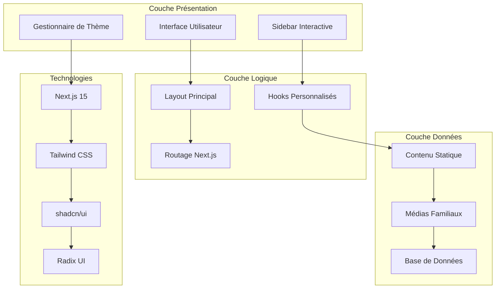
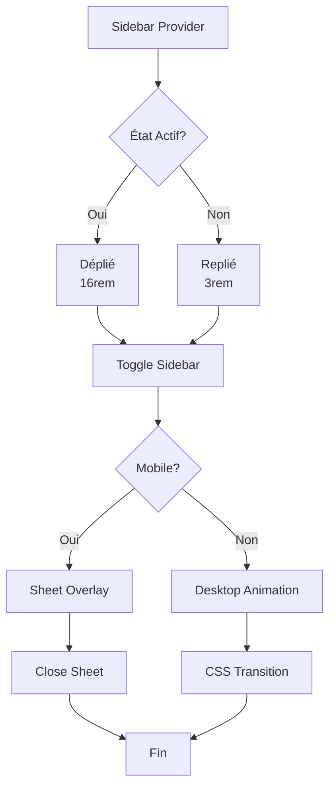
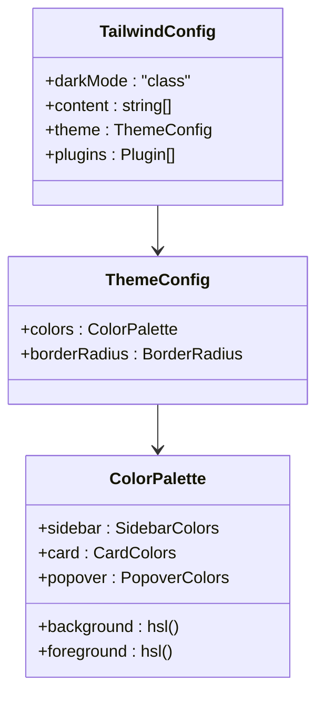
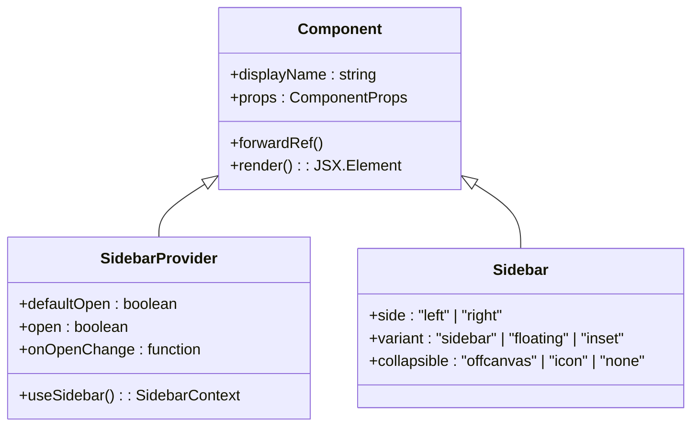

# Aperçu du Projet Decker

<cite>
**Fichiers Référencés dans ce Document**
- [package.json](file://package.json)
- [app/layout.tsx](file://app/layout.tsx)
- [app/page.tsx](file://app/page.tsx)
- [components/sidebar.tsx](file://components/ui/sidebar.tsx)
- [components.json](file://components.json)
- [lib/utils.ts](file://lib/utils.ts)
- [tailwind.config.ts](file://tailwind.config.ts)
- [next.config.ts](file://next.config.ts)
- [hooks/use-mobile.tsx](file://hooks/use-mobile.tsx)
- [hooks/use-toast.ts](file://hooks/use-toast.ts)
- [components/ui/button.tsx](file://components/ui/button.tsx)
- [components/ui/card.tsx](file://components/ui/card.tsx)
- [components/ui/dropdown-menu.tsx](file://components/ui/dropdown-menu.tsx)
- [app/globals.css](file://app/globals.css)
- [PLAN.md](file://PLAN.md)
</cite>

## Table des Matières
1. [Introduction](#introduction)
2. [Objectif Principal](#objectif-principal)
3. [Architecture Globale](#architecture-globale)
4. [Stack Technique](#stack-technique)
5. [Fonctionnalités Clés](#fonctionnalités-clés)
6. [Vue d'Ensemble Conceptuelle](#vue-densemble-conceptuelle)
7. [Détails Techniques](#détails-techniques)
8. [Composants Principaux](#composants-principaux)
9. [Gestion des Thèmes](#gestion-des-thèmes)
10. [Système de Navigation](#système-de-navigation)
11. [Exemples d'Utilisation](#exemples-dutilisation)
12. [Conclusion](#conclusion)

## Introduction

Le projet Decker est une application web moderne conçue pour préserver et partager l'histoire, les créations artistiques, les archives et les portraits de la famille DECKER. Cette plateforme numérique constitue un testament numérique durable qui permettra de transmettre la richesse culturelle et historique de la famille à travers les générations.

L'application représente une fusion entre technologie moderne et patrimoine familial, offrant une expérience utilisateur immersive tout en maintenant l'intégrité des données historiques et artistiques. Le projet s'inscrit dans une démarche de préservation numérique responsable et accessible.

## Objectif Principal

L'objectif principal de Decker est de créer une plateforme unifiée qui :
- **Préserve l'histoire familiale** : Organisation chronologique des événements clés et contexte historique
- **Partage les créations artistiques** : Musique, photographies, peintures, textes littéraires
- **Gère les archives** : Documents officiels, photos anciennes, vidéos INA, manuscrits
- **Montre les portraits** : Galeries de portraits des membres marquants de la famille
- **Visualise l'arbre généalogique** : Représentation interactive des relations familiales
- **Collecte les témoignages** : Souvenirs et anecdotes personnelles

Cette application vise à devenir le point central de référence pour la famille DECKER, facilitant la découverte, l'exploration et la transmission de leur patrimoine commun.

## Architecture Globale

Le projet Decker suit une architecture modulaire basée sur Next.js 15 avec TypeScript, intégrant plusieurs couches de technologie sophistiquées.



**Sources du Diagramme**
- [app/layout.tsx](file://app/layout.tsx#L1-L35)
- [components/sidebar.tsx](file://components/ui/sidebar.tsx#L1-L100)
- [tailwind.config.ts](file://tailwind.config.ts#L1-L73)

**Sources de Section**
- [package.json](file://package.json#L1-L50)
- [app/layout.tsx](file://app/layout.tsx#L1-L35)

## Stack Technique

Le projet Decker utilise une stack technologique moderne et éprouvée, optimisée pour la performance et la maintenabilité.

### Framework Backend : Next.js 15
- **Rendu côté serveur (SSR)** : Amélioration des performances et SEO
- **Génération de sites statiques (SSG)** : Pages optimisées pour la vitesse
- **Routing automatique** : Structure intuitive des URLs
- **TypeScript natif** : Typage fort pour la robustesse du code

### Interface Utilisateur : shadcn/ui + Tailwind CSS
- **shadcn/ui** : Bibliothèque de composants réutilisables avec Radix UI
- **Tailwind CSS** : Utility-first CSS pour le design responsive
- **Lucide React** : Icônes vectorielles modernes
- **Accessibilité** : Conformité WCAG intégrée

### Gestion d'État et Hooks
- **Context API** : Gestion globale de l'état de la sidebar
- **Custom Hooks** : Logique métier réutilisable
- **React Query** : Gestion des données distantes (optionnel)

### Dépendances Clés
- **@radix-ui/react-*** : Composants d'interface accessibles
- **class-variance-authority** : Variants de composants
- **clsx** : Classes CSS conditionnelles
- **tailwind-merge** : Fusion intelligente de classes

**Sources de Section**
- [package.json](file://package.json#L12-L35)
- [components.json](file://components.json#L1-L23)

## Fonctionnalités Clés

### Sidebar Interactive Dépliable
La sidebar constitue le cœur de la navigation, offrant une expérience utilisateur fluide et intuitive.



**Sources du Diagramme**
- [components/sidebar.tsx](file://components/ui/sidebar.tsx#L56-L120)

### Gestion des Thèmes Clair/Sombre
Système de thème sophistiqué avec persistance automatique.

### Arbre Généalogique Interactif
Visualisation interactive des relations familiales avec zoom et navigation.

### Timeline Historique
Chronologie animée des événements clés de la famille.

### Galeries Média
Galerie responsive pour photographies, vidéos et créations artistiques.

**Sources de Section**
- [components/sidebar.tsx](file://components/ui/sidebar.tsx#L1-L774)
- [hooks/use-mobile.tsx](file://hooks/use-mobile.tsx#L1-L20)

## Vue d'Ensemble Conceptuelle

### Pour les Débutants

Pour une personne novice découvrant le site Decker :

1. **Accueil** : Une page de bienvenue simple qui présente le projet
2. **Navigation** : Sidebar interactive qui s'adapte à l'écran
3. **Thème** : Basculer entre clair et sombre selon vos préférences
4. **Sections** : Accès aux différentes parties (Histoire, Archives, Créations, etc.)

### Pour les Utilisateurs Avancés

Pour ceux qui veulent explorer en profondeur :

1. **Navigation par clavier** : Raccourcis disponibles pour la sidebar
2. **Persistance** : Préférences sauvegardées automatiquement
3. **Responsive** : Adaptation automatique aux appareils mobiles
4. **Accessibilité** : Compatibilité avec les lecteurs d'écran

## Détails Techniques

### Configuration Tailwind CSS

Le projet utilise une configuration personnalisée avec support des thèmes sombre et clair.



**Sources du Diagramme**
- [tailwind.config.ts](file://tailwind.config.ts#L1-L73)
- [app/globals.css](file://app/globals.css#L12-L82)

### Gestion des Cookies

Le système de sidebar utilise des cookies pour la persistance de l'état.

### Architecture des Composants

Chaque composant suit un pattern cohérent avec shadcn/ui :



**Sources du Diagramme**
- [components/sidebar.tsx](file://components/ui/sidebar.tsx#L56-L163)
- [components/ui/button.tsx](file://components/ui/button.tsx#L1-L58)

**Sources de Section**
- [tailwind.config.ts](file://tailwind.config.ts#L1-L73)
- [app/globals.css](file://app/globals.css#L1-L95)

## Composants Principaux

### SidebarProvider
Le composant principal qui gère l'état global de la sidebar.

**Interfaces Publiques :**
- `defaultOpen?: boolean` : État initial ouvert
- `open?: boolean` : Contrôle externe de l'état
- `onOpenChange?: (open: boolean) => void` : Callback de changement

**Valeurs de Retour :**
- `state: "expanded" | "collapsed"` : État actuel
- `open: boolean` : État ouvert
- `setOpen: (open: boolean) => void` : Fonction de mise à jour
- `toggleSidebar: () => void` : Fonction de basculement

### Sidebar
Composant de navigation principal avec support responsive.

**Paramètres :**
- `side?: "left" | "right"` : Position de la sidebar
- `variant?: "sidebar" | "floating" | "inset"` : Style de présentation
- `collapsible?: "offcanvas" | "icon" | "none"` : Comportement de collage

### useSidebar Hook
Hook personnalisé pour accéder aux fonctionnalités de la sidebar.

**Utilisation :**
```typescript
const {
  state,           // "expanded" | "collapsed"
  open,
  setOpen,
  isMobile,
  toggleSidebar
} = useSidebar()
```

**Sources de Section**
- [components/sidebar.tsx](file://components/ui/sidebar.tsx#L35-L774)
- [hooks/use-mobile.tsx](file://hooks/use-mobile.tsx#L1-L20)

## Gestion des Thèmes

### Configuration des Variables CSS

Le système de thème utilise des variables CSS pour une transition fluide.

### Persistance Automatique

Les préférences de thème sont sauvegardées automatiquement en utilisant `next-themes`.

### Composant DropdownMenu

Intégré dans la sidebar pour la sélection du thème.

**Options disponibles :**
- Clair (Sun icon)
- Sombre (Moon icon)
- Système (Monitor icon)

**Sources de Section**
- [app/globals.css](file://app/globals.css#L12-L82)
- [components/ui/dropdown-menu.tsx](file://components/ui/dropdown-menu.tsx#L1-L202)

## Système de Navigation

### Structure de Navigation

La navigation suit une hiérarchie claire :

1. **Accueil** : Point d'entrée principal
2. **Histoire familiale** : Chronologie et contexte
3. **Archives & Documents** : Documents officiels
4. **Créations artistiques** : Contenu multimédia
5. **Portraits** : Galerie des membres
6. **Arbre généalogique** : Relations familiales
7. **Témoignages** : Souvenirs personnels
8. **Téléchargements** : Ressources téléchargeables
9. **Méthode & Sources** : Transparence

### Navigation Mobile

Adaptation automatique pour les appareils mobiles avec Sheet component.

### Navigation Desktop

Sidebar fixe avec animations fluides.

**Sources de Section**
- [components/sidebar.tsx](file://components/ui/sidebar.tsx#L201-L222)
- [hooks/use-mobile.tsx](file://hooks/use-mobile.tsx#L1-L20)

## Exemples d'Utilisation

### Utilisation de la Sidebar

```typescript
// Dans un composant
import { SidebarProvider, Sidebar, SidebarContent, SidebarMenu } from '@/components/ui/sidebar'

export default function NavigationExample() {
  return (
    <SidebarProvider>
      <Sidebar>
        <SidebarContent>
          <SidebarMenu>
            {/* Items de navigation ici */}
          </SidebarMenu>
        </SidebarContent>
      </Sidebar>
    </SidebarProvider>
  )
}
```

### Gestion du Thème

```typescript
// Dans le layout principal
import { ThemeProvider } from 'next-themes'

export default function RootLayout({ children }) {
  return (
    <ThemeProvider attribute="class" defaultTheme="system" enableSystem>
      {children}
    </ThemeProvider>
  )
}
```

### Utilisation des Hooks

```typescript
// Dans un composant de navigation
import { useSidebar } from '@/components/ui/sidebar'

export function NavigationButton() {
  const { toggleSidebar } = useSidebar()
  
  return (
    <button onClick={toggleSidebar}>
      Toggle Navigation
    </button>
  )
}
```

**Sources de Section**
- [components/sidebar.tsx](file://components/ui/sidebar.tsx#L56-L163)
- [hooks/use-toast.ts](file://hooks/use-toast.ts#L1-L195)

## Conclusion

Le projet Decker représente une solution technologique sophistiquée pour la préservation numérique du patrimoine familial. Sa conception modulaire, son architecture robuste et ses fonctionnalités avancées en font une plateforme idéale pour transmettre l'histoire et les créations de la famille DECKER aux générations futures.

### Points Forts du Projet

1. **Architecture Moderne** : Next.js 15 avec TypeScript pour la robustesse
2. **Design Responsif** : Adaptation automatique à tous les appareils
3. **Accessibilité** : Conformité WCAG intégrée
4. **Performance** : Optimisations SSR et SSG
5. **Extensibilité** : Architecture modulaire pour les futures fonctionnalités

### Perspectives d'Évolution

Le projet est conçu pour évoluer avec les besoins de la famille, pouvant facilement intégrer de nouvelles fonctionnalités comme :
- Système d'authentification pour l'espace d'administration
- Fonctionnalités sociales (commentaires, partage)
- Recherche avancée avec indexation
- Export de données et statistiques

Cette documentation fournit une base solide pour comprendre, maintenir et développer le projet Decker, garantissant sa pérennité et son évolution continue.