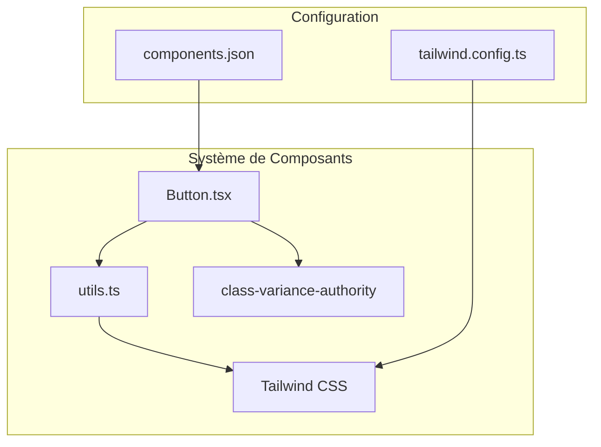
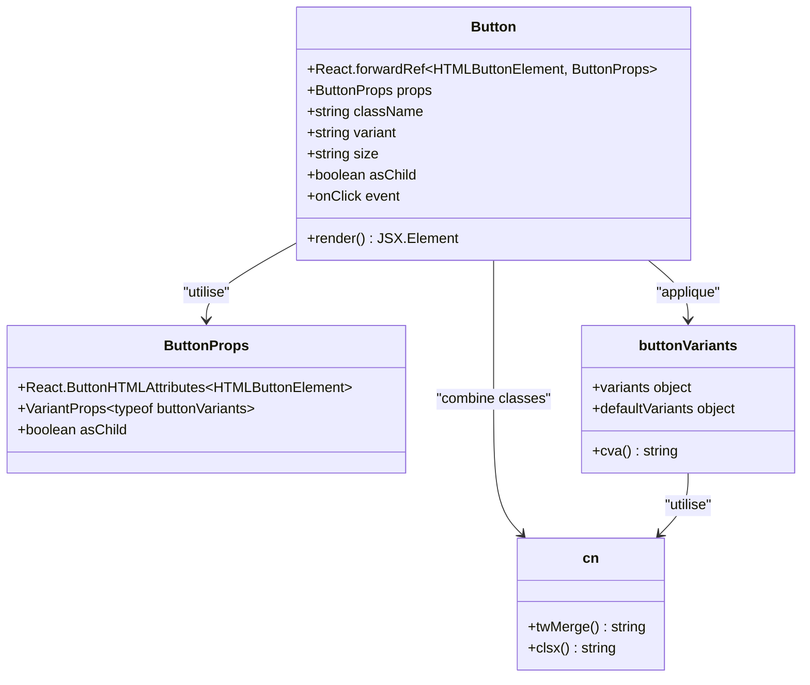
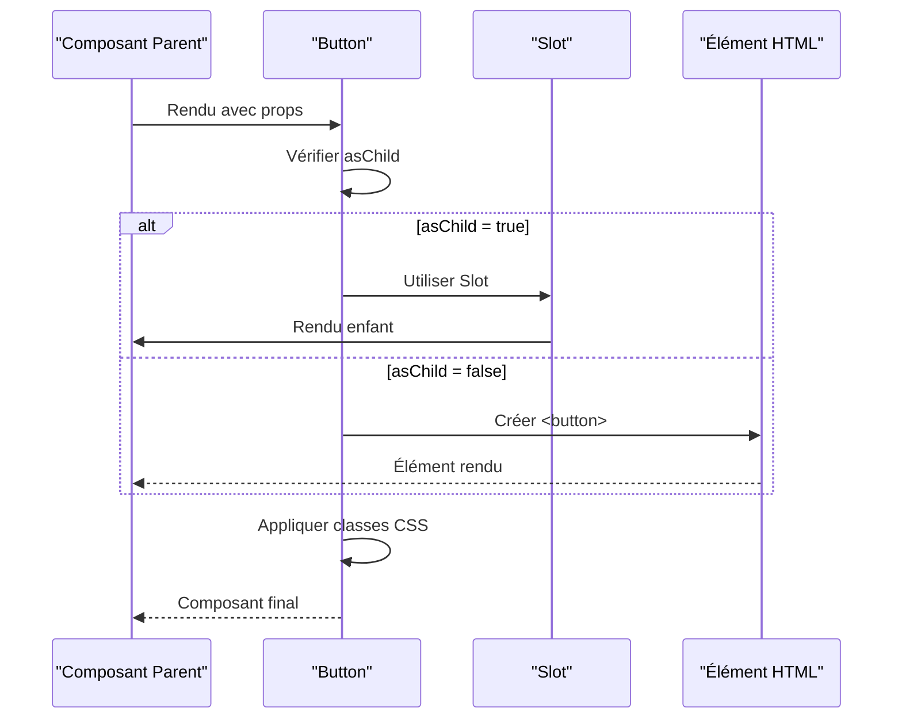
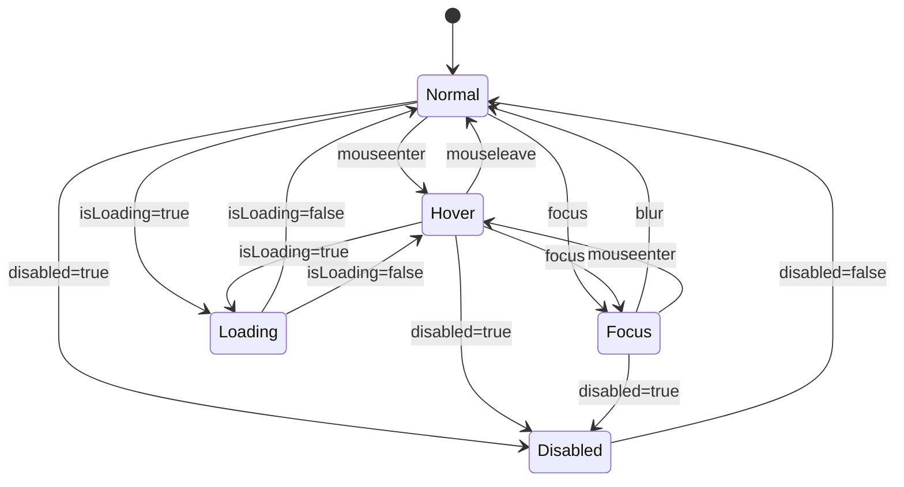

# Composant Button

<cite>
**Fichiers Référencés dans ce Document**
- [button.tsx](file://components/ui/button.tsx)
- [utils.ts](file://lib/utils.ts)
- [components.json](file://components.json)
- [tailwind.config.ts](file://tailwind.config.ts)
- [dialog.tsx](file://components/ui/dialog.tsx)
- [input.tsx](file://components/ui/input.tsx)
- [card.tsx](file://components/ui/card.tsx)
</cite>

## Table des Matières
1. [Introduction](#introduction)
2. [Structure du Projet](#structure-du-projet)
3. [Composants Principaux](#composants-principaux)
4. [Vue d'Ensemble de l'Architecture](#vue-densemble-de-larchitecture)
5. [Analyse Détaillée des Composants](#analyse-détaillée-des-composants)
6. [Analyse des Dépendances](#analyse-des-dépendances)
7. [Considérations de Performance](#considérations-de-performance)
8. [Guide de Dépannage](#guide-de-dépannage)
9. [Conclusion](#conclusion)

## Introduction

Le composant Button est un élément fondamental de l'interface utilisateur du projet Decker, construit avec React et TypeScript. Il fait partie du design system basé sur Tailwind CSS et shadcn/ui, offrant une variété de styles et de fonctionnalités pour créer des boutons interactifs et accessibles.

Ce composant utilise la bibliothèque `class-variance-authority` (CVA) pour gérer les variantes de styles et `clsx` avec `tailwind-merge` pour la gestion des classes CSS, permettant une personnalisation flexible tout en maintenant la cohérence visuelle.

## Structure du Projet

Le composant Button est organisé dans le système de composants de Decker selon une architecture modulaire :



**Sources du Diagramme**
- [button.tsx](file://components/ui/button.tsx#L1-L58)
- [utils.ts](file://lib/utils.ts#L1-L7)
- [components.json](file://components.json#L1-L23)

**Sources de Section**
- [button.tsx](file://components/ui/button.tsx#L1-L58)
- [utils.ts](file://lib/utils.ts#L1-L7)

## Composants Principaux

### Button Variants

Le composant Button supporte plusieurs variantes de style définies par la fonction `buttonVariants` :

| Variante | Description | Couleurs Principales |
|----------|-------------|---------------------|
| `default` | Bouton principal par défaut | `bg-primary`, `text-primary-foreground` |
| `destructive` | Bouton danger/suppression | `bg-destructive`, `text-destructive-foreground` |
| `outline` | Bouton avec bordure | `border`, `bg-background`, `hover:bg-accent` |
| `secondary` | Bouton secondaire | `bg-secondary`, `text-secondary-foreground` |
| `ghost` | Bouton fantôme | `hover:bg-accent`, `hover:text-accent-foreground` |
| `link` | Lien stylisé | `text-primary`, `underline` |

### Tailles Disponibles

| Taille | Hauteur | Padding | Police | Cas d'Usage |
|--------|---------|---------|--------|-------------|
| `default` | 36px | 16px horizontal | 14px | Boutons principaux |
| `sm` | 32px | 12px horizontal | 12px | Boutons compacts |
| `lg` | 40px | 32px horizontal | 14px | Actions importantes |
| `icon` | 36px | 0 padding | 16px | Icônes seules |

**Sources de Section**
- [button.tsx](file://components/ui/button.tsx#L7-L35)

## Vue d'Ensemble de l'Architecture

Le composant Button suit une architecture fonctionnelle moderne avec React, utilisant des patterns avancés pour la réutilisabilité et la flexibilité :



**Sources du Diagramme**
- [button.tsx](file://components/ui/button.tsx#L37-L57)
- [utils.ts](file://lib/utils.ts#L4-L6)

## Analyse Détaillée des Composants

### Implémentation du Composant Button

Le composant Button utilise une approche sophistiquée avec `React.forwardRef` pour maintenir la référence DOM et `asChild` pour la composition de composants :



**Sources du Diagramme**
- [button.tsx](file://components/ui/button.tsx#L43-L57)

### Propriétés et Types

Le composant expose une interface TypeScript complète :

| Propriété | Type | Valeur par Défaut | Description |
|-----------|------|-------------------|-------------|
| `variant` | `string` | `"default"` | Style du bouton |
| `size` | `string` | `"default"` | Taille du bouton |
| `disabled` | `boolean` | `false` | État désactivé |
| `isLoading` | `boolean` | `false` | État de chargement |
| `asChild` | `boolean` | `false` | Utiliser comme enfant |
| `className` | `string` | `""` | Classes CSS supplémentaires |

### États Interactifs

Le composant gère plusieurs états visuels grâce aux utilitaires Tailwind :



**Sources de Section**
- [button.tsx](file://components/ui/button.tsx#L7-L35)
- [button.tsx](file://components/ui/button.tsx#L37-L57)

## Exemples d'Utilisation Pratiques

### Dans les Modales (Dialog)

Le composant Button est largement utilisé dans les composants de dialogue pour les actions utilisateur :

```typescript
// Exemple d'utilisation dans un Dialog
<DialogFooter>
  <Button variant="outline">Annuler</Button>
  <Button type="submit">Confirmer</Button>
</DialogFooter>
```

### Dans les Cartes (Card)

Les boutons sont intégrés dans les cartes pour les actions rapides :

```typescript
<CardContent>
  <Button variant="secondary" className="w-full">
    Modifier
  </Button>
</CardContent>
```

### Avec Icônes

Le composant supporte facilement les icônes Lucide :

```typescript
<Button size="icon">
  <PlusIcon className="h-4 w-4" />
</Button>
```

**Sources de Section**
- [dialog.tsx](file://components/ui/dialog.tsx#L70-L81)

## Accessibilité et Compatibilité

### Attributs ARIA

Le composant Button implémente automatiquement les bonnes pratiques d'accessibilité :

- `focus-visible:outline-none` pour les styles de focus
- `focus-visible:ring-1` pour l'indicateur de focus
- `disabled:pointer-events-none` pour l'état désactivé
- `disabled:opacity-50` pour l'indication visuelle

### Navigation au Clavier

Le composant supporte nativement la navigation au clavier :

- `Tab` : Navigation entre éléments focusables
- `Enter` / `Space` : Activation des boutons
- `Escape` : Fermeture des modales (quand applicable)

### Responsivité

Le composant s'adapte automatiquement aux différentes tailles d'écran grâce aux utilitaires Tailwind :

- `whitespace-nowrap` pour prévenir la rupture de ligne
- `gap-2` pour l'espacement entre contenu et icônes
- `transition-colors` pour les animations fluides

**Sources de Section**
- [button.tsx](file://components/ui/button.tsx#L7-L9)

## Intégration avec le Design System

### Configuration Tailwind

Le composant s'intègre parfaitement avec la configuration Tailwind CSS du projet :

```typescript
// Configuration des couleurs personnalisées
colors: {
  primary: 'hsl(var(--primary))',
  primaryForeground: 'hsl(var(--primary-foreground))',
  destructive: 'hsl(var(--destructive))',
  destructiveForeground: 'hsl(var(--destructive-foreground))',
  // ... autres couleurs
}
```

### Utilisation de cn()

La fonction `cn()` combine intelligemment les classes CSS :

```typescript
// Exemple d'utilisation de cn()
className={cn(
  buttonVariants({ variant, size, className })
)}
```

Cette approche permet :
- Fusion intelligente des classes
- Élimination des doublons
- Priorité des dernières classes

**Sources de Section**
- [button.tsx](file://components/ui/button.tsx#L5-L6)
- [utils.ts](file://lib/utils.ts#L4-L6)
- [tailwind.config.ts](file://tailwind.config.ts#L12-L62)

## Bonnes Pratiques et Erreurs Courantes

### Bonnes Pratiques

1. **Utilisation appropriée des variantes** :
   ```typescript
   // ✅ Correct : utiliser destructive pour les actions dangereuses
   <Button variant="destructive">Supprimer</Button>
   
   // ❌ Incorrect : utiliser primary pour des actions non critiques
   <Button variant="primary">Modifier</Button>
   ```

2. **Gestion des états de chargement** :
   ```typescript
   // ✅ Correct : utiliser isLoading pour les actions asynchrones
   <Button isLoading={isLoading}>Sauvegarder</Button>
   ```

3. **Accessibilité** :
   ```typescript
   // ✅ Correct : fournir du texte descriptif
   <Button>
     <PlusIcon className="mr-2" />
     Ajouter un élément
   </Button>
   ```

### Erreurs Communes à Éviter

1. **Omission des attributs requis** :
   ```typescript
   // ❌ Incorrect : ne pas utiliser onClick sans logique
   <Button>Texte</Button>
   
   // ✅ Correct : fournir une fonction de callback
   <Button onClick={() => console.log('Clicked')}>Texte</Button>
   ```

2. **Styles personnalisés incompatibles** :
   ```typescript
   // ❌ Incorrect : écraser les styles du composant
   <Button className="!bg-red-500">Texte</Button>
   
   // ✅ Correct : ajouter des classes supplémentaires
   <Button className="custom-class">Texte</Button>
   ```

3. **Manque de considération responsive** :
   ```typescript
   // ❌ Incorrect : ignorer la responsivité
   <Button className="w-full">Texte</Button>
   
   // ✅ Correct : utiliser les utilitaires Tailwind
   <Button className="w-full sm:w-auto">Texte</Button>
   ```

## Conclusion

Le composant Button de Decker représente une implémentation robuste et flexible d'un élément UI fondamental. Sa conception modulaire, son support complet de l'accessibilité, et son intégration transparente avec le design system en font un outil puissant pour créer des interfaces utilisateur cohérentes et professionnelles.

Les caractéristiques clés incluent :
- Système de variantes configurable avec CVA
- Support complet de l'accessibilité
- Intégration native avec Tailwind CSS
- Flexibilité grâce à la composition de composants
- Gestion intelligente des états interactifs

Cette documentation fournit une base solide pour comprendre, utiliser et étendre le composant Button dans le contexte du projet Decker.