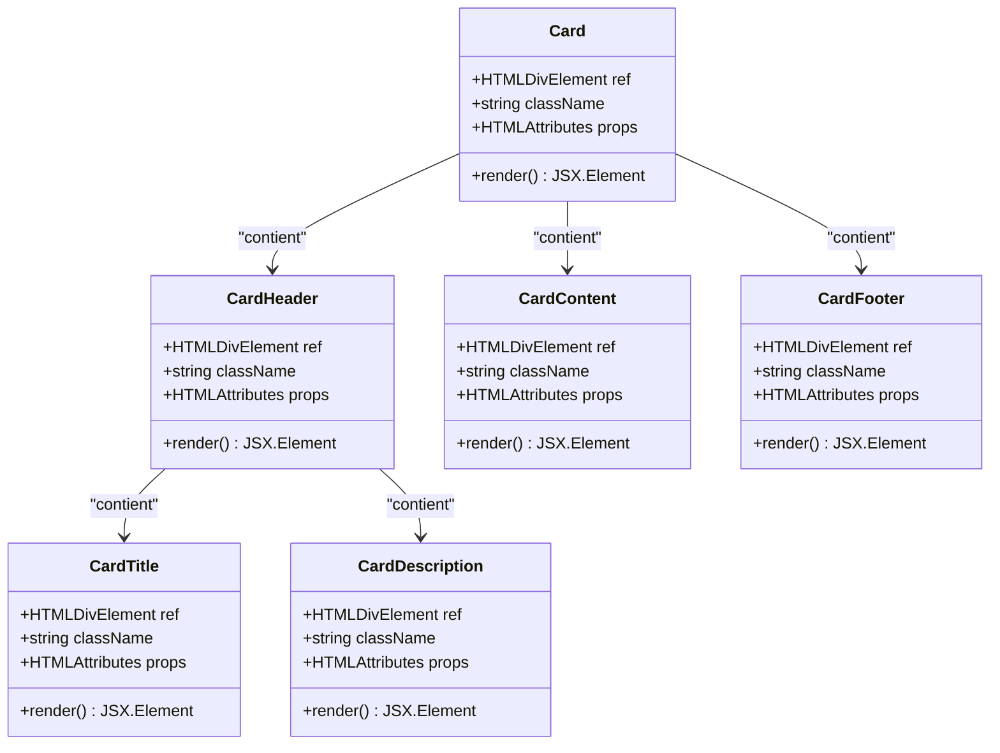
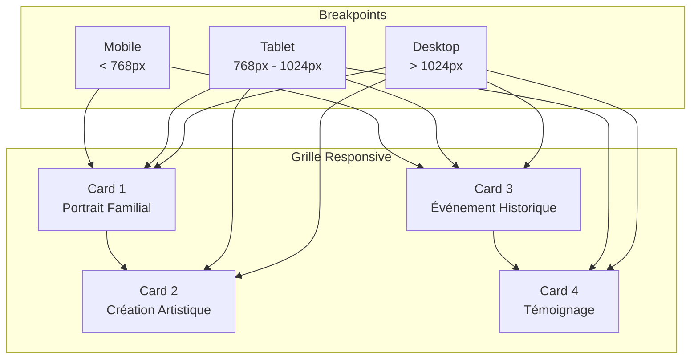
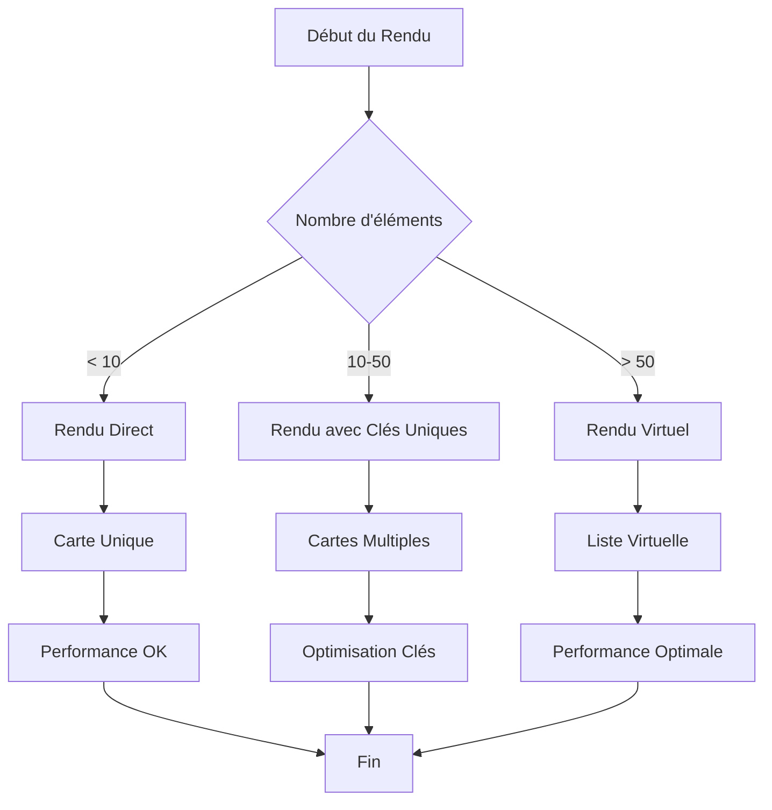
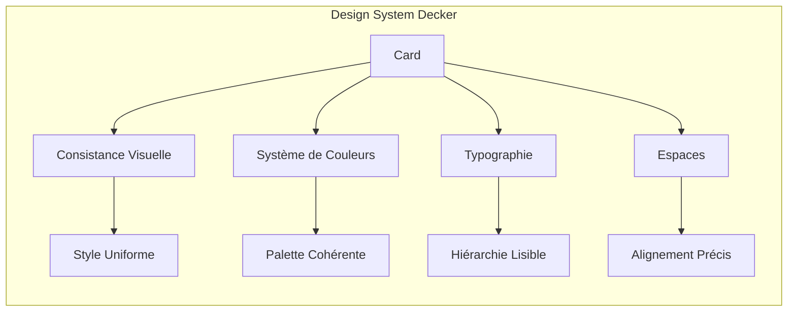

# Composant Card

<cite>
**Fichiers Référencés dans ce Document**
- [card.tsx](file://components/ui/card.tsx)
- [button.tsx](file://components/ui/button.tsx)
- [badge.tsx](file://components/ui/badge.tsx)
- [avatar.tsx](file://components/ui/avatar.tsx)
- [utils.ts](file://lib/utils.ts)
- [tailwind.config.ts](file://tailwind.config.ts)
- [components.json](file://components.json)
- [globals.css](file://app/globals.css)
- [admin/page.tsx](file://app/admin/page.tsx)
- [archives/page.tsx](file://app/archives/page.tsx)
</cite>

## Table des Matières
1. [Introduction](#introduction)
2. [Structure du Composant](#structure-du-composant)
3. [Styles et Variants](#styles-et-variants)
4. [Composition avec Autres Composants](#composition-avec-autres-composants)
5. [Intégration dans une Grille Responsive](#intégration-dans-une-grille-responsive)
6. [Considérations d'Accessibilité](#considérations-daccessibilité)
7. [Performance et Rendu en Liste](#performance-et-rendu-en-liste)
8. [Respect du Design System](#respect-du-design-system)
9. [Exemples Pratiques](#exemples-pratiques)
10. [Conclusion](#conclusion)

## Introduction

Le composant Card est un élément fondamental de l'interface utilisateur de l'application Decker, conçu pour présenter des informations structurées de manière visuellement attrayante et cohérente. Inspiré par le design system shadcn/ui et construit avec Tailwind CSS, ce composant offre une solution flexible pour afficher des données variées comme les portraits familiaux, les créations artistiques ou les événements historiques.

Le composant Card suit une approche modulaire avec six éléments principaux : Card (conteneur principal), CardHeader (en-tête), CardTitle (titre), CardDescription (description), CardContent (corps) et CardFooter (pied de page). Cette structure permet une organisation claire des informations tout en maintenant la flexibilité nécessaire pour différents cas d'usage.

## Structure du Composant

Le composant Card est implémenté comme une collection de composants React réutilisables, chacun ayant un rôle spécifique dans la présentation des données.



**Sources du Diagramme**
- [card.tsx](file://components/ui/card.tsx#L5-L76)

### Composants Individuels

Chaque composant de la suite Card est implémenté avec des propriétés spécifiques :

**Card (Conteneur Principal)** : Le composant racine avec des styles de base incluant un bord arrondi, une ombre portée et une couleur de fond adaptative au thème.

**CardHeader (En-tête)** : Un conteneur flexbox qui organise verticalement le contenu avec un espacement contrôlé entre les éléments enfants.

**CardTitle (Titre)** : Un élément de titre avec une police gras, une ligne haute optimisée et un suivi de texte ajusté pour une lisibilité maximale.

**CardDescription (Description)** : Un texte de description avec une taille réduite et une couleur de premier plan atténuée pour distinguer le contexte.

**CardContent (Corps)** : Le contenu principal du card avec une marge intérieure standardisée et une gestion de l'espacement vertical.

**CardFooter (Pied de Page)** : Un conteneur flexible pour les actions ou informations complémentaires, aligné horizontalement.

**Sources de Section**
- [card.tsx](file://components/ui/card.tsx#L5-L76)

## Styles et Variants

Le composant Card utilise un système de styles basé sur Tailwind CSS avec des couleurs et des espacements définis dans la configuration du projet. Les styles sont appliqués de manière cohérente à travers tous les composants Card.

### Couleurs et Thèmes

Le composant s'adapte automatiquement au thème clair/sombre grâce aux variables CSS personnalisées :

- **Couleur de fond** : `bg-card` (adaptatif selon le thème)
- **Couleur de premier plan** : `text-card-foreground` (adaptatif selon le thème)
- **Bordure** : `border` (couleur du thème)
- **Ombre** : `shadow` (effet d'ombre standard)

### Espacements et Arrondis

- **Bords arrondis** : `rounded-xl` (12px d'arrondi)
- **Ombre** : `shadow` (effet d'ombre léger)
- **Marge extérieure** : Pas de marge par défaut pour permettre une meilleure intégration dans les grilles
- **Padding interne** : 6px (0.375rem) pour tous les composants CardContent et CardFooter

### Adaptabilité Responsive

Les composants Card sont conçus pour être entièrement responsifs, s'adaptant naturellement à différentes tailles d'écran grâce aux utilitaires Tailwind CSS intégrés.

**Sources de Section**
- [card.tsx](file://components/ui/card.tsx#L11-L16)
- [tailwind.config.ts](file://tailwind.config.ts#L12-L22)
- [globals.css](file://app/globals.css#L14-L47)

## Composition avec Autres Composants

Le composant Card excelle dans sa capacité à composer avec d'autres composants UI de l'écosystème Decker, notamment Button, Badge et Avatar.

```mermaid
sequenceDiagram
participant User as "Utilisateur"
participant Card as "Card"
participant Header as "CardHeader"
participant Title as "CardTitle"
participant Content as "CardContent"
participant Button as "Button"
participant Badge as "Badge"
participant Avatar as "Avatar"
User->>Card : Affichage
Card->>Header : Contient
Header->>Title : Titre principal
Header->>Badge : Statut ou étiquette
Card->>Content : Contenu principal
Content->>Avatar : Image ou icône
Content->>Button : Actions disponibles
Button-->>User : Interaction
```

**Sources du Diagramme**
- [admin/page.tsx](file://app/admin/page.tsx#L129-L145)
- [archives/page.tsx](file://app/archives/page.tsx#L42-L58)

### Intégration avec Button

Le composant Button est fréquemment utilisé dans le CardFooter pour fournir des actions utilisateur. Dans l'exemple d'administration, les boutons sont désactivés avec un style approprié pour indiquer que certaines fonctionnalités ne sont pas encore disponibles.

### Intégration avec Badge

Les Badges sont utilisés pour afficher des statuts, catégories ou informations contextuelles. Ils peuvent être placés dans l'en-tête ou le corps du card pour ajouter des informations supplémentaires sans surcharger le contenu principal.

### Intégration avec Avatar

Les Avatars sont souvent utilisés dans les cards pour représenter des utilisateurs, des portraits ou des icônes représentatives. Ils bénéficient de la compatibilité native avec les composants Card pour une présentation cohérente.

**Sources de Section**
- [button.tsx](file://components/ui/button.tsx#L7-L35)
- [badge.tsx](file://components/ui/badge.tsx#L6-L24)
- [avatar.tsx](file://components/ui/avatar.tsx#L8-L20)

## Intégration dans une Grille Responsive

Le composant Card est particulièrement efficace dans les grilles responsive, permettant une présentation flexible des données dans différentes configurations d'écran.

### Configuration Grid Basique



### Exemples d'Implémentation

Dans l'application Decker, le composant Card est utilisé dans plusieurs sections importantes :

**Section Administration** : Les cards sont organisées en grille 2 colonnes sur tablette et desktop, avec une disposition adaptative pour les écrans mobiles.

**Section Archives** : Différentes catégories de contenu (photos, vidéos, documents) sont présentées dans des cards distinctes avec des styles de bordure personnalisés.

**Sources de Section**
- [admin/page.tsx](file://app/admin/page.tsx#L125-L148)
- [archives/page.tsx](file://app/archives/page.tsx#L41-L84)

## Considérations d'Accessibilité

Bien que le composant Card soit principalement un composant de présentation, il respecte les bonnes pratiques d'accessibilité inhérentes à l'utilisation de balises HTML sémantiques et de styles appropriés.

### Rôle et Structure Sémantique

- **Balises HTML** : Chaque composant Card utilise des balises HTML appropriées (div, h2, p) pour maintenir la sémantique
- **Hiérarchie** : Les titres sont structurés de manière hiérarchique (CardTitle, CardDescription)
- **Navigation au clavier** : Les composants internes (boutons, liens) maintiennent leur comportement natif

### Contraste et Lisibilité

- **Contraste** : Les couleurs de texte et arrière-plan respectent les ratios de contraste recommandés
- **Taille de police** : Les tailles de police sont suffisamment grandes pour la lecture confortable
- **Espacement** : L'espacement entre les éléments aide à la lisibilité

### Adaptabilité Visuelle

- **Thème sombre** : Le composant s'adapte automatiquement au thème sombre
- **Zoom** : Le contenu reste lisible même avec un zoom de 200%
- **Couleur uniquement** : Aucune information n'est transmise uniquement par la couleur

## Performance et Rendu en Liste

Le composant Card est optimisé pour le rendu efficace dans des listes de données, particulièrement important pour les sections avec de nombreux éléments comme les archives familiales.

### Optimisations de Performance



### Bonnes Pratiques de Rendu

- **Clés Uniques** : Utiliser des clés uniques pour chaque card dans une liste
- **Lazy Loading** : Charger les images et contenu sur demande pour les grandes collections
- **Virtualisation** : Implémenter le rendu virtuel pour les listes très longues
- **Mise en cache** : Mettre en cache les données des cards pour éviter les re-rendus

### Gestion Mémoire

- **Désallocation** : Nettoyer les références lors de la suppression des cards
- **État Local** : Minimiser l'état local dans les cards pour éviter les fuites mémoire
- **Effets de bord** : Éviter les effets de bord non nécessaires dans les composants Card

## Respect du Design System

Le composant Card fait partie intégrante du design system global de Decker, respectant les principes de cohérence et d'uniformité établis.

### Alignement avec les Standards shadcn/ui

- **Approche modulaire** : Composants séparés réutilisables
- **Système de couleurs** : Utilisation des tokens de couleur du design system
- **Typographie** : Respect des hiérarchies typographiques établies
- **Espaces** : Consistance dans l'utilisation des espacements

### Intégration Tailwind CSS

Le composant Card utilise pleinement les capacités de Tailwind CSS :

- **Utility-first** : Classes utilitaires pour tous les styles
- **Configuration personnalisée** : Variables CSS intégrées dans la configuration Tailwind
- **Theming** : Support complet du système de thème clair/sombre
- **Responsive** : Utilisation des breakpoints intégrés

### Cohérence Visuelle



**Sources de Section**
- [components.json](file://components.json#L1-L23)
- [tailwind.config.ts](file://tailwind.config.ts#L1-L95)

## Exemples Pratiques

### Exemple 1 : Portrait Familial

```typescript
// Structure typique pour un portrait familial
<Card>
  <CardHeader>
    <CardTitle>Jean Dupont</CardTitle>
    <CardDescription>Colonel Rémy, 1914-1918</CardDescription>
  </CardHeader>
  <CardContent>
    <div className="flex items-center space-x-4">
      <Avatar>
        <AvatarImage src="/images/portrait-jean-dupont.jpg" alt="Jean Dupont" />
        <AvatarFallback>JD</AvatarFallback>
      </Avatar>
      <div>
        <p className="text-sm text-muted-foreground">
          Soldat de la Première Guerre mondiale
        </p>
      </div>
    </div>
  </CardContent>
  <CardFooter className="flex justify-between">
    <Button variant="outline">Voir plus</Button>
    <Badge variant="secondary">Historique</Badge>
  </CardFooter>
</Card>
```

### Exemple 2 : Création Artistique

```typescript
// Structure pour une création artistique
<Card className="group hover:shadow-lg transition-shadow duration-200">
  <CardHeader>
    <CardTitle>La Grande Guerre</CardTitle>
    <CardDescription>Oeuvre peinte par Marcel Dupont</CardDescription>
  </CardHeader>
  <CardContent>
    <AspectRatio ratio={16 / 9} className="rounded-lg overflow-hidden">
      
    </AspectRatio>
    <div className="mt-4">
      <p className="text-sm text-muted-foreground">
        Peinture réalisée en 1920, symbole de la reconstruction nationale
      </p>
    </div>
  </CardContent>
  <CardFooter>
    <Button className="w-full">Découvrir l'artiste</Button>
  </CardFooter>
</Card>
```

### Exemple 3 : Événement Historique

```typescript
// Structure pour un événement historique
<Card className="border-l-4 border-primary">
  <CardHeader>
    <div className="flex items-center space-x-4">
      <div className="p-2 bg-primary/10 rounded-lg">
        <Calendar className="h-6 w-6 text-primary" />
      </div>
      <div>
        <CardTitle>11 Novembre 1918</CardTitle>
        <CardDescription>Armistice de la Première Guerre mondiale</CardDescription>
      </div>
    </div>
  </CardHeader>
  <CardContent>
    <div className="space-y-2">
      <p className="text-sm text-muted-foreground">
        Fin brutale mais significative de la guerre qui a marqué l'histoire de France.
      </p>
      <div className="flex items-center space-x-2">
        <Badge variant="outline">1918</Badge>
        <Badge variant="outline">Paix</Badge>
        <Badge variant="outline">France</Badge>
      </div>
    </div>
  </CardContent>
</Card>
```

**Sources de Section**
- [admin/page.tsx](file://app/admin/page.tsx#L129-L145)
- [archives/page.tsx](file://app/archives/page.tsx#L42-L58)

## Conclusion

Le composant Card représente un élément central du design system de l'application Decker, offrant une solution robuste et flexible pour la présentation de contenu structuré. Sa conception modulaire, son intégration native avec les autres composants UI, et son respect des standards d'accessibilité et de performance en font un choix optimal pour présenter les informations de l'application.

L'approche basée sur Tailwind CSS et shadcn/ui garantit une cohérence visuelle tout en maintenant la flexibilité nécessaire pour différents cas d'usage. Que ce soit pour présenter des portraits familiaux, des créations artistiques ou des événements historiques, le composant Card s'adapte parfaitement aux besoins de l'application tout en respectant les meilleures pratiques de développement web modernes.

Sa capacité à composer avec d'autres composants comme Button, Badge et Avatar, combinée à son support natif pour les grilles responsive et l'accessibilité, en fait un outil puissant pour créer des interfaces utilisateur engageantes et performantes.