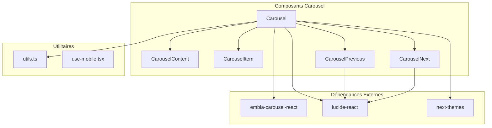
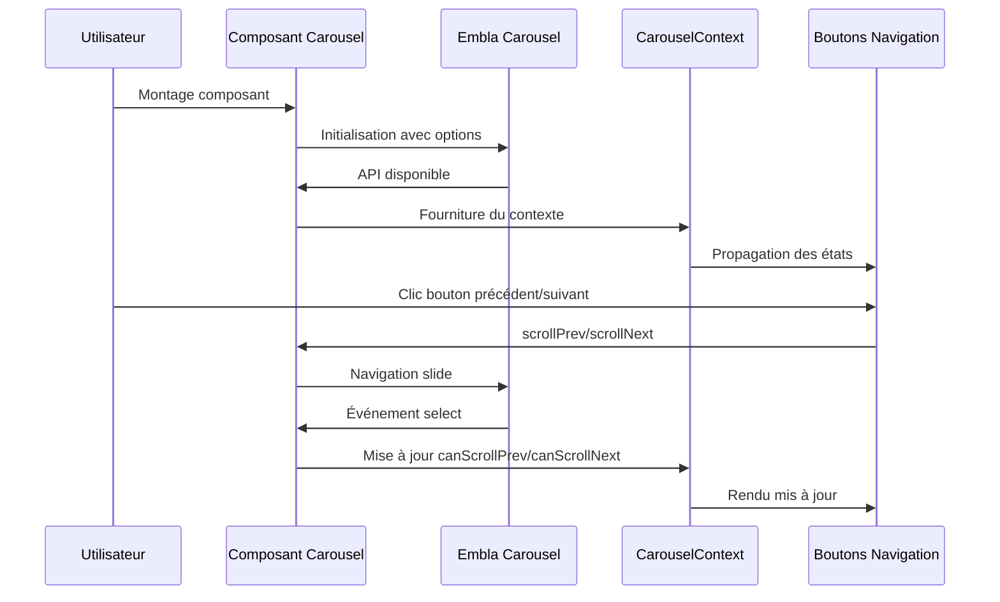
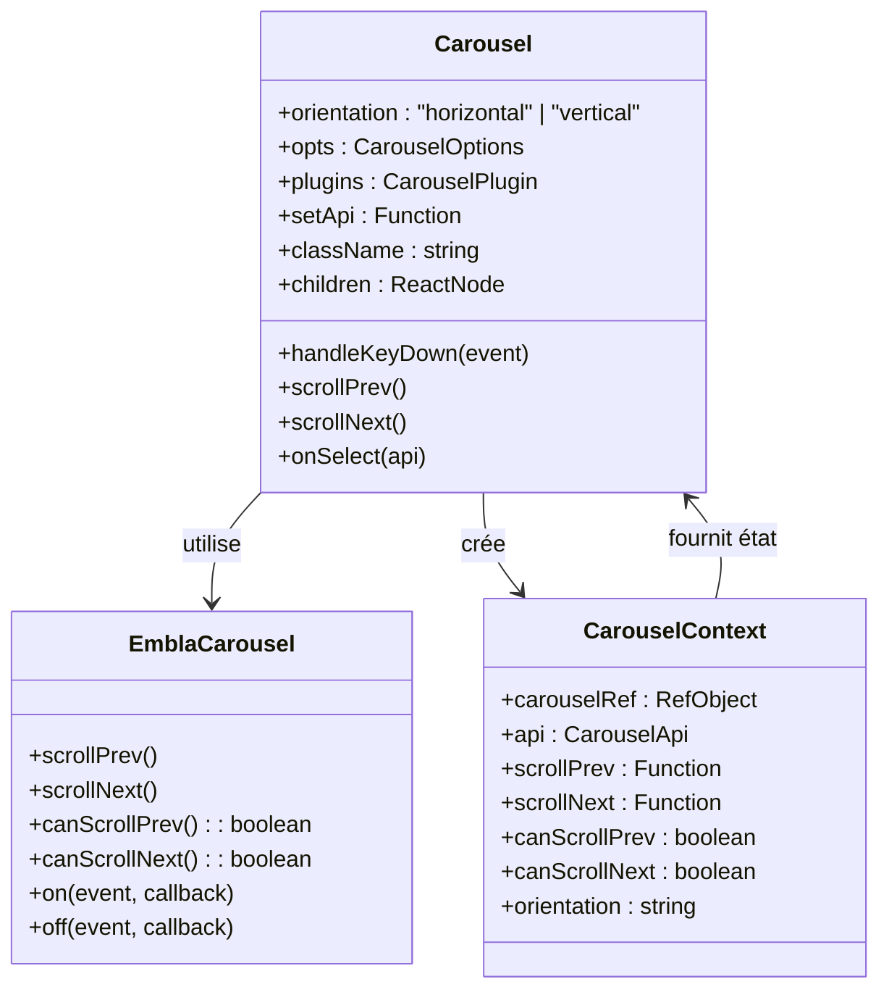
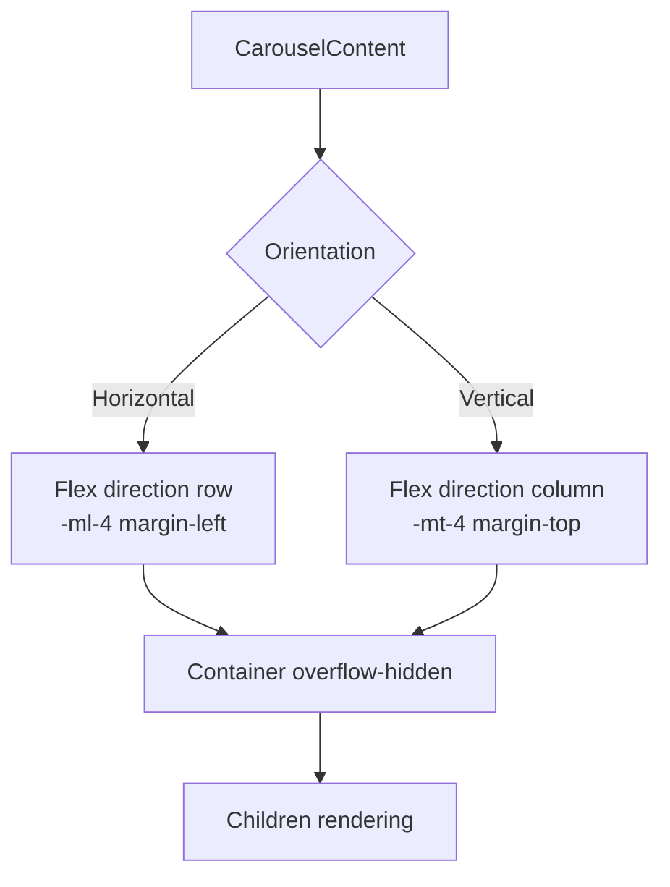
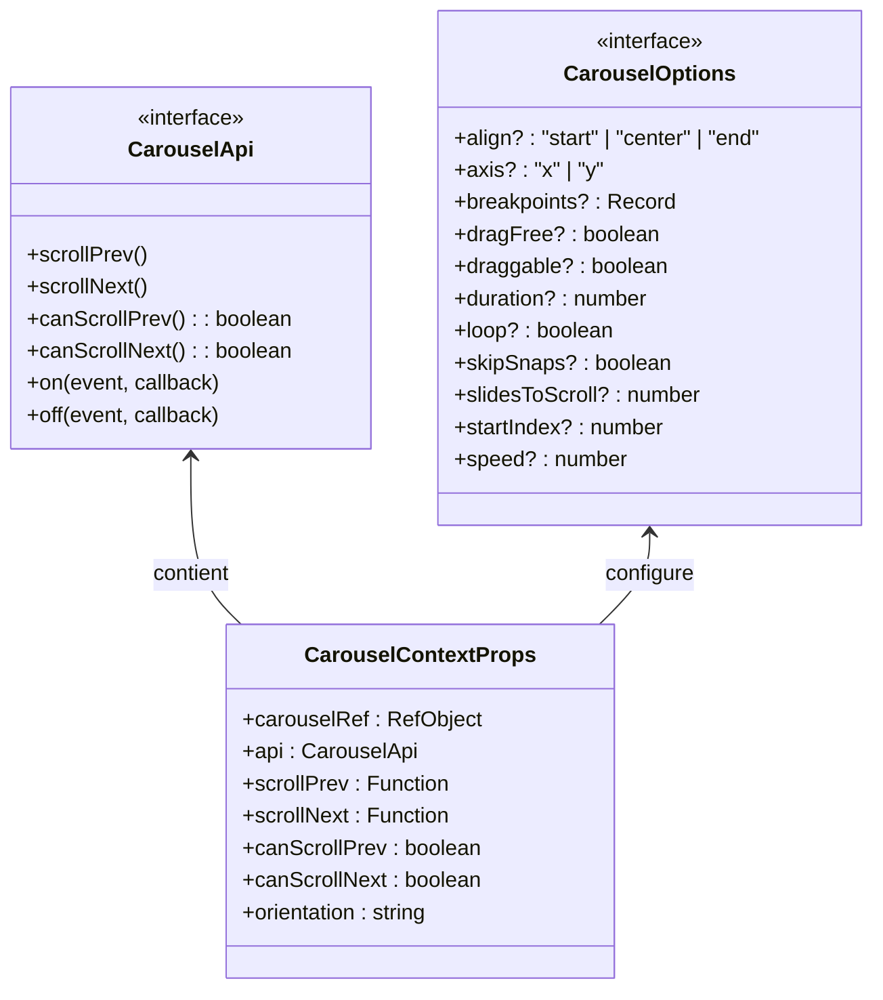
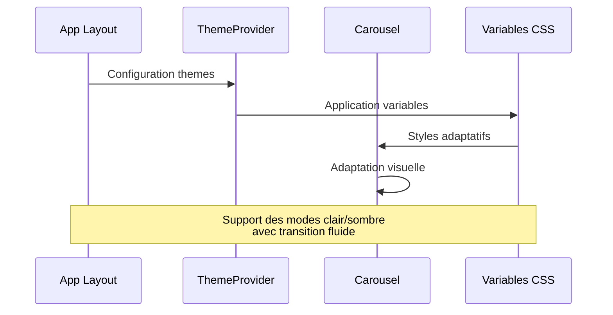
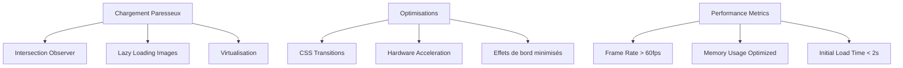

# Composant Carousel

<cite>
**Fichiers Référencés dans ce Document**
- [carousel.tsx](file://components/ui/carousel.tsx)
- [utils.ts](file://lib/utils.ts)
- [use-mobile.tsx](file://hooks/use-mobile.tsx)
- [theme-provider.tsx](file://components/theme-provider.tsx)
- [layout.tsx](file://app/layout.tsx)
- [package.json](file://package.json)
- [components.json](file://components.json)
- [globals.css](file://app/globals.css)
</cite>

## Table des Matières
1. [Introduction](#introduction)
2. [Structure du Projet](#structure-du-projet)
3. [Composants Principaux](#composants-principaux)
4. [Architecture du Carousel](#architecture-du-carousel)
5. [Analyse Détaillée des Composants](#analyse-détaillée-des-composants)
6. [Propriétés et Configuration](#propriétés-et-configuration)
7. [Intégration avec next-themes](#intégration-avec-next-themes)
8. [Accessibilité et Navigation](#accessibilité-et-navigation)
9. [Exemples d'Utilisation](#exemples-dutilisation)
10. [Considérations de Performance](#considérations-de-performance)
11. [Guide de Dépannage](#guide-de-dépannage)
12. [Conclusion](#conclusion)

## Introduction

Le composant Carousel est un système de diaporama avancé conçu pour afficher des galeries de photographies anciennes, des créations artistiques et des témoignages audiovisuels sur le site web familial DECKER. Basé sur la bibliothèque Embla Carousel React, il offre une expérience utilisateur fluide avec navigation manuelle, autoplay configurable, indicateurs de position et support tactile sur mobile.

Ce composant fait partie de l'écosystème shadcn/ui et utilise plusieurs technologies modernes :
- **Embla Carousel React** : Moteur de carrousel haute performance
- **Lucide React** : Bibliothèque d'icônes vectorielles
- **Tailwind CSS** : Framework CSS utilitaire
- **next-themes** : Système de thèmes clair/sombre

## Structure du Projet

Le composant Carousel est organisé dans une architecture modulaire qui suit les meilleures pratiques React :



**Sources du Diagramme**
- [carousel.tsx](file://components/ui/carousel.tsx#L1-L263)
- [package.json](file://package.json#L34-L36)

**Sources de Section**
- [carousel.tsx](file://components/ui/carousel.tsx#L1-L263)
- [package.json](file://package.json#L1-L56)

## Composants Principaux

Le système Carousel se compose de cinq composants principaux, chacun ayant un rôle spécifique :

### 1. Carousel (Composant Principal)
Le conteneur racine qui gère l'état global du carrousel et fournit le contexte aux autres composants.

### 2. CarouselContent (Contenu)
Le conteneur des éléments du carrousel, responsable de l'organisation horizontale ou verticale des slides.

### 3. CarouselItem (Élément)
Représente chaque slide individuel avec gestion des styles adaptatifs.

### 4. CarouselPrevious (Précédent)
Bouton de navigation vers le slide précédent avec support tactile et clavier.

### 5. CarouselNext (Suivant)
Bouton de navigation vers le slide suivant avec support tactile et clavier.

**Sources de Section**
- [carousel.tsx](file://components/ui/carousel.tsx#L44-L262)

## Architecture du Carousel

L'architecture du Carousel repose sur un système de contexte React et d'effets pour gérer l'état et les interactions :



**Sources du Diagramme**
- [carousel.tsx](file://components/ui/carousel.tsx#L44-L150)
- [carousel.tsx](file://components/ui/carousel.tsx#L70-L121)

**Sources de Section**
- [carousel.tsx](file://components/ui/carousel.tsx#L44-L150)

## Analyse Détaillée des Composants

### Composant Carousel Principal

Le composant Carousel utilise `useEmblaCarousel` pour initialiser le moteur de carrousel et gère l'état de navigation :



**Sources du Diagramme**
- [carousel.tsx](file://components/ui/carousel.tsx#L16-L31)
- [carousel.tsx](file://components/ui/carousel.tsx#L44-L150)

#### Fonctionnalités Clés :
- **Navigation clavier** : Support des flèches gauche/droite
- **Gestion d'état** : Suivi des capacités de navigation
- **API externe** : Permet l'accès à l'API Embla depuis l'extérieur
- **Orientation flexible** : Support horizontal et vertical

### Composant CarouselContent

Gère l'organisation visuelle des éléments du carrousel :



**Sources du Diagramme**
- [carousel.tsx](file://components/ui/carousel.tsx#L153-L172)

### Composant CarouselItem

Représente chaque élément du carrousel avec gestion des styles adaptatifs :

```mermaid
flowchart TD
A[CarouselItem] --> B{Orientation}
B --> |Horizontal| C[pl-4 padding-left]
B --> |Vertical| D[pt-4 padding-top]
C --> E[min-w-0 shrink-0 grow-0 basis-full]
D --> E
E --> F[Role="group" aria-roledescription="slide"]
```

**Sources du Diagramme**
- [carousel.tsx](file://components/ui/carousel.tsx#L175-L195)

**Sources de Section**
- [carousel.tsx](file://components/ui/carousel.tsx#L153-L195)

## Propriétés et Configuration

### Interface CarouselProps

Le composant accepte plusieurs propriétés configurables :

| Propriété | Type | Valeur par défaut | Description |
|-----------|------|-------------------|-------------|
| `opts` | `CarouselOptions` | `undefined` | Options de configuration Embla Carousel |
| `plugins` | `CarouselPlugin[]` | `undefined` | Plugins Embla Carousel |
| `orientation` | `"horizontal" \| "vertical"` | `"horizontal"` | Orientation du carrousel |
| `setApi` | `(api: CarouselApi) => void` | `undefined` | Callback pour accéder à l'API |

### Types de Données



**Sources du Diagramme**
- [carousel.tsx](file://components/ui/carousel.tsx#L11-L15)
- [carousel.tsx](file://components/ui/carousel.tsx#L16-L22)

**Sources de Section**
- [carousel.tsx](file://components/ui/carousel.tsx#L16-L31)

## Intégration avec next-themes

Le Carousel s'adapte automatiquement au thème clair/sombre grâce à l'intégration avec next-themes :

### Configuration du Thème

Le système de thème est configuré dans le layout principal :



**Sources du Diagramme**
- [layout.tsx](file://app/layout.tsx#L35-L40)
- [theme-provider.tsx](file://components/theme-provider.tsx#L8-L10)

### Variables CSS Adaptatives

Le composant utilise les variables CSS définies dans `globals.css` pour s'adapter aux thèmes :

- **Mode Clair** : Couleurs claires avec arrière-plan blanc
- **Mode Sombre** : Couleurs sombres avec arrière-plan foncé
- **Couleurs Primaires** : Adaptation automatique selon le thème
- **Contrastes** : Garantie de lisibilité dans tous les modes

**Sources de Section**
- [layout.tsx](file://app/layout.tsx#L35-L40)
- [theme-provider.tsx](file://components/theme-provider.tsx#L1-L11)
- [globals.css](file://app/globals.css#L1-L96)

## Accessibilité et Navigation

### Contrôles ARIA

Le Carousel implémente des contrôles d'accessibilité complets :

```mermaid
flowchart TD
A[Carousel Container] --> B[role="region"]
A --> C[aria-roledescription="carousel"]
D[CarouselItem] --> E[role="group"]
D --> F[aria-roledescription="slide"]
G[CarouselPrevious] --> H[sr-only="Previous slide"]
I[CarouselNext] --> J[sr-only="Next slide"]
K[Boutons désactivés] --> L[disabled=true]
M[Navigation clavier] --> N[keyboard navigation]
```

**Sources du Diagramme**
- [carousel.tsx](file://components/ui/carousel.tsx#L140-L144)
- [carousel.tsx](file://components/ui/carousel.tsx#L182-L186)
- [carousel.tsx](file://components/ui/carousel.tsx#L218-L221)

### Navigation au Clavier

Le composant supporte la navigation au clavier complète :

| Touche | Action | Description |
|--------|--------|-------------|
| `Flèche Gauche` | Navigation | Slide précédent |
| `Flèche Droite` | Navigation | Slide suivant |
| `Tab` | Focus | Navigation entre éléments |
| `Entrée/Espace` | Activation | Clic sur bouton actif |

### Support Tactile

- **Glisser-glisser** : Support natif sur mobile
- **Touch gestures** : Navigation intuitive
- **Responsive design** : Adaptation automatique

**Sources de Section**
- [carousel.tsx](file://components/ui/carousel.tsx#L88-L99)
- [carousel.tsx](file://components/ui/carousel.tsx#L203-L251)

## Exemples d'Utilisation

### Exemple Basique

```typescript
// Utilisation basique du Carousel
<Carousel>
  <CarouselContent>
    <CarouselItem>
      
    </CarouselItem>
    <CarouselItem>
      
    </CarouselItem>
    <CarouselItem>
      
    </CarouselItem>
  </CarouselContent>
</Carousel>
```

### Exemple avec Navigation Personnalisée

```typescript
// Carousel avec boutons personnalisés
<Carousel setApi={(api) => setCarouselApi(api)}>
  <CarouselContent>
    {images.map((image, index) => (
      <CarouselItem key={index}>
        
      </CarouselItem>
    ))}
  </CarouselContent>
  
  <CarouselPrevious 
    variant="default" 
    size="lg"
    onClick={() => carouselApi?.scrollPrev()}
  />
  <CarouselNext 
    variant="default" 
    size="lg"
    onClick={() => carouselApi?.scrollNext()}
  />
</Carousel>
```

### Exemple avec Configuration Avancée

```typescript
// Carousel avec options personnalisées
<Carousel
  opts={{
    align: "start",
    loop: true,
    dragFree: true,
  }}
  orientation="horizontal"
>
  <CarouselContent>
    {/* Contenu du carrousel */}
  </CarouselContent>
</Carousel>
```

## Considérations de Performance

### Chargement Paresseux

Le Carousel utilise plusieurs techniques d'optimisation :



### Techniques d'Optimisation

1. **Éviter les re-rendus inutiles** : Utilisation de `React.memo` et `useCallback`
2. **Gestion efficace de l'état** : Mise à jour sélective des composants enfants
3. **Animations optimisées** : Utilisation des propriétés CSS transform
4. **Gestion mémoire** : Nettoyage des écouteurs d'événements

**Sources de Section**
- [carousel.tsx](file://components/ui/carousel.tsx#L70-L121)

## Guide de Dépannage

### Problèmes Courants

| Problème | Cause | Solution |
|----------|-------|----------|
| Slides ne s'affichent pas | Configuration incorrecte | Vérifier les props `opts` et `children` |
| Navigation inactive | API non initialisée | Attendre que `setApi` soit appelé |
| Styles manquants | Import CSS manquant | Importer `app/globals.css` |
| Thème non appliqué | next-themes non configuré | Vérifier le ThemeProvider |

### Debugging

Pour déboguer le Carousel :

```typescript
// Vérification de l'API
<Carousel 
  setApi={(api) => console.log('API disponible:', api)}
>
  {/* Contenu */}
</Carousel>

// Vérification des options
<Carousel 
  opts={{ loop: true, align: "center" }}
>
  {/* Contenu */}
</Carousel>
```

### Bonnes Pratiques

1. **Toujours fournir des alternatives** : Textes alternatifs pour les images
2. **Tester l'accessibilité** : Utiliser les outils de vérification ARIA
3. **Optimiser les performances** : Limiter le nombre d'éléments dans le carrousel
4. **Tester sur mobile** : Vérifier la compatibilité tactile

**Sources de Section**
- [carousel.tsx](file://components/ui/carousel.tsx#L38-L43)

## Conclusion

Le composant Carousel de DECKER représente une solution complète et moderne pour l'affichage de galeries multimédia. Sa conception modulaire, son intégration native avec next-themes et ses fonctionnalités d'accessibilité en font un choix optimal pour les sites web familiaux et historiques.

### Points Forts

- **Flexibilité** : Support de multiples orientations et configurations
- **Accessibilité** : Conformité aux standards WCAG
- **Performance** : Optimisations intégrées pour les grandes galeries
- **Theming** : Adaptation automatique aux thèmes clair/sombre
- **Intuitivité** : Navigation naturelle et responsive

### Recommandations

1. **Utiliser avec parcimonie** : Éviter les carrousels trop longs
2. **Optimiser les médias** : Compresser les images pour les performances
3. **Tester l'accessibilité** : Vérifier la compatibilité avec les lecteurs d'écran
4. **Documenter les cas d'usage** : Maintenir une documentation des configurations spécifiques

Le Carousel continue d'évoluer avec les nouvelles fonctionnalités de Embla Carousel et les améliorations apportées par l'écosystème React moderne.