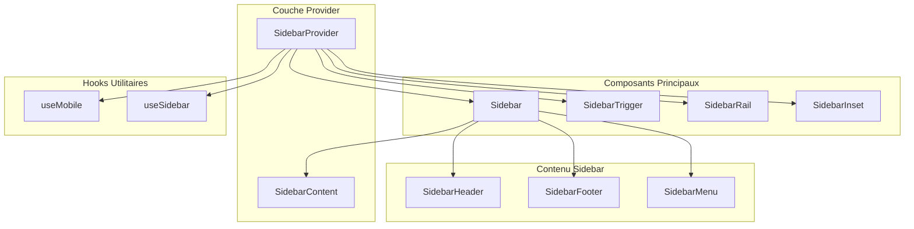
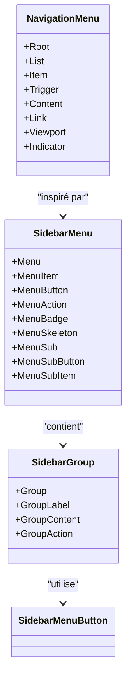
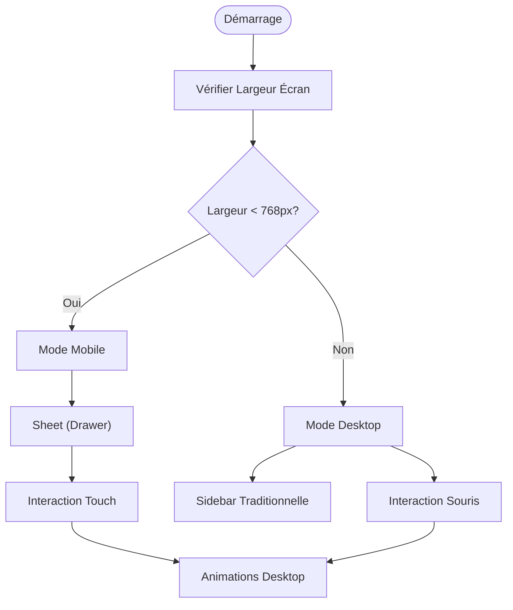
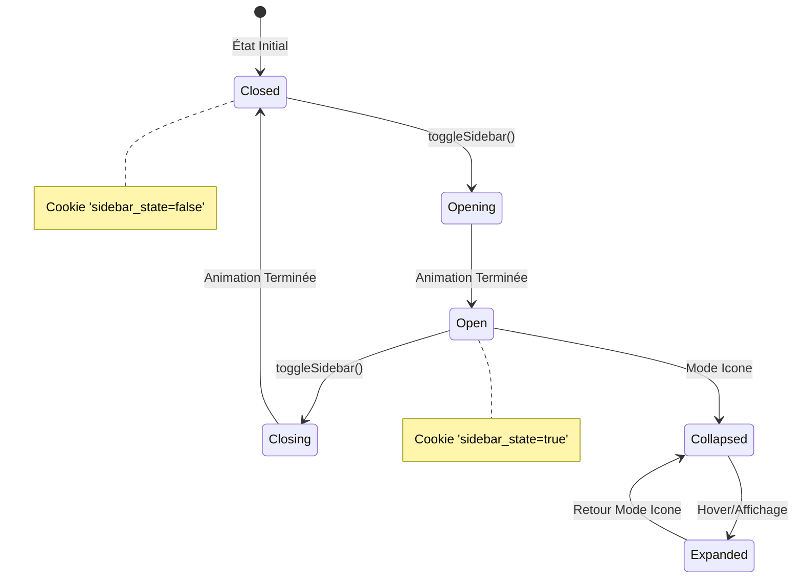
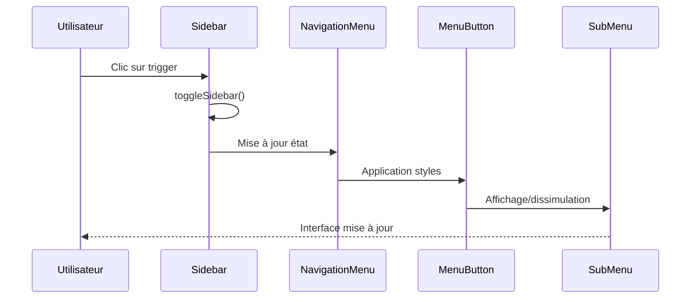

# Composant Sidebar

<cite>
**Fichiers Référencés dans ce Document**
- [sidebar.tsx](file://components/ui/sidebar.tsx)
- [use-mobile.tsx](file://hooks/use-mobile.tsx)
- [navigation-menu.tsx](file://components/ui/navigation-menu.tsx)
- [layout.tsx](file://app/layout.tsx)
- [button.tsx](file://components/ui/button.tsx)
- [sheet.tsx](file://components/ui/sheet.tsx)
- [tooltip.tsx](file://components/ui/tooltip.tsx)
</cite>

## Table des Matières
1. [Introduction](#introduction)
2. [Structure du Projet](#structure-du-projet)
3. [Composants Principaux](#composants-principaux)
4. [Architecture de Navigation](#architecture-de-navigation)
5. [Gestion Responsive](#gestion-responsive)
6. [Persistance d'État](#persistance-détat)
7. [Intégration avec NavigationMenu](#intégration-avec-navigationmenu)
8. [Accessibilité et Performance](#accessibilité-et-performance)
9. [Extensions et Personnalisation](#extensions-et-personnalisation)
10. [Exemples d'Utilisation](#exemples-dutilisation)
11. [Conclusion](#conclusion)

## Introduction

Le composant Sidebar est un élément central de navigation dans l'application Decker, offrant une expérience utilisateur cohérente et responsive à travers différents appareils. Il implémente un système de navigation dépliable sophistiqué qui s'adapte automatiquement aux écrans mobiles et desktop, tout en maintenant une interface intuitive et accessible.

Le composant Sidebar se compose d'un ensemble de sous-composants spécialisés qui travaillent ensemble pour créer une navigation flexible et performante. Il intègre des fonctionnalités avancées comme la persistance d'état via les cookies, la gestion des raccourcis clavier, et l'optimisation pour l'accessibilité.

## Structure du Projet

Le composant Sidebar est organisé autour d'une architecture modulaire qui sépare les responsabilités entre différents niveaux :



**Sources du Diagramme**
- [sidebar.tsx](file://components/ui/sidebar.tsx#L56-L162)
- [use-mobile.tsx](file://hooks/use-mobile.tsx#L5-L19)

**Sources de Section**
- [sidebar.tsx](file://components/ui/sidebar.tsx#L1-L774)
- [layout.tsx](file://app/layout.tsx#L1-L60)

## Composants Principaux

### SidebarProvider

Le `SidebarProvider` constitue le cœur du système de navigation, gérant l'état global de la sidebar et fournissant les contextes nécessaires à tous les sous-composants.

**Caractéristiques principales :**
- Gestion de l'état ouvert/fermé avec persistance cookie
- Détecteur automatique d'appareil mobile
- Raccourcis clavier pour l'activation
- Support des états contrôlés et non-contrôlés

**Configuration des constantes :**
- `SIDEBAR_COOKIE_NAME`: "sidebar_state"
- `SIDEBAR_COOKIE_MAX_AGE`: 7 jours
- `SIDEBAR_WIDTH`: 16rem (desktop)
- `SIDEBAR_WIDTH_MOBILE`: 18rem
- `SIDEBAR_WIDTH_ICON`: 3rem
- `SIDEBAR_KEYBOARD_SHORTCUT`: "b" (Ctrl/Cmd+B)

### Sidebar

Le composant `Sidebar` s'adapte dynamiquement selon le type d'appareil et les paramètres de configuration.

**Variantes disponibles :**
- **sidebar** (défaut): Navigation traditionnelle
- **floating**: Sidebar flottante avec bordures
- **inset**: Sidebar insérée dans le contenu

**Collapsibles :**
- **offcanvas**: Effet de glissement complet
- **icon**: Seulement les icônes visibles
- **none**: Sidebar toujours visible

### SidebarTrigger et SidebarRail

Ces composants fournissent les mécanismes d'interaction pour déplier/replier la sidebar.

**SidebarTrigger** :
- Bouton d'activation avec icône PanelLeft
- Accessibilité intégrée (sr-only label)
- Intégration avec le contexte Sidebar

**SidebarRail** :
- Rail de survol pour les écrans desktop
- Indicateurs visuels de direction
- Support des raccourcis clavier

**Sources de Section**
- [sidebar.tsx](file://components/ui/sidebar.tsx#L56-L325)

## Architecture de Navigation

### Hiérarchie Navigationnelle

Le composant Sidebar intègre profondément le composant `NavigationMenu` pour créer une structure de navigation hiérarchique complète.



**Sources du Diagramme**
- [navigation-menu.tsx](file://components/ui/navigation-menu.tsx#L1-L129)
- [sidebar.tsx](file://components/ui/sidebar.tsx#L498-L771)

### NavigationMenu Intégré

Le `NavigationMenu` fournit une structure de navigation avancée avec :

**Fonctionnalités :**
- Navigation par onglets avec effet de survol
- Contenus déroulants avec animations
- Support des raccourcis clavier
- Accessibilité WCAG complète

**Styles personnalisables :**
- Variants : default, outline
- Tailles : default, sm, lg
- États : actif, ouvert, désactivé

**Sources de Section**
- [navigation-menu.tsx](file://components/ui/navigation-menu.tsx#L1-L129)
- [sidebar.tsx](file://components/ui/sidebar.tsx#L498-L771)

## Gestion Responsive

### Détecteur Mobile

Le système utilise le hook `useIsMobile` pour détecter automatiquement le type d'appareil et adapter l'interface.



**Sources du Diagramme**
- [use-mobile.tsx](file://hooks/use-mobile.tsx#L5-L19)
- [sidebar.tsx](file://components/ui/sidebar.tsx#L184-L222)

### Adaptations Responsive

**Sur mobile (< 768px) :**
- Utilisation de `Sheet` pour un drawer tactile
- Largeur fixe de 18rem
- Interaction swipe native
- Overlay semi-transparent

**Sur desktop (≥ 768px) :**
- Sidebar traditionnelle avec effets de transition
- Largeur configurable (16rem par défaut)
- Support des raccourcis clavier
- Animations fluides

**Sources de Section**
- [use-mobile.tsx](file://hooks/use-mobile.tsx#L1-L20)
- [sidebar.tsx](file://components/ui/sidebar.tsx#L184-L267)

## Persistance d'État

### Système de Cookies

Le composant implémente une persistance d'état robuste via les cookies web.

**Mécanisme de persistance :**
- Nom du cookie : `sidebar_state`
- Durée : 7 jours (60*60*24*7 secondes)
- Valeurs : `true`/`false` (ouvert/fermé)
- Synchronisation automatique avec l'état interne

**Implémentation technique :**
- Écriture lors des changements d'état
- Lecture automatique au montage
- Mise à jour en temps réel
- Fallback pour navigateurs sans cookies

### États de Transition



**Sources de Section**
- [sidebar.tsx](file://components/ui/sidebar.tsx#L79-L96)

## Intégration avec NavigationMenu

### Composition des Composants

Le composant Sidebar s'intègre parfaitement avec NavigationMenu pour créer une navigation complète :



**Sources du Diagramme**
- [sidebar.tsx](file://components/ui/sidebar.tsx#L272-L295)
- [navigation-menu.tsx](file://components/ui/navigation-menu.tsx#L1-L129)

### Fonctionnalités Avancées

**Navigation imbriquée :**
- Support des sous-menus multiples
- Navigation hiérarchique intuitive
- Raccourcis clavier pour chaque niveau

**Personnalisation :**
- Styles variés (default, outline)
- Tailles adaptatives (sm, default, lg)
- Badges et actions contextuelles

**Sources de Section**
- [sidebar.tsx](file://components/ui/sidebar.tsx#L498-L771)
- [navigation-menu.tsx](file://components/ui/navigation-menu.tsx#L1-L129)

## Accessibilité et Performance

### Accessibilité WCAG

Le composant Sidebar implémente plusieurs normes d'accessibilité :

**Raccourcis clavier :**
- `Ctrl/Cmd+B` : Toggle sidebar (configurable)
- Focus management automatique
- Support des lecteurs d'écran

**Attributs ARIA :**
- `aria-label` sur les boutons
- `aria-expanded` pour l'état d'expansion
- `aria-controls` pour les relations

**Focus management :**
- Retour automatique au trigger après fermeture
- Protection contre le focus hors de la sidebar
- Support des raccourcis clavier globaux

### Optimisations de Performance

**Lazy Loading :**
- Chargement conditionnel des sous-composants
- Séparation des bundles par route
- Optimisation des transitions CSS

**Gestion Mémoire :**
- Nettoyage automatique des listeners
- Memoization des fonctions utilitaires
- Événements déclaratifs

**Animations optimisées :**
- Utilisation de CSS transforms
- Prévention du reflow/layout
- Optimisation GPU pour les transitions

**Sources de Section**
- [sidebar.tsx](file://components/ui/sidebar.tsx#L98-L119)
- [sidebar.tsx](file://components/ui/sidebar.tsx#L657-L692)

## Extensions et Personnalisation

### Ajout de Nouvelles Sections

Le système de Sidebar est conçu pour être extensible. Voici comment ajouter de nouvelles sections :

**Structure recommandée :**
```typescript
// Exemple d'extension
<SidebarGroup>
  <SidebarGroupLabel>Témoignages</SidebarGroupLabel>
  <SidebarGroupContent>
    <SidebarMenu>
      <SidebarMenuItem>
        <SidebarMenuButton tooltip="Ajouter témoignage">
          <PlusIcon />
          <span>Ajouter</span>
        </SidebarMenuButton>
      </SidebarMenuItem>
      {/* Autres éléments de témoignages */}
    </SidebarMenu>
  </SidebarGroupContent>
</SidebarGroup>
```

### Points d'Extension

**Pour les témoignages :**
- Ajouter des badges de notification
- Intégrer des filtres et recherches
- Support des vues multiples (liste, grille)

**Pour les archives :**
- Pagination automatique
- Recherche full-text
- Filtrage par date et catégorie

**Pour les favoris :**
- Drag-and-drop pour réorganisation
- Synchronisation cross-device
- Import/export de listes

### Personnalisation Thématique

**Variables CSS :**
- `--sidebar-width`: Largeur principale
- `--sidebar-width-icon`: Largeur mode icônes
- `--sidebar-transition-duration`: Durée des animations

**Classes Tailwind :**
- `bg-sidebar` : Arrière-plan principal
- `text-sidebar-foreground` : Texte principal
- `border-sidebar-border` : Bordures
- `shadow-sidebar` : Ombres

**Sources de Section**
- [sidebar.tsx](file://components/ui/sidebar.tsx#L426-L771)

## Exemples d'Utilisation

### Configuration de Base

Dans le layout principal, le composant Sidebar est configuré comme suit :

```typescript
// Exemple d'utilisation dans layout.tsx
<SidebarProvider>
  <AppSidebar />
  <SidebarInset>
    <header className="flex h-16 shrink-0 items-center gap-2">
      <SidebarTrigger className="-ml-1" />
      <Separator orientation="vertical" className="mr-2 h-4" />
      <h1 className="text-lg font-semibold">Famille DECKER</h1>
    </header>
    <div className="flex flex-1 flex-col gap-4 p-4 pt-0">
      {children}
    </div>
  </SidebarInset>
</SidebarProvider>
```

### Intégration avec NavigationMenu

```typescript
// Exemple de menu de navigation
<SidebarMenu>
  <SidebarMenuItem>
    <SidebarMenuButton asChild isActive={pathname === '/'}>
      <Link href="/">
        <HomeIcon />
        <span>Accueil</span>
      </Link>
    </SidebarMenuButton>
  </SidebarMenuItem>
  
  <SidebarMenuItem>
    <SidebarMenuButton tooltip="Équipe">
      <UsersIcon />
      <span>Équipe</span>
    </SidebarMenuButton>
    <SidebarMenuSub>
      <SidebarMenuSubItem>
        <SidebarMenuSubButton asChild>
          <Link href="/team/members">Membres</Link>
        </SidebarMenuSubButton>
      </SidebarMenuSubItem>
    </SidebarMenuSub>
  </SidebarMenuItem>
</SidebarMenu>
```

### Configuration Avancée

```typescript
// Sidebar avec état contrôlé
<SidebarProvider
  defaultOpen={false}
  open={customOpenState}
  onOpenChange={handleOpenChange}
>
  <Sidebar collapsible="icon" variant="floating">
    {/* Contenu de la sidebar */}
  </Sidebar>
</SidebarProvider>
```

**Sources de Section**
- [layout.tsx](file://app/layout.tsx#L40-L53)
- [sidebar.tsx](file://components/ui/sidebar.tsx#L56-L162)

## Conclusion

Le composant Sidebar de Decker représente une solution complète et sophistiquée pour la navigation dans les applications modernes. Son architecture modulaire, ses capacités d'adaptation responsive, et son intégration profonde avec les systèmes d'accessibilité et de performance en font un élément fondamental de l'expérience utilisateur.

**Points forts identifiés :**
- Architecture contextuelle robuste avec persistance d'état
- Adaptation automatique aux appareils mobiles et desktop
- Intégration transparente avec NavigationMenu
- Support complet de l'accessibilité et des performances
- Extensibilité naturelle pour de nouveaux cas d'usage

**Recommandations d'implémentation :**
- Utiliser les variantes appropriées selon le contexte
- Implémenter des tests d'accessibilité réguliers
- Optimiser les transitions pour les appareils moins puissants
- Documenter les extensions personnalisées

Cette documentation fournit une base solide pour comprendre, utiliser et étendre le composant Sidebar dans le cadre de l'application Decker.