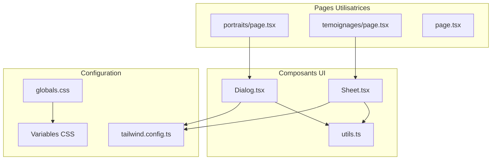
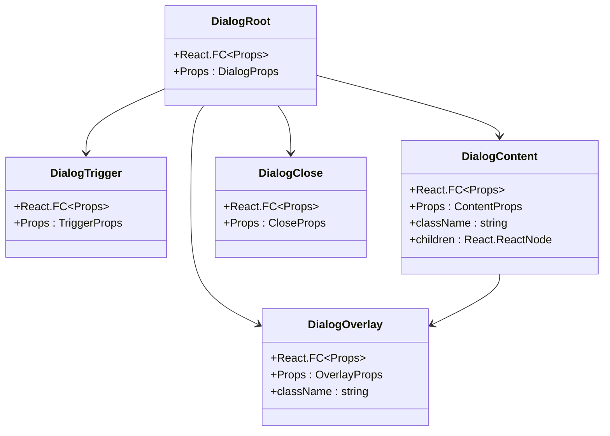
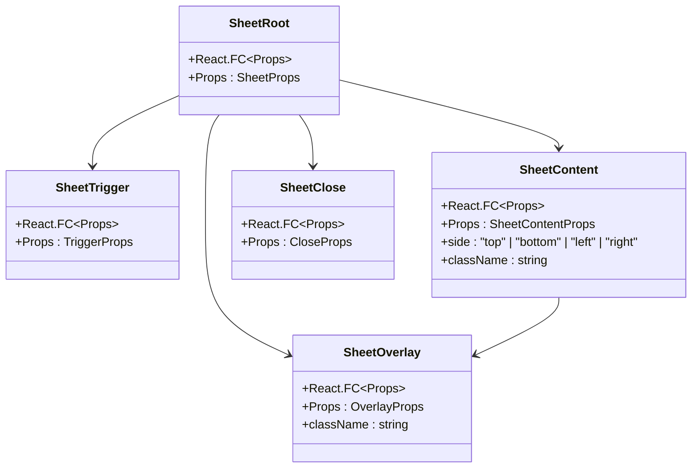
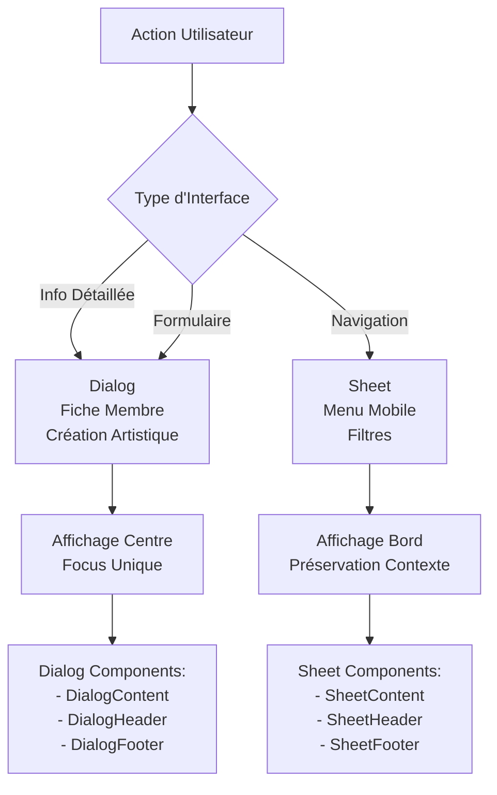
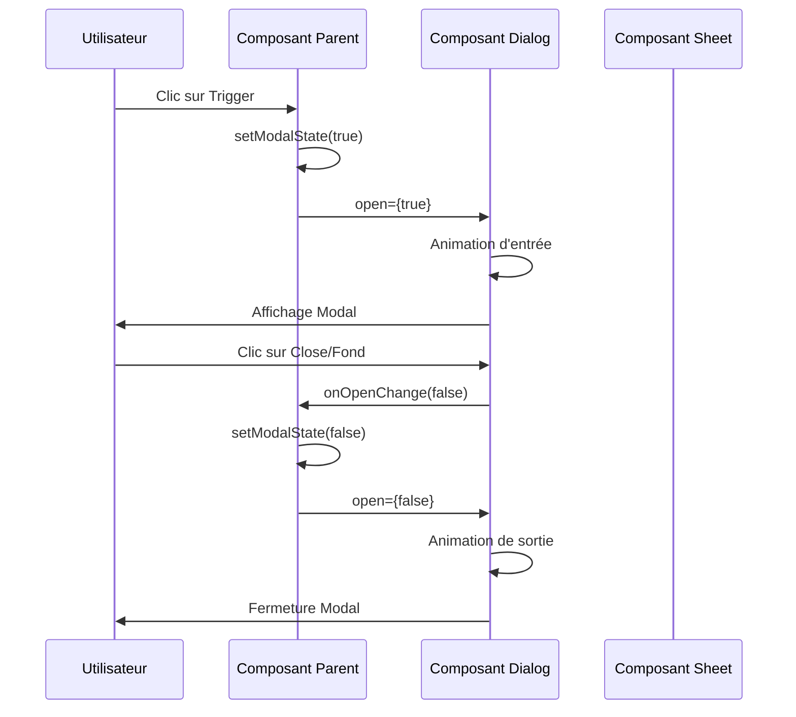
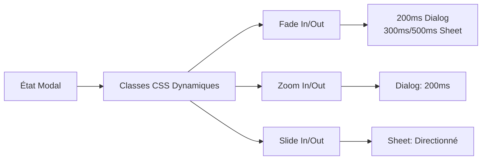
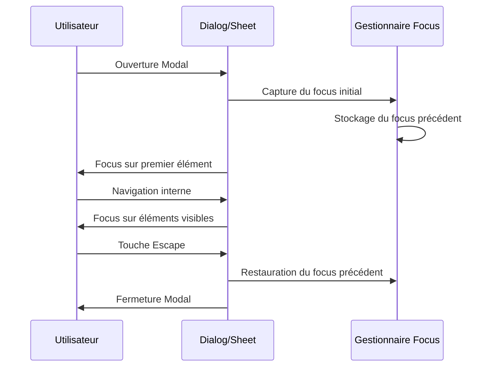
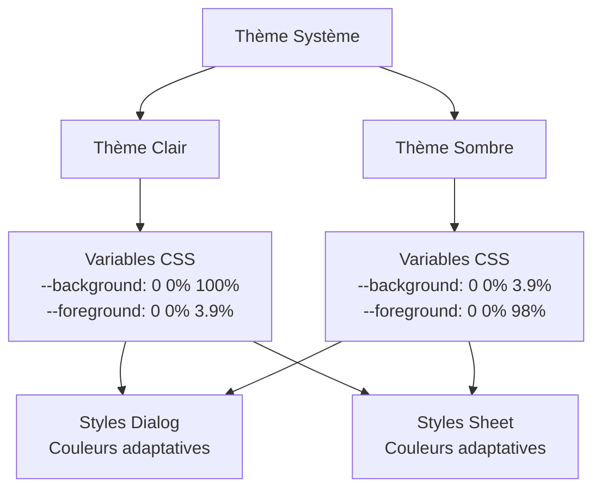

# Composants Dialog et Sheet

<cite>
**Fichiers Référencés dans ce Document**
- [dialog.tsx](file://components/ui/dialog.tsx)
- [sheet.tsx](file://components/ui/sheet.tsx)
- [utils.ts](file://lib/utils.ts)
- [tailwind.config.ts](file://tailwind.config.ts)
- [globals.css](file://app/globals.css)
- [use-mobile.tsx](file://hooks/use-mobile.tsx)
- [portraits/page.tsx](file://app/portraits/page.tsx)
- [temoignages/page.tsx](file://app/temoignages/page.tsx)
- [page.tsx](file://app/page.tsx)
</cite>

## Table des Matières
1. [Introduction](#introduction)
2. [Structure du Projet](#structure-du-projet)
3. [Composants Dialog](#composants-dialog)
4. [Composants Sheet](#composants-sheet)
5. [Comparaison des Usages](#comparaison-des-usages)
6. [Props Partagées et Gestion d'État](#props-partagées-et-gestion-détat)
7. [Animations et Transitions](#animations-et-transitions)
8. [Accessibilité et Gestion du Focus](#accessibilité-et-gestion-du-focus)
9. [Intégration avec le Système de Thème](#intégration-avec-le-système-de-thème)
10. [Exemples d'Utilisation](#exemples-dutilisation)
11. [Bonnes Pratiques](#bonnes-pratiques)
12. [Conclusion](#conclusion)

## Introduction

Les composants Dialog et Sheet sont deux éléments fondamentaux de l'interface utilisateur utilisés pour afficher des contenus supplémentaires sans quitter la page courante. Ces composants modaux permettent de présenter des informations détaillées, des formulaires, ou des interfaces complexes tout en maintenant le contexte de la page parente.

Le système utilise Radix UI comme base pour assurer une accessibilité optimale et une expérience utilisateur cohérente. Les deux composants partagent des concepts similaires mais sont conçus pour des cas d'usage distincts au sein de l'application familiale DECKER.

## Structure du Projet



**Sources du Diagramme**
- [dialog.tsx](file://components/ui/dialog.tsx#L1-L123)
- [sheet.tsx](file://components/ui/sheet.tsx#L1-L141)
- [utils.ts](file://lib/utils.ts#L1-L7)

**Sources de Section**
- [dialog.tsx](file://components/ui/dialog.tsx#L1-L123)
- [sheet.tsx](file://components/ui/sheet.tsx#L1-L141)
- [tailwind.config.ts](file://tailwind.config.ts#L1-L95)

## Composants Dialog

### Architecture et Structure

Le composant Dialog est conçu pour afficher des contenus modaux centrés sur l'écran, idéal pour les actions ponctuelles et les informations de détail importantes.



**Sources du Diagramme**
- [dialog.tsx](file://components/ui/dialog.tsx#L8-L53)

### Fonctionnalités Principales

Le composant Dialog offre plusieurs fonctionnalités clés :

- **Contenu Centralisé** : Le contenu s'affiche au centre de l'écran avec une position fixe
- **Surcouche Semi-Transparente** : Une overlay noire semi-transparente recouvre la page principale
- **Animations Fluides** : Transitions CSS pour l'ouverture et la fermeture
- **Gestion du Focus** : Contrôle automatique du focus lors de l'ouverture/fermeture
- **Fermeture par Échappement** : Support natif du clavier ESC

### Styles et Animations

Le Dialog utilise des animations sophistiquées pour une expérience utilisateur fluide :

- **Fade In/Out** : Transition de transparence
- **Zoom In/Out** : Effet de zoom pour l'entrée et la sortie
- **Slide In/Out** : Mouvements directionnels pour l'animation

**Sources de Section**
- [dialog.tsx](file://components/ui/dialog.tsx#L16-L53)

## Composants Sheet

### Architecture et Structure

Le composant Sheet est optimisé pour les interfaces plus larges, particulièrement utiles sur mobile comme un menu ou un panneau latéral.



**Sources du Diagramme**
- [sheet.tsx](file://components/ui/sheet.tsx#L10-L73)

### Variants de Positionnement

Le Sheet propose quatre positions différentes :
- **Top** : Panneau venant du haut
- **Bottom** : Panneau venant du bas  
- **Left** : Panneau venant de gauche (par défaut)
- **Right** : Panneau venant de droite

### Styles et Animations

Le Sheet utilise des animations adaptées à chaque position :

- **Slide In/Out** : Mouvement selon la direction spécifiée
- **Duration Variable** : Durées différentes selon l'état (ouvert/fermé)
- **Ease Animation** : Transitions fluides avec easing

**Sources de Section**
- [sheet.tsx](file://components/ui/sheet.tsx#L33-L73)

## Comparaison des Usages

### Cas d'Usage Recommandés

| Aspect | Dialog | Sheet |
|--------|--------|-------|
| **Taille du Contenu** | Contenu modéré, centré | Contenu large, pleine largeur |
| **Positionnement** | Centre de l'écran | Bord de l'écran (mobile-first) |
| **Interaction** | Actions ponctuelles | Navigation ou formulaires longs |
| **Mobile** | Moins adapté | Idéal pour mobile |
| **Desktop** | Très efficace | Adapté mais moins fréquent |

### Exemples Concrets



**Sources du Diagramme**
- [portraits/page.tsx](file://app/portraits/page.tsx#L1-L104)
- [temoignages/page.tsx](file://app/temoignages/page.tsx#L1-L116)

## Props Partagées et Gestion d'État

### Props Communes

Les deux composants partagent un ensemble de props essentielles pour la gestion d'état :

```typescript
interface ModalProps {
  open: boolean;
  onOpenChange: (open: boolean) => void;
  children: React.ReactNode;
}
```

### Pattern de Gestion d'État



**Sources du Diagramme**
- [dialog.tsx](file://components/ui/dialog.tsx#L8-L16)
- [sheet.tsx](file://components/ui/sheet.tsx#L10-L15)

### Intégration avec le Hook useMobile

Le système utilise un hook personnalisé pour détecter les appareils mobiles :

```typescript
// utilisation dans les composants
const isMobile = useIsMobile();
```

Cette détection influence le choix entre Dialog et Sheet selon le contexte d'affichage.

**Sources de Section**
- [use-mobile.tsx](file://hooks/use-mobile.tsx#L1-L20)

## Animations et Transitions

### Système d'Animations CSS

Les composants utilisent un système d'animations basé sur les classes CSS conditionnelles :



**Sources du Diagramme**
- [dialog.tsx](file://components/ui/dialog.tsx#L41-L43)
- [sheet.tsx](file://components/ui/sheet.tsx#L34-L49)

### Configuration Tailwind

Le système d'animations est configuré via Tailwind CSS avec des durées personnalisées :

- **Dialog** : 200ms pour toutes les animations
- **Sheet** : 300ms pour fermeture, 500ms pour ouverture
- **Easing** : Ease-in-out pour fluidité

**Sources de Section**
- [tailwind.config.ts](file://tailwind.config.ts#L70-L94)
- [dialog.tsx](file://components/ui/dialog.tsx#L24-L25)
- [sheet.tsx](file://components/ui/sheet.tsx#L24-L25)

## Accessibilité et Gestion du Focus

### Pièges de Focus

Les composants Dialog et Sheet implémentent des stratégies sophistiquées pour éviter les pièges de focus :



### Fonctionnalités d'Accessibilité

- **Fermeture par Escape** : Support natif du clavier
- **Focus Trap** : Limitation du focus dans le modal
- **Announcements** : ARIA live regions pour les changements d'état
- **SR-only Labels** : Textes cachés pour les lecteurs d'écran

### Bonnes Pratiques d'Accessibilité

1. **Gestion du Focus** : Toujours restaurer le focus précédent
2. **ARIA Labels** : Utiliser des labels appropriés
3. **Keyboard Navigation** : Support complet du clavier
4. **Screen Reader** : Compatibilité avec les lecteurs d'écran

**Sources de Section**
- [dialog.tsx](file://components/ui/dialog.tsx#L47-L49)
- [sheet.tsx](file://components/ui/sheet.tsx#L67-L69)

## Intégration avec le Système de Thème

### Variables CSS du Thème

Le système utilise un système de variables CSS pour le thème :

```css
:root {
  --background: 0 0% 100%;
  --foreground: 0 0% 3.9%;
  --card: 0 0% 100%;
  --popover: 0 0% 100%;
  --primary: 0 0% 9%;
  --secondary: 0 0% 96.1%;
  --muted: 0 0% 96.1%;
  --accent: 0 0% 96.1%;
  --destructive: 0 84.2% 60.2%;
  --border: 0 0% 89.8%;
  --input: 0 0% 89.8%;
  --ring: 0 0% 3.9%;
}
```

### Couleurs Adaptatives

Les composants s'adaptent automatiquement au thème :

- **Background** : Couleur de fond du contenu
- **Foreground** : Couleur du texte principal
- **Accent** : Couleurs accentuées pour les états
- **Border** : Couleurs de bordure adaptatives

### Système de Couleurs



**Sources du Diagramme**
- [globals.css](file://app/globals.css#L13-L82)
- [dialog.tsx](file://components/ui/dialog.tsx#L40-L43)
- [sheet.tsx](file://components/ui/sheet.tsx#L63-L65)

**Sources de Section**
- [globals.css](file://app/globals.css#L13-L82)
- [tailwind.config.ts](file://tailwind.config.ts#L10-L62)

## Exemples d'Utilisation

### Dans la Section Portraits

Bien que les exemples ne montrent pas d'utilisation directe, le composant Dialog serait idéal pour :

- **Affichage de Profil Complet** : Fiche détaillée d'un membre de la famille
- **Visualisation d'Images** : Grandes images des portraits
- **Biographies Complètes** : Contenu étendu sur les membres

### Dans la Section Témoignages

Le composant Sheet est plus approprié pour :

- **Menu de Filtrage** : Options de tri par auteur ou thème
- **Interface de Contribution** : Formulaire pour soumettre un témoignage
- **Panneau de Navigation** : Menu latéral sur mobile

### Pattern d'Utilisation Recommandé

```mermaid
flowchart TD
Page[Page Parente] --> Trigger[Bouton/Link]
Trigger --> Conditional{Condition<br/>Mobile/Desktop}
Conditional --> |Mobile| Sheet[Sheet<br/>Menu/Large Interface]
Conditional --> |Desktop| Dialog[Dialog<br/>Info/Détail]
Sheet --> SheetContent[SheetContent<br/>- side: "left"/"right"<br/>- className: "sm:max-w-sm"]
Dialog --> DialogContent[DialogContent<br/>- className: "max-w-lg<br/>translate-x/y<br/>centered"]
SheetContent --> MobileLayout[Layout Mobile<br/>Plein largeur<br/>Bord de l'écran]
DialogContent --> DesktopLayout[Layout Desktop<br/>Centre écran<br/>Taille modérée]
```

**Sources du Diagramme**
- [portraits/page.tsx](file://app/portraits/page.tsx#L47-L103)
- [temoignages/page.tsx](file://app/temoignages/page.tsx#L42-L115)

**Sources de Section**
- [portraits/page.tsx](file://app/portraits/page.tsx#L47-L103)
- [temoignages/page.tsx](file://app/temoignages/page.tsx#L42-L115)

## Bonnes Pratiques

### Choix Entre Dialog et Sheet

1. **Utilisez Dialog pour** :
   - Informations de détail importantes
   - Actions ponctuelles (confirmation, formulaire court)
   - Contenu centré et focalisé

2. **Utilisez Sheet pour** :
   - Navigation ou menus
   - Interfaces larges nécessitant beaucoup d'espace
   - Expérience mobile-first

### Gestion d'État

- **State Local** : Utilisez useState pour contrôler l'état ouvert/fermé
- **Callback Prop** : Implémentez onOpenChange pour la synchronisation
- **Cleanup** : Nettoyez les effets de bord lors de la fermeture

### Accessibilité

- **Focus Management** : Toujours gérer le focus après ouverture/fermeture
- **Keyboard Support** : Assurez-vous de la compatibilité clavier
- **Screen Reader** : Utilisez les bonnes pratiques ARIA

### Performance

- **Lazy Loading** : Chargez le contenu seulement lors de l'ouverture
- **Memory Management** : Nettoyez les références lors de la fermeture
- **Animation Performance** : Utilisez les propriétés CSS animables

### Design Responsif

- **Mobile First** : Préférez Sheet pour les appareils mobiles
- **Breakpoints** : Utilisez useIsMobile pour adapter l'interface
- **Touch Targets** : Assurez des zones de clic suffisamment grandes

## Conclusion

Les composants Dialog et Sheet constituent un système modal robuste et accessible pour l'application familiale DECKER. Leur conception modulaire et leur intégration profonde avec le système de thème Tailwind CSS permettent une expérience utilisateur cohérente et adaptative.

### Points Clés à Retenir

1. **Dialog** : Idéal pour les informations centrées et les actions ponctuelles
2. **Sheet** : Parfait pour les interfaces larges et mobile-first
3. **Accessibilité** : Implémentation complète des bonnes pratiques ARIA
4. **Thème** : Système de couleurs adaptatif et responsive
5. **Animations** : Transitions fluides avec timing approprié

### Recommandations Futures

- **Documentation** : Créer des exemples complets d'utilisation
- **Tests** : Implémenter des tests d'accessibilité automatisés
- **Extensions** : Considérer des variantes spécialisées pour les cas d'usage spécifiques

Ces composants représentent une base solide pour l'interaction utilisateur dans l'application familiale, offrant à la fois flexibilité et accessibilité tout en maintenant une expérience cohérente à travers tous les appareils.