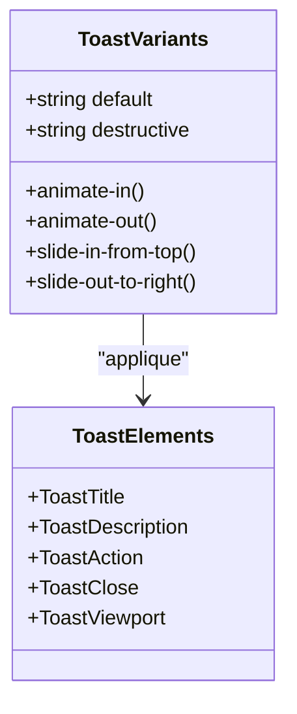
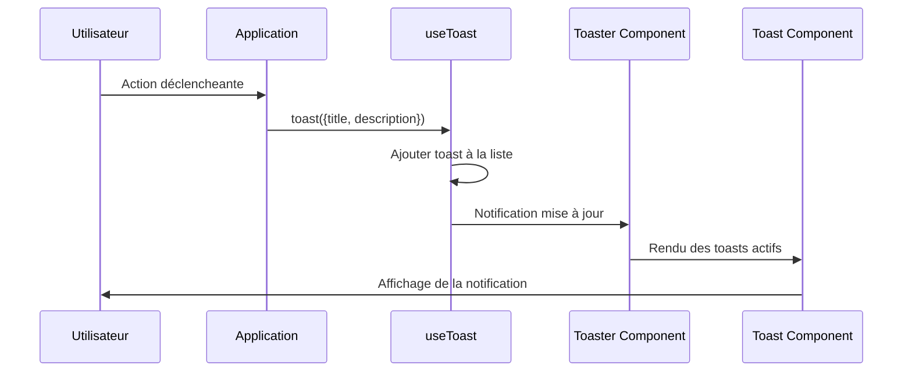
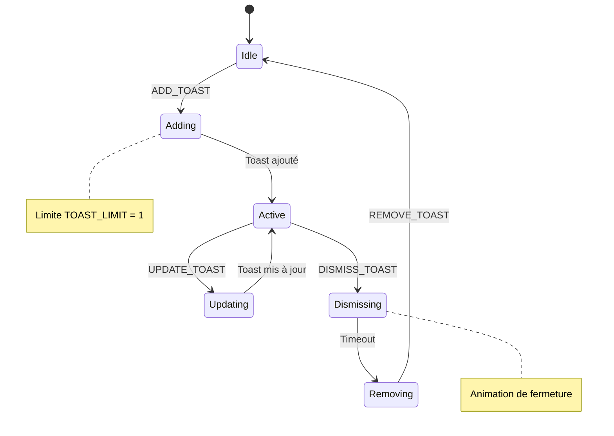
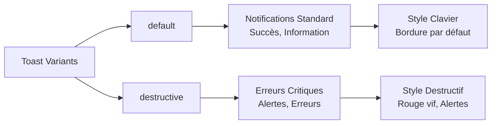
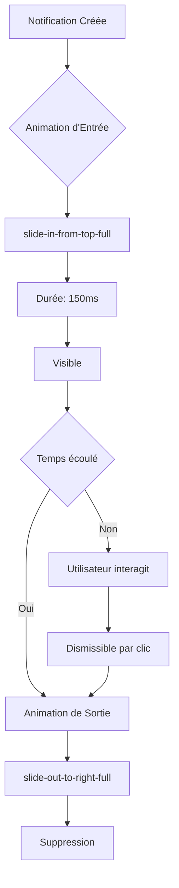
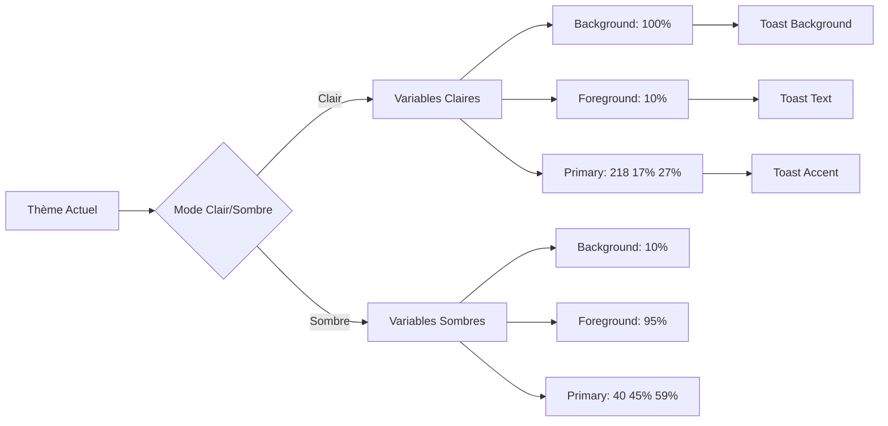

# Composants Toast et Toaster

<cite>
**Fichiers Référencés dans ce Document**
- [toast.tsx](file://components/ui/toast.tsx)
- [toaster.tsx](file://components/ui/toaster.tsx)
- [use-toast.ts](file://hooks/use-toast.ts)
- [utils.ts](file://lib/utils.ts)
- [globals.css](file://app/globals.css)
- [layout.tsx](file://app/layout.tsx)
</cite>

## Table des Matières
1. [Introduction](#introduction)
2. [Structure du Système](#structure-du-système)
3. [Composant Toast](#composant-toast)
4. [Composant Toaster](#composant-toaster)
5. [Hook use-toast](#hook-use-toast)
6. [Intégration et Utilisation](#intégration-et-utilisation)
7. [Types de Notifications](#types-de-notifications)
8. [Animations et Durées](#animations-et-durées)
9. [Accessibilité](#accessibilité)
10. [Adaptation du Thème](#adaptation-du-thème)
11. [Exemples d'Utilisation](#exemples-dutilisation)
12. [Conclusion](#conclusion)

## Introduction

Le système de notifications de Decker est basé sur un ensemble sophistiqué de composants React qui permettent d'afficher des messages éphémères (toast) aux utilisateurs lors d'interactions importantes. Ce système utilise la bibliothèque Radix UI pour les primitives de toast et implémente une logique de gestion d'état centralisée pour une expérience utilisateur fluide et accessible.

Le système comprend trois composants principaux :
- **Toast** : Composant d'affichage individuel d'une notification
- **Toaster** : Composant de gestion globale des notifications
- **use-toast** : Hook personnalisé pour l'émission et la gestion des notifications

## Structure du Système

Le système de notifications suit une architecture modulaire où chaque composant a un rôle spécifique :

```mermaid
graph TB
subgraph "Architecture du Système Toast"
A[use-toast Hook] --> B[État Global]
B --> C[Toaster Component]
C --> D[Toast Provider]
D --> E[Toast Component]
E --> F[Toast Elements]
F --> G[ToastTitle]
F --> H[ToastDescription]
F --> I[ToastAction]
F --> J[ToastClose]
end
subgraph "Émissions de Notifications"
K[toast() Function] --> A
L[Form Submission] --> K
M[File Download] --> K
N[API Response] --> K
end
```

**Sources du Diagramme**
- [use-toast.ts](file://hooks/use-toast.ts#L145-L171)
- [toaster.tsx](file://components/ui/toaster.tsx#L13-L35)
- [toast.tsx](file://components/ui/toast.tsx#L10-L129)

## Composant Toast

Le composant Toast constitue le cœur de l'affichage des notifications individuelles. Il encapsule toutes les fonctionnalités nécessaires pour créer une notification complète avec titre, description, actions et bouton de fermeture.

### Caractéristiques Principales

Le composant Toast implémente plusieurs éléments structuraux :

- **ToastRoot** : Élément racine avec gestion des animations
- **ToastTitle** : Titre de la notification
- **ToastDescription** : Description détaillée
- **ToastAction** : Bouton d'action personnalisable
- **ToastClose** : Bouton de fermeture

### Variants et Styles

Le système utilise `class-variance-authority` (CVA) pour gérer les variants de style :



**Sources du Diagramme**
- [toast.tsx](file://components/ui/toast.tsx#L27-L41)
- [toast.tsx](file://components/ui/toast.tsx#L43-L119)

### Propriétés et Configuration

Le composant Toast accepte diverses propriétés pour personnaliser son comportement :

| Propriété | Type | Description | Valeur par défaut |
|-----------|------|-------------|-------------------|
| variant | "default" \| "destructive" | Style visuel de la notification | "default" |
| className | string | Classes CSS supplémentaires | undefined |
| duration | number | Durée d'affichage en ms | 5000 |
| onOpenChange | function | Callback pour changement d'état | undefined |
| action | ReactNode | Bouton d'action personnalisé | undefined |

**Sources de Section**
- [toast.tsx](file://components/ui/toast.tsx#L27-L41)
- [toast.tsx](file://components/ui/toast.tsx#L43-L56)

## Composant Toaster

Le composant Toaster agit comme un conteneur global qui orchestre l'affichage de toutes les notifications actives. Il s'occupe de la gestion de la liste des toasts et de leur rendu conditionnel.

### Fonctionnement Principal

Le Toaster utilise le hook `useToast()` pour accéder à l'état global des notifications et génère dynamiquement les composants Toast appropriés :



**Sources du Diagramme**
- [use-toast.ts](file://hooks/use-toast.ts#L145-L171)
- [toaster.tsx](file://components/ui/toaster.tsx#L14-L35)

### Gestion de la Vueport

Le composant Toaster intègre également un `ToastViewport` qui contrôle l'emplacement d'affichage des notifications :

- Positionnement fixe en haut de l'écran
- Adaptation responsive pour différents appareils
- Gestion automatique de la pile des notifications

**Sources de Section**
- [toaster.tsx](file://components/ui/toaster.tsx#L13-L35)
- [toast.tsx](file://components/ui/toast.tsx#L12-L25)

## Hook use-toast

Le hook `use-toast` constitue le cœur logique du système de notifications. Il implémente un pattern Redux-like pour la gestion d'état centralisée avec des actions spécifiques.

### Architecture de l'État

Le système utilise une architecture d'état simplifiée avec quatre actions principales :



**Sources du Diagramme**
- [use-toast.ts](file://hooks/use-toast.ts#L77-L128)

### Actions et Reducer

Le reducer gère quatre types d'actions distinctes :

| Action | Description | Effet |
|--------|-------------|-------|
| ADD_TOAST | Ajoute une nouvelle notification | Limite à 1 toast actif |
| UPDATE_TOAST | Met à jour une notification existante | Modifie contenu ou propriétés |
| DISMISS_TOAST | Démarre la fermeture d'une notification | Lance animation de sortie |
| REMOVE_TOAST | Supprime définitivement une notification | Retire de la liste |

### Génération d'IDs

Le système utilise une fonction de génération d'IDs unique pour chaque toast :

```typescript
function genId() {
  count = (count + 1) % Number.MAX_SAFE_INTEGER
  return count.toString()
}
```

Cette approche garantit l'unicité des IDs tout en évitant les fuites mémoire.

**Sources de Section**
- [use-toast.ts](file://hooks/use-toast.ts#L30-L33)
- [use-toast.ts](file://hooks/use-toast.ts#L77-L128)

## Intégration et Utilisation

Pour utiliser le système de notifications, il faut d'abord intégrer le composant Toaster dans l'application.

### Intégration dans le Layout

Le Toaster doit être placé dans le layout principal pour être accessible globalement :

```typescript
// Dans app/layout.tsx
export default function RootLayout({ children }) {
  return (
    <html lang="fr">
      <body>
        <ThemeProvider>
          <SidebarProvider>
            <AppSidebar />
            <SidebarInset>
              <SiteHeader />
              <div className="flex flex-1 flex-col gap-4 p-4 pt-0 min-h-0">
                {children}
              </div>
              <SiteFooter />
            </SidebarInset>
          </SidebarProvider>
          <Toaster />
        </ThemeProvider>
      </body>
    </html>
  )
}
```

### Utilisation du Hook toast()

Le hook expose deux fonctions principales :

```typescript
// Import du hook
import { useToast } from '@/hooks/use-toast'

// Utilisation dans un composant
export function ExampleComponent() {
  const { toast } = useToast()
  
  const handleDownload = () => {
    // Exemple de notification de succès
    toast({
      title: "Téléchargement réussi",
      description: "Votre fichier a été téléchargé avec succès.",
      variant: "default"
    })
  }
  
  const handleError = () => {
    // Exemple de notification d'erreur
    toast({
      title: "Erreur",
      description: "Une erreur est survenue lors du traitement.",
      variant: "destructive"
    })
  }
}
```

**Sources de Section**
- [layout.tsx](file://app/layout.tsx#L35-L50)
- [use-toast.ts](file://hooks/use-toast.ts#L145-L171)

## Types de Notifications

Le système supporte plusieurs types de notifications adaptés à différents contextes d'utilisation :

### Types de Variants

Le système utilise deux variants principaux :



**Sources du Diagramme**
- [toast.tsx](file://components/ui/toast.tsx#L31-L35)

### Cas d'Usage Recommandés

| Type de Notification | Cas d'Usage | Exemple |
|---------------------|-------------|---------|
| default | Succès, Confirmation, Information | "Fichier téléchargé" |
| destructive | Erreurs, Avertissements, Échecs | "Erreur lors de la sauvegarde" |

### Personnalisation Avancée

Les notifications peuvent être personnalisées avec des actions et des durées spécifiques :

```typescript
toast({
  title: "Confirmation requise",
  description: "Êtes-vous sûr de vouloir supprimer cet élément ?",
  variant: "default",
  duration: 10000, // 10 secondes
  action: (
    <ToastAction altText="Confirmer la suppression">
      Confirmer
    </ToastAction>
  )
})
```

**Sources de Section**
- [toast.tsx](file://components/ui/toast.tsx#L27-L41)
- [use-toast.ts](file://hooks/use-toast.ts#L142-L171)

## Animations et Durées

Le système implémente un système d'animations sophistiqué basé sur CSS custom properties et Radix UI animations.

### Durées de Base

Le système utilise deux constantes principales pour la gestion du temps :

- **TOAST_LIMIT = 1** : Limite de 1 toast actif simultanément
- **TOAST_REMOVE_DELAY = 1000000ms** : Délai de suppression (1 million de ms)

### Animations d'Entrée et Sortie



**Sources du Diagramme**
- [toast.tsx](file://components/ui/toast.tsx#L27-L28)

### Configuration des Animations

Les animations sont contrôlées par des classes CSS conditionnelles :

- `data-[state=open]:animate-in` : Animation d'entrée
- `data-[state=closed]:animate-out` : Animation de sortie
- `data-[swipe=end]:animate-out` : Animation lors du swipe

**Sources de Section**
- [use-toast.ts](file://hooks/use-toast.ts#L11-L12)
- [toast.tsx](file://components/ui/toast.tsx#L27-L28)

## Accessibilité

Le système de notifications est conçu avec une attention particulière à l'accessibilité, suivant les meilleures pratiques WCAG.

### Gestion du Focus

Le composant Toast implémente plusieurs fonctionnalités d'accessibilité :

- **Focus Management** : Le bouton de fermeture devient focusable uniquement au survol
- **Keyboard Navigation** : Support complet du clavier
- **Screen Reader** : Labels appropriés pour les lecteurs d'écran

### Éléments Accessibles

```mermaid
graph TB
A[Toast Accessible] --> B[ToastTitle]
A --> C[ToastDescription]
A --> D[ToastAction]
A --> E[ToastClose]
B --> F[aria-label approprié]
C --> G[Contenu textuel clair]
D --> H[Bouton focusable]
E --> I[Bouton de fermeture accessible]
H --> J[Alt Text: "Annuler"]
I --> K[Icone X avec aria-label]
```

**Sources du Diagramme**
- [toast.tsx](file://components/ui/toast.tsx#L91-L113)
- [toast.tsx](file://components/ui/toast.tsx#L73-L89)

### Contrôle du Focus

Le système gère intelligemment le focus pour maintenir une expérience utilisateur cohérente :

- Les notifications ne capturent pas automatiquement le focus
- Le focus revient naturellement après la fermeture
- Support des raccourcis clavier natifs

**Sources de Section**
- [toast.tsx](file://components/ui/toast.tsx#L73-L89)
- [toast.tsx](file://components/ui/toast.tsx#L91-L113)

## Adaptation du Thème

Le système de notifications s'adapte automatiquement au thème actuel (clair/sombre) grâce à l'utilisation des variables CSS et du système de thèmes Tailwind.

### Variables CSS du Thème

Le système utilise les variables CSS définies dans `globals.css` :

```css
/* Mode Clair */
:root {
  --background: 0 0% 100%;
  --foreground: 0 0% 10%;
  --primary: 218 17% 27%;
  --destructive: 0 84.2% 60.2%;
}

/* Mode Sombre */
.dark {
  --background: 218 17% 10%;
  --foreground: 0 0% 95%;
  --primary: 40 45% 59%;
  --destructive: 0 62.8% 50%;
}
```

### Adaptation Visuelle



**Sources du Diagramme**
- [globals.css](file://app/globals.css#L14-L84)

### Couleurs Dynamiques

Les couleurs des notifications s'ajustent automatiquement :

- **Toast par défaut** : Utilise les couleurs `background` et `foreground`
- **Toast destructif** : Utilise les couleurs `destructive` et `destructive-foreground`
- **Boutons d'action** : S'adaptent aux couleurs du thème

**Sources de Section**
- [globals.css](file://app/globals.css#L14-L84)
- [toast.tsx](file://components/ui/toast.tsx#L31-L35)

## Exemples d'Utilisation

Voici quelques exemples concrets d'utilisation du système de notifications dans différents contextes d'application.

### Téléchargement de Documents

```typescript
export function DocumentDownloadButton() {
  const { toast } = useToast()
  
  const handleDownload = async (documentId: string) => {
    try {
      await downloadDocument(documentId)
      
      toast({
        title: "Téléchargement réussi",
        description: "Votre document a été téléchargé avec succès.",
        variant: "default",
        duration: 3000
      })
    } catch (error) {
      toast({
        title: "Erreur de téléchargement",
        description: "Impossible de télécharger le document.",
        variant: "destructive",
        duration: 5000
      })
    }
  }
  
  return (
    <Button onClick={() => handleDownload('doc-123')}>
      Télécharger
    </Button>
  )
}
```

### Soumission de Formulaires

```typescript
export function ContactForm() {
  const { toast } = useToast()
  
  const handleSubmit = async (formData: FormData) => {
    try {
      await submitContactForm(formData)
      
      toast({
        title: "Message envoyé",
        description: "Nous avons bien reçu votre message.",
        variant: "default",
        duration: 4000
      })
      
      // Reset du formulaire
      formRef.current?.reset()
    } catch (error) {
      toast({
        title: "Erreur d'envoi",
        description: "Une erreur est survenue lors de l'envoi.",
        variant: "destructive",
        duration: 6000
      })
    }
  }
  
  return (
    <form onSubmit={handleSubmit}>
      {/* Champs du formulaire */}
      <Button type="submit">Envoyer</Button>
    </form>
  )
}
```

### Gestion d'Erreurs API

```typescript
export function ApiErrorHandler() {
  const { toast } = useToast()
  
  const fetchData = async (url: string) => {
    try {
      const response = await fetch(url)
      if (!response.ok) {
        throw new Error(`HTTP ${response.status}`)
      }
      return response.json()
    } catch (error) {
      toast({
        title: "Erreur réseau",
        description: "Impossible de se connecter au serveur.",
        variant: "destructive",
        duration: 8000,
        action: (
          <ToastAction 
            altText="Réessayer"
            onClick={() => fetchData(url)}
          >
            Réessayer
          </ToastAction>
        )
      })
    }
  }
}
```

### Notifications de Progression

```typescript
export function UploadProgressTracker() {
  const { toast } = useToast()
  const [uploadProgress, setUploadProgress] = useState(0)
  
  useEffect(() => {
    if (uploadProgress > 0 && uploadProgress < 100) {
      toast({
        title: "Chargement...",
        description: `${uploadProgress}% terminé`,
        variant: "default",
        duration: 2000
      })
    } else if (uploadProgress === 100) {
      toast({
        title: "Chargement terminé",
        description: "Fichiers transférés avec succès.",
        variant: "default",
        duration: 3000
      })
    }
  }, [uploadProgress])
  
  return (
    <ProgressBar value={uploadProgress} onChange={setUploadProgress} />
  )
}
```

**Sources de Section**
- [use-toast.ts](file://hooks/use-toast.ts#L145-L171)

## Conclusion

Le système de notifications basé sur Toast et Toaster de Decker représente une solution robuste et accessible pour l'affichage de messages temporaires aux utilisateurs. Son architecture modulaire, ses animations fluides, et son intégration transparente avec le système de thèmes en font un outil puissant pour améliorer l'expérience utilisateur.

### Points Forts du Système

- **Architecture modulaire** : Séparation claire des responsabilités entre composants
- **Accessibilité** : Respect complet des standards WCAG
- **Adaptabilité** : Support automatique des thèmes clair/sombre
- **Flexibilité** : Personnalisation avancée des notifications
- **Performance** : Gestion efficace de l'état et des animations

### Recommandations d'Utilisation

1. **Limitation** : Utiliser le système pour les notifications courtes et informatives
2. **Accessibilité** : Toujours fournir des alternatives textuelles pour les actions
3. **Durées** : Adapter les durées selon le contexte d'utilisation
4. **Thèmes** : Tester l'apparence dans les deux modes clair et sombre

Ce système constitue une base solide pour l'interaction utilisateur dans l'application Decker, offrant une expérience cohérente et professionnelle à travers toutes les fonctionnalités de l'application.