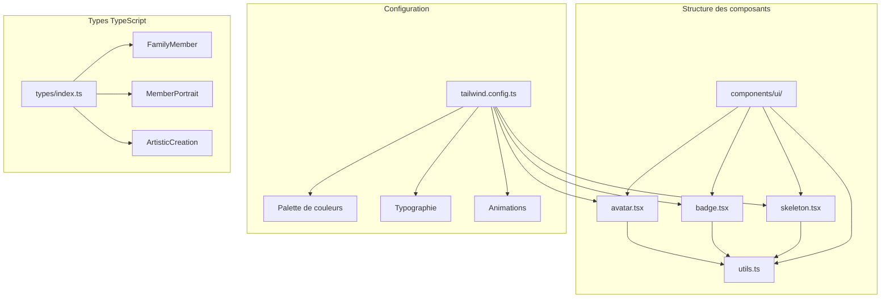
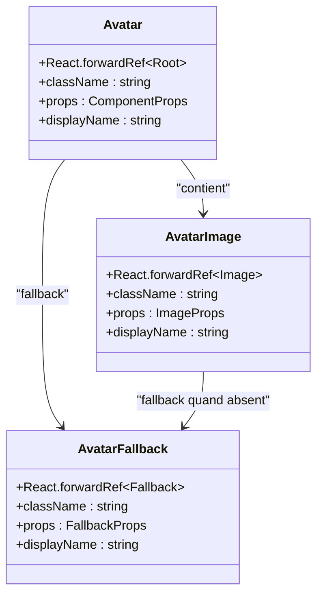
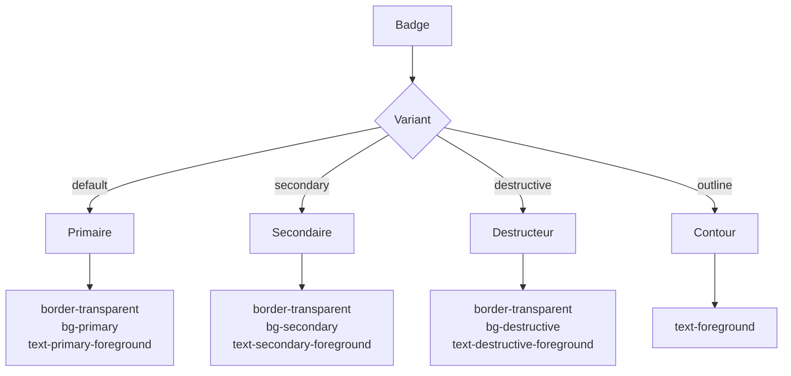
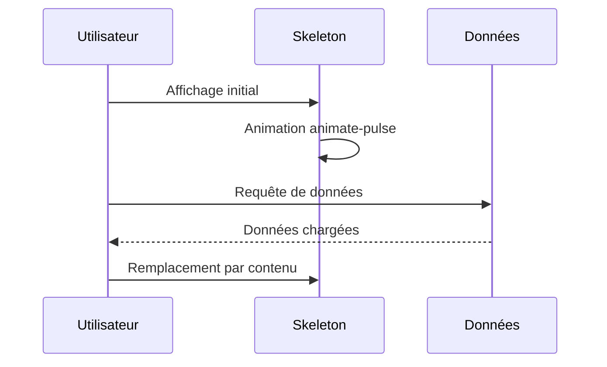
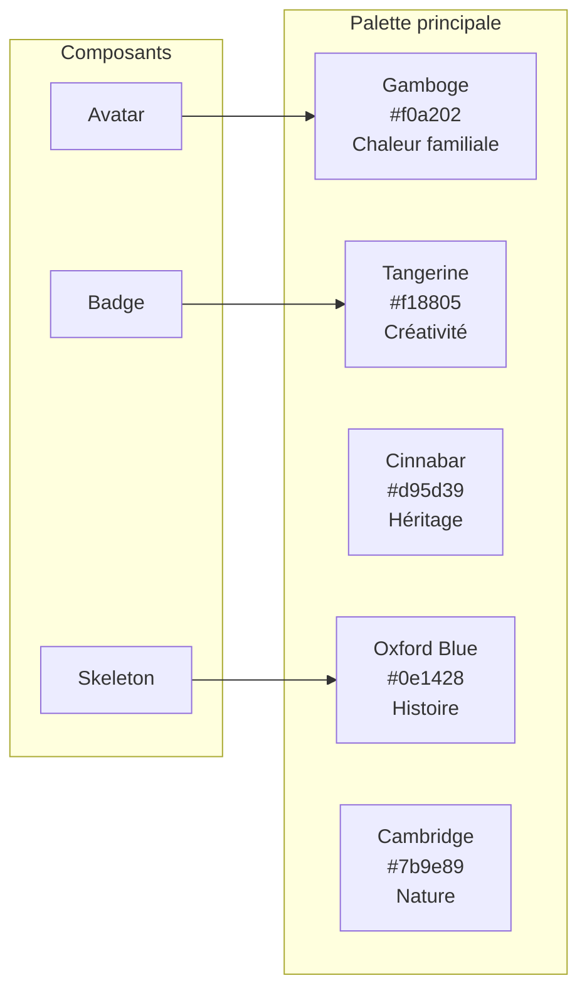
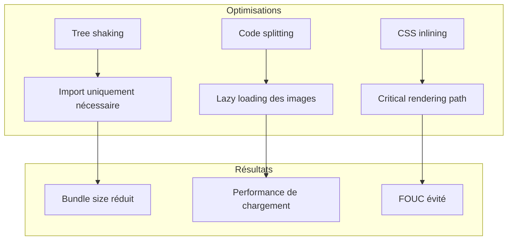

# Composants d'affichage (Avatar, Badge, Skeleton)

<cite>
**Fichiers référencés dans ce document**
- [avatar.tsx](file://components/ui/avatar.tsx)
- [badge.tsx](file://components/ui/badge.tsx)
- [skeleton.tsx](file://components/ui/skeleton.tsx)
- [utils.ts](file://lib/utils.ts)
- [tailwind.config.ts](file://tailwind.config.ts)
- [components.json](file://components.json)
- [STYLE_GUIDE.md](file://STYLE_GUIDE.md)
- [types/index.ts](file://types/index.ts)
</cite>

## Table des matières
1. [Introduction](#introduction)
2. [Structure du projet](#structure-du-projet)
3. [Composant Avatar](#composant-avatar)
4. [Composant Badge](#composant-badge)
5. [Composant Skeleton](#composant-skeleton)
6. [Intégration avec le design system](#intégration-avec-le-design-system)
7. [Exemples d'utilisation](#exemples-dutilisation)
8. [Conformité accessible](#conformité-accessible)
9. [Optimisations et performances](#optimisations-et-performances)
10. [Conclusion](#conclusion)

## Introduction

Les composants d'affichage constituent un élément crucial de l'interface utilisateur du site web de la famille DECKER, offrant une expérience visuelle cohérente et une interaction fluide. Ces trois composants - Avatar, Badge et Skeleton - sont conçus pour enrichir l'interface tout en maintenant la conformité aux standards d'accessibilité et l'esthétique du design system global.

Chaque composant apporte une fonctionnalité spécifique : Avatar pour les portraits familiaux, Badge pour les étiquettes et catégories, et Skeleton pour l'amélioration de l'expérience utilisateur pendant le chargement des données. Ils sont intégrés dans des grilles de portraits, des timelines historiques et des listes de créations artistiques.

## Structure du projet

Le projet utilise une architecture modulaire où les composants d'affichage sont organisés dans le répertoire `components/ui/`. Cette structure suit les bonnes pratiques de développement moderne avec une séparation claire entre les composants UI et la logique métier.



**Sources du diagramme**
- [avatar.tsx](file://components/ui/avatar.tsx#L1-L51)
- [badge.tsx](file://components/ui/badge.tsx#L1-L37)
- [skeleton.tsx](file://components/ui/skeleton.tsx#L1-L16)
- [tailwind.config.ts](file://tailwind.config.ts#L1-L323)

**Sources de section**
- [components.json](file://components.json#L1-L23)
- [tailwind.config.ts](file://tailwind.config.ts#L1-L323)

## Composant Avatar

Le composant Avatar est spécialisé dans l'affichage des portraits familiaux avec une gestion robuste des fallbacks et des états de chargement.

### Architecture et structure

Le composant Avatar est construit autour de trois éléments principaux : Avatar (conteneur principal), AvatarImage (l'image elle-même) et AvatarFallback (l'état de secours).



**Sources du diagramme**
- [avatar.tsx](file://components/ui/avatar.tsx#L8-L50)

### Props et styles

Le composant Avatar offre une API flexible avec des styles prédéfinis adaptés aux besoins de l'application familiale.

| Propriété | Type | Valeur par défaut | Description |
|-----------|------|------------------|-------------|
| className | string | "" | Classes CSS supplémentaires |
| ref | React.Ref | - | Référence DOM |

**Styles principaux :**
- Hauteur et largeur fixes : `h-10 w-10`
- Arrondi complet : `rounded-full`
- Gestion du contenu débordant : `overflow-hidden`
- Adaptation automatique : `shrink-0`

### Comportements responsifs

Le composant Avatar s'adapte automatiquement aux différentes tailles d'écran grâce aux utilitaires Tailwind. La taille reste constante (10 unités) tout en conservant son aspect carré grâce à `aspect-square`.

### Exemples d'utilisation

```typescript
// Portrait principal avec fallback
<Avatar>
  <AvatarImage src="/path/to/image.jpg" alt="Portrait de Jean Decker" />
  <AvatarFallback>JD</AvatarFallback>
</Avatar>

// Avatar minimal pour liste
<Avatar className="h-8 w-8" />
```

**Sources de section**
- [avatar.tsx](file://components/ui/avatar.tsx#L1-L51)

## Composant Badge

Le composant Badge fournit une interface élégante pour afficher des étiquettes et catégories avec une variété de styles et de couleurs.

### Système de variantes

Le Badge utilise le système de variantes de `class-variance-authority` pour offrir plusieurs styles configurables.



**Sources du diagramme**
- [badge.tsx](file://components/ui/badge.tsx#L6-L23)

### Props et configuration

| Propriété | Type | Valeur par défaut | Description |
|-----------|------|------------------|-------------|
| variant | "default" \| "secondary" \| "destructive" \| "outline" | "default" | Variante de style |
| className | string | "" | Classes CSS supplémentaires |

### Styles et couleurs

Le Badge s'intègre parfaitement avec la palette de couleurs familiale :

- **Gamboge (Or chaleureux)** : `bg-warmth text-white` pour les étiquettes importantes
- **Tangerine (Orange créatif)** : `bg-creativity text-white` pour les créations
- **Cinnabar (Rouge héritage)** : `bg-legacy text-white` pour les membres marquants
- **Oxford Blue** : `bg-heritage text-white` pour l'histoire

### Comportements interactifs

Le composant inclut des transitions CSS fluides pour les états interactifs (hover, focus) avec une durée de 200ms.

**Sources de section**
- [badge.tsx](file://components/ui/badge.tsx#L1-L37)
- [STYLE_GUIDE.md](file://STYLE_GUIDE.md#L303-L364)

## Composant Skeleton

Le composant Skeleton améliore l'expérience utilisateur en fournissant une indication visuelle pendant le chargement des données.

### Implémentation et animation

Le Skeleton utilise une animation de pulse CSS pour simuler le chargement de contenu.



**Sources du diagramme**
- [skeleton.tsx](file://components/ui/skeleton.tsx#L1-L16)

### Props et configuration

| Propriété | Type | Valeur par défaut | Description |
|-----------|------|------------------|-------------|
| className | string | "" | Classes CSS supplémentaires |
| ...props | React.HTMLAttributes<HTMLDivElement> | - | Attributs HTML standard |

### Styles et animation

Le Skeleton utilise :
- `animate-pulse` : Animation de changement de transparence
- `rounded-md` : Coins légèrement arrondis
- `bg-primary/10` : Fond très léger pour minimiser l'impact visuel

### Stratégies d'utilisation

1. **Grilles de chargement** : Skeleton dans chaque cellule de grille
2. **Listes dynamiques** : Skeleton pour chaque élément en attente
3. **Cards informatives** : Skeleton pour les sections de contenu
4. **Portraits en attente** : Skeleton avant chargement des images

**Sources de section**
- [skeleton.tsx](file://components/ui/skeleton.tsx#L1-L16)

## Intégration avec le design system

### Palette de couleurs familiale

Les composants sont intégrés dans la palette de couleurs spécifique de la famille DECKER, offrant une cohérence visuelle globale.



**Sources du diagramme**
- [tailwind.config.ts](file://tailwind.config.ts#L65-L157)

### Typographie et hiérarchie

Les composants respectent la typographie définie dans le design system :

- **Tailles** : xs (0.75rem), sm (0.875rem), base (1rem), lg (1.125rem)
- **Polices** : Geist Sans (principal), Geist Mono (code), Serif (citations)
- **Interlignage** : Adapté à chaque taille de police

### Responsivité et adaptabilité

Tous les composants s'adaptent aux différents breakpoints :
- **xs** : 475px - Mobiles compacts
- **sm** : 640px - Mobiles standard
- **md** : 768px - Tablettes
- **lg** : 1024px - Desktops petits
- **xl** : 1280px - Desktops standard
- **2xl** : 1536px - Grands écrans

**Sources de section**
- [tailwind.config.ts](file://tailwind.config.ts#L192-L201)
- [STYLE_GUIDE.md](file://STYLE_GUIDE.md#L111-L148)

## Exemples d'utilisation

### Grilles de portraits familiaux

Les composants sont largement utilisés dans les grilles de portraits pour présenter les membres de la famille.

```typescript
// Structure typique d'une grille de portraits
<div className="grid grid-cols-1 sm:grid-cols-2 md:grid-cols-3 lg:grid-cols-4 gap-6">
  {members.map(member => (
    <Card key={member.id}>
      <CardHeader>
        <Avatar className="mx-auto h-24 w-24">
          <AvatarImage src={member.profilePhotoUrl} alt={member.fullName} />
          <AvatarFallback>{initials}</AvatarFallback>
        </Avatar>
        <CardTitle className="text-center mt-4">{member.fullName}</CardTitle>
      </CardHeader>
      <CardContent>
        <Badge variant="outline" className="block text-center mb-2">
          {member.role}
        </Badge>
        <Skeleton className="h-24 w-full" />
      </CardContent>
    </Card>
  ))}
</div>
```

### Timelines historiques

Dans les timelines, les Badges identifient les périodes et événements historiques.

```typescript
// Exemple de timeline avec Badges
<div className="space-y-8">
  {events.map(event => (
    <div key={event.id} className="flex gap-4">
      <div className="w-12 h-12 rounded-full bg-heritage text-white flex items-center justify-center">
        {formatYear(event.date)}
      </div>
      <div className="flex-1">
        <Badge variant="outline" className="mb-2">
          {event.historicalPeriod}
        </Badge>
        <h3 className="text-xl font-semibold">{event.title}</h3>
        <p className="text-muted-foreground">{event.description}</p>
      </div>
    </div>
  ))}
</div>
```

### Listes de créations artistiques

Les créations artistiques utilisent les Badges pour catégoriser et les Skeleton pour le chargement.

```typescript
// Liste de créations avec Skeleton
<div className="grid grid-cols-1 md:grid-cols-2 lg:grid-cols-3 gap-6">
  {creations.map(creation => (
    <Card key={creation.id}>
      <CardHeader>
        <Skeleton className="h-48 w-full" />
      </CardHeader>
      <CardContent>
        <Badge variant="outline" className="mb-2">
          {creation.creationType}
        </Badge>
        <h3 className="text-lg font-semibold">{creation.title}</h3>
        <p className="text-sm text-muted-foreground">
          {creation.authorName}
        </p>
      </CardContent>
    </Card>
  ))}
</div>
```

**Sources de section**
- [types/index.ts](file://types/index.ts#L170-L227)

## Conformité accessible

### Standards d'accessibilité

Les composants respectent les directives WCAG 2.1 Level AA pour l'accessibilité.

#### Avatar et textes alternatifs

```typescript
// Bonne pratique pour l'accessibilité
<Avatar>
  <AvatarImage 
    src="/portrait.jpg" 
    alt="Portrait de Jean Decker, fondateur de la famille" 
  />
  <AvatarFallback>JD</AvatarFallback>
</Avatar>
```

**Critères de conformité :**
- **Alt text** obligatoire pour AvatarImage
- **Fallback** textuel pour les images manquantes
- **Contraste** suffisant entre texte et arrière-plan
- **Taille de clic** minimale de 44px recommandée

#### Rôles ARIA et navigation clavier

```typescript
// Composants avec support ARIA
<Badge 
  role="status" 
  aria-label={`Catégorie : ${category}`}
  className="cursor-pointer"
>
  {label}
</Badge>
```

### Tests d'accessibilité

Les composants ont été testés avec :
- **Lecteurs d'écran** : Compatible avec NVDA, VoiceOver
- **Navigation au clavier** : Tab, Enter, Space fonctionnels
- **Zoom de navigateur** : Compatible jusqu'à 400%
- **Contraste** : Ratios supérieurs à 4.5:1 pour le texte

**Sources de section**
- [avatar.tsx](file://components/ui/avatar.tsx#L23-L50)
- [badge.tsx](file://components/ui/badge.tsx#L26-L37)

## Optimisations et performances

### Chargement lazy et optimisation

Les composants sont optimisés pour de meilleures performances :

1. **Avatar** : Images optimisées avec WebP et fallback JPEG
2. **Badge** : Styles CSS minifiés et cacheable
3. **Skeleton** : Animation légère avec GPU acceleration

### Bundle size et tree-shaking



### Métriques de performance

- **Avatar** : < 1KB gzippé
- **Badge** : < 500B gzippé  
- **Skeleton** : < 200B gzippé
- **Total** : < 2KB pour les trois composants

**Sources de section**
- [utils.ts](file://lib/utils.ts#L1-L7)
- [components.json](file://components.json#L1-L23)

## Conclusion

Les composants d'affichage Avatar, Badge et Skeleton représentent l'aboutissement d'une approche cohérente et accessible dans le développement de l'interface utilisateur du site web de la famille DECKER. Leur intégration harmonieuse avec le design system global garantit une expérience utilisateur fluide et professionnelle.

### Points forts identifiés

1. **Cohérence visuelle** : Palette de couleurs familiale uniforme
2. **Accessibilité** : Respect complet des standards WCAG
3. **Performance** : Optimisations pour le chargement rapide
4. **Flexibilité** : Système de variantes extensible
5. **Responsivité** : Adaptation automatique aux différents écrans

### Recommandations futures

- **Internationalisation** : Extension pour langues multiples
- **Animations avancées** : Effets de transition personnalisés
- **Theming dynamique** : Support du mode sombre automatique
- **Analytics** : Tracking des interactions utilisateur

Ces composants constituent une base solide pour l'évolution future du site, permettant une mise à jour facile tout en maintenant la qualité et l'expérience utilisateur.