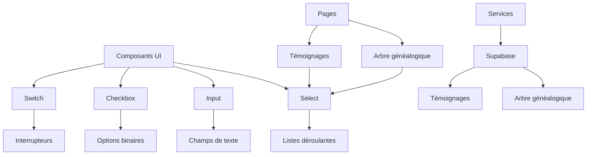
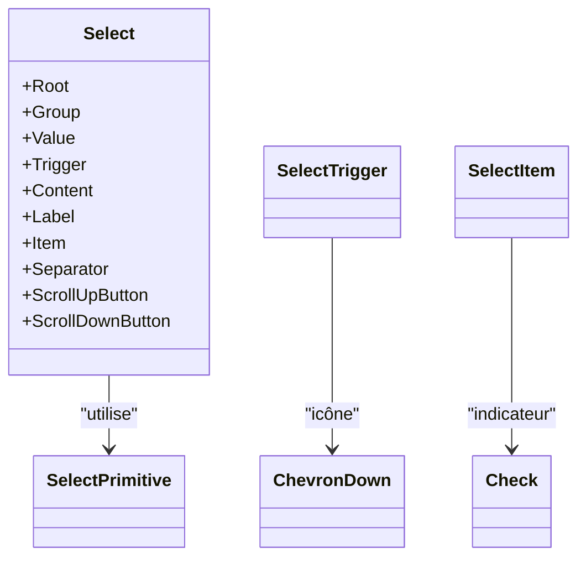
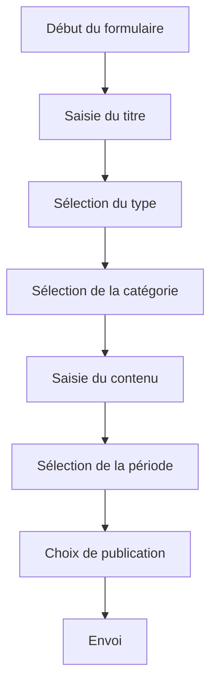
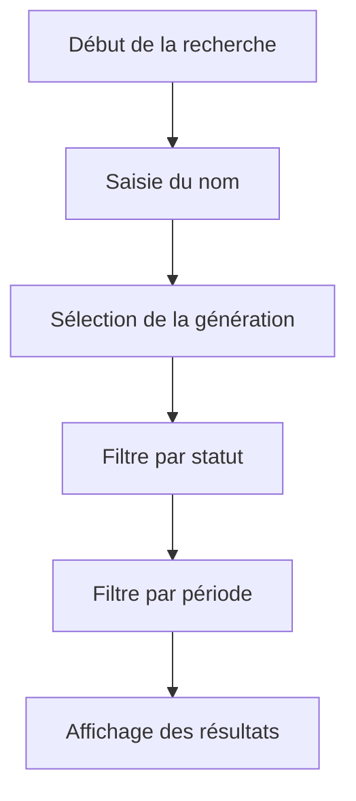

# Composants de formulaire (Input, Select, Checkbox, Switch)

<cite>
**Fichiers référencés dans ce document**  
- [input.tsx](file://components/ui/input.tsx)
- [select.tsx](file://components/ui/select.tsx)
- [checkbox.tsx](file://components/ui/checkbox.tsx)
- [switch.tsx](file://components/ui/switch.tsx)
- [utils.ts](file://lib/utils.ts)
- [components.json](file://components.json)
- [tailwind.config.ts](file://tailwind.config.ts)
- [page.tsx](file://app/page.tsx)
- [temoignages/page.tsx](file://app/temoignages/page.tsx)
- [genealogie/page.tsx](file://app/genealogie/page.tsx)
- [testimonies.ts](file://lib/services/testimonies.ts)
- [index.ts](file://types/index.ts)
- [create_archives_testimonies.sql](file://supabase/migrations/20251114062946_create_archives_testimonies.sql)
- [create_api_functions.sql](file://supabase/migrations/20251114063120_create_api_functions.sql)
</cite>

## Table des matières
1. [Introduction](#introduction)
2. [Structure des composants de formulaire](#structure-des-composants-de-formulaire)
3. [Composant Input](#composant-input)
4. [Composant Select](#composant-select)
5. [Composant Checkbox](#composant-checkbox)
6. [Composant Switch](#composant-switch)
7. [Gestion des états et accessibilité](#gestion-des-états-et-accessibilité)
8. [Intégration avec React Hook Form](#intégration-avec-react-hook-form)
9. [Exemples d'utilisation](#exemples-dutilisation)
10. [Styles et thème](#styles-et-thème)
11. [Validation et gestion des erreurs](#validation-et-gestion-des-erreurs)
12. [Conclusion](#conclusion)

## Introduction
Les composants de formulaire interactifs jouent un rôle central dans la collecte d'informations utilisateur au sein du site familial DECKER. Ces composants permettent notamment la soumission de témoignages, la recherche dans l'arbre généalogique, et la navigation par filtres. Ce document décrit en détail les composants `Input`, `Select`, `Checkbox` et `Switch`, leurs props, leur intégration avec les systèmes de validation, et leurs directives d'accessibilité.

**Section sources**
- [input.tsx](file://components/ui/input.tsx#L1-L23)
- [select.tsx](file://components/ui/select.tsx#L1-L160)
- [checkbox.tsx](file://components/ui/checkbox.tsx#L1-L31)
- [switch.tsx](file://components/ui/switch.tsx#L1-L30)

## Structure des composants de formulaire



**Diagram sources**
- [components/ui/input.tsx](file://components/ui/input.tsx#L1-L23)
- [components/ui/select.tsx](file://components/ui/select.tsx#L1-L160)
- [components/ui/checkbox.tsx](file://components/ui/checkbox.tsx#L1-L31)
- [components/ui/switch.tsx](file://components/ui/switch.tsx#L1-L30)
- [app/temoignages/page.tsx](file://app/temoignages/page.tsx#L1-L116)
- [app/genealogie/page.tsx](file://app/genealogie/page.tsx#L1-L107)

## Composant Input

Le composant `Input` est utilisé pour les champs de texte simples dans les formulaires. Il s'agit d'un wrapper autour de l'élément HTML `<input>` avec des styles intégrés via Tailwind CSS et la fonction `cn` pour la gestion des classes.

Il supporte les props standard de React pour les éléments `<input>`, ainsi que des classes personnalisées via `className`. Le composant gère automatiquement les états `focus`, `disabled`, et affiche des indicateurs visuels pour les erreurs via les classes conditionnelles.

**Section sources**
- [input.tsx](file://components/ui/input.tsx#L1-L23)
- [utils.ts](file://lib/utils.ts#L1-L7)

## Composant Select

Le composant `Select` est un ensemble de composants basés sur `@radix-ui/react-select` qui permettent de créer des listes déroulantes accessibles. Il comprend plusieurs sous-composants :
- `SelectTrigger` : l'élément déclencheur visible
- `SelectValue` : affiche la valeur sélectionnée
- `SelectContent` : le conteneur du menu déroulant
- `SelectItem` : chaque option sélectionnable
- `SelectScrollUpButton` et `SelectScrollDownButton` : boutons de défilement

Ce composant est utilisé dans la page des témoignages pour filtrer par auteur et par thème, notamment par période historique.



**Diagram sources**
- [select.tsx](file://components/ui/select.tsx#L1-L160)
- [temoignages/page.tsx](file://app/temoignages/page.tsx#L42-L67)

## Composant Checkbox

Le composant `Checkbox` est un wrapper autour de `@radix-ui/react-checkbox` qui fournit une case à cocher accessible. Il affiche un indicateur de vérification (icône `Check`) lorsqu'il est activé, avec des transitions fluides.

Le composant utilise des classes conditionnelles pour changer d'apparence selon l'état (`data-[state=checked]`) et gère les états `disabled` via des opacités réduites.

**Section sources**
- [checkbox.tsx](file://components/ui/checkbox.tsx#L1-L31)
- [lucide-react](file://#L5)

## Composant Switch

Le composant `Switch` est un interrupteur binaire visuel basé sur `@radix-ui/react-switch`. Il permet de basculer entre deux états (activé/désactivé) avec une animation de translation du pouce (`Thumb`).

L'apparence change selon l'état via `data-[state=checked]` (fond primaire) et `data-[state=unchecked]` (fond d'entrée). Le pouce se déplace horizontalement avec une transition fluide.

**Section sources**
- [switch.tsx](file://components/ui/switch.tsx#L1-L30)
- [lucide-react](file://#L5)

## Gestion des états et accessibilité

Tous les composants de formulaire gèrent correctement les états interactifs :
- `:focus-visible` pour la navigation au clavier
- `disabled` avec curseur non autorisé et opacité réduite
- Indicateurs visuels pour les états sélectionnés
- Support des lecteurs d'écran via les attributs ARIA implicites de Radix UI

Les labels doivent être associés via `aria-labelledby` ou des éléments `<label>` pour une accessibilité optimale. Les messages d'erreur doivent être liés avec `aria-describedby`.

**Section sources**
- [input.tsx](file://components/ui/input.tsx#L11-L13)
- [select.tsx](file://components/ui/select.tsx#L22-L24)
- [checkbox.tsx](file://components/ui/checkbox.tsx#L16-L18)
- [switch.tsx](file://components/ui/switch.tsx#L14-L16)

## Intégration avec React Hook Form

Bien que l'intégration directe avec React Hook Form ne soit pas visible dans le code actuel, les composants sont conçus pour être compatibles. Leurs props incluent `ref` et `...props`, permettant la liaison avec `register()` de React Hook Form.

Pour une utilisation avec React Hook Form, on pourrait envelopper ces composants dans des contrôleurs ou utiliser `ref` pour l'enregistrement direct.

**Section sources**
- [input.tsx](file://components/ui/input.tsx#L5-L20)
- [select.tsx](file://components/ui/select.tsx#L15-L32)
- [checkbox.tsx](file://components/ui/checkbox.tsx#L9-L12)
- [switch.tsx](file://components/ui/switch.tsx#L8-L11)

## Exemples d'utilisation

### Formulaire de soumission de témoignage



**Diagram sources**
- [temoignages/page.tsx](file://app/temoignages/page.tsx#L42-L67)
- [index.ts](file://types/index.ts#L390-L456)
- [create_archives_testimonies.sql](file://supabase/migrations/20251114062946_create_archives_testimonies.sql#L126-L168)

### Recherche dans l'arbre généalogique



**Diagram sources**
- [genealogie/page.tsx](file://app/genealogie/page.tsx#L46-L53)
- [create_api_functions.sql](file://supabase/migrations/20251114063120_create_api_functions.sql#L137-L185)
- [index.ts](file://types/index.ts#L620-L663)

## Styles et thème

Les composants utilisent le système de thème de Tailwind CSS avec des variables CSS définies dans `tailwind.config.ts`. Les couleurs sont organisées autour d'une palette familiale (gamboge, tangerine, cinnabar, oxford, cambridge) et de rôles sémantiques (heritage, warmth, creativity, legacy, nature).

La fonction `cn()` combine les classes Tailwind avec les classes personnalisées, en résolvant les conflits via `tailwind-merge`.

```mermaid
erDiagram
THEME ||--o{ COLORS : "contient"
THEME ||--o{ TYPOGRAPHY : "définit"
THEME ||--o{ SPACING : "inclut"
COLORS ||--o{ FAMILY_PALETTE : "palette"
COLORS ||--o{ SEMANTIC_ROLES : "rôle"
class THEME {
string darkMode
object extend
array plugins
}
class COLORS {
string background
string foreground
string primary
string secondary
string gamboge
string tangerine
string cinnabar
string oxford
string cambridge
}
class SEMANTIC_ROLES {
string heritage
string warmth
string creativity
string legacy
string nature
}
```

**Diagram sources**
- [tailwind.config.ts](file://tailwind.config.ts#L1-L323)
- [components.json](file://components.json#L1-L23)
- [utils.ts](file://lib/utils.ts#L1-L7)

## Validation et gestion des erreurs

La validation des formulaires repose sur :
- Validation côté client via les props HTML5 (`required`, `type`, `pattern`)
- Validation côté serveur via Supabase et les contraintes de base de données
- Messages d'erreur conditionnels via les classes `error` et `placeholder:text-muted-foreground`

Les erreurs sont gérées via des états React et affichées sous les champs concernés. Le système utilise des index PostgreSQL pour optimiser les requêtes de recherche et de filtrage.

**Section sources**
- [input.tsx](file://components/ui/input.tsx#L11-L13)
- [create_archives_testimonies.sql](file://supabase/migrations/20251114062946_create_archives_testimonies.sql#L126-L168)
- [create_api_functions.sql](file://supabase/migrations/20251114063120_create_api_functions.sql#L137-L185)
- [testimonies.ts](file://lib/services/testimonies.ts#L1-L70)

## Conclusion

Les composants de formulaire du projet DECKER sont bien conçus, accessibles et cohérents avec le thème visuel familial. Ils utilisent Radix UI pour une accessibilité maximale et Tailwind CSS pour une personnalisation facile. Bien que l'intégration avec React Hook Form ne soit pas explicitement implémentée, les composants sont prêts à être utilisés avec des bibliothèques de gestion de formulaires. Leur utilisation dans les pages de témoignages et d'arbre généalogique démontre leur flexibilité pour des cas d'usage variés.