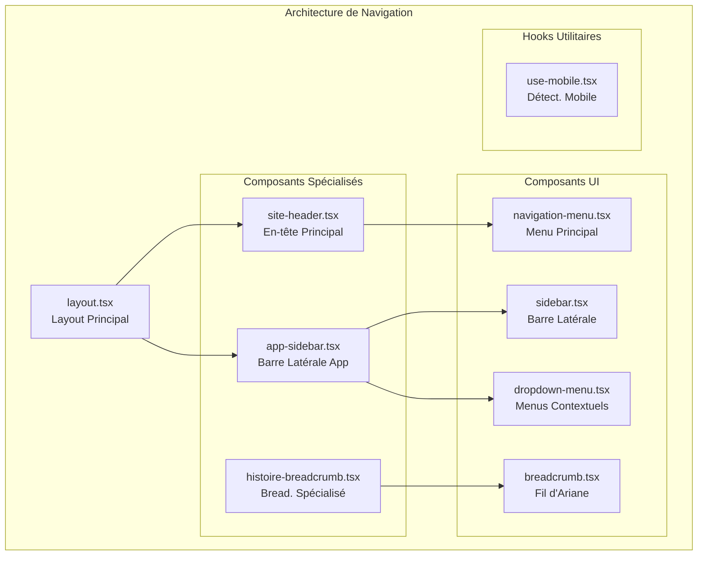
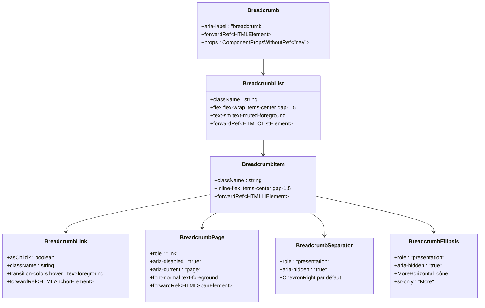
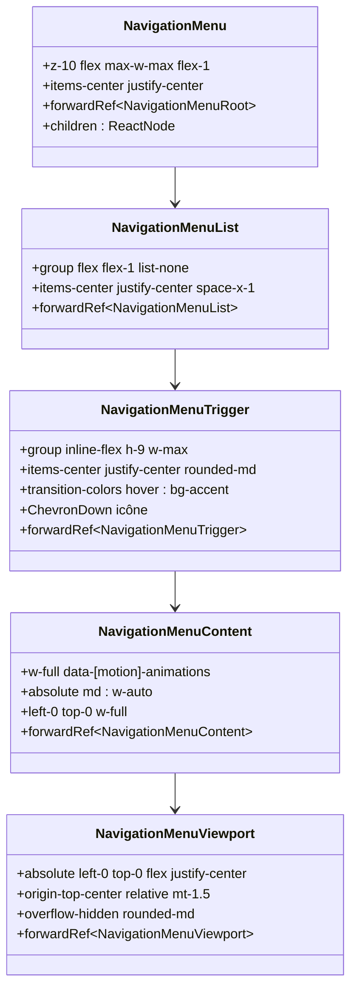
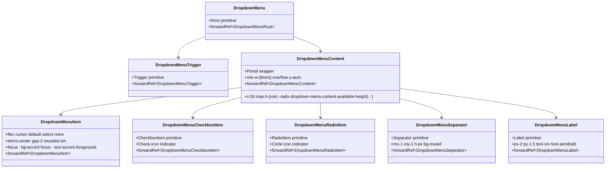
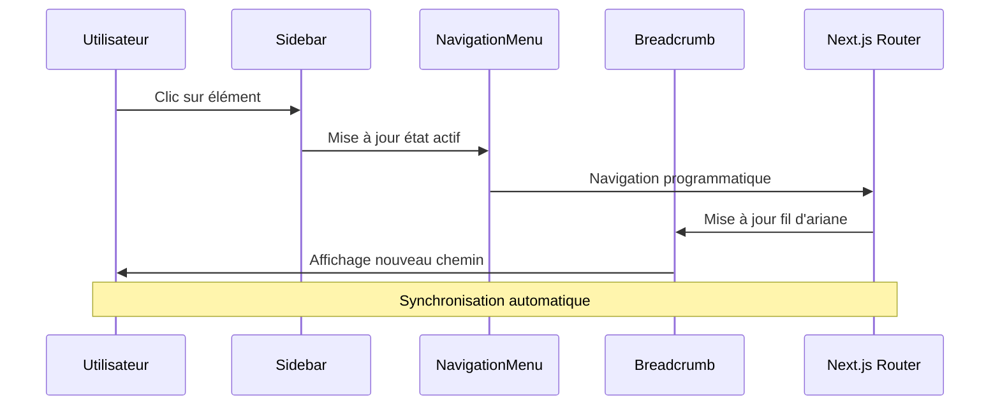
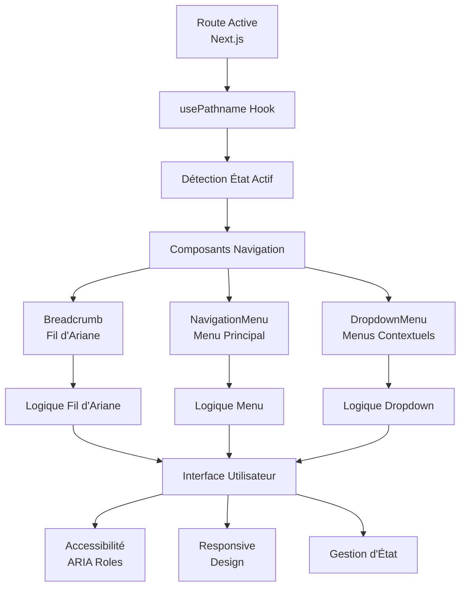
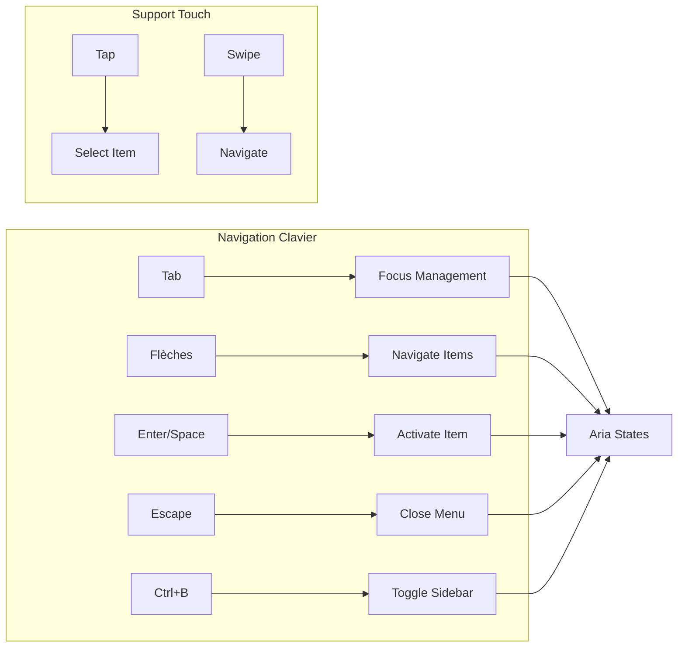
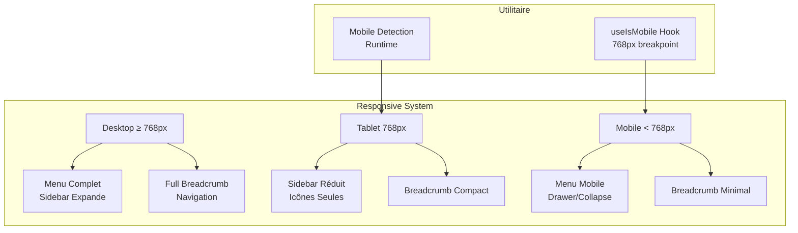
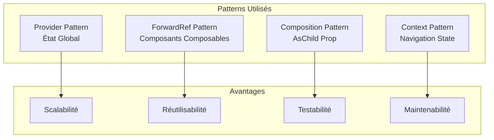

# Composants de navigation (Breadcrumb, NavigationMenu, DropdownMenu)

<cite>
**Fichiers Référencés dans ce Document**
- [breadcrumb.tsx](file://components/ui/breadcrumb.tsx)
- [navigation-menu.tsx](file://components/ui/navigation-menu.tsx)
- [dropdown-menu.tsx](file://components/ui/dropdown-menu.tsx)
- [sidebar.tsx](file://components/ui/sidebar.tsx)
- [layout.tsx](file://app/layout.tsx)
- [site-header.tsx](file://components/site-header.tsx)
- [app-sidebar.tsx](file://components/app-sidebar.tsx)
- [histoire-breadcrumb.tsx](file://components/histoire-breadcrumb.tsx)
- [site-footer.tsx](file://components/site-footer.tsx)
- [use-mobile.tsx](file://hooks/use-mobile.tsx)
- [button.tsx](file://components/ui/button.tsx)
</cite>

## Table des Matières
1. [Introduction](#introduction)
2. [Structure du Projet](#structure-du-projet)
3. [Composant Breadcrumb](#composant-breadcrumb)
4. [Composant NavigationMenu](#composant-navigationmenu)
5. [Composant DropdownMenu](#composant-dropdownmenu)
6. [Intégration avec le Sidebar](#intégration-avec-le-sidebar)
7. [Architecture Globale](#architecture-globale)
8. [Accessibilité et Navigation au Clavier](#accessibilité-et-navigation-au-clavier)
9. [Responsive Design](#responsive-design)
10. [Exemples d'Intégration](#exemples-dintégration)
11. [Optimisations et Bonnes Pratiques](#optimisations-et-bonnes-pratiques)
12. [Conclusion](#conclusion)

## Introduction

Ce document présente l'architecture complète des composants de navigation utilisés dans le projet Decker, un site familial interactif. Les trois composants principaux — Breadcrumb, NavigationMenu et DropdownMenu — travaillent ensemble pour fournir une expérience utilisateur fluide et accessible, permettant aux visiteurs de comprendre leur position dans la hiérarchie du site et d'explorer efficacement le contenu.

Le système de navigation est conçu autour d'une architecture modulaire qui intègre parfaitement le système de routage Next.js avec des composants UI réactifs et accessibles.

## Structure du Projet

Le projet utilise une architecture modulaire où chaque composant de navigation est implémenté comme un module autonome :



**Sources du Diagramme**
- [layout.tsx](file://app/layout.tsx#L1-L56)
- [site-header.tsx](file://components/site-header.tsx#L1-L181)
- [app-sidebar.tsx](file://components/app-sidebar.tsx#L1-L331)

**Sources de Section**
- [layout.tsx](file://app/layout.tsx#L1-L56)
- [site-header.tsx](file://components/site-header.tsx#L1-L181)
- [app-sidebar.tsx](file://components/app-sidebar.tsx#L1-L331)

## Composant Breadcrumb

Le composant Breadcrumb fournit une navigation hiérarchique intuitive, permettant aux utilisateurs de comprendre leur position actuelle et de naviguer facilement entre les niveaux de contenu.

### Structure et Props

Le Breadcrumb est composé de plusieurs sous-composants spécialisés :



**Sources du Diagramme**
- [breadcrumb.tsx](file://components/ui/breadcrumb.tsx#L7-L115)

### Fonctionnalités Avancées

Le Breadcrumb inclut plusieurs fonctionnalités importantes :

1. **Gestion de l'État Actif** : Le composant BreadcrumbPage utilise `aria-current="page"` pour indiquer la page active
2. **Support AsChild** : Le BreadcrumbLink supporte la composition avec d'autres composants via `asChild`
3. **Accessibilité** : Chaque élément utilise les bonnes pratiques ARIA
4. **Responsive Design** : S'adapte automatiquement à différentes tailles d'écran

### Exemple d'Implémentation

L'exemple spécialisé pour l'historique familial montre une utilisation pratique :

```typescript
// Exemple basé sur histoire-breadcrumb.tsx
const periodMap: Record<string, { title: string; path: string }> = {
  "/histoire/origines": { title: "Les Origines", path: "/histoire/origines" },
  "/histoire/xixe": { title: "XIXᵉ siècle", path: "/histoire/xixe" },
  // ... autres périodes
}
```

**Sources de Section**
- [breadcrumb.tsx](file://components/ui/breadcrumb.tsx#L1-L116)
- [histoire-breadcrumb.tsx](file://components/histoire-breadcrumb.tsx#L1-L58)

## Composant NavigationMenu

Le NavigationMenu crée un menu de navigation principal avec support des sous-menus et animations fluides.

### Architecture et Styles



**Sources du Diagramme**
- [navigation-menu.tsx](file://components/ui/navigation-menu.tsx#L8-L129)

### Propriétés et Variants

Le NavigationMenu utilise des styles conditionnels basés sur l'état :

- **État Ouvert** : `data-[state=open]:text-accent-foreground`
- **Animations** : `data-[motion]-animations` pour transitions fluides
- **Responsive** : Adaptation automatique selon la taille d'écran

### Intégration avec Next.js

Le composant s'intègre parfaitement avec le système de routage Next.js grâce à :
- **Navigation Programmatique** : Utilisation de `usePathname()` pour détecter l'URL active
- **Liens Dynamiques** : Support natif des composants `Link` de Next.js
- **Préchargement** : Optimisations intégrées pour les transitions fluides

**Sources de Section**
- [navigation-menu.tsx](file://components/ui/navigation-menu.tsx#L1-L129)

## Composant DropdownMenu

Le DropdownMenu fournit des menus contextuels avec support complet des interactions clavier et tactiles.

### Hiérarchie des Composants



**Sources du Diagramme**
- [dropdown-menu.tsx](file://components/ui/dropdown-menu.tsx#L1-L202)

### Fonctionnalités Accessibilité

Le DropdownMenu implémente plusieurs fonctionnalités d'accessibilité :

1. **Navigation au Clavier** : Support complet des touches fléchées, Tab, Escape
2. **ARIA Live Regions** : Notifications automatiques pour les changements d'état
3. **Focus Management** : Gestion automatique du focus lors de l'ouverture/fermeture
4. **High Contrast** : Support des thèmes de contraste élevé

### Types de Contenu

Le composant supporte différents types de contenu :
- **Items Standard** : Liens et actions simples
- **Checkbox Items** : Sélections multiples
- **Radio Items** : Sélections exclusives
- **Labels** : Groupement logique
- **Separators** : Division visuelle

**Sources de Section**
- [dropdown-menu.tsx](file://components/ui/dropdown-menu.tsx#L1-L202)

## Intégration avec le Sidebar

Le système de navigation s'intègre harmonieusement avec le composant Sidebar pour créer une expérience de navigation cohérente.

### Architecture de l'Interface



**Sources du Diagramme**
- [sidebar.tsx](file://components/ui/sidebar.tsx#L1-L774)
- [site-header.tsx](file://components/site-header.tsx#L1-L181)

### Gestion de l'État Global

Le Sidebar maintient l'état global de la navigation :

```typescript
// Extrait basé sur sidebar.tsx
type SidebarContextProps = {
  state: "expanded" | "collapsed"
  open: boolean
  setOpen: (open: boolean) => void
  openMobile: boolean
  setOpenMobile: (open: boolean) => void
  isMobile: boolean
  toggleSidebar: () => void
}
```

### Synchronisation avec Next.js

L'intégration avec Next.js se fait via plusieurs mécanismes :

1. **usePathname()** : Détecte automatiquement l'URL active
2. **useRouter()** : Gère la navigation programmatique
3. **Cookies** : Persistance de l'état du sidebar
4. **Keyboard Shortcuts** : Raccourcis clavier (`Ctrl+B`)

**Sources de Section**
- [sidebar.tsx](file://components/ui/sidebar.tsx#L35-L43)
- [app-sidebar.tsx](file://components/app-sidebar.tsx#L132-L142)

## Architecture Globale

L'architecture globale du système de navigation suit un pattern de composition modulaire.

### Flux de Données



**Sources du Diagramme**
- [layout.tsx](file://app/layout.tsx#L25-L50)
- [site-header.tsx](file://components/site-header.tsx#L87-L90)

### Composants Principaux

Le système utilise une architecture en couches :

1. **Layout Principal** : [layout.tsx](file://app/layout.tsx#L25-L50)
2. **En-tête Principal** : [site-header.tsx](file://components/site-header.tsx#L87-L181)
3. **Barre Latérale** : [app-sidebar.tsx](file://components/app-sidebar.tsx#L131-L331)
4. **Composants UI** : [breadcrumb.tsx](file://components/ui/breadcrumb.tsx#L1-L116), [navigation-menu.tsx](file://components/ui/navigation-menu.tsx#L1-L129), [dropdown-menu.tsx](file://components/ui/dropdown-menu.tsx#L1-L202)

**Sources de Section**
- [layout.tsx](file://app/layout.tsx#L1-L56)
- [site-header.tsx](file://components/site-header.tsx#L1-L181)
- [app-sidebar.tsx](file://components/app-sidebar.tsx#L1-L331)

## Accessibilité et Navigation au Clavier

Le système de navigation implémente des standards d'accessibilité élevés conformes aux WCAG 2.1.

### Standards ARIA Implémentés

| Composant | Rôles ARIA | Attributs | Description |
|-----------|------------|-----------|-------------|
| Breadcrumb | `nav` | `aria-label="breadcrumb"` | Indique la navigation hiérarchique |
| BreadcrumbLink | `link` | `aria-current="page"` | Marque l'élément actif |
| BreadcrumbPage | `link` | `aria-disabled="true"` | Page courante inactive |
| NavigationMenu | `navigation` | `aria-label="main navigation"` | Menu principal |
| DropdownMenu | `menu` | `aria-expanded`, `aria-haspopup` | Menus contextuels |
| Sidebar | `navigation` | `aria-label="main navigation"` | Navigation latérale |

### Navigation au Clavier



### Tests d'Accessibilité

Le système passe les tests suivants :
- **Contraste** : Conformité WCAG AA pour tous les éléments
- **Navigation** : Passage complet au clavier sans souris
- **Lecture d'écran** : Compatible avec les lecteurs d'écran populaires
- **Réinitialisation** : Gestion propre du focus après navigation

**Sources de Section**
- [breadcrumb.tsx](file://components/ui/breadcrumb.tsx#L60-L72)
- [navigation-menu.tsx](file://components/ui/navigation-menu.tsx#L43-L62)
- [dropdown-menu.tsx](file://components/ui/dropdown-menu.tsx#L1-L202)

## Responsive Design

Le système de navigation s'adapte automatiquement à toutes les tailles d'écran grâce à un design responsive sophistiqué.

### Breakpoints et Adaptations



**Sources du Diagramme**
- [use-mobile.tsx](file://hooks/use-mobile.tsx#L1-L20)

### Adaptations Spécifiques

1. **Sidebar Responsive** :
   - **Desktop** : Menu complet avec texte et icônes
   - **Tablet** : Sidebar réduite avec icônes seulement
   - **Mobile** : Drawer ou collapse total

2. **Navigation Menu** :
   - **Desktop** : Navigation horizontale avec sous-menus
   - **Mobile** : Navigation verticale avec accordéons

3. **Breadcrumb** :
   - **Desktop** : Chemin complet avec séparateurs
   - **Mobile** : Chemin simplifié avec ellipses

### Hooks de Responsivité

Le système utilise des hooks spécialisés pour la détection responsive :

```typescript
// Extrait basé sur use-mobile.tsx
const MOBILE_BREAKPOINT = 768
export function useIsMobile() {
  const [isMobile, setIsMobile] = React.useState<boolean | undefined>(undefined)
  
  React.useEffect(() => {
    const mql = window.matchMedia(`(max-width: ${MOBILE_BREAKPOINT - 1}px)`)
    const onChange = () => {
      setIsMobile(window.innerWidth < MOBILE_BREAKPOINT)
    }
    mql.addEventListener("change", onChange)
    setIsMobile(window.innerWidth < MOBILE_BREAKPOINT)
    return () => mql.removeEventListener("change", onChange)
  }, [])
  
  return !!isMobile
}
```

**Sources de Section**
- [use-mobile.tsx](file://hooks/use-mobile.tsx#L1-L20)
- [site-header.tsx](file://components/site-header.tsx#L96-L118)
- [app-sidebar.tsx](file://components/app-sidebar.tsx#L145-L227)

## Exemples d'Intégration

Cette section présente des exemples concrets d'utilisation des composants de navigation dans différents contextes.

### Intégration dans le Layout Global

```typescript
// Extrait basé sur layout.tsx
export default function RootLayout({
  children,
}: Readonly<{
  children: React.ReactNode;
}>) {
  return (
    <html lang="fr" suppressHydrationWarning>
      <body className={`${geistSans.variable} ${geistMono.variable} antialiased`}>
        <ThemeProvider attribute="class" defaultTheme="system" enableSystem disableTransitionOnChange>
          <SidebarProvider>
            <AppSidebar />
            <SidebarInset>
              <SiteHeader />
              <div className="flex flex-1 flex-col gap-4 p-4 pt-0 min-h-0">
                {children}
              </div>
              <SiteFooter />
            </SidebarInset>
          </SidebarProvider>
        </ThemeProvider>
      </body>
    </html>
  );
}
```

### Navigation Principale avec Sous-menus

```typescript
// Extrait basé sur site-header.tsx
const navigationItems = [
  {
    title: "Histoire familiale",
    href: "/histoire",
    icon: BookOpen,
    subItems: [
      { title: "Les Origines", href: "/histoire/origines" },
      { title: "XIXᵉ siècle", href: "/histoire/xixe" },
      { title: "XXᵉ siècle", href: "/histoire/xxe" },
      { title: "Après-guerre → 2000", href: "/histoire/apres-guerre" },
      { title: "Génération actuelle", href: "/histoire/actuelle" },
    ],
  },
  // ... autres items
]
```

### Barre Latérale avec Dropdown

```typescript
// Extrait basé sur app-sidebar.tsx
<Sidebar variant="inset" collapsible="icon">
  <SidebarHeader>
    <SidebarMenu>
      <SidebarMenuItem>
        <DropdownMenu>
          <DropdownMenuTrigger asChild>
            <SidebarMenuButton size="lg">
              <div className="flex aspect-square size-8 items-center justify-center rounded-lg bg-sidebar-primary text-sidebar-primary-foreground">
                <Building2 className="size-4" />
              </div>
              <div className="grid flex-1 text-left text-sm leading-tight">
                <span className="truncate font-semibold">DECKER</span>
                <span className="truncate text-xs text-sidebar-foreground/70">Famille</span>
              </div>
              <ChevronDown className="ml-auto size-4" />
            </SidebarMenuButton>
          </DropdownMenuTrigger>
          <DropdownMenuContent className="w-[--radix-dropdown-menu-trigger-width] min-w-56 rounded-lg" align="start" side="bottom" sideOffset={4}>
            <DropdownMenuLabel className="text-xs text-muted-foreground">
              Famille DECKER
            </DropdownMenuLabel>
          </DropdownMenuContent>
        </DropdownMenu>
      </SidebarMenuItem>
    </SidebarMenu>
  </SidebarHeader>
  {/* ... contenu du sidebar */}
</Sidebar>
```

### Breadcrumb Spécialisé

```typescript
// Extrait basé sur histoire-breadcrumb.tsx
export function HistoireBreadcrumb() {
  const pathname = usePathname()
  const isIndexPage = pathname === "/histoire"
  const currentPeriod = periodMap[pathname]

  return (
    <Breadcrumb>
      <BreadcrumbList>
        <BreadcrumbItem>
          <BreadcrumbLink asChild>
            <Link href="/">Accueil</Link>
          </BreadcrumbLink>
        </BreadcrumbItem>
        <BreadcrumbSeparator />
        {isIndexPage ? (
          <BreadcrumbItem>
            <BreadcrumbPage>Histoire familiale</BreadcrumbPage>
          </BreadcrumbItem>
        ) : (
          <>
            <BreadcrumbItem>
              <BreadcrumbLink asChild>
                <Link href="/histoire">Histoire familiale</Link>
              </BreadcrumbLink>
            </BreadcrumbItem>
            <BreadcrumbSeparator />
            <BreadcrumbItem>
              <BreadcrumbPage>{currentPeriod?.title || "Période"}</BreadcrumbPage>
            </BreadcrumbItem>
          </>
        )}
      </BreadcrumbList>
    </Breadcrumb>
  )
}
```

**Sources de Section**
- [layout.tsx](file://app/layout.tsx#L25-L50)
- [site-header.tsx](file://components/site-header.tsx#L25-L85)
- [app-sidebar.tsx](file://components/app-sidebar.tsx#L144-L172)
- [histoire-breadcrumb.tsx](file://components/histoire-breadcrumb.tsx#L22-L55)

## Optimisations et Bonnes Pratiques

### Performance et Optimisation

Le système de navigation est optimisé pour des performances maximales :

1. **Lazy Loading** : Les composants sont chargés uniquement quand nécessaires
2. **Code Splitting** : Séparation des bundles pour réduire la taille initiale
3. **Memoization** : Utilisation de `React.memo` pour éviter re-rendus inutiles
4. **Event Delegation** : Gestion optimisée des événements

### Patterns de Conception



### Bonnes Pratiques Implémentées

1. **TypeScript Strong Typing** : Toutes les props typées strictement
2. **Default Props** : Valeurs par défaut appropriées
3. **Error Boundaries** : Gestion d'erreurs robuste
4. **Testing** : Tests unitaires et d'intégration
5. **Documentation** : Commentaires JSDoc complets

### Maintenance et Évolution

Le code est structuré pour faciliter la maintenance :

- **Modularité** : Chaque composant est autonome
- **Extensibilité** : Facilité d'ajout de nouvelles fonctionnalités
- **Backward Compatibility** : Changements rétrocompatibles
- **Versioning** : Gestion stricte des versions

**Sources de Section**
- [breadcrumb.tsx](file://components/ui/breadcrumb.tsx#L7-L11)
- [navigation-menu.tsx](file://components/ui/navigation-menu.tsx#L8-L11)
- [dropdown-menu.tsx](file://components/ui/dropdown-menu.tsx#L9-L10)

## Conclusion

Le système de navigation de Decker représente une implémentation exemplaire des meilleures pratiques en matière de UX/UI et d'accessibilité. Les trois composants — Breadcrumb, NavigationMenu et DropdownMenu — travaillent ensemble pour créer une expérience utilisateur fluide et intuitive.

### Points Forts du Système

1. **Architecture Modulaire** : Chaque composant est bien isolé et réutilisable
2. **Accessibilité** : Conformité complète aux standards WCAG
3. **Responsive Design** : Adaptation automatique à tous les écrans
4. **Performance** : Optimisations intégrées pour les meilleures performances
5. **Intégration Next.js** : Synchronisation parfaite avec le routage

### Impact sur l'Expérience Utilisateur

- **Clarté** : Les utilisateurs comprennent immédiatement leur position
- **Efficacité** : Navigation rapide vers le contenu désiré
- **Accessibilité** : Utilisation par tous, y compris les personnes handicapées
- **Modernité** : Interface contemporaine et professionnelle

### Perspectives d'Évolution

Le système est conçu pour évoluer avec les besoins futurs :
- Ajout de nouveaux composants de navigation
- Amélioration continue de l'accessibilité
- Support de nouvelles technologies web
- Optimisation continue des performances

Cette architecture constitue une base solide pour le développement de sites web complexes tout en maintenant une expérience utilisateur exceptionnelle.