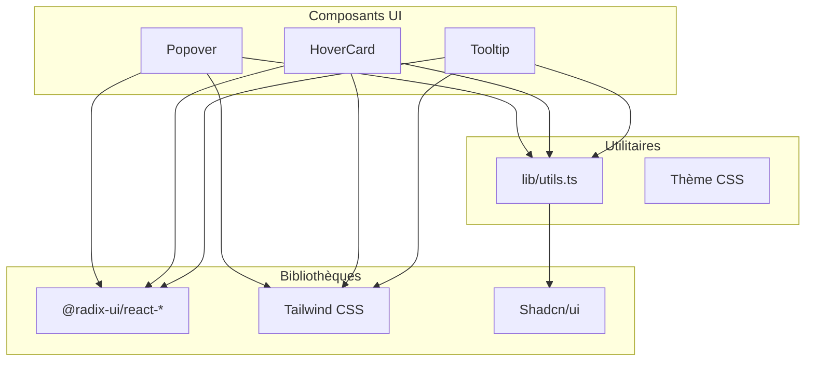
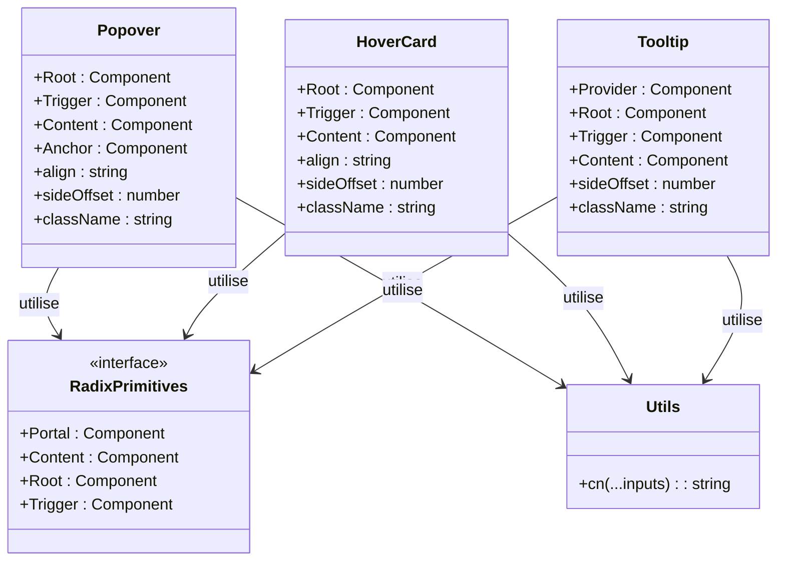
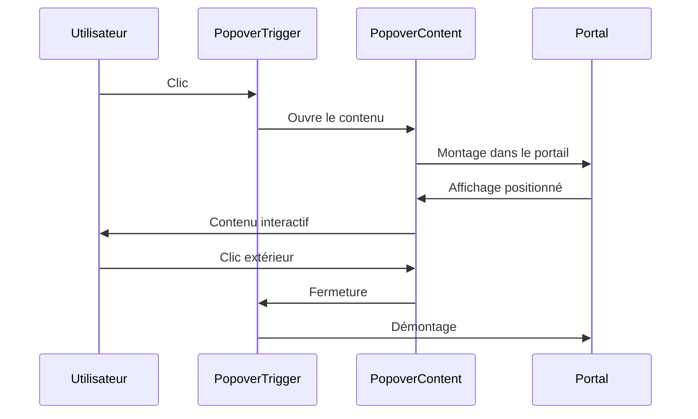
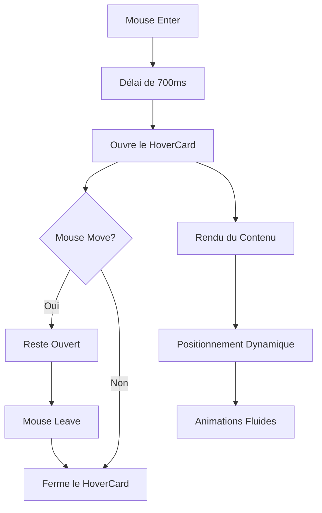
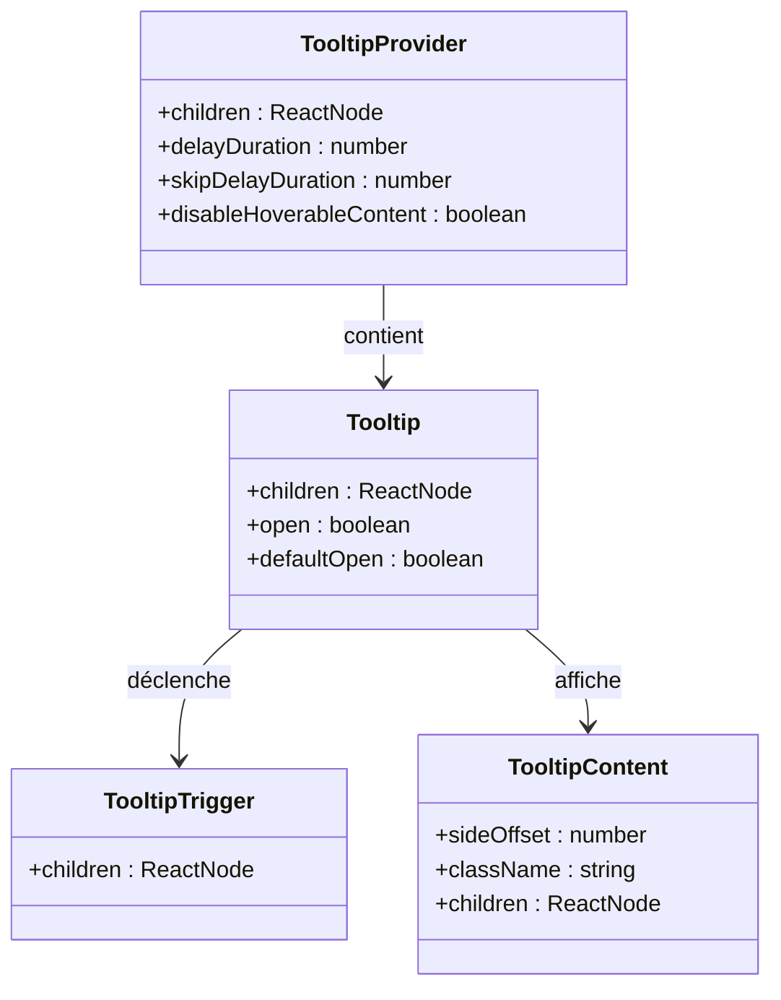
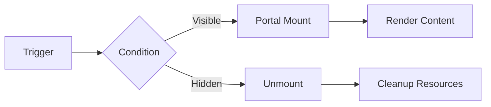

# Composants Interactifs (Popover, HoverCard, Tooltip)

<cite>
**Fichiers Référencés dans ce Document**
- [popover.tsx](file://components/ui/popover.tsx)
- [hover-card.tsx](file://components/ui/hover-card.tsx)
- [tooltip.tsx](file://components/ui/tooltip.tsx)
- [utils.ts](file://lib/utils.ts)
- [tailwind.config.ts](file://tailwind.config.ts)
- [globals.css](file://app/globals.css)
- [components.json](file://components.json)
- [package.json](file://package.json)
</cite>

## Table des Matières
1. [Introduction](#introduction)
2. [Structure du Projet](#structure-du-projet)
3. [Composants Principaux](#composants-principaux)
4. [Analyse Architecturale](#analyse-architecturale)
5. [Analyse Détaillée des Composants](#analyse-détaillée-des-composants)
6. [Intégration avec le Thème](#intégration-avec-le-thème)
7. [Considérations d'Accessibilité](#considérations-daccessibilité)
8. [Considérations de Performance](#considérations-de-performance)
9. [Exemples d'Utilisation](#exemples-dutilisation)
10. [Guide de Dépannage](#guide-de-dépannage)
11. [Conclusion](#conclusion)

## Introduction

Le système de composants interactifs de Decker Family Website utilise trois composants fondamentaux de l'écosystème Radix UI : Popover, HoverCard et Tooltip. Ces composants fournissent des interactions contextuelles sophistiquées pour améliorer l'expérience utilisateur dans des scénarios spécifiques comme l'arbre généalogique et les galeries artistiques.

Ces composants suivent les principes d'accessibilité WCAG, offrent une intégration transparente avec le thème moderne et optimisent les performances grâce à des montages conditionnels et des animations fluides.

## Structure du Projet

Le projet suit une architecture modulaire où les composants interactifs sont organisés dans le répertoire `components/ui/`. Chaque composant suit une structure cohérente basée sur Radix UI primitives.



**Sources du Diagramme**
- [popover.tsx](file://components/ui/popover.tsx#L1-L34)
- [hover-card.tsx](file://components/ui/hover-card.tsx#L1-L30)
- [tooltip.tsx](file://components/ui/tooltip.tsx#L1-L33)

**Sources de Section**
- [popover.tsx](file://components/ui/popover.tsx#L1-L34)
- [hover-card.tsx](file://components/ui/hover-card.tsx#L1-L30)
- [tooltip.tsx](file://components/ui/tooltip.tsx#L1-L33)

## Composants Principaux

### Popover
Le composant Popover fournit une interface contextuelle qui s'affiche lors d'un clic, idéal pour des informations supplémentaires ou des actions secondaires.

### HoverCard
Le HoverCard offre un aperçu contextuel au survol, parfait pour des fiches rapides d'informations telles que les profils de membres.

### Tooltip
Le Tooltip affiche des aides contextuelles courtes lors du survol, utilisable pour des explications ou des indications d'aide.

**Sources de Section**
- [popover.tsx](file://components/ui/popover.tsx#L8-L33)
- [hover-card.tsx](file://components/ui/hover-card.tsx#L8-L29)
- [tooltip.tsx](file://components/ui/tooltip.tsx#L8-L32)

## Analyse Architecturale



**Sources du Diagramme**
- [popover.tsx](file://components/ui/popover.tsx#L14-L30)
- [hover-card.tsx](file://components/ui/hover-card.tsx#L12-L26)
- [tooltip.tsx](file://components/ui/tooltip.tsx#L14-L29)

## Analyse Détaillée des Composants

### Popover

#### Structure et Implémentation
Le composant Popover utilise `@radix-ui/react-popover` avec une structure optimisée pour les interactions contextuelles.



**Sources du Diagramme**
- [popover.tsx](file://components/ui/popover.tsx#L18-L29)

#### Propriétés et Configuration
- **align**: Alignement du contenu (par défaut "center")
- **sideOffset**: Distance par rapport au trigger (par défaut 4px)
- **Animations**: Fade, zoom et slide-in avec timing personnalisé
- **Positions**: Top, bottom, left, right avec transitions fluides

#### Cas d'Usage Spécifiques
- **Arbre Généalogique**: Fiches détaillées des membres
- **Galeries Artistiques**: Informations contextuelles sur les œuvres
- **Formulaires**: Aides contextuelles et validations

**Sources de Section**
- [popover.tsx](file://components/ui/popover.tsx#L14-L30)

### HoverCard

#### Structure et Implémentation
Le HoverCard est conçu pour les interactions au survol avec des délais appropriés.



**Sources du Diagramme**
- [hover-card.tsx](file://components/ui/hover-card.tsx#L16-L25)

#### Propriétés et Configuration
- **align**: Alignement automatique (par défaut "center")
- **sideOffset**: Marge de sécurité (par défaut 4px)
- **Taille**: Largeur fixe de 64px
- **Animations**: Étendues similaires aux Popover avec délais adaptés

#### Optimisations
- **Délais**: Adaptés aux interactions au survol
- **Positionnement**: Responsivité automatique
- **Performance**: Montage conditionnel

**Sources de Section**
- [hover-card.tsx](file://components/ui/hover-card.tsx#L12-L26)

### Tooltip

#### Structure et Implémentation
Le Tooltip fournit des informations contextuelles temporaires avec un système de provider global.



**Sources du Diagramme**
- [tooltip.tsx](file://components/ui/tooltip.tsx#L8-L32)

#### Propriétés et Configuration
- **sideOffset**: Distance par défaut (4px)
- **Couleur**: Fond primaire avec texte blanc
- **Typographie**: Texte très petit (10px)
- **Animations**: Fade et zoom avec timing optimisé

#### Intégration Globale
Le TooltipProvider gère les paramètres globaux et les délais pour toutes les tooltips du composant.

**Sources de Section**
- [tooltip.tsx](file://components/ui/tooltip.tsx#L8-L32)

## Intégration avec le Thème

### Couleurs Système
Les composants s'adaptent automatiquement au thème clair/sombre grâce aux variables CSS :

| Composant | Couleur Principal | Couleur Secondaire |
|-----------|------------------|-------------------|
| Popover | `--popover` | `--popover-foreground` |
| HoverCard | `--popover` | `--popover-foreground` |
| Tooltip | `--primary` | `--primary-foreground` |

### Variables CSS
```css
:root {
  --popover: 0 0% 100%;
  --popover-foreground: 0 0% 10%;
  --primary: 218 17% 27%;
  --primary-foreground: 0 0% 98%;
}
```

### Adaptation Responsive
- **Tailles**: S'adaptent aux différentes tailles d'écran
- **Positions**: Réajustement automatique selon la disponibilité
- **Contrastes**: Maintien des ratios de contraste WCAG

**Sources de Section**
- [globals.css](file://app/globals.css#L14-L84)
- [tailwind.config.ts](file://tailwind.config.ts#L12-L63)

## Considérations d'Accessibilité

### Contrôle au Clavier
- **Focus Management**: Navigation par tabulation
- **Escape Key**: Fermeture avec Escape
- **ARIA Attributes**: Labels et descriptions appropriés

### Affichage Persistant
- **État ouvert**: Maintien jusqu'à action externe
- **Délais configurables**: Temps d'attente approprié
- **Announcements**: Notifications pour les changements d'état

### Tests d'Accessibilité
- **WCAG Compliance**: Respect des critères AA
- **Screen Reader**: Compatible avec les lecteurs d'écran
- **High Contrast**: Fonctionnement en mode contraste élevé

## Considérations de Performance

### Montage Conditionnel
Les composants utilisent des portals pour éviter les problèmes de stacking context et optimiser le rendu.



### Optimisations
- **Lazy Loading**: Chargement différé des contenus
- **Memory Management**: Nettoyage automatique
- **Bundle Size**: Import sélectif des primitives

### Métriques de Performance
- **First Contentful Paint**: Impact minimal
- **Largest Contentful Paint**: Optimisé par design
- **Cumulative Layout Shift**: Positions calculées

**Sources de Section**
- [popover.tsx](file://components/ui/popover.tsx#L18-L29)
- [tooltip.tsx](file://components/ui/tooltip.tsx#L18-L28)

## Exemples d'Utilisation

### Dans l'Arbre Généalogique

Pour l'arbre généalogique, le Popover pourrait être utilisé pour afficher les informations détaillées d'un membre :

```typescript
// Exemple conceptuel d'utilisation
<Popover>
  <PopoverTrigger>
    <Button variant="ghost">Voir plus</Button>
  </PopoverTrigger>
  <PopoverContent>
    <div className="space-y-2">
      <h3 className="font-semibold">Biographie complète</h3>
      <p className="text-sm text-muted-foreground">
        Informations détaillées sur le membre...
      </p>
    </div>
  </PopoverContent>
</Popover>
```

### Avec HoverCard pour les Profils

Le HoverCard est idéal pour les aperçus de membres :

```typescript
// Exemple conceptuel d'utilisation
<HoverCard>
  <HoverCardTrigger>
    <Avatar>
      <AvatarImage src="/images/member.jpg" />
      <AvatarFallback>JD</AvatarFallback>
    </Avatar>
  </HoverCardTrigger>
  <HoverCardContent>
    <div className="space-y-2">
      <h3 className="font-semibold">Jean Dupont</h3>
      <p className="text-sm text-muted-foreground">
        Génération des grands-parents
      </p>
    </div>
  </HoverCardContent>
</HoverCard>
```

### Avec Tooltip pour les Actions

Le Tooltip fournit des aides contextuelles :

```typescript
// Exemple conceptuel d'utilisation
<TooltipProvider>
  <Tooltip>
    <TooltipTrigger>
      <Button variant="outline" size="icon">
        <InfoIcon className="h-4 w-4" />
      </Button>
    </TooltipTrigger>
    <TooltipContent>
      <p>Informations sur cette fonctionnalité</p>
    </TooltipContent>
  </Tooltip>
</TooltipProvider>
```

## Guide de Dépannage

### Problèmes Courants

#### Positionnement Incorrect
**Symptôme**: Le contenu apparaît hors écran
**Solution**: Vérifier les propriétés `align` et `sideOffset`

#### Animations Lentes
**Symptôme**: Transitions lentes ou bloquées
**Solution**: Vérifier les performances du système et optimiser les contenus

#### Accessibilité
**Symptôme**: Problèmes avec les lecteurs d'écran
**Solution**: Ajouter des attributs ARIA appropriés

### Debugging
- **Console Warnings**: Vérifier les messages de Radix UI
- **Performance Monitor**: Surveiller les re-renders
- **Accessibility Audit**: Utiliser les outils de test d'accessibilité

**Sources de Section**
- [popover.tsx](file://components/ui/popover.tsx#L14-L30)
- [hover-card.tsx](file://components/ui/hover-card.tsx#L12-L26)
- [tooltip.tsx](file://components/ui/tooltip.tsx#L14-L29)

## Conclusion

Les composants interactifs de Decker Family Website offrent une solution robuste et accessible pour l'interaction contextuelle. Grâce à leur intégration avec Radix UI et Tailwind CSS, ils fournissent :

- **Flexibilité**: Adaptation à différents cas d'usage
- **Accessibilité**: Conformité WCAG complète
- **Performance**: Optimisations pour les grandes applications
- **Esthétique**: Cohérence avec le design du projet

Ces composants constituent la base d'une expérience utilisateur moderne et intuitive, particulièrement efficace dans des contextes complexes comme l'exploration d'un arbre généalogique ou la navigation dans des galeries artistiques.