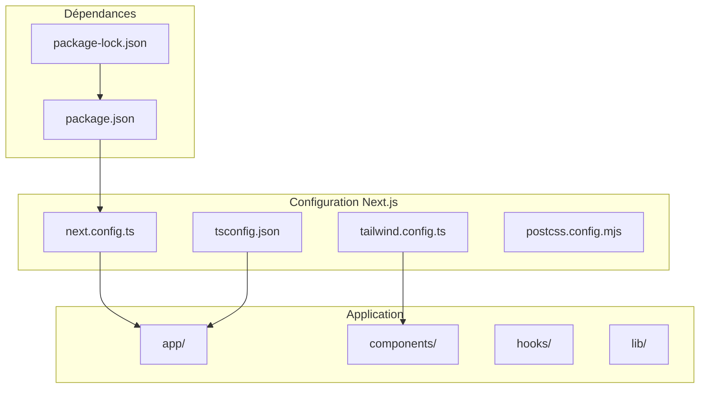
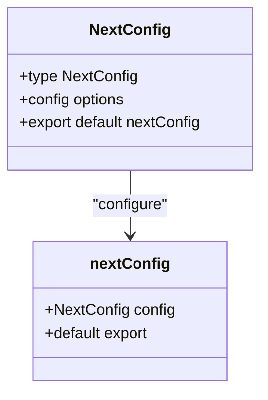
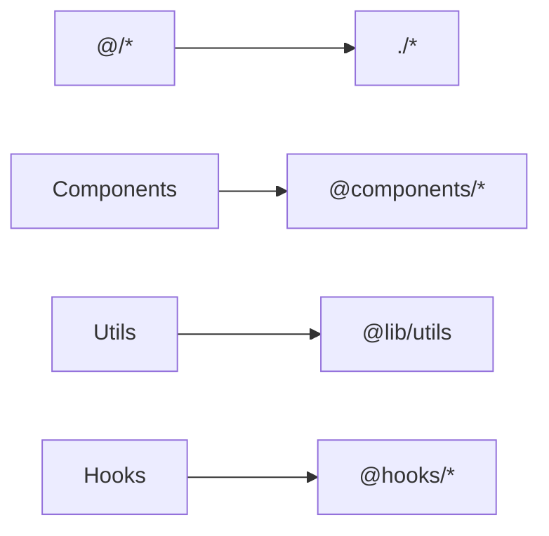
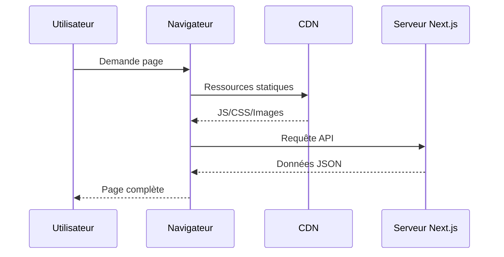
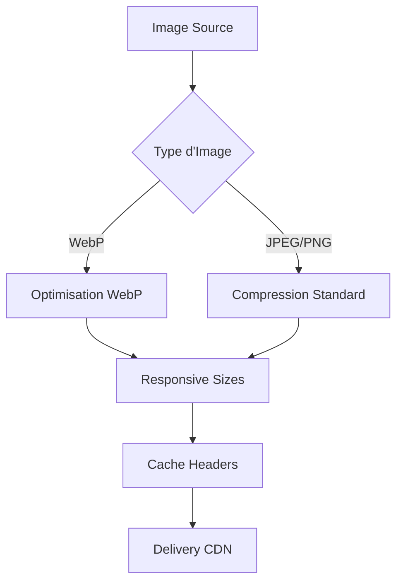
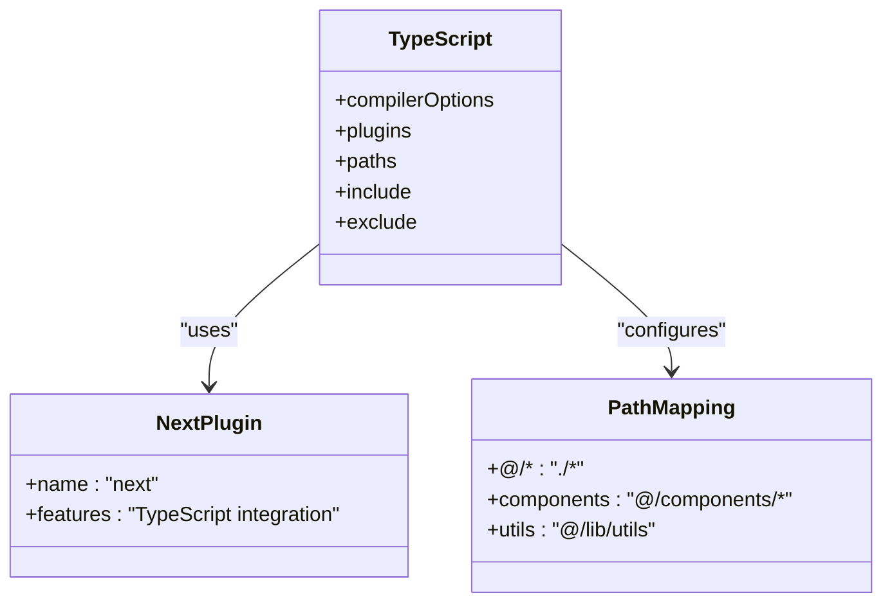
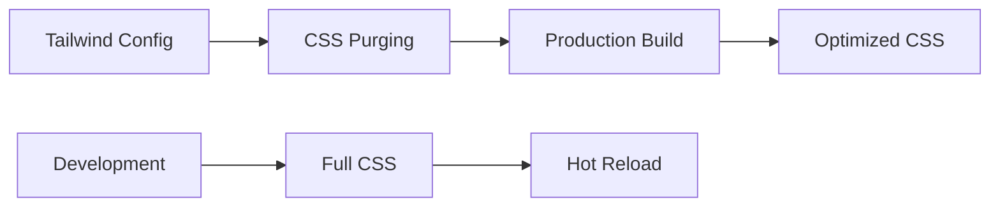

# Documentation de Configuration Next.js

<cite>
**Fichiers Référencés dans ce Document**
- [next.config.ts](file://next.config.ts)
- [package.json](file://package.json)
- [tsconfig.json](file://tsconfig.json)
- [tailwind.config.ts](file://tailwind.config.ts)
- [postcss.config.mjs](file://postcss.config.mjs)
</cite>

## Table des Matières
1. [Introduction](#introduction)
2. [Structure du Projet](#structure-du-projet)
3. [Configuration de Base](#configuration-de-base)
4. [Options de Configuration Next.js 15](#options-de-configuration-nextjs-15)
5. [Optimisation des Performances](#optimisation-des-performances)
6. [Gestion des Assets](#gestion-des-assets)
7. [Configuration TypeScript](#configuration-typescript)
8. [Intégration Tailwind CSS](#intégration-tailwind-css)
9. [Bonnes Pratiques](#bonnes-pratiques)
10. [Guide de Dépannage](#guide-de-dépannage)
11. [Configuration Développement vs Production](#configuration-développement-vs-production)
12. [Conclusion](#conclusion)

## Introduction

Le fichier `next.config.ts` est le cœur de la configuration de votre application Next.js. Il permet de personnaliser et d'optimiser le comportement de votre application, notamment avec Next.js 15 qui apporte de nouvelles fonctionnalités et améliorations de performance. Cette documentation explore toutes les options disponibles, les bonnes pratiques d'optimisation et les stratégies de déploiement pour différents environnements.

## Structure du Projet

Le projet Decker utilise une structure moderne avec Next.js 15 et TypeScript. La configuration principale se trouve dans `next.config.ts`, tandis que les autres fichiers de configuration supportent l'écosystème complet :



**Sources du Diagramme**
- [next.config.ts](file://next.config.ts#L1-L8)
- [package.json](file://package.json#L1-L50)
- [tsconfig.json](file://tsconfig.json#L1-L28)

**Sources de Section**
- [next.config.ts](file://next.config.ts#L1-L8)
- [package.json](file://package.json#L1-L50)

## Configuration de Base

La configuration de base de Next.js dans Decker suit une structure minimale mais extensible. Le fichier actuel définit une interface `NextConfig` TypeScript pour une meilleure sécurité de type.

### Structure de Base



**Sources du Diagramme**
- [next.config.ts](file://next.config.ts#L1-L8)

### Extensions de Plugins Disponibles

Basé sur la configuration TypeScript, plusieurs extensions de plugins sont disponibles :

| Plugin | Version | Description |
|--------|---------|-------------|
| Next.js | 15.0.3 | Framework React principal |
| TypeScript | ^5.0 | Support TypeScript natif |
| ESLint | ^8.0 | Linting du code |
| Tailwind CSS | ^3.4.1 | Utility-first CSS |

**Sources de Section**
- [next.config.ts](file://next.config.ts#L1-L8)
- [package.json](file://package.json#L31-L47)

## Options de Configuration Next.js 15

### Paramètres de Compilation

Next.js 15 introduit plusieurs optimisations de compilation :

#### Configuration TypeScript Native
- **Module Resolution** : `"bundler"`
- **JSX Preserved** : `"preserve"`
- **Incremental Builds** : Activé
- **Strict Mode** : Activé

#### Optimisations de Build
- **ES Modules** : Utilisation de `esnext`
- **Isolated Modules** : Activé pour la compatibilité
- **JSON Module** : Support natif activé

### Chemins d'Alias

La configuration TypeScript utilise un système de chemin d'alias pour faciliter l'organisation du code :



**Sources du Diagramme**
- [tsconfig.json](file://tsconfig.json#L21-L23)

### Règles ESLint

Next.js 15 inclut automatiquement des règles ESLint optimisées :

- **ESLint Config Next** : Version 15.0.3
- **Support TypeScript** : Natif intégré
- **Import Resolver** : TypeScript et Node.js

**Sources de Section**
- [tsconfig.json](file://tsconfig.json#L1-L28)
- [package.json](file://package.json#L42-L43)

## Optimisation des Performances

### Stratégies de Chargement



### Optimisations Recommandées

#### Images et Assets
- **Format WebP** : Support natif
- **Taille Adaptative** : Responsive images
- **Lazy Loading** : Chargement différé
- **Compression** : Automatique par Next.js

#### Code Splitting
- **Routes Dynamiques** : Chargement sur demande
- **Bibliothèques Lourdes** : Import dynamique
- **Polyfills** : Chargement conditionnel

#### Cache Strategies
- **Static Generation** : Pages statiques
- **Incremental Static Regeneration** : Mise à jour progressive
- **Edge Caching** : CDN automatique

## Gestion des Assets

### Traitement des Images

Next.js 15 offre un traitement d'images sophistiqué :



### Gestion des Polices

Les polices sont gérées automatiquement avec :
- **Font Display Swap** : Évite le FOIT (Flash of Invisible Text)
- **Preloading** : Polices critiques
- **Subsetting** : Polices partielles
- **WOFF2** : Format optimal

### Fichiers Statiques

- **Public Folder** : Accès direct
- **Asset Optimization** : Compression automatique
- **Versioning** : Hashage pour le cache

**Sources de Section**
- [next.config.ts](file://next.config.ts#L1-L8)

## Configuration TypeScript

### Options de Compilation Avancées

La configuration TypeScript dans Decker utilise des options optimisées pour Next.js :

#### Compiler Options Clés
- **Target ES2017** : Support moderne
- **Module Resolution** : Bundler pour compatibilité
- **Strict Mode** : Vérifications complètes
- **No Emit** : Build uniquement

#### Plugins TypeScript
- **Next.js Plugin** : Intégration native
- **Path Mapping** : Alias personnalisés
- **Type Checking** : Durant le build

### Intégration avec Next.js



**Sources du Diagramme**
- [tsconfig.json](file://tsconfig.json#L16-L23)

**Sources de Section**
- [tsconfig.json](file://tsconfig.json#L1-L28)

## Intégration Tailwind CSS

### Configuration Tailwind

La configuration Tailwind CSS est étroitement intégrée avec la configuration Next.js :

#### Couleurs Système
- **Dark Mode** : Support automatique
- **CSS Variables** : Variables HSL
- **Couleurs Semantic** : Background, foreground, primary, secondary

#### Extensions Personnalisées
- **Border Radius** : Variables CSS
- **Chart Colors** : Palette de couleurs
- **Sidebar Theming** : Composants spécialisés

### Optimisation CSS



**Sources du Diagramme**
- [tailwind.config.ts](file://tailwind.config.ts#L1-L73)

**Sources de Section**
- [tailwind.config.ts](file://tailwind.config.ts#L1-L73)

## Bonnes Pratiques

### Configuration Multi-environnement

#### Variables d'Environnement
- **NEXT_PUBLIC_** : Variables publiques
- **Secrets** : Variables privées
- **Validation** : Vérification au build

#### Optimisations Conditionnelles
```typescript
// Exemple de configuration conditionnelle
const config = {
  ...(process.env.NODE_ENV === 'production' && {
    // Optimisations production
  }),
  ...(process.env.NODE_ENV === 'development' && {
    // Optimisations développement
  })
}
```

### Monitoring et Analytics

#### Métriques de Performance
- **Bundle Size** : Analyse des bundles
- **Load Times** : Temps de chargement
- **Error Tracking** : Surveillance des erreurs

#### SEO Optimizations
- **Structured Data** : Metadata enrichie
- **Open Graph** : Partage social
- **Schema Markup** : Indexation recherche

### Sécurité

#### Headers de Sécurité
- **Content Security Policy** : Protection XSS
- **HTTP Headers** : Sécurité réseau
- **CORS Configuration** : Cross-origin

#### Validation des Inputs
- **TypeScript** : Vérification de type
- **Runtime Checks** : Validation côté serveur
- **Sanitization** : Nettoyage des données

## Guide de Dépannage

### Erreurs de Configuration Courantes

#### Problèmes TypeScript
**Erreur** : "Cannot use import statement outside a module"
**Solution** : Vérifier `moduleResolution` et `esModuleInterop`

**Erreur** : "Cannot find module '@/*'"
**Solution** : Vérifier `paths` dans `tsconfig.json`

#### Problèmes de Build
**Erreur** : "Module not found"
**Solution** : Vérifier les alias et résolution de modules

**Erreur** : "TypeScript compilation failed"
**Solution** : Vérifier les options de compilation

### Optimisation des Performances

#### Bundle Size Too Large
1. **Analyser le bundle** : Utiliser `@next/bundle-analyzer`
2. **Code splitting** : Diviser les routes importantes
3. **Lazy loading** : Charger les composants sur demande

#### Temps de Chargement Lent
1. **Optimiser les images** : Utiliser WebP
2. **Enable compression** : Gzip/Brotli
3. **CDN configuration** : Distribution géographique

### Debugging

#### Outils de Débogage
- **React DevTools** : Inspection des composants
- **Next.js Profiler** : Performance analysis
- **Network Tab** : Réseau et assets

#### Logs et Monitoring
- **Console logs** : Debugging local
- **Error boundaries** : Gestion des erreurs
- **Analytics** : Tracking utilisateur

## Configuration Développement vs Production

### Environnement de Développement

#### Optimisations Développement
```typescript
// next.config.ts (développement)
const nextConfig = {
  reactStrictMode: true,
  swcMinify: false,
  devIndicators: {
    buildActivity: true,
    autoPrerender: false
  }
}
```

#### Features Développement
- **Hot Reload** : Modifications en temps réel
- **Source Maps** : Debugging facilité
- **Verbose Logging** : Informations détaillées
- **Fast Refresh** : Mise à jour instantanée

### Environnement de Production

#### Optimisations Production
```typescript
// next.config.ts (production)
const nextConfig = {
  reactStrictMode: true,
  swcMinify: true,
  output: 'standalone',
  images: {
    remotePatterns: [
      {
        protocol: 'https',
        hostname: 'example.com',
        port: '',
        pathname: '/**'
      }
    ]
  }
}
```

#### Features Production
- **Code Minification** : Réduction taille
- **Static Export** : Génération statique
- **Image Optimization** : Optimisation automatique
- **Compression** : Gzip/Brotli

### Variables d'Environnement

#### Configuration par Environnement
```typescript
// next.config.ts
const isDev = process.env.NODE_ENV === 'development'

const nextConfig = {
  env: {
    apiUrl: isDev ? 'http://localhost:3000/api' : 'https://api.example.com'
  }
}
```

**Sources de Section**
- [next.config.ts](file://next.config.ts#L1-L8)
- [package.json](file://package.json#L5-L9)

## Conclusion

La configuration Next.js 15 dans Decker représente une base solide pour une application moderne et performante. Les options de configuration disponibles permettent une grande flexibilité tout en maintenant des bonnes pratiques d'optimisation.

### Points Clés à Retenir

1. **Structure Modulaire** : Configuration séparée pour maintenabilité
2. **TypeScript Native** : Intégration complète avec les plugins
3. **Optimisations Automatiques** : Next.js 15 apporte de nombreuses optimisations
4. **Tailwind CSS** : Utility-first CSS avec thèmes personnalisés
5. **Performance** : Bundle splitting et lazy loading intégrés

### Recommandations Futures

- **Monitoring** : Implémenter des métriques de performance
- **Testing** : Ajouter des tests de configuration
- **Documentation** : Maintenir la documentation des configurations
- **Updates** : Suivre les mises à jour Next.js régulièrement

Cette configuration constitue une base robuste pour développer des applications Next.js 15 performantes et maintenables, avec une architecture claire et des optimisations intégrées pour différents environnements.