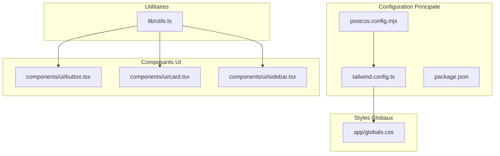
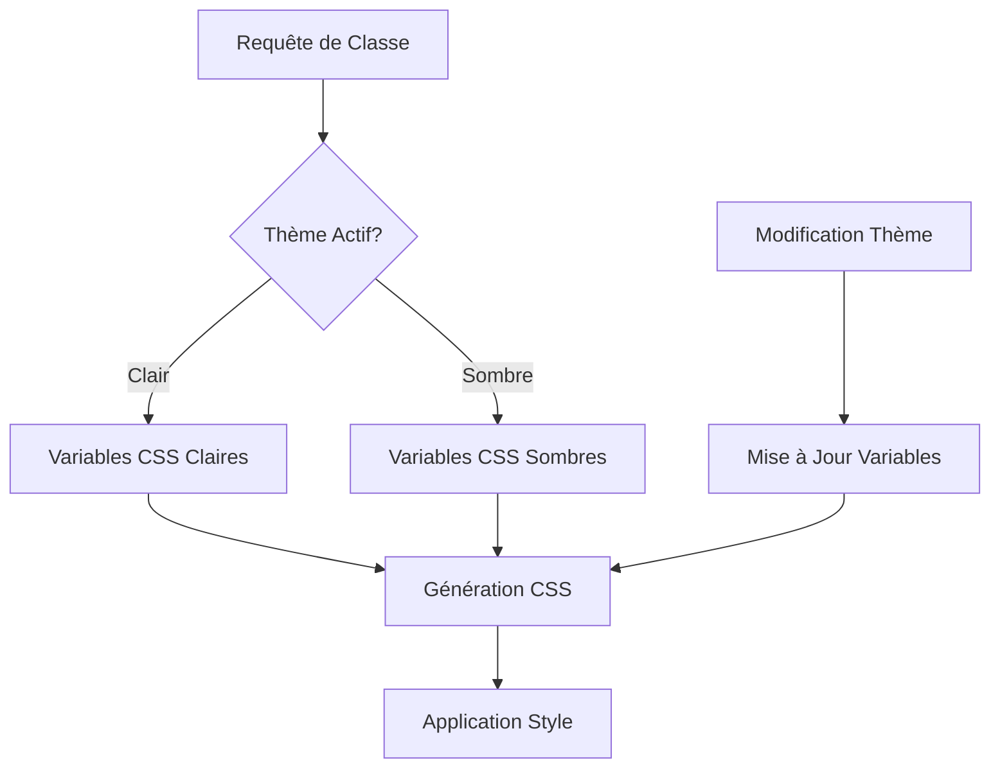

# Documentation de Configuration Tailwind CSS

<cite>
**Fichiers Référencés dans ce Document**
- [tailwind.config.ts](file://tailwind.config.ts)
- [app/globals.css](file://app/globals.css)
- [package.json](file://package.json)
- [postcss.config.mjs](file://postcss.config.mjs)
- [lib/utils.ts](file://lib/utils.ts)
- [components/ui/card.tsx](file://components/ui/card.tsx)
- [components/ui/button.tsx](file://components/ui/button.tsx)
- [components/ui/sidebar.tsx](file://components/ui/sidebar.tsx)
</cite>

## Table des Matières
1. [Introduction](#introduction)
2. [Structure du Projet](#structure-du-projet)
3. [Configuration Principale](#configuration-principale)
4. [Mode Sombre Activé](#mode-sombre-activé)
5. [Variables CSS et Thèmes](#variables-css-et-thèmes)
6. [Design System et Couleurs](#design-system-et-couleurs)
7. [Extension des Bordures Arrondies](#extension-des-bordures-arrondies)
8. [Plugin tailwindcss-animate](#plugin-tailwindcss-animate)
9. [Génération Dynamique des Classes](#génération-dynamique-des-classes)
10. [Intégration avec les Composants UI](#intégration-avec-les-composants-ui)
11. [Problèmes Courants et Solutions](#problèmes-courants-et-solutions)
12. [Bonnes Pratiques](#bonnes-pratiques)

## Introduction

Cette documentation présente la configuration complète de Tailwind CSS utilisée dans le projet Decker, un système de design moderne basé sur Next.js et Shadcn/ui. La configuration met l'accent sur le système de thèmes dynamiques, les variables CSS HSL, et l'intégration du plugin d'animation.

Le projet utilise une approche sophistiquée pour gérer les thèmes clair et sombre via des variables CSS, permettant une transition fluide entre les modes tout en maintenant une cohérence visuelle globale.

## Structure du Projet

Le système de configuration Tailwind CSS est organisé autour de plusieurs fichiers clés qui travaillent ensemble pour créer un design system complet :



**Sources du Diagramme**
- [tailwind.config.ts](file://tailwind.config.ts#L1-L73)
- [postcss.config.mjs](file://postcss.config.mjs#L1-L10)
- [app/globals.css](file://app/globals.css#L1-L95)

**Sources de Section**
- [tailwind.config.ts](file://tailwind.config.ts#L1-L73)
- [postcss.config.mjs](file://postcss.config.mjs#L1-L10)
- [package.json](file://package.json#L1-L50)

## Configuration Principale

La configuration principale de Tailwind CSS se trouve dans `tailwind.config.ts` et définit les paramètres fondamentaux du framework :

### Paramètres Fondamentaux

La configuration commence par l'activation du mode sombre via la classe CSS :

```typescript
export default {
    darkMode: ["class"],
    content: [
        "./pages/**/*.{js,ts,jsx,tsx,mdx}",
        "./components/**/*.{js,ts,jsx,tsx,mdx}",
        "./app/**/*.{js,ts,jsx,tsx,mdx}",
    ],
    theme: {
        extend: {
            // Extension des couleurs et des propriétés
        }
    },
    plugins: [require("tailwindcss-animate")],
} satisfies Config;
```

### Analyse Statique du Contenu

La configuration inclut une analyse statique complète du contenu pour générer efficacement les classes CSS :

- **Pages** : Tous les fichiers dans le répertoire `pages/`
- **Composants** : Tous les fichiers dans le répertoire `components/`
- **Application** : Tous les fichiers dans le répertoire `app/`

Cette approche garantit que toutes les classes utilisées dans l'application sont générées automatiquement.

**Sources de Section**
- [tailwind.config.ts](file://tailwind.config.ts#L3-L10)

## Mode Sombre Activé

Le mode sombre est activé via la configuration `"class"` qui permet de contrôler manuellement le thème via des classes CSS :

### Activation du Mode Sombre

```typescript
darkMode: ["class"]
```

Cette configuration permet :
- **Contrôle Manuel** : Le thème peut être activé/désactivé via des classes CSS
- **Flexibilité** : Compatible avec les systèmes de thème complexes
- **Performance** : Évite l'analyse automatique du système de préférences

### Intégration avec les Variables CSS

Le mode sombre fonctionne en tandem avec les variables CSS définies dans `globals.css`. Lorsque la classe `.dark` est appliquée, les variables CSS appropriées sont utilisées pour changer la palette de couleurs.

**Sources de Section**
- [tailwind.config.ts](file://tailwind.config.ts#L4-L4)

## Variables CSS et Thèmes

Le système utilise des variables CSS HSL pour créer un design system flexible et maintenable :

### Palette de Couleurs HSL

Les couleurs sont définies en utilisant la notation HSL (Teinte, Saturation, Luminosité) avec des variables CSS :

```css
:root {
    --background: 0 0% 100%;
    --foreground: 0 0% 3.9%;
    --card: 0 0% 100%;
    --popover: 0 0% 100%;
    --primary: 0 0% 9%;
    --secondary: 0 0% 96.1%;
    --muted: 0 0% 96.1%;
    --accent: 0 0% 96.1%;
    --destructive: 0 84.2% 60.2%;
    --border: 0 0% 89.8%;
    --input: 0 0% 89.8%;
    --ring: 0 0% 3.9%;
    --chart-1: 12 76% 61%;
    --chart-2: 173 58% 39%;
    --chart-3: 197 37% 24%;
    --chart-4: 43 74% 66%;
    --chart-5: 27 87% 67%;
    --radius: 0.5rem;
}
```

### Variables de Thème Sombre

Le mode sombre définit des valeurs différentes pour chaque variable :

```css
.dark {
    --background: 0 0% 3.9%;
    --foreground: 0 0% 98%;
    --card: 0 0% 3.9%;
    --popover: 0 0% 3.9%;
    --primary: 0 0% 98%;
    --secondary: 0 0% 14.9%;
    --muted: 0 0% 14.9%;
    --accent: 0 0% 14.9%;
    --destructive: 0 62.8% 30.6%;
    --border: 0 0% 14.9%;
    --input: 0 0% 14.9%;
    --ring: 0 0% 83.1%;
}
```

### Avantages des Variables CSS HSL

- **Flexibilité** : Modification facile des couleurs
- **Performance** : Calculs optimisés par le navigateur
- **Maintenabilité** : Centralisation des valeurs de couleur
- **Accessibilité** : Contraste amélioré dans le mode sombre

**Sources de Section**
- [app/globals.css](file://app/globals.css#L14-L82)

## Design System et Couleurs

Le design system étend les couleurs de base de Tailwind CSS avec des palettes personnalisées organisées logiquement :

### Couleurs de Base

```typescript
colors: {
    background: 'hsl(var(--background))',
    foreground: 'hsl(var(--foreground))',
    card: {
        DEFAULT: 'hsl(var(--card))',
        foreground: 'hsl(var(--card-foreground))'
    },
    popover: {
        DEFAULT: 'hsl(var(--popover))',
        foreground: 'hsl(var(--popover-foreground))'
    },
    primary: {
        DEFAULT: 'hsl(var(--primary))',
        foreground: 'hsl(var(--primary-foreground))'
    },
    secondary: {
        DEFAULT: 'hsl(var(--secondary))',
        foreground: 'hsl(var(--secondary-foreground))'
    },
    muted: {
        DEFAULT: 'hsl(var(--muted))',
        foreground: 'hsl(var(--muted-foreground))'
    },
    accent: {
        DEFAULT: 'hsl(var(--accent))',
        foreground: 'hsl(var(--accent-foreground))'
    },
    destructive: {
        DEFAULT: 'hsl(var(--destructive))',
        foreground: 'hsl(var(--destructive-foreground))'
    },
    border: 'hsl(var(--border))',
    input: 'hsl(var(--input))',
    ring: 'hsl(var(--ring))',
}
```

### Couleurs Spécialisées

#### Couleurs de Chart
```typescript
chart: {
    '1': 'hsl(var(--chart-1))',
    '2': 'hsl(var(--chart-2))',
    '3': 'hsl(var(--chart-3))',
    '4': 'hsl(var(--chart-4))',
    '5': 'hsl(var(--chart-5))'
}
```

#### Couleurs de Sidebar
```typescript
sidebar: {
    DEFAULT: 'hsl(var(--sidebar-background))',
    foreground: 'hsl(var(--sidebar-foreground))',
    primary: 'hsl(var(--sidebar-primary))',
    'primary-foreground': 'hsl(var(--sidebar-primary-foreground))',
    accent: 'hsl(var(--sidebar-accent))',
    'accent-foreground': 'hsl(var(--sidebar-accent-foreground))',
    border: 'hsl(var(--sidebar-border))',
    ring: 'hsl(var(--sidebar-ring))'
}
```

### Organisation Logique

Le design system suit une hiérarchie claire :
- **Couleurs de Fond** : background, card, popover
- **Couleurs de Texte** : foreground, card-foreground, popover-foreground
- **Couleurs d'État** : primary, secondary, muted, accent, destructive
- **Couleurs de Structure** : border, input, ring
- **Couleurs de Chart** : chart-1 à chart-5
- **Couleurs de Sidebar** : sidebar-*

Cette organisation facilite la maintenance et la cohérence visuelle.

**Sources de Section**
- [tailwind.config.ts](file://tailwind.config.ts#L12-L62)

## Extension des Bordures Arrondies

Le système étend les propriétés de bordure arrondie avec des valeurs calculées basées sur une variable CSS centrale :

### Configuration des Rayons

```typescript
borderRadius: {
    lg: 'var(--radius)',
    md: 'calc(var(--radius) - 2px)',
    sm: 'calc(var(--radius) - 4px)'
}
```

### Avantages du Système de Rayons

1. **Consistance** : Toutes les bordures utilisent la même base
2. **Flexibilité** : Adaptation aux besoins spécifiques
3. **Maintenabilité** : Modification d'un seul point central
4. **Performance** : Calculs optimisés par le navigateur

### Utilisation dans les Composants

Les composants utilisent ces valeurs de rayon de manière cohérente :

```typescript
// Exemple d'utilisation dans un composant
className={cn(
    "rounded-xl border bg-card text-card-foreground shadow",
    className
)}
```

**Sources de Section**
- [tailwind.config.ts](file://tailwind.config.ts#L64-L68)

## Plugin tailwindcss-animate

Le plugin `tailwindcss-animate` est intégré pour fournir des animations fluides et des transitions harmonieuses :

### Installation et Configuration

```typescript
plugins: [require("tailwindcss-animate")]
```

### Fonctionnalités du Plugin

Le plugin ajoute des classes d'animation prédéfinies :
- **Animations de Base** : Fade, Slide, Scale
- **Transitions** : Durées et timing functions configurables
- **Easing** : Curves d'accélération et de décélération
- **Chains** : Animations séquentielles et parallèles

### Intégration avec le Design System

Le plugin s'intègre parfaitement avec le design system existant :
- **Consistance** : Animations cohérentes avec les transitions CSS
- **Performance** : Utilisation des animations CSS natives
- **Flexibilité** : Possibilité de personnalisation avancée

### Exemples d'Utilisation

```typescript
// Classes d'animation générées
<button className="animate-in fade-in zoom-in">
    Bouton animé
</button>

<div className="transition-all duration-300 ease-in-out">
    Contenu avec transition
</div>
```

**Sources de Section**
- [tailwind.config.ts](file://tailwind.config.ts#L71-L71)
- [package.json](file://package.json#L35-L35)

## Génération Dynamique des Classes

Le système génère dynamiquement les classes CSS en fonction du thème actif :

### Mécanisme de Génération



### Variables Dynamiques

Chaque classe utilise une variable CSS dynamique :
```typescript
// Exemple de génération
background: 'hsl(var(--background))'
```

Lorsque le thème change, les variables CSS sont mises à jour automatiquement, provoquant une recompilation CSS sans rechargement de page.

### Avantages de la Génération Dynamique

- **Performance** : Évite les recompilations complètes
- **Flexibilité** : Changements en temps réel
- **Maintenabilité** : Centralisation des styles
- **Accessibilité** : Transitions fluides

**Sources de Section**
- [tailwind.config.ts](file://tailwind.config.ts#L13-L45)

## Intégration avec les Composants UI

Les composants UI utilisent le design system de manière cohérente et réutilisable :

### Composant Card

```typescript
const Card = React.forwardRef<HTMLDivElement, React.HTMLAttributes<HTMLDivElement>>(
    ({ className, ...props }, ref) => (
        <div
            ref={ref}
            className={cn(
                "rounded-xl border bg-card text-card-foreground shadow",
                className
            )}
            {...props}
        />
    )
)
```

### Composant Button

```typescript
const buttonVariants = cva(
    "inline-flex items-center justify-center gap-2 whitespace-nowrap rounded-md text-sm font-medium transition-colors focus-visible:outline-none focus-visible:ring-1 focus-visible:ring-ring disabled:pointer-events-none disabled:opacity-50",
    {
        variants: {
            variant: {
                default: "bg-primary text-primary-foreground shadow hover:bg-primary/90",
                destructive: "bg-destructive text-destructive-foreground shadow-sm hover:bg-destructive/90",
                outline: "border border-input bg-background shadow-sm hover:bg-accent hover:text-accent-foreground",
                secondary: "bg-secondary text-secondary-foreground shadow-sm hover:bg-secondary/80",
                ghost: "hover:bg-accent hover:text-accent-foreground",
                link: "text-primary underline-offset-4 hover:underline",
            },
            size: {
                default: "h-9 px-4 py-2",
                sm: "h-8 rounded-md px-3 text-xs",
                lg: "h-10 rounded-md px-8",
                icon: "h-9 w-9",
            },
        },
        defaultVariants: {
            variant: "default",
            size: "default",
        },
    }
)
```

### Composant Sidebar

La sidebar utilise un système de variables CSS avancé :

```typescript
<div
    style={{
        "--sidebar-width": SIDEBAR_WIDTH,
        "--sidebar-width-icon": SIDEBAR_WIDTH_ICON,
        ...style,
    } as React.CSSProperties}
    className={cn(
        "group/sidebar-wrapper flex min-h-svh w-full has-[[data-variant=inset]]:bg-sidebar",
        className
    )}
>
```

### Utilisation des Classes de Thème

Les composants utilisent des classes qui s'adaptent automatiquement au thème :

```typescript
// Classes adaptatives
className={cn(
    "bg-card text-card-foreground", // S'adapte au thème
    "border-border",               // Couleur de bordure
    "text-foreground",             // Couleur de texte
    className
)}
```

**Sources de Section**
- [components/ui/card.tsx](file://components/ui/card.tsx#L11-L16)
- [components/ui/button.tsx](file://components/ui/button.tsx#L7-L35)
- [components/ui/sidebar.tsx](file://components/ui/sidebar.tsx#L141-L152)

## Problèmes Courants et Solutions

### Classes Non Générées

**Problème** : Certaines classes ne sont pas générées automatiquement

**Causes Communes** :
- Chemins de contenu incorrects dans `content`
- Utilisation de classes dynamiques
- Variables CSS mal définies

**Solutions** :
1. Vérifier les chemins dans `content`
2. Utiliser `hsl(var(--variable))` pour les couleurs
3. Redémarrer le serveur de développement

### Erreurs de Thème

**Problème** : Les thèmes ne s'appliquent pas correctement

**Causes Communes** :
- Classes CSS manquantes
- Variables CSS non définies
- Conflits avec d'autres styles

**Solutions** :
1. Vérifier la présence de la classe `.dark`
2. Confirmer la définition des variables CSS
3. Utiliser l'inspecteur d'éléments pour vérifier les styles appliqués

### Performance des Animations

**Problème** : Animations lentes ou bloquées

**Solutions** :
1. Utiliser `will-change` pour les éléments animés
2. Optimiser les sélecteurs CSS
3. Limiter le nombre d'animations simultanées

### Consistance Visuelle

**Problème** : Différences de style entre les composants

**Solutions** :
1. Utiliser les classes du design system
2. Vérifier les variables CSS utilisées
3. Respecter la hiérarchie des couleurs

**Sources de Section**
- [tailwind.config.ts](file://tailwind.config.ts#L5-L10)
- [app/globals.css](file://app/globals.css#L49-L82)

## Bonnes Pratiques

### Organisation des Couleurs

1. **Hiérarchie Claire** : Organiser les couleurs par fonction
2. **Nomination Cohérente** : Utiliser des noms descriptifs
3. **Groupe Logique** : Regrouper les couleurs apparentées

### Utilisation des Variables CSS

1. **Centralisation** : Définir toutes les variables dans `globals.css`
2. **Nommage** : Utiliser des conventions cohérentes
3. **Documentation** : Commenter les variables importantes

### Performance et Optimisation

1. **Analyse Statique** : Inclure tous les fichiers nécessaires
2. **Lazy Loading** : Charger les styles uniquement quand nécessaire
3. **Minification** : Utiliser les outils de build appropriés

### Accessibilité

1. **Contraste** : Vérifier les ratios de contraste
2. **Navigation** : Assurer la navigation au clavier
3. **Réduction** : Respecter les préférences utilisateur

### Maintenance et Évolution

1. **Versioning** : Gérer les changements de design system
2. **Tests** : Valider les thèmes et animations
3. **Documentation** : Maintenir la documentation à jour

Cette configuration Tailwind CSS représente une approche moderne et sophistiquée pour créer un design system cohérent et maintenable. L'utilisation des variables CSS HSL, combinée avec le système de thèmes dynamiques et l'intégration du plugin d'animation, offre une base solide pour développer des interfaces utilisateur modernes et performantes.