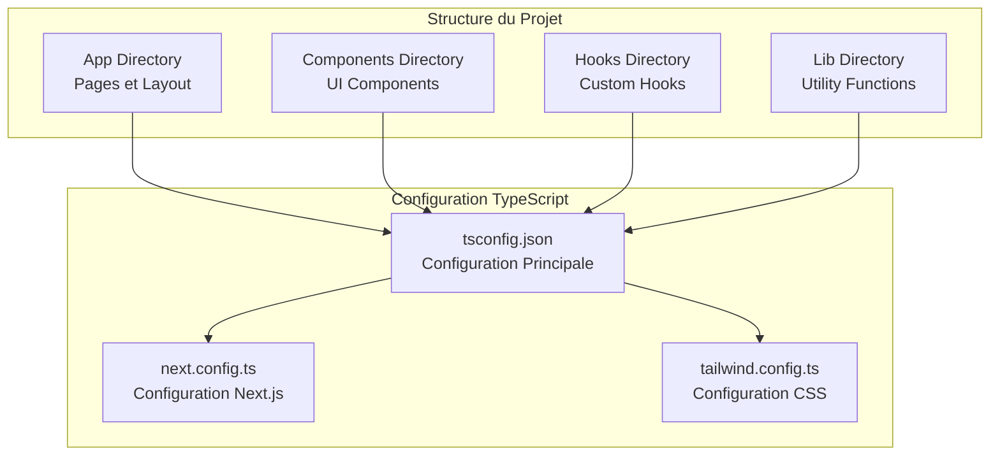
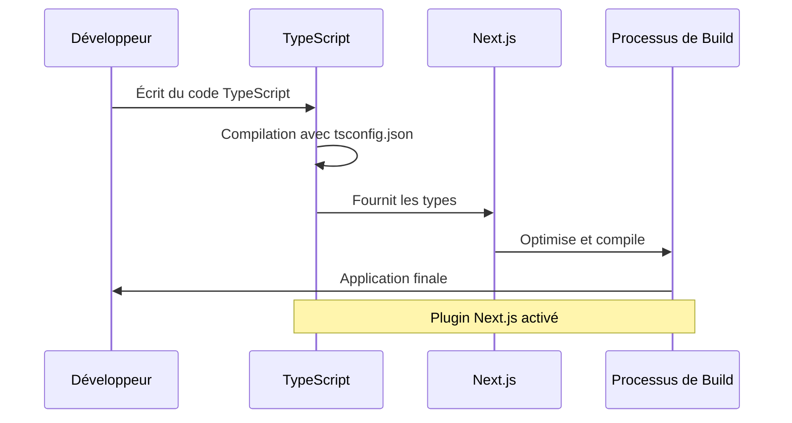
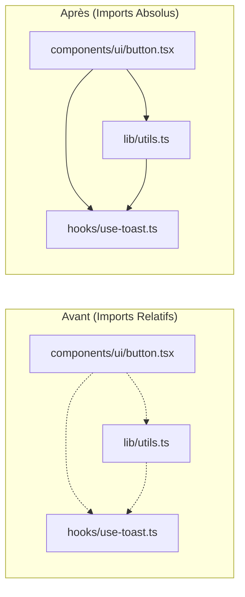

# Configuration TypeScript

<cite>
**Fichiers Référencés dans ce Document**
- [tsconfig.json](file://tsconfig.json)
- [package.json](file://package.json)
- [next.config.ts](file://next.config.ts)
- [tailwind.config.ts](file://tailwind.config.ts)
- [app/layout.tsx](file://app/layout.tsx)
- [components/ui/button.tsx](file://components/ui/button.tsx)
- [lib/utils.ts](file://lib/utils.ts)
</cite>

## Table des Matières
1. [Introduction](#introduction)
2. [Structure du Projet](#structure-du-projet)
3. [Configuration du Compilateur TypeScript](#configuration-du-compilateur-typescript)
4. [Options de Sécurité et de Développement](#options-de-sécurité-et-de-développement)
5. [Configuration des Alias de Chemins](#configuration-des-alias-de-chemins)
6. [Intégration avec Next.js](#intégration-avec-nextjs)
7. [Exemples d'Utilisation Pratiques](#exemples-dutilisation-pratiques)
8. [Avantages de la Configuration](#avantages-de-la-configuration)
9. [Conclusion](#conclusion)

## Introduction

Le fichier `tsconfig.json` est un élément fondamental de tout projet TypeScript, servant de configuration centrale pour le compilateur TypeScript et les outils de développement. Dans le projet Decker, cette configuration est optimisée pour une expérience de développement moderne avec Next.js, offrant une base solide pour le développement d'applications web TypeScript robustes et maintenables.

Cette documentation explore en détail chaque aspect de la configuration TypeScript, depuis les options de compilation jusqu'à l'intégration avec les outils de développement, en montrant comment cette configuration améliore significativement l'expérience de développement et la qualité du code.

## Structure du Projet

Le projet Decker suit une architecture modulaire bien organisée qui s'intègre parfaitement avec la configuration TypeScript :



**Sources du Diagramme**
- [tsconfig.json](file://tsconfig.json#L1-L28)
- [package.json](file://package.json#L1-L50)

**Sources de Section**
- [tsconfig.json](file://tsconfig.json#L1-L28)
- [package.json](file://package.json#L1-L50)

## Configuration du Compilateur TypeScript

### Options de Cible et de Bibliothèques

La configuration commence par définir les paramètres de base du compilateur TypeScript :

#### Target ES2017
```json
"target": "ES2017"
```
Cette option configure le compilateur pour générer du code JavaScript compatible avec ECMAScript 2017. Cette version offre un bon équilibre entre compatibilité et fonctionnalités modernes, incluant :
- Async/await natifs
- Opérateurs de propriétés de classe
- Générateurs et itérateurs
- Modules dynamiques

#### Bibliothèques DOM et ESNext
```json
"lib": ["dom", "dom.iterable", "esnext"]
```
Cette configuration inclut trois catégories essentielles :
- **DOM** : Types pour l'API Web Browser
- **DOM Iterable** : Types pour les objets itérables du DOM
- **ESNext** : Fonctionnalités JavaScript les plus récentes

### Gestion des Modules

#### Module ESNext avec Resolution Bundler
```json
"module": "esnext",
"moduleResolution": "bundler"
```
Cette combinaison représente l'état de l'art de la résolution de modules :
- **ESNext** : Utilise les modules JavaScript natifs
- **Bundler** : Optimisé pour les bundlers modernes comme Vite, Webpack, ou Next.js

#### Interopérabilité des Modules
```json
"esModuleInterop": true
```
Active l'interopérabilité entre les modules CommonJS et ES modules, permettant :
- L'utilisation de bibliothèques CommonJS dans du code ES modules
- L'importation de modules sans avoir à utiliser `.default`
- Une meilleure intégration avec l'écosystème npm

#### JSX Preserved
```json
"jsx": "preserve"
```
Conserve les balises JSX telles quelles pendant la compilation, permettant aux outils comme Next.js de traiter le JSX ultérieurement. Cette approche offre :
- Une meilleure optimisation du rendu
- Un support amélioré pour les transformations JSX personnalisées
- Une compilation plus rapide

**Sources de Section**
- [tsconfig.json](file://tsconfig.json#L3-L14)

## Options de Sécurité et de Développement

### Contrôle Strict et Vérification des Bibliothèques

#### Mode Strict
```json
"strict": true
```
Active toutes les options de vérification strictes de TypeScript, fournissant :
- **Vérification de null/undefined** : Prévention des erreurs d'accès aux propriétés
- **Vérification de l'assignation** : Types cohérents dans les assignations
- **Vérification de l'argument** : Vérification stricte des arguments de fonctions
- **Vérification de l'inférence** : Inférence de types précise
- **Vérification de l'assignation de fonctions** : Contrôle des signatures de fonctions

#### Ignorer les Vérifications de Bibliothèques
```json
"skipLibCheck": true
```
Améliore les performances de compilation en ignorant les vérifications sur les fichiers de définition TypeScript des bibliothèques, sans compromettre la sécurité du code.

### Optimisations de Développement

#### Compilation Incrémentale
```json
"incremental": true
```
Active la compilation incrémentale, offrant :
- **Performance améliorée** : Seuls les fichiers modifiés sont recompilés
- **Temps de compilation réduit** : Compilation plus rapide lors du développement
- **Support IDE** : Meilleur support pour les éditeurs de code

#### Pas d'Émission de Fichiers
```json
"noEmit": true
```
Empêche la génération automatique de fichiers JavaScript, car :
- Next.js gère lui-même la compilation
- Évite les conflits de fichiers générés
- Améliore les performances de développement

#### Modules Isolés
```json
"isolatedModules": true
```
Assure que chaque fichier peut être compilé indépendamment, facilitant :
- Le hot reloading
- La compilation par module
- La compatibilité avec les outils de transformation

#### Résolution de Modules JSON
```json
"resolveJsonModule": true
```
Permet l'importation directe de fichiers JSON comme des modules TypeScript, utile pour :
- Les configurations
- Les données statiques
- Les ressources de traduction

**Sources de Section**
- [tsconfig.json](file://tsconfig.json#L6-L16)

## Configuration des Alias de Chemins

### Système d'Alias @/*

```json
"paths": {
  "@/*": ["./*"]
}
```

Cette configuration crée un système d'alias puissant qui transforme les imports relatifs en imports absolus :

#### Avantages des Alias
- **Imports Propres** : `import { cn } from '@/lib/utils'`
- **Maintenabilité** : Facilité de navigation dans le code
- **Flexibilité** : Changements de structure sans impact sur les imports
- **Lisibilité** : Clarté dans la hiérarchie des fichiers

#### Exemples de Transformation
```typescript
// Avant (imports relatifs complexes)
import { cn } from '../../../lib/utils'

// Après (imports absolus avec alias)
import { cn } from '@/lib/utils'
```

### Configuration d'Inclusion et d'Exclusion

#### Fichiers Inclus
```json
"include": [
  "next-env.d.ts", 
  "**/*.ts", 
  "**/*.tsx", 
  ".next/types/**/*.ts"
]
```
Cette configuration inclut :
- **next-env.d.ts** : Définitions d'environnement Next.js
- **Tous les fichiers TypeScript** : `.ts` et `.tsx`
- **Types générés** : `.next/types/**/*.ts`

#### Fichiers Exclus
```json
"exclude": ["node_modules"]
```
Exclut explicitement le dossier `node_modules` pour :
- **Performance** : Éviter la compilation des packages
- **Sécurité** : Ne pas compiler les dépendances tierces
- **Clarté** : Focus uniquement sur le code source

**Sources de Section**
- [tsconfig.json](file://tsconfig.json#L21-L26)

## Intégration avec Next.js

### Plugin Next.js

```json
"plugins": [
  {
    "name": "next"
  }
]
```

Ce plugin active les fonctionnalités spécifiques à Next.js :

#### Fonctionnalités Activées
- **Support des pages** : Reconnaissance automatique des routes
- **Optimisation des images** : Intégration avec Image Optimization
- **Préchargement** : Optimisation des préchargements de routes
- **Types automatiques** : Génération de types pour les métadonnées

### Configuration Complémentaire

La configuration TypeScript travaille en synergie avec les autres fichiers de configuration :



**Sources du Diagramme**
- [tsconfig.json](file://tsconfig.json#L16-L20)
- [next.config.ts](file://next.config.ts#L1-L8)

**Sources de Section**
- [tsconfig.json](file://tsconfig.json#L16-L20)
- [next.config.ts](file://next.config.ts#L1-L8)

## Exemples d'Utilisation Pratiques

### Import Simplifié avec Alias

#### Exemple 1 : Composant UI
```typescript
// Avant (chemin relatif)
import { Button } from '../../../components/ui/button'

// Après (alias recommandé)
import { Button } from '@/components/ui/button'
```

#### Exemple 2 : Fonctions Utilitaires
```typescript
// Avant (chemin complexe)
import { cn } from '../../../../lib/utils'

// Après (alias clair)
import { cn } from '@/lib/utils'
```

#### Exemple 3 : Hooks Personnalisés
```typescript
// Avant (navigation difficile)
import { useToast } from '../../../hooks/use-toast'

// Après (structure intuitive)
import { useToast } from '@/hooks/use-toast'
```

### Impact sur la Structure du Projet



**Sources du Diagramme**
- [components/ui/button.tsx](file://components/ui/button.tsx#L5)
- [lib/utils.ts](file://lib/utils.ts#L1-L7)

**Sources de Section**
- [components/ui/button.tsx](file://components/ui/button.tsx#L5)
- [lib/utils.ts](file://lib/utils.ts#L1-L7)

## Avantages de la Configuration

### Amélioration de l'Expérience de Développement

#### 1. Productivité Augmentée
- **Imports Simplifiés** : Réduction de la complexité des chemins
- **Navigation Facile** : Structure intuitive du projet
- **Autocomplétion Améliorée** : Meilleur support IDE

#### 2. Maintenabilité du Code
- **Consistance** : Convention uniforme pour tous les imports
- **Flexibilité** : Changements de structure sans réécriture d'imports
- **Lisibilité** : Code plus propre et compréhensible

#### 3. Performance de Compilation
- **Compilation Rapide** : Compilation incrémentale
- **Optimisation** : Ignorer les bibliothèques inutiles
- **Intégration Next.js** : Workflow optimisé

### Qualité du Code Garantie

#### 1. Vérifications Stricts
- **Types Cohérents** : Vérification complète des types
- **Null Safety** : Prévention des erreurs d'accès
- **Assignation Correcte** : Validation des signatures

#### 2. Sécurité du Développement
- **Erreurs Préventives** : Détection avant exécution
- **Compatibilité** : Support des standards modernes
- **Interopérabilité** : Bonne intégration des bibliothèques

### Intégration Ecosystem

#### 1. Outils Modernes
- **Next.js** : Framework React optimisé
- **Tailwind CSS** : Utility-first CSS
- **Radix UI** : Composants React accessibles

#### 2. Écosystème TypeScript
- **TypeScript 5.x** : Dernières fonctionnalités
- **ES2017** : Compatibilité universelle
- **ESNext** : Innovation technologique

## Conclusion

La configuration TypeScript du projet Decker représente une approche moderne et sophistiquée de la configuration de développement TypeScript. Cette configuration équilibre parfaitement :

- **Performance** : Compilation rapide avec incrémentale et skipLibCheck
- **Sécurité** : Vérifications strictes avec mode strict
- **Productivité** : Imports simplifiés avec système d'alias
- **Maintenabilité** : Structure claire et convention uniforme
- **Intégration** : Synergie optimale avec Next.js et l'écosystème

Cette configuration constitue une base solide pour le développement d'applications TypeScript modernes, offrant aux développeurs un environnement de travail efficace, sécurisé et agréable. Elle démontre l'importance d'une configuration TypeScript bien pensée dans la création d'applications web robustes et maintenables à long terme.

L'utilisation systématique des alias `@/*` transforme radicalement l'expérience de développement, rendant le code plus lisible, plus maintenable et plus flexible face aux changements de structure. Couplée à l'intégration native avec Next.js, cette configuration représente un modèle exemplaire pour les projets TypeScript modernes.