# Configuration

<cite>
**Fichiers Référencés dans ce Document**
- [next.config.ts](file://next.config.ts)
- [tailwind.config.ts](file://tailwind.config.ts)
- [tsconfig.json](file://tsconfig.json)
- [package.json](file://package.json)
- [postcss.config.mjs](file://postcss.config.mjs)
- [components.json](file://components.json)
</cite>

## Table des Matières
1. [Introduction](#introduction)
2. [Structure des Fichiers de Configuration](#structure-des-fichiers-de-configuration)
3. [Configuration Next.js (next.config.ts)](#configuration-nextjs-nextconfigts)
4. [Configuration Tailwind CSS (tailwind.config.ts)](#configuration-tailwind-css-tailwindconfigts)
5. [Configuration TypeScript (tsconfig.json)](#configuration-typescript-tsconfigjson)
6. [Gestion des Dépendances (package.json)](#gestion-des-dépendances-packagejson)
7. [Configuration PostCSS (postcss.config.mjs)](#configuration-postcss-postcssconfigmjs)
8. [Configuration shadcn/ui (components.json)](#configuration-shadcnui-componentsjson)
9. [Bonnes Pratiques et Optimisations](#bonnes-pratiques-et-optimisations)
10. [Guide de Dépannage](#guide-de-dépannage)
11. [Conclusion](#conclusion)

## Introduction

Le projet Decker utilise un système de configuration moderne et bien structuré basé sur les technologies React/Next.js avec Tailwind CSS. Cette documentation explore en détail chaque fichier de configuration qui contrôle le comportement de l'application, son processus de développement, et ses optimisations de performance.

Les fichiers de configuration jouent un rôle crucial dans la définition de :
- Les options de compilation et de transpilation du code TypeScript
- La configuration du framework Next.js pour le rendu côté serveur et client
- Les personnalisations de Tailwind CSS pour l'interface utilisateur
- La gestion des dépendances et scripts de build
- Les outils d'analyse statique et de qualité du code

## Structure des Fichiers de Configuration

Le projet Decker organise ses fichiers de configuration selon une approche modulaire et spécialisée :

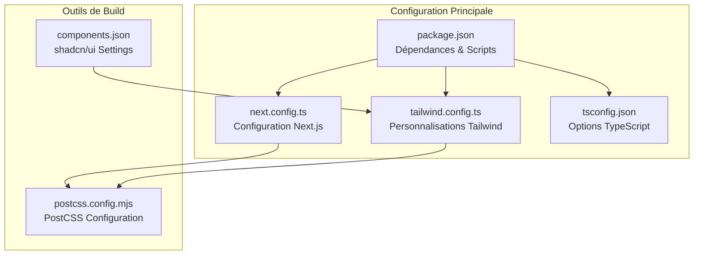

**Sources du Diagramme**
- [next.config.ts](file://next.config.ts#L1-L8)
- [tailwind.config.ts](file://tailwind.config.ts#L1-L73)
- [tsconfig.json](file://tsconfig.json#L1-L28)
- [package.json](file://package.json#L1-L50)
- [postcss.config.mjs](file://postcss.config.mjs#L1-L10)
- [components.json](file://components.json#L1-L23)

## Configuration Next.js (next.config.ts)

Le fichier `next.config.ts` configure le framework Next.js avec des options spécialisées pour le projet Decker.

### Structure de Base

La configuration actuelle utilise une structure minimale avec une interface TypeScript typée :

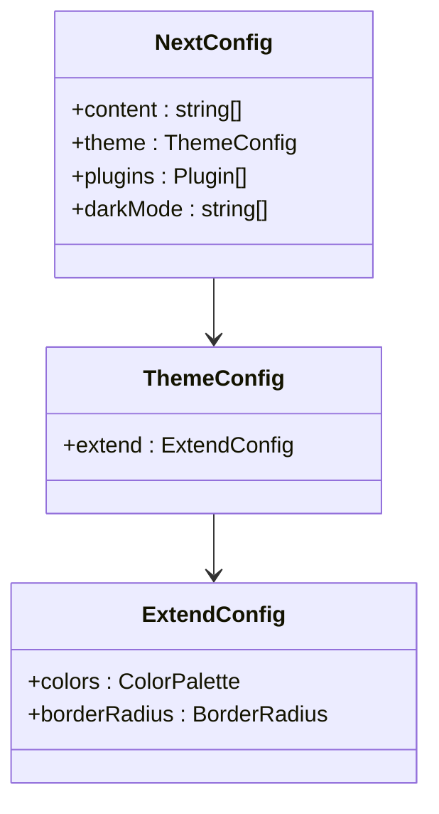

**Sources du Diagramme**
- [tailwind.config.ts](file://tailwind.config.ts#L10-L70)

### Options de Configuration Principales

| Option | Valeur | Description |
|--------|--------|-------------|
| `darkMode` | `["class"]` | Active le mode sombre via classe CSS plutôt que media query |
| `content` | Patterns glob | Spécifie les fichiers à analyser pour générer les styles Tailwind |

### Impact sur le Comportement de l'Application

- **Mode Sombre** : Utilise la classe CSS `dark` pour activer le thème sombre
- **Analyse des Styles** : Tailwind analyse automatiquement tous les composants React et pages
- **Performance** : La configuration minimaliste réduit la complexité initiale

**Sources de Section**
- [next.config.ts](file://next.config.ts#L1-L8)

## Configuration Tailwind CSS (tailwind.config.ts)

La configuration Tailwind CSS est particulièrement riche et personnalisée pour supporter le design system complet du projet.

### Architecture des Couleurs

La configuration implémente un système de couleurs basé sur des variables CSS personnalisées :

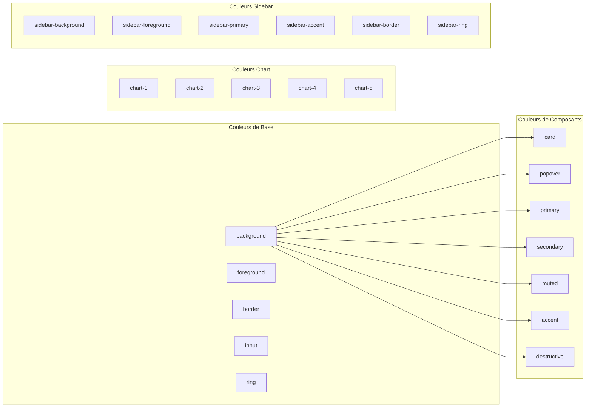

**Sources du Diagramme**
- [tailwind.config.ts](file://tailwind.config.ts#L12-L62)

### Variables CSS et Couleurs Dynamiques

| Variable | Utilisation | Exemple |
|----------|-------------|---------|
| `--background` | Fond principal | `hsl(var(--background))` |
| `--card` | Arrière-plan des cartes | `hsl(var(--card))` |
| `--primary` | Couleur primaire | `hsl(var(--primary))` |
| `--radius` | Rayon des bordures | `var(--radius)` |

### Extensions de Plugins

Le projet utilise plusieurs plugins Tailwind CSS :

```mermaid
flowchart TD
A[Tailwind CSS Core] --> B[tailwindcss-animate]
B --> C[Génération des Animations]
C --> D[Animations CSS Automatiques]
E[Configuration Actuelle] --> F[Plugin Chargé Dynamiquement]
F --> G[require(\"tailwindcss-animate\")]
```

**Sources du Diagramme**
- [tailwind.config.ts](file://tailwind.config.ts#L71-L72)

### Impact sur le Design System

- **Consistance Visuelle** : Toutes les couleurs utilisent le même système de variables
- **Thèmes Adaptatifs** : Support natif pour les thèmes clair/sombre
- **Personnalisation Avancée** : Couleurs spécifiques aux composants UI

**Sources de Section**
- [tailwind.config.ts](file://tailwind.config.ts#L1-L73)

## Configuration TypeScript (tsconfig.json)

La configuration TypeScript optimise la compilation et l'intégration avec Next.js.

### Options de Compilation

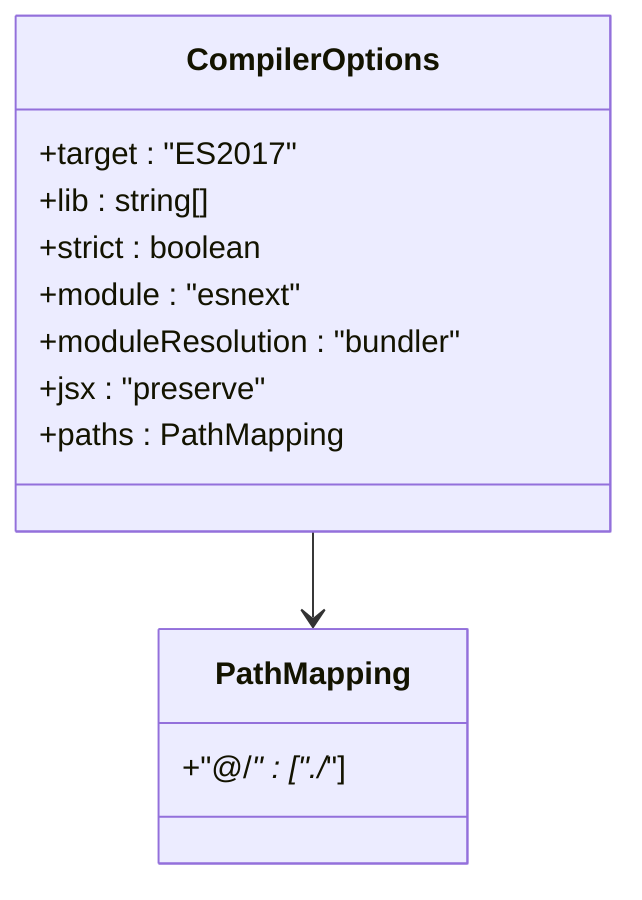

**Sources du Diagramme**
- [tsconfig.json](file://tsconfig.json#L2-L23)

### Configuration des Chemins d'Alias

| Alias | Chemin Résolu | Utilisation |
|-------|---------------|-------------|
| `@/*` | `./` | Accès racine du projet |

### Intégration avec Next.js

La configuration inclut un plugin spécifique pour Next.js :

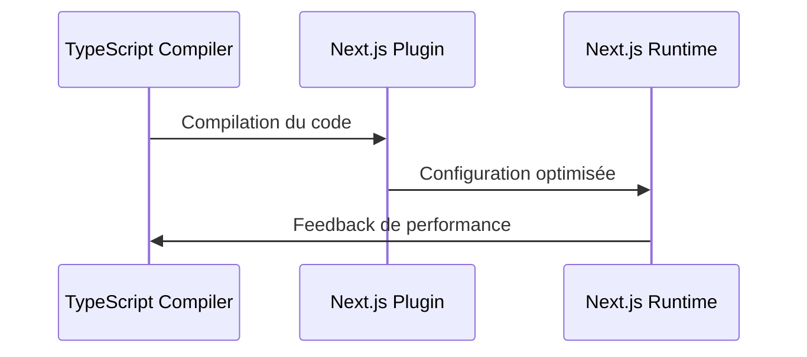

**Sources du Diagramme**
- [tsconfig.json](file://tsconfig.json#L16-L20)

### Optimisations de Performance

- **Compilation Incrémentale** : `incremental: true` pour les builds rapides
- **Éviction des Modules** : `isolatedModules: true` pour la compatibilité
- **Type Checking** : `strict: true` pour la sécurité des types

**Sources de Section**
- [tsconfig.json](file://tsconfig.json#L1-L28)

## Gestion des Dépendances (package.json)

Le fichier `package.json` centralise toutes les dépendances et scripts du projet.

### Dépendances de Production

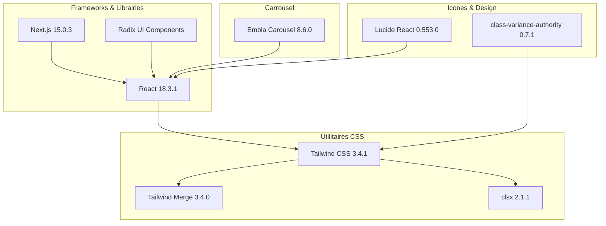

**Sources du Diagramme**
- [package.json](file://package.json#L11-L35)

### Dépendances de Développement

| Package | Version | Utilisation |
|---------|---------|-------------|
| `eslint` | ^8 | Analyse statique du code |
| `typescript` | ^5 | Support TypeScript |
| `tailwindcss` | ^3.4.1 | Framework CSS |
| `autoprefixer` | ^10.4.20 | Préfixes CSS |

### Scripts de Build et Développement

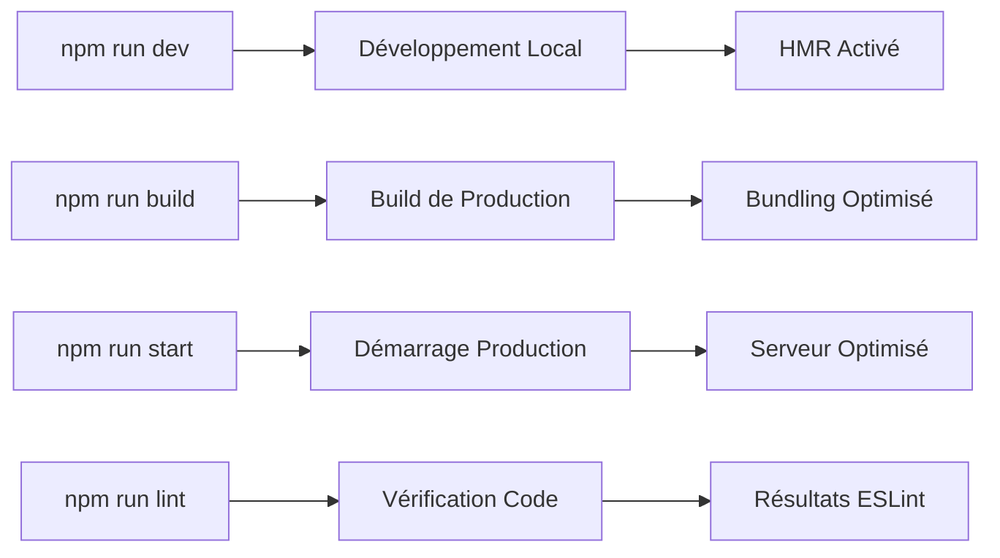

**Sources du Diagramme**
- [package.json](file://package.json#L5-L9)

### Stratégie de Versioning

- **Version Initiale** : `0.1.0` pour le développement initial
- **Private Package** : `"private": true` pour éviter la publication accidentelle
- **Compatibilité Next.js** : Version spécifique `15.0.3` pour stabilité

**Sources de Section**
- [package.json](file://package.json#L1-L50)

## Configuration PostCSS (postcss.config.mjs)

La configuration PostCSS orchestre le traitement des feuilles de style CSS.

### Plugins Activés

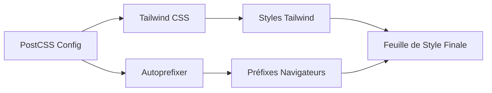

**Sources du Diagramme**
- [postcss.config.mjs](file://postcss.config.mjs#L3-L6)

### Configuration des Plugins

| Plugin | Version | Rôle |
|--------|---------|------|
| `tailwindcss` | ^latest | Traitement des directives Tailwind |
| `autoprefixer` | ^10.4.20 | Ajout des préfixes navigateurs |

### Flux de Traitement CSS

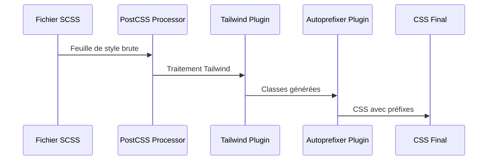

**Sources du Diagramme**
- [postcss.config.mjs](file://postcss.config.mjs#L1-L10)

**Sources de Section**
- [postcss.config.mjs](file://postcss.config.mjs#L1-L10)

## Configuration shadcn/ui (components.json)

Le fichier `components.json` configure l'écosystème shadcn/ui pour la gestion des composants UI.

### Configuration du Design System

```mermaid
graph TB
subgraph "Style & Thème"
A[style: "new-york"]
B[rsc: true]
C[tsx: true]
end
subgraph "Configuration Tailwind"
D[tailwind.config: "tailwind.config.ts"]
E[tailwind.css: "app/globals.css"]
F[baseColor: "neutral"]
G[cssVariables: true]
end
subgraph "Aliases"
H[components: "@/components"]
I[utils: "@/lib/utils"]
J[ui: "@/components/ui"]
K[lib: "@/lib"]
L[hooks: "@/hooks"]
end
A --> D
B --> E
C --> F
D --> H
E --> I
F --> J
G --> K
H --> L
```

**Sources du Diagramme**
- [components.json](file://components.json#L2-L21)

### Paramètres de Configuration

| Paramètre | Valeur | Description |
|-----------|--------|-------------|
| `style` | `"new-york"` | Style du design system |
| `rsc` | `true` | Support React Server Components |
| `tsx` | `true` | Support TypeScript JSX |
| `cssVariables` | `true` | Utilisation des variables CSS |

### Aliases et Organisation

Les aliases organisent le projet selon une structure logique :

- **`@/components`** : Composants React
- **`@/lib/utils`** : Fonctions utilitaires
- **`@/components/ui`** : Composants UI shadcn
- **`@/lib`** : Bibliothèques partagées
- **`@/hooks`** : Hooks personnalisés

**Sources de Section**
- [components.json](file://components.json#L1-L23)

## Bonnes Pratiques et Optimisations

### Configuration Optimisée

1. **Compilation TypeScript**
   - Utilisation de `moduleResolution: "bundler"` pour compatibilité moderne
   - Activation de `incremental` pour les builds rapides
   - Configuration stricte pour la sécurité des types

2. **Tailwind CSS**
   - Variables CSS pour les couleurs dynamiques
   - Extensions personnalisées pour les composants
   - Plugin `tailwindcss-animate` pour les animations fluides

3. **Next.js**
   - Mode Sombre via classe CSS pour plus de flexibilité
   - Configuration minimaliste pour éviter la complexité excessive

### Optimisations de Performance

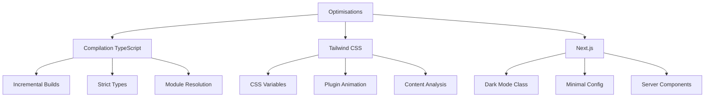

### Recommandations de Maintenance

1. **Mise à Jour des Dépendances**
   - Surveiller régulièrement les mises à jour de Next.js
   - Tester les nouvelles versions de Tailwind CSS
   - Maintenir la compatibilité TypeScript

2. **Configuration des Environnements**
   - Adapter les configurations pour différents environnements
   - Utiliser des variables d'environnement quand nécessaire
   - Tester les performances de build

3. **Documentation Continue**
   - Documenter les changements de configuration
   - Maintenir la cohérence des noms de variables
   - Partager les bonnes pratiques avec l'équipe

## Guide de Dépannage

### Problèmes Courants

#### Erreurs de Compilation TypeScript

**Symptôme** : Erreurs de type lors du développement
**Solution** :
1. Vérifier la compatibilité des versions TypeScript
2. Nettoyer le cache de compilation
3. Valider la configuration `tsconfig.json`

#### Problèmes Tailwind CSS

**Symptôme** : Styles manquants ou non appliqués
**Solution** :
1. Vérifier les patterns de contenu dans `tailwind.config.ts`
2. Redémarrer le serveur de développement
3. Valider la configuration PostCSS

#### Configuration Next.js

**Symptôme** : Erreurs de build ou de développement
**Solution** :
1. Vérifier la compatibilité des versions
2. Valider la configuration des plugins
3. Tester avec une configuration minimale

### Outils de Diagnostic

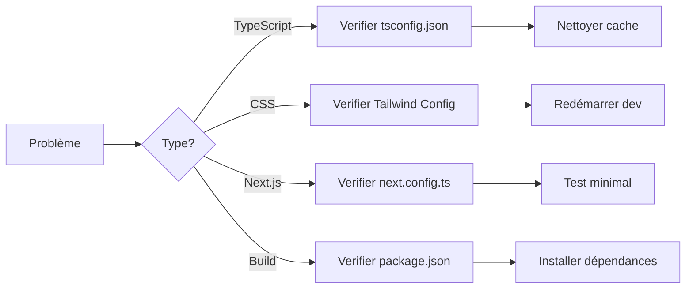

### Scripts de Diagnostic

- **Vérification TypeScript** : `npx tsc --noEmit`
- **Test Tailwind** : `npx tailwindcss -i ./input.css -o ./output.css`
- **Validation Next.js** : `npx next info`

## Conclusion

La configuration du projet Decker représente une approche moderne et optimisée pour le développement d'applications React/Next.js avec Tailwind CSS. Chaque fichier de configuration a été conçu pour :

- **Faciliter le développement** avec des outils intégrés et des alias de chemins
- **Optimiser les performances** grâce à des configurations spécifiques
- **Maintenir la cohérence** avec des standards de qualité élevés
- **Supporter l'évolution** avec des dépendances bien choisies

Cette configuration établit une base solide pour le développement continu tout en permettant des adaptations futures selon les besoins du projet. L'utilisation de shadcn/ui et des variables CSS personnalisées crée un design system cohérent et maintenable.

Les bonnes pratiques documentées ici serviront de référence pour les développeurs travaillant sur le projet et aideront à maintenir la qualité du code et des performances à long terme.