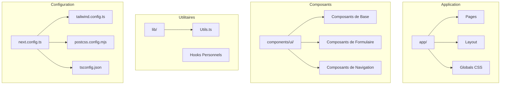
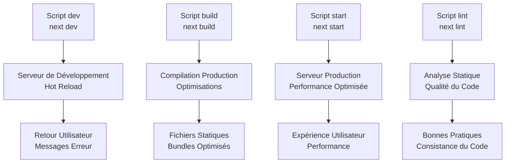
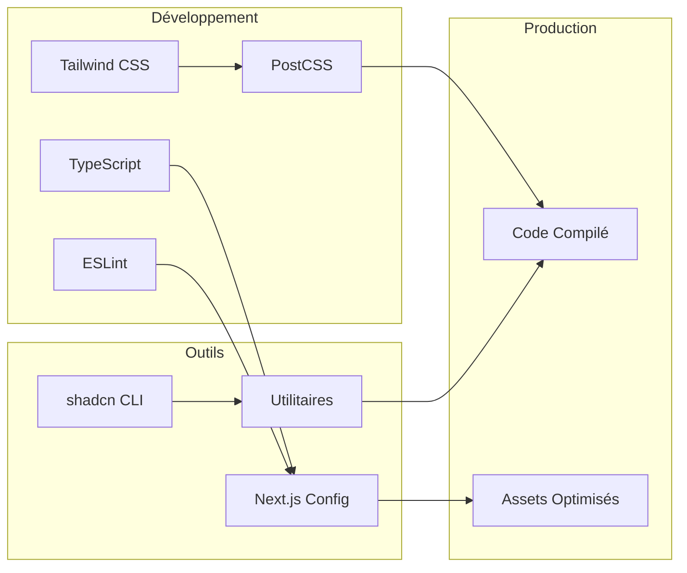

# Dépendances et Scripts

<cite>
**Fichiers Référencés dans ce Document**
- [package.json](file://package.json)
- [next.config.ts](file://next.config.ts)
- [tailwind.config.ts](file://tailwind.config.ts)
- [postcss.config.mjs](file://postcss.config.mjs)
- [tsconfig.json](file://tsconfig.json)
- [components.json](file://components.json)
- [lib/utils.ts](file://lib/utils.ts)
- [components/ui/button.tsx](file://components/ui/button.tsx)
- [components/ui/input.tsx](file://components/ui/input.tsx)
- [components/ui/dialog.tsx](file://components/ui/dialog.tsx)
- [components/ui/alert.tsx](file://components/ui/alert.tsx)
- [components/ui/navigation-menu.tsx](file://components/ui/navigation-menu.tsx)
- [components/ui/breadcrumb.tsx](file://components/ui/breadcrumb.tsx)
- [hooks/use-toast.ts](file://hooks/use-toast.ts)
</cite>

## Table des Matières
1. [Introduction](#introduction)
2. [Structure du Projet](#structure-du-projet)
3. [Scripts de Développement](#scripts-de-développement)
4. [Dépendances Principales](#dépendances-principales)
5. [Dépendances de Développement](#dépendances-de-développement)
6. [Architecture de Styles](#architecture-de-styles)
7. [Utilisation des Dépendances](#utilisation-des-dépendances)
8. [Gestion des Sécurité et Mises à Jour](#gestion-des-sécurité-et-mises-à-jour)
9. [Conseils et Bonnes Pratiques](#conseils-et-bonnes-pratiques)
10. [Conclusion](#conclusion)

## Introduction

Le projet Decker est une application web moderne construite avec Next.js 15, React 18 et un système de composants UI sophistiqué utilisant shadcn/ui. Cette documentation analyse exhaustivement les dépendances et scripts définis dans le fichier `package.json`, expliquant leur rôle dans l'écosystème du projet et comment elles interagissent pour créer une expérience utilisateur optimale.

Le projet utilise une approche modulaire avec des composants réutilisables, un système de styles cohérent basé sur Tailwind CSS, et une architecture TypeScript strictement typée. Chaque dépendance a été soigneusement sélectionnée pour contribuer à la performance, la maintenabilité et l'expérience développeur.

## Structure du Projet

Le projet suit une architecture Next.js moderne avec une organisation claire des fichiers et dossiers :



**Sources du Diagramme**
- [package.json](file://package.json#L1-L51)
- [next.config.ts](file://next.config.ts#L1-L8)
- [tailwind.config.ts](file://tailwind.config.ts#L1-L73)

**Sources de Section**
- [package.json](file://package.json#L1-L51)
- [components.json](file://components.json#L1-L23)

## Scripts de Développement

Le fichier `package.json` définit quatre scripts essentiels pour le cycle de vie du développement et du déploiement :

### Script de Développement Principal

```json
"dev": "next dev"
```

Ce script démarre le serveur de développement Next.js en mode hot-reload, permettant aux développeurs de travailler efficacement avec rechargement automatique et messages d'erreur détaillés.

### Compilation en Production

```json
"build": "next build"
```

Ce script compile l'application pour la production, optimisant les bundles JavaScript, générant les pages statiques, et préparant l'application pour le déploiement.

### Serveur de Production

```json
"start": "next start"
```

Ce script démarre le serveur de production optimisé, prêt à servir l'application compilée avec les performances maximales.

### Analyse Statique du Code

```json
"lint": "next lint"
```

Ce script exécute ESLint avec la configuration Next.js personnalisée pour détecter les problèmes de code, maintenir la qualité et appliquer les bonnes pratiques.



**Sources du Diagramme**
- [package.json](file://package.json#L5-L9)

**Sources de Section**
- [package.json](file://package.json#L5-L9)

## Dépendances Principales

### Next.js 15.0.3

Next.js est le framework React principal qui fournit :
- **Rendu côté serveur (SSR)** : Améliore les performances et le SEO
- **Routage automatique** : Gestion des routes basée sur la structure de fichiers
- **Optimisation automatique** : Lazy loading, code splitting et image optimization
- **TypeScript natif** : Support intégré avec configuration avancée

### React 18.3.1

React fournit la base de l'interface utilisateur avec :
- **Fragments** : Composition d'éléments sans nœud DOM supplémentaire
- **Suspense** : Chargement progressif des données
- **Concurrent Rendering** : Amélioration des performances d'interface
- **Hooks** : Logique réutilisable dans les composants fonctionnels

### Radix UI - Composants Primitifs Accessibles

Le projet utilise plusieurs composants Radix UI pour l'accessibilité :

| Composant | Version | Fonction |
|-----------|---------|----------|
| `@radix-ui/react-aspect-ratio` | ^1.1.8 | Maintien des proportions d'images |
| `@radix-ui/react-avatar` | ^1.1.11 | Affichage d'avatars avec fallback |
| `@radix-ui/react-checkbox` | ^1.3.3 | Cases à cocher accessibles |
| `@radix-ui/react-dialog` | ^1.1.15 | Boîtes de dialogue modales |
| `@radix-ui/react-dropdown-menu` | ^2.1.16 | Menus déroulants complexes |
| `@radix-ui/react-navigation-menu` | ^1.2.14 | Navigation principale |
| `@radix-ui/react-popover` | ^1.1.15 | Contenus contextuels |
| `@radix-ui/react-scroll-area` | ^1.2.10 | Zones de défilement personnalisées |
| `@radix-ui/react-select` | ^2.2.6 | Sélecteurs avancés |
| `@radix-ui/react-separator` | ^1.1.8 | Séparateurs visuels |
| `@radix-ui/react-slot` | ^1.2.4 | Composants polymorphes |
| `@radix-ui/react-switch` | ^1.2.6 | Interrupteurs binaires |
| `@radix-ui/react-toast` | ^1.2.15 | Notifications temporaires |
| `@radix-ui/react-tooltip` | ^1.2.8 | Infobulles contextuelles |

### Lucide React 0.553.0

Lucide React fournit un ensemble complet d'icônes vectorielles modernes et minimalistes :

```typescript
// Exemple d'utilisation dans les composants
import { X, Check, ChevronRight, MoreHorizontal } from "lucide-react"
```

Les icônes sont utilisées dans :
- **Dialogues** : Bouton de fermeture (`X`)
- **Menus** : Flèches de navigation (`ChevronRight`)
- **Indicateurs** : Ellipses de contenu étendu (`MoreHorizontal`)
- **Statuts** : Icônes de validation (`Check`)

### Utilitaires de Classes CSS

#### clsx 2.1.1
`clsx` permet la composition conditionnelle de classes CSS :

```typescript
// Exemple d'utilisation dans utils.ts
import { clsx, type ClassValue } from "clsx"
```

#### class-variance-authority 0.7.1
`class-variance-authority` (CVA) crée des variantes de composants avec des styles cohérents :

```typescript
// Exemple dans button.tsx
import { cva, type VariantProps } from "class-variance-authority"
```

#### tailwind-merge 3.4.0
`tailwind-merge` résout les conflits entre classes Tailwind CSS :

```typescript
// Exemple dans utils.ts
import { twMerge } from "tailwind-merge"
```

### Autres Dépendances Critiques

#### Supabase 2.81.1
Intégration backend pour :
- Authentification utilisateur
- Stockage de données
- Fonctionnalités en temps réel

#### Embla Carousel 8.6.0
Bibliothèque de carousels performante pour :
- Galeries d'images
- Diaporamas
- Navigations horizontales

**Sources de Section**
- [package.json](file://package.json#L11-L36)

## Dépendances de Développement

### TypeScript 5.x

TypeScript fournit :
- **Vérification de types** : Détection des erreurs avant l'exécution
- **IntelliSense amélioré** : Meilleure expérience de développement
- **Refactoring sécurisé** : Modifications sans risque de rupture
- **Documentation automatique** : Génération de documentation depuis les types

### ESLint 8.x

Configuration Next.js optimisée :
- **Règles strictes** : Conformité aux standards React
- **Auto-correction** : Nettoyage automatique du code
- **Plugin Next.js** : Règles spécifiques au framework
- **Support TypeScript** : Vérification des types dans ESLint

### Tailwind CSS 3.4.x

Framework CSS utilitaire avec :
- **Configuration centralisée** : Variables CSS personnalisées
- **Thème cohérent** : Couleurs, espacements, typographie unifiés
- **Responsive design** : Breakpoints intégrés
- **Dark mode** : Support automatique

### PostCSS 8.x

PostCSS avec plugins :
- **Tailwind CSS** : Traitement des directives Tailwind
- **Autoprefixer** : Vendor prefixes automatiques

### shadcn CLI 3.5.0

Outil de gestion des composants UI :
- **Installation de composants** : `npx shadcn@latest add [composant]`
- **Configuration centralisée** : Synchronisation avec `components.json`
- **Personnalisation** : Adaptation aux besoins du projet



**Sources du Diagramme**
- [package.json](file://package.json#L38-L48)
- [next.config.ts](file://next.config.ts#L1-L8)
- [tailwind.config.ts](file://tailwind.config.ts#L1-L73)

**Sources de Section**
- [package.json](file://package.json#L38-L48)

## Architecture de Styles

### Configuration Tailwind CSS

La configuration Tailwind est centralisée dans `tailwind.config.ts` avec support des variables CSS personnalisées :

```typescript
// Configuration des couleurs avec variables CSS
colors: {
  background: 'hsl(var(--background))',
  foreground: 'hsl(var(--foreground))',
  primary: { DEFAULT: 'hsl(var(--primary))' },
  // ... autres couleurs
}
```

### Variables CSS Personnalisées

Le projet utilise des variables CSS pour le thème :
- `--background`, `--foreground` : Couleurs de base
- `--primary`, `--secondary` : Couleurs principales
- `--muted`, `--accent` : Couleurs secondaires
- `--radius` : Arrondis globaux

### PostCSS Pipeline

Le pipeline PostCSS traite les styles dans l'ordre :
1. **Tailwind CSS** : Génération des classes
2. **Autoprefixer** : Ajout des prefixes navigateurs

### Intégration avec shadcn/ui

Le système de composants shadcn/ui est configuré pour :
- **Style New York** : Thème par défaut
- **TSX** : Support complet TypeScript
- **RSC** : Support des React Server Components
- **Icon Library** : Lucide React intégré

**Sources de Section**
- [tailwind.config.ts](file://tailwind.config.ts#L1-L73)
- [postcss.config.mjs](file://postcss.config.mjs#L1-L10)
- [components.json](file://components.json#L1-L23)

## Utilisation des Dépendances

### Pattern d'Importation Standard

Toutes les dépendances suivent un pattern d'importation cohérent :

```typescript
// Import des utilitaires de classes
import { cn } from "@/lib/utils"
import { cva, type VariantProps } from "class-variance-authority"
import { clsx, type ClassValue } from "clsx"
import { twMerge } from "tailwind-merge"

// Import des icônes
import { X, Check, ChevronRight } from "lucide-react"

// Import des primitives Radix UI
import * as DialogPrimitive from "@radix-ui/react-dialog"
import * as NavigationMenuPrimitive from "@radix-ui/react-navigation-menu"
```

### Exemples d'Utilisation dans le Code

#### Composant Button avec CVA et clsx

Le composant Button illustre l'utilisation combinée des utilitaires :

```typescript
// Utilisation de class-variance-authority pour les variants
const buttonVariants = cva(
  "inline-flex items-center justify-center gap-2 whitespace-nowrap rounded-md text-sm font-medium transition-colors focus-visible:outline-none focus-visible:ring-1 focus-visible:ring-ring disabled:pointer-events-none disabled:opacity-50",
  {
    variants: {
      variant: {
        default: "bg-primary text-primary-foreground shadow hover:bg-primary/90",
        // ... autres variants
      },
      size: {
        default: "h-9 px-4 py-2",
        // ... autres tailles
      }
    }
  }
)
```

#### Composant Dialog avec Lucide React

Le composant Dialog montre l'intégration avec les icônes :

```typescript
// Import de l'icône X depuis Lucide React
import { X } from "lucide-react"

// Utilisation dans le composant
<DialogPrimitive.Close className="absolute right-4 top-4 rounded-sm opacity-70 ring-offset-background transition-opacity hover:opacity-100">
  <X className="h-4 w-4" />
  <span className="sr-only">Close</span>
</DialogPrimitive.Close>
```

#### Utilisation de clsx et tailwind-merge

Le fichier `utils.ts` combine clsx et tailwind-merge pour une gestion optimale des classes :

```typescript
// Fonction cn pour la composition de classes
export function cn(...inputs: ClassValue[]) {
  return twMerge(clsx(inputs))
}
```

### Hooks Personnalisés

Le hook `useToast` démontre l'utilisation de plusieurs dépendances :

```typescript
// Utilisation de React pour la gestion d'état
import * as React from "react"

// Utilisation de types pour la sécurité
import type { ToastActionElement, ToastProps } from "@/components/ui/toast"

// Pattern Redux simplifié pour la gestion des notifications
const TOAST_LIMIT = 1
```

**Sources de Section**
- [lib/utils.ts](file://lib/utils.ts#L1-L7)
- [components/ui/button.tsx](file://components/ui/button.tsx#L1-L58)
- [components/ui/dialog.tsx](file://components/ui/dialog.tsx#L1-L123)
- [hooks/use-toast.ts](file://hooks/use-toast.ts#L1-L195)

## Gestion de la Sécurité et Mises à Jour

### Audit de Sécurité

Pour vérifier la sécurité des dépendances :

```bash
# Exécution de l'audit npm
npm audit

# Installation des corrections de sécurité
npm audit fix

# Audit détaillé avec report
npm audit --audit-level moderate
```

### Stratégies de Mise à Jour

#### Mise à Jour Sécurisée

1. **Audit initial** : `npm audit`
2. **Test local** : `npm run build && npm run lint`
3. **Tests E2E** : Vérification de la fonctionnalité
4. **Commit** : Versioning approprié

#### Mise à Jour Progressive

```bash
# Mise à jour d'une dépendance spécifique
npm install next@15.1.0

# Mise à jour de toutes les dépendances
npm update

# Installation de nouvelles dépendances
npm install nouvelle-dependance@latest
```

### Gestion des Versions

| Type | Commande | Description |
|------|----------|-------------|
| **Patch** | `npm install paquet@1.0.1` | Corrections de bugs mineurs |
| **Minor** | `npm install paquet@1.1.0` | Nouvelles fonctionnalités compatibles |
| **Major** | `npm install paquet@2.0.0` | Changements majeurs, potentiellement régressifs |
| **Latest** | `npm install paquet@latest` | Dernière version disponible |

### Monitoring des Sécurité

```bash
# Surveillance continue
npm audit --json > security-report.json

# Notification des vulnérabilités critiques
npm audit --audit-level critical
```

## Conseils et Bonnes Pratiques

### Optimisation des Performances

1. **Lazy Loading** : Utiliser `import()` dynamique pour les composants rares
2. **Code Splitting** : Diviser le bundle en chunks logiques
3. **Image Optimization** : Utiliser les composants Next.js pour les images
4. **Bundle Analyzer** : Analyser la taille des bundles

### Maintenance du Code

1. **Types Strict** : Maintenir `strict: true` dans `tsconfig.json`
2. **ESLint** : Respecter les règles de codage
3. **Tests** : Implémenter une couverture de tests adéquate
4. **Documentation** : Commenter les APIs complexes

### Développement Collaboratif

1. **Git Hooks** : Pré-commit avec linting automatique
2. **Pull Requests** : Reviews de code obligatoires
3. **Changelog** : Documentation des changements
4. **Versioning** : SemVer pour les releases

### Déploiement et Production

1. **Build Testing** : Tester la compilation avant déploiement
2. **Monitoring** : Surveiller les performances en production
3. **Rollback** : Stratégies de rollback rapides
4. **CI/CD** : Automatisation des tests et déploiements

## Conclusion

Le projet Decker présente une architecture robuste et bien structurée avec un écosystème de dépendances mature. Chaque bibliothèque a été choisie pour son rôle spécifique et sa contribution à l'expérience utilisateur finale.

Les scripts de développement automatisent efficacement le cycle de vie du projet, tandis que les dépendances principales fournissent les fondations nécessaires pour une application React moderne. Les utilitaires de classes CSS offrent une flexibilité maximale tout en maintenant la cohérence visuelle.

L'intégration de shadcn/ui avec Tailwind CSS crée un système de composants réutilisable et personnalisable, facilitant le développement rapide tout en garantissant la qualité du code. La configuration TypeScript stricte assure la fiabilité et la maintenabilité à long terme.

Cette architecture solide permet aux développeurs de se concentrer sur la création de fonctionnalités métier tout en bénéficiant d'une infrastructure technique éprouvée et performante.