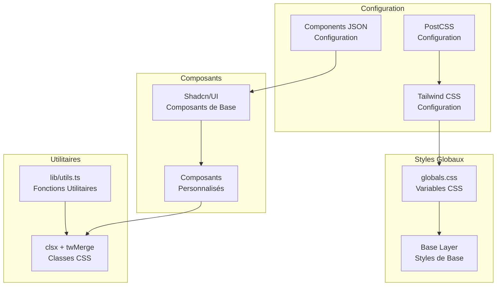
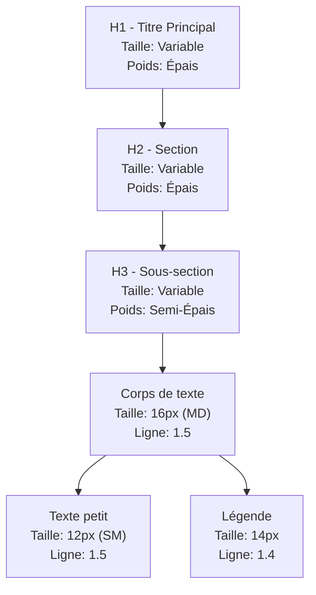
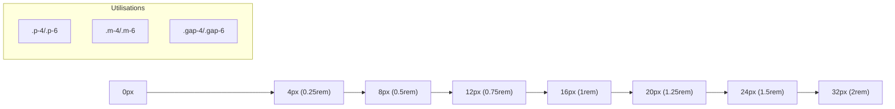
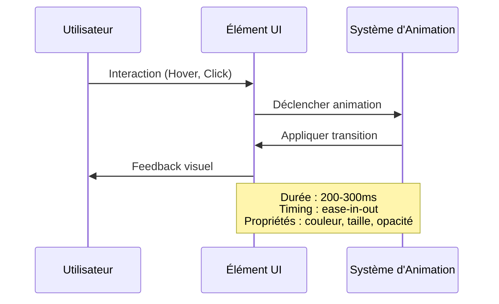
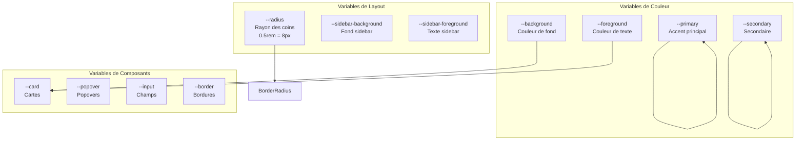
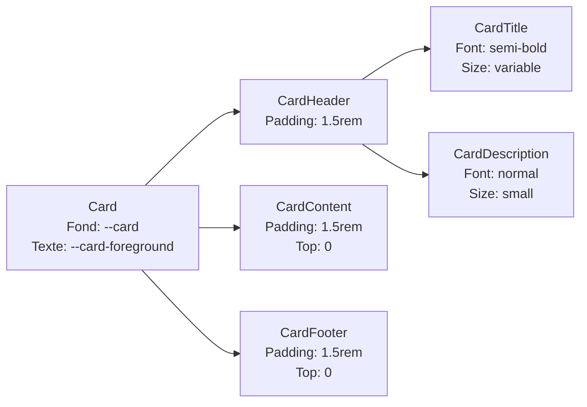
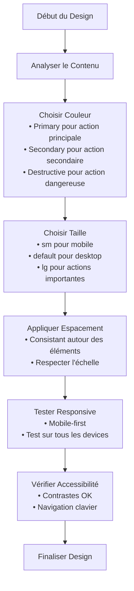
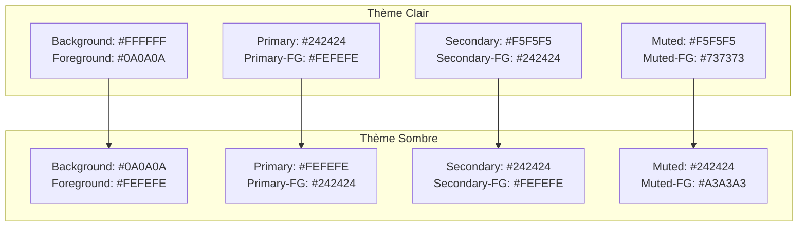
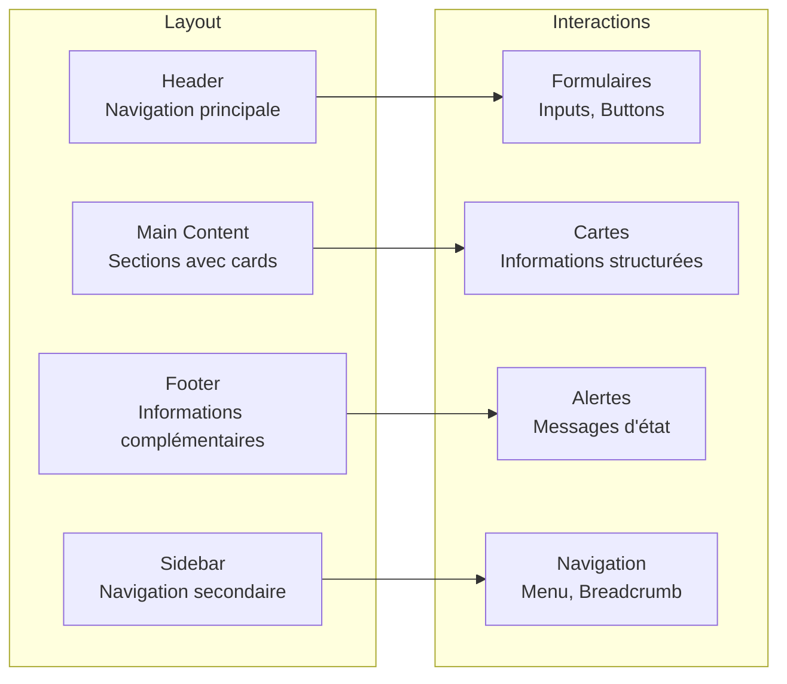

# Design System Decker

<cite>
**Fichiers Référencés dans ce Document**
- [tailwind.config.ts](file://tailwind.config.ts)
- [app/globals.css](file://app/globals.css)
- [components.json](file://components.json)
- [postcss.config.mjs](file://postcss.config.mjs)
- [components/ui/button.tsx](file://components/ui/button.tsx)
- [components/ui/card.tsx](file://components/ui/card.tsx)
- [components/ui/input.tsx](file://components/ui/input.tsx)
- [components/ui/badge.tsx](file://components/ui/badge.tsx)
- [components/ui/alert.tsx](file://components/ui/alert.tsx)
- [lib/utils.ts](file://lib/utils.ts)
- [package.json](file://package.json)
</cite>

## Table des Matières
1. [Introduction](#introduction)
2. [Structure du Projet](#structure-du-projet)
3. [Palette de Couleurs](#palette-de-couleurs)
4. [Typographie et Polices](#typographie-et-polices)
5. [Espacements et Grille Responsive](#espacements-et-grille-responsive)
6. [Animations et Transitions](#animations-et-transitions)
7. [Variables CSS et Classes Personnalisées](#variables-css-et-classes-personnalisées)
8. [Composants Shadcn/UI Personnalisés](#composants-shadcnui-personnalisés)
9. [Directives d'Utilisation](#directives-dutilisation)
10. [Exemples Visuels](#exemples-visuels)
11. [Conclusion](#conclusion)

## Introduction

Le design system Decker est un système de conception moderne et cohérent basé sur Tailwind CSS, conçu pour fournir une expérience utilisateur uniforme à travers tout le site web. Il s'appuie sur les composants shadcn/ui personnalisés pour créer une identité visuelle familiale et professionnelle.

Ce design system implémente une approche moderne avec support des thèmes clair et sombre, une palette de couleurs harmonieuse, et des animations fluides qui améliorent l'expérience utilisateur globale.

## Structure du Projet

Le design system Decker suit une architecture modulaire bien organisée qui sépare clairement les responsabilités :



**Sources du Diagramme**
- [tailwind.config.ts](file://tailwind.config.ts#L1-L73)
- [app/globals.css](file://app/globals.css#L1-L95)
- [components.json](file://components.json#L1-L23)

**Sources de Section**
- [tailwind.config.ts](file://tailwind.config.ts#L1-L73)
- [app/globals.css](file://app/globals.css#L1-L95)
- [components.json](file://components.json#L1-L23)

## Palette de Couleurs

Le design system Decker utilise une palette de couleurs sophistiquée basée sur le modèle HSL (Teinte, Saturation, Luminosité) qui s'adapte parfaitement aux thèmes clair et sombre.

### Thème Clair

| Couleur | Valeur HSL | Utilisation | Exemple |
|---------|------------|-------------|---------|
| Background | `0 0% 100%` | Fond principal | Pages, sections principales |
| Foreground | `0 0% 3.9%` | Texte principal | Titres, paragraphes |
| Primary | `0 0% 9%` | Accent principal | Boutons, liens principaux |
| Secondary | `0 0% 96.1%` | Secondaire | Boutons secondaires, badges |
| Muted | `0 0% 96.1%` | Texte désactivé | Placeholder, informations |
| Destructive | `0 84.2% 60.2%` | Erreurs, actions destructives | Boutons danger |

### Thème Sombre

| Couleur | Valeur HSL | Utilisation | Exemple |
|---------|------------|-------------|---------|
| Background | `0 0% 3.9%` | Fond principal | Pages, sections principales |
| Foreground | `0 0% 98%` | Texte principal | Titres, paragraphes |
| Primary | `0 0% 98%` | Accent principal | Boutons, liens principaux |
| Secondary | `0 0% 14.9%` | Secondaire | Boutons secondaires, badges |
| Muted | `0 0% 14.9%` | Texte désactivé | Placeholder, informations |
| Destructive | `0 62.8% 30.6%` | Erreurs, actions destructives | Boutons danger |

### Couleurs Spéciales

| Couleur | Valeur HSL (Clair) | Valeur HSL (Sombre) | Utilisation |
|---------|-------------------|-------------------|-------------|
| Border | `0 0% 89.8%` | `0 0% 14.9%` | Bordures, séparateurs |
| Input | `0 0% 89.8%` | `0 0% 14.9%` | Champs de formulaire |
| Ring | `0 0% 3.9%` | `0 0% 83.1%` | Focus, bordures actives |
| Chart | 5 couleurs variées | 5 couleurs variées | Graphiques, statistiques |

**Sources de Section**
- [app/globals.css](file://app/globals.css#L14-L82)
- [tailwind.config.ts](file://tailwind.config.ts#L12-L62)

## Typographie et Polices

Le design system Decker utilise une typographie moderne et lisible avec une hiérarchie claire. Bien que les polices spécifiques ne soient pas explicitement définies dans la configuration, le système s'appuie sur les polices système pour une performance optimale.

### Hiérarchie Typographique



### Classes de Texte Utilisées

| Classe | Taille | Poids | Ligne | Cas d'Usage |
|--------|--------|-------|-------|-------------|
| `text-sm` | 12px | Normal | 1.5 | Petits textes, légendes |
| `text-base` | 16px | Normal | 1.5 | Corps de texte standard |
| `text-lg` | 18px | Normal | 1.5 | Titres de section |
| `text-xl` | 20px | Normal | 1.5 | Titres de bloc |
| `text-2xl` | 24px | Normal | 1.5 | Titres principaux |
| `text-balance` | Variable | Normal | 1.5 | Texte équilibré |

**Sources de Section**
- [app/globals.css](file://app/globals.css#L5-L8)
- [components/ui/input.tsx](file://components/ui/input.tsx#L10-L11)

## Espacements et Grille Responsive

Le design system Decker utilise un système d'espacement cohérent basé sur des multiples de 4px, avec des breakpoints responsive pour une adaptation optimale sur tous les appareils.

### Échelle d'Espacement



### Breakpoints Responsive

| Taille | Classe Tailwind | Largeur Max | Utilisation |
|--------|----------------|-------------|-------------|
| Mobile | `sm` | 640px | Smartphones |
| Tablet | `md` | 768px | Tablets |
| Desktop | `lg` | 1024px | Ordinateurs |
| Large | `xl` | 1280px | Écrans larges |
| Extra Large | `2xl` | 1536px | Grandes résolutions |

### Grid System

Le système utilise une grille de 12 colonnes avec des espacements contrôlés :
- Gutter horizontal : 1rem (16px)
- Gutter vertical : 1rem (16px)
- Colonnes fluides : auto-fill ou auto-fit

**Sources de Section**
- [tailwind.config.ts](file://tailwind.config.ts#L64-L67)
- [app/globals.css](file://app/globals.css#L39-L47)

## Animations et Transitions

Le design system Decker intègre des animations fluides et des transitions naturelles pour améliorer l'expérience utilisateur.

### Animations Présentes



### Types d'Animations

| Type | Classe Tailwind | Durée | Timing Function | Exemple d'Usage |
|------|----------------|-------|-----------------|-----------------|
| Hover | `hover:` | 200ms | ease-in-out | Boutons, liens |
| Focus | `focus-visible:` | 150ms | linear | Champs de formulaire |
| Transition | `transition-all` | 200ms | ease-in-out | Tous les changements |
| Shadow | `shadow` | 150ms | ease-in-out | Ombres, cartes |

### Animations Personnalisées

Le système inclut des animations prêtes à l'emploi :
- **Fade In/Out** : Apparition/disparition fluide
- **Slide Up/Down** : Navigation mobile
- **Scale** : Effet de zoom au survol
- **Rotate** : Indicateurs directionnels

**Sources de Section**
- [components/ui/button.tsx](file://components/ui/button.tsx#L7-L8)
- [tailwind.config.ts](file://tailwind.config.ts#L71-L71)

## Variables CSS et Classes Personnalisées

Le design system Decker utilise un système de variables CSS sophistiqué pour maintenir la cohérence et faciliter la maintenance.

### Variables Principales



### Classes Utilitaires Personnalisées

| Classe | Propriété | Valeur | Utilisation |
|--------|-----------|--------|-------------|
| `.text-balance` | `text-wrap` | `balance` | Texte équilibré |
| `.rounded-lg` | `border-radius` | `calc(var(--radius))` | Coins arrondis grands |
| `.rounded-md` | `border-radius` | `calc(var(--radius) - 2px)` | Coins moyens |
| `.rounded-sm` | `border-radius` | `calc(var(--radius) - 4px)` | Coins petits |

### Système de Thèmes

Le design system supporte automatiquement les thèmes clair et sombre grâce aux variables CSS :

```css
:root {
  --background: 0 0% 100%;
  --foreground: 0 0% 3.9%;
  --card: 0 0% 100%;
  --popover: 0 0% 100%;
}

.dark {
  --background: 0 0% 3.9%;
  --foreground: 0 0% 98%;
  --card: 0 0% 3.9%;
  --popover: 0 0% 3.9%;
}
```

**Sources de Section**
- [app/globals.css](file://app/globals.css#L14-L82)
- [tailwind.config.ts](file://tailwind.config.ts#L64-L67)

## Composants Shadcn/UI Personnalisés

Le design system Decker étend les composants shadcn/ui de base pour créer une identité visuelle cohérente.

### Architecture des Composants

```mermaid
classDiagram
class Button {
+variant : "default" | "destructive" | "outline" | "secondary" | "ghost" | "link"
+size : "default" | "sm" | "lg" | "icon"
+asChild : boolean
+render() JSX.Element
}
class Card {
+className : string
+children : React.ReactNode
+render() JSX.Element
}
class Input {
+type : string
+className : string
+placeholder : string
+render() JSX.Element
}
class Badge {
+variant : "default" | "secondary" | "destructive" | "outline"
+className : string
+render() JSX.Element
}
class Alert {
+variant : "default" | "destructive"
+className : string
+render() JSX.Element
}
Button --> "utilise" ButtonVariants
Card --> "utilise" CardHeader, CardContent, CardFooter
Input --> "utilise" cn
Badge --> "utilise" BadgeVariants
Alert --> "utilise" AlertVariants
```

**Sources du Diagramme**
- [components/ui/button.tsx](file://components/ui/button.tsx#L7-L35)
- [components/ui/card.tsx](file://components/ui/card.tsx#L5-L77)
- [components/ui/input.tsx](file://components/ui/input.tsx#L5-L23)
- [components/ui/badge.tsx](file://components/ui/badge.tsx#L6-L37)
- [components/ui/alert.tsx](file://components/ui/alert.tsx#L6-L60)

### Personnalisation des Variants

#### Boutons

Les boutons utilisent le système de variants de class-variance-authority pour des styles cohérents :

| Variant | Couleur Fond | Couleur Texte | Ombre | Hover |
|---------|--------------|---------------|-------|-------|
| default | `--primary` | `--primary-foreground` | `shadow` | `hover:bg-primary/90` |
| destructive | `--destructive` | `--destructive-foreground` | `shadow-sm` | `hover:bg-destructive/90` |
| outline | `transparent` | `--foreground` | `shadow-sm` | `hover:bg-accent` |
| secondary | `--secondary` | `--secondary-foreground` | `shadow-sm` | `hover:bg-secondary/80` |
| ghost | `transparent` | `--foreground` | Aucune | `hover:bg-accent` |
| link | `transparent` | `--primary` | Aucune | `hover:underline` |

#### Cartes

Les cartes suivent une structure modulaire avec des variantes de couleurs :



**Sources de Section**
- [components/ui/button.tsx](file://components/ui/button.tsx#L10-L21)
- [components/ui/card.tsx](file://components/ui/card.tsx#L8-L16)
- [components/ui/input.tsx](file://components/ui/input.tsx#L10-L11)
- [components/ui/badge.tsx](file://components/ui/badge.tsx#L6-L18)

## Directives d'Utilisation

Pour garantir une expérience utilisateur uniforme, suivez ces directives lors de l'utilisation du design system Decker.

### Bonnes Pratiques

#### Couleurs
1. **Préférez les variables CSS** : Utilisez `--primary`, `--secondary`, `--background` plutôt que valeurs fixes
2. **Respectez la hiérarchie** : Utilisez `primary` pour les actions principales, `secondary` pour secondaires
3. **Accessibilité** : Vérifiez toujours les contrastes avec les outils d'accessibilité

#### Typographie
1. **Hiérarchie claire** : Utilisez `text-2xl` pour titres principaux, `text-lg` pour sections
2. **Lisibilité** : Limitez les lignes à 65-75 caractères maximum
3. **Équilibre** : Utilisez `.text-balance` pour un texte plus lisible

#### Espacements
1. **Échelle cohérente** : Utilisez multiples de 4px (4, 8, 12, 16, 20, 24, 32)
2. **Consistance** : Appliquez les mêmes marges/paddings aux composants similaires
3. **Responsive** : Testez sur tous les breakpoints

#### Composants
1. **Variants appropriés** : Choisissez le bon variant selon le contexte
2. **Tailles adaptées** : Utilisez `sm` pour mobile, `default` pour desktop
3. **AsChild pattern** : Utilisez `asChild` pour intégrer avec des éléments personnalisés

### Patterns Recommandés



### Exclusions et Limitations

1. **Couleurs personnalisées** : Évitez de créer de nouvelles couleurs hors de la palette
2. **Tailles arbitraires** : Utilisez uniquement les tailles prédéfinies
3. **Animations complexes** : Limitez aux animations simples et fluides
4. **Breakpoints custom** : Utilisez uniquement les breakpoints Tailwind

**Sources de Section**
- [lib/utils.ts](file://lib/utils.ts#L4-L6)
- [components/ui/button.tsx](file://components/ui/button.tsx#L30-L33)

## Exemples Visuels

### Palette de Couleurs Complète



### Composants en Action

#### Boutons
- **Default** : Bouton principal avec accent primary
- **Destructive** : Actions dangereuses avec rouge
- **Outline** : Boutons secondaires avec bordure
- **Secondary** : Actions alternatives
- **Ghost** : Liens stylisés comme boutons
- **Link** : Texte sous-ligné

#### Cartes
- **Card** : Conteneurs avec ombre légère
- **CardHeader** : Titres et descriptions
- **CardContent** : Contenu principal
- **CardFooter** : Actions ou informations

#### Formulaires
- **Input** : Champs de texte avec focus
- **Badge** : Labels informatifs
- **Alert** : Messages d'état

### Patterns d'Utilisation



**Sources de Section**
- [components/ui/button.tsx](file://components/ui/button.tsx#L12-L21)
- [components/ui/card.tsx](file://components/ui/card.tsx#L8-L16)
- [components/ui/alert.tsx](file://components/ui/alert.tsx#L7-L13)

## Conclusion

Le design system Decker représente une approche moderne et cohérente pour le développement d'interfaces utilisateur. En combinant les avantages de Tailwind CSS avec les composants shadcn/ui personnalisés, il offre :

### Avantages Clés

1. **Cohérence** : Palette de couleurs unifiée, typographie harmonisée, espacements constants
2. **Flexibilité** : Support des thèmes clair/sombre, variants de composants multiples
3. **Performance** : Utilisation de variables CSS, classes optimisées
4. **Maintenabilité** : Architecture modulaire, documentation claire
5. **Accessibilité** : Conformité aux standards WCAG, navigation clavier

### Évolution Future

Le design system est conçu pour évoluer avec les besoins du projet :
- Ajout de nouveaux composants selon les besoins
- Extension de la palette de couleurs si nécessaire
- Optimisation continue des performances
- Intégration de nouvelles fonctionnalités UX

### Adoption et Formation

Pour maximiser l'efficacité du design system :
- Suivre les directives d'utilisation strictement
- Tester régulièrement l'accessibilité
- Documenter les cas d'usage spécifiques
- Partager les bonnes pratiques entre équipes

Le design system Decker constitue une base solide pour créer des expériences utilisateur modernes, performantes et accessibles à travers tout le site web.