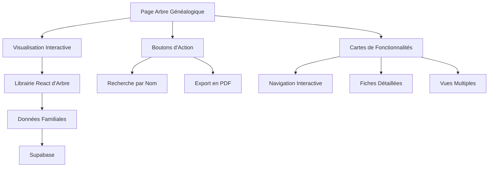
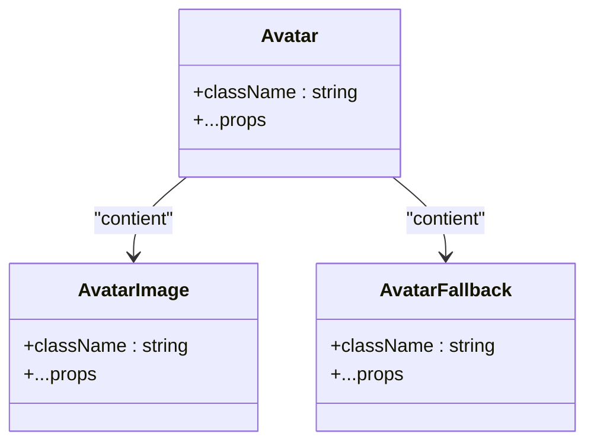
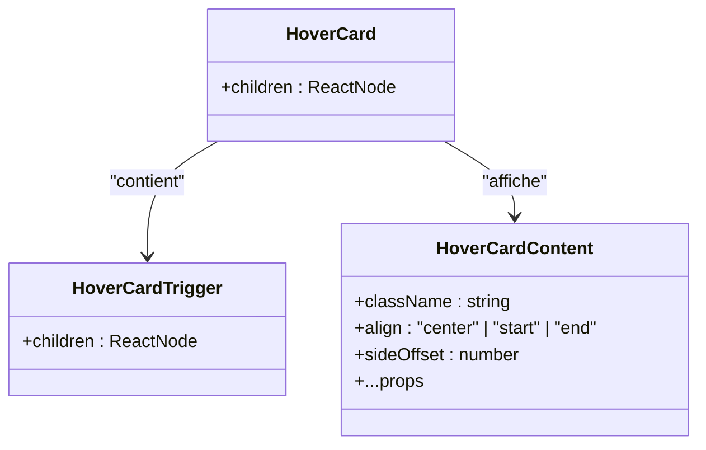
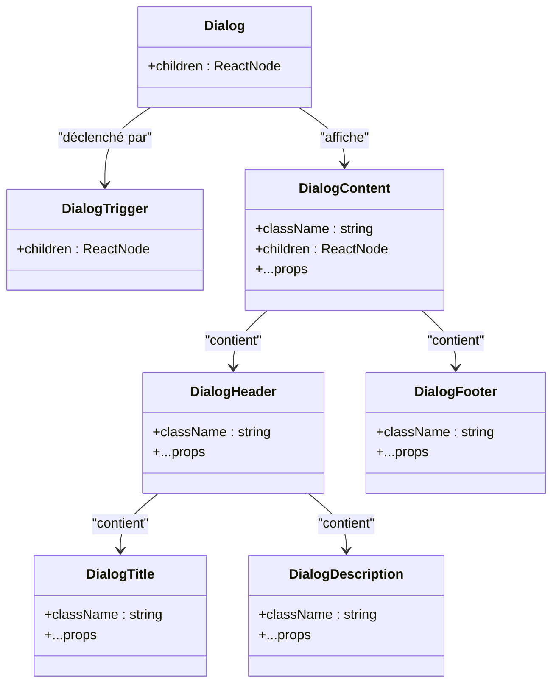
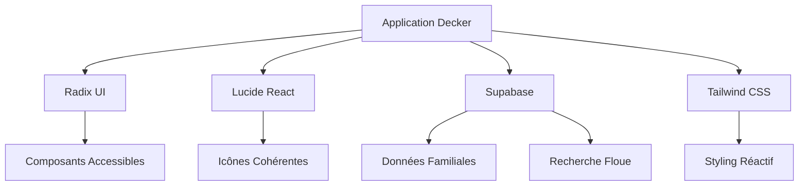

# Arbre Généalogique

<cite>
**Fichiers référencés dans ce document**  
- [app/genealogie/page.tsx](file://app/genealogie/page.tsx)
- [components/ui/avatar.tsx](file://components/ui/avatar.tsx)
- [components/ui/hover-card.tsx](file://components/ui/hover-card.tsx)
- [components/ui/button.tsx](file://components/ui/button.tsx)
- [components/ui/input.tsx](file://components/ui/input.tsx)
- [components/ui/dialog.tsx](file://components/ui/dialog.tsx)
- [components/ui/select.tsx](file://components/ui/select.tsx)
- [lib/utils.ts](file://lib/utils.ts)
- [package.json](file://package.json)
- [tailwind.config.ts](file://tailwind.config.ts)
- [supabase/migrations/20251114063120_create_api_functions.sql](file://supabase/migrations/20251114063120_create_api_functions.sql)
- [app/telechargements/page.tsx](file://app/telechargements/page.tsx)
- [PLAN.md](file://PLAN.md)
</cite>

## Table des matières
1. [Introduction](#introduction)
2. [Structure du projet](#structure-du-projet)
3. [Composants principaux](#composants-principaux)
4. [Architecture de visualisation](#architecture-de-visualisation)
5. [Analyse détaillée des composants](#analyse-détaillée-des-composants)
6. [Analyse des dépendances](#analyse-des-dépendances)
7. [Considérations de performance](#considérations-de-performance)
8. [Guide de dépannage](#guide-de-dépannage)
9. [Conclusion](#conclusion)

## Introduction

La section Arbre Généalogique du projet Decker vise à offrir une expérience interactive et immersive pour explorer les liens familiaux à travers plusieurs générations. Bien que cette fonctionnalité soit actuellement en cours de développement, son architecture est soigneusement planifiée pour intégrer des fonctionnalités avancées telles que la navigation interactive, la recherche par nom, l'export en PDF et des vues multiples (ascendance, descendance, vue complète). Cette documentation détaille l'implémentation prévue, les composants utilisés, la modélisation des données et les considérations techniques clés.

**Section sources**
- [app/genealogie/page.tsx](file://app/genealogie/page.tsx#L1-L107)
- [PLAN.md](file://PLAN.md#L239-L247)

## Structure du projet

La structure du projet suit une architecture basée sur les fonctionnalités, avec un répertoire `app` qui suit les conventions de Next.js 13+ pour le routage basé sur le système de fichiers. Le module `genealogie` est organisé dans `app/genealogie/page.tsx`, ce qui permet une intégration fluide avec le framework. Les composants d'interface utilisateur réutilisables sont centralisés dans `components/ui`, suivant les meilleures pratiques de shadcn/ui, ce qui garantit une cohérence visuelle et fonctionnelle à travers l'application.

Le projet utilise Tailwind CSS pour le style, configuré avec des couleurs personnalisées reflétant l'identité familiale (Gamboge, Tangerine, Cinnabar, Oxford, Cambridge), et intègre Supabase pour la gestion des données. La configuration de Tailwind inclut des animations personnalisées, des breakpoints responsives étendus et une typographie soigneusement choisie pour une expérience utilisateur optimale.

**Section sources**
- [app/genealogie/page.tsx](file://app/genealogie/page.tsx#L1-L107)
- [tailwind.config.ts](file://tailwind.config.ts#L1-L323)
- [package.json](file://package.json#L1-L56)

## Composants principaux

Les composants principaux de l'arbre généalogique sont conçus pour offrir une interface utilisateur riche et interactive. Le composant `Avatar` est prévu pour afficher les photos des membres familiaux au sein des nœuds de l'arbre, tandis que `HoverCard` permettra d'afficher des informations contextuelles lors du survol des nœuds. Le composant `Dialog` sera utilisé pour afficher les fiches détaillées des membres, et `Select` permettra de choisir entre différentes vues (ascendance, descendance, complète).

Les boutons d'action tels que la recherche et le téléchargement en PDF sont déjà présents dans l'interface, bien qu'ils soient actuellement désactivés, indiquant que leur implémentation est en cours. L'utilisation de `Input` permettra de gérer la recherche par nom via une commande interactive.

**Section sources**
- [components/ui/avatar.tsx](file://components/ui/avatar.tsx#L1-L51)
- [components/ui/hover-card.tsx](file://components/ui/hover-card.tsx#L1-L30)
- [components/ui/dialog.tsx](file://components/ui/dialog.tsx#L1-L123)
- [components/ui/select.tsx](file://components/ui/select.tsx#L1-L33)
- [components/ui/input.tsx](file://components/ui/input.tsx#L1-L22)
- [components/ui/button.tsx](file://components/ui/button.tsx#L1-L58)

## Architecture de visualisation

L'architecture de visualisation de l'arbre généalogique repose sur une intégration future avec une librairie React dédiée à la visualisation de graphes ou d'arbres hiérarchiques. Bien que le choix spécifique de la librairie ne soit pas encore implémenté, le plan de projet mentionne explicitement l'intégration d'une telle librairie pour permettre une navigation interactive avec zoom et panoramique.

L'interface utilisateur est conçue pour afficher une zone centrale en format vidéo (aspect ratio) qui accueillera la visualisation interactive. Cette zone sera entourée de boutons d'action pour la recherche et l'export, ainsi que de cartes décrivant les fonctionnalités clés : navigation interactive, fiches détaillées et vues multiples.

**Diagram sources**
- [app/genealogie/page.tsx](file://app/genealogie/page.tsx#L1-L107)
- [PLAN.md](file://PLAN.md#L239-L247)

**Section sources**
- [app/genealogie/page.tsx](file://app/genealogie/page.tsx#L1-L107)

## Analyse détaillée des composants

### Analyse du composant Avatar

Le composant `Avatar` est un élément clé pour personnaliser la visualisation de l'arbre généalogique. Il permet d'afficher les photos des membres familiaux de manière circulaire et stylisée. Le composant est composé de trois parties : `Avatar` (conteneur racine), `AvatarImage` (image du membre) et `AvatarFallback` (texte alternatif si aucune image n'est disponible). Cette structure permet une grande flexibilité dans l'affichage des nœuds de l'arbre.

**Diagram sources**
- [components/ui/avatar.tsx](file://components/ui/avatar.tsx#L1-L51)

**Section sources**
- [components/ui/avatar.tsx](file://components/ui/avatar.tsx#L1-L51)

### Analyse du composant HoverCard

Le composant `HoverCard` est conçu pour fournir des informations contextuelles lors du survol des nœuds de l'arbre généalogique. Il se compose de trois parties : `HoverCard` (conteneur racine), `HoverCardTrigger` (élément déclencheur) et `HoverCardContent` (contenu affiché au survol). Ce composant sera essentiel pour afficher rapidement les liens de parenté, les dates clés ou d'autres informations sans avoir à cliquer sur le nœud.

**Diagram sources**
- [components/ui/hover-card.tsx](file://components/ui/hover-card.tsx#L1-L30)

**Section sources**
- [components/ui/hover-card.tsx](file://components/ui/hover-card.tsx#L1-L30)

### Analyse du composant Dialog

Le composant `Dialog` sera utilisé pour afficher les fiches détaillées des membres familiaux lorsqu'un utilisateur clique sur un nœud de l'arbre. Il fournit une interface modale complète avec un en-tête, un corps, un pied de page et un bouton de fermeture. Ce composant permettra d'afficher des biographies complètes, des photos, des documents et d'autres informations enrichies.

**Diagram sources**
- [components/ui/dialog.tsx](file://components/ui/dialog.tsx#L1-L123)

**Section sources**
- [components/ui/dialog.tsx](file://components/ui/dialog.tsx#L1-L123)

## Analyse des dépendances

L'analyse des dépendances révèle que le projet s'appuie sur un écosystème moderne et bien structuré. Les composants d'interface utilisateur sont basés sur Radix UI, garantissant une accessibilité native et une qualité de code élevée. La bibliothèque Lucide React fournit des icônes cohérentes, notamment `Network` pour représenter l'arbre généalogique, `Search` pour la recherche et `Download` pour l'export.

Le projet utilise Supabase comme backend, ce qui est confirmé par la présence de fonctions de recherche SQL dans les migrations. La fonction de recherche floue (`similarity`) permettra de trouver des membres familiaux même avec des fautes de frappe ou des correspondances partielles, ce qui est crucial pour une expérience utilisateur fluide.

**Diagram sources**
- [package.json](file://package.json#L1-L56)
- [supabase/migrations/20251114063120_create_api_functions.sql](file://supabase/migrations/20251114063120_create_api_functions.sql#L372-L424)

**Section sources**
- [package.json](file://package.json#L1-L56)
- [supabase/migrations/20251114063120_create_api_functions.sql](file://supabase/migrations/20251114063120_create_api_functions.sql#L372-L424)

## Considérations de performance

La performance est un aspect critique pour la visualisation d'arbres généalogiques, surtout lorsqu'ils contiennent de nombreuses générations et membres. Le projet prévoit des solutions pour gérer les grands volumes de données, notamment par le chargement progressif (lazy loading) des nœuds. Cela signifie que seules les parties de l'arbre actuellement visibles ou proches du point de vue de l'utilisateur seront chargées, réduisant ainsi la charge mémoire et améliorant la réactivité.

La recherche par nom est implémentée avec une fonction de similarité PostgreSQL, ce qui permet des recherches rapides et intelligentes même dans de grandes bases de données. L'export en PDF sera généré côté serveur pour éviter de surcharger le navigateur, et la version PDF sera disponible dans la section téléchargements, comme indiqué dans l'interface.

**Section sources**
- [app/genealogie/page.tsx](file://app/genealogie/page.tsx#L1-L107)
- [app/telechargements/page.tsx](file://app/telechargements/page.tsx#L37-L81)
- [supabase/migrations/20251114063120_create_api_functions.sql](file://supabase/migrations/20251114063120_create_api_functions.sql#L372-L424)

## Guide de dépannage

Étant donné que la fonctionnalité d'arbre généalogique est en cours de développement, plusieurs éléments sont actuellement désactivés. Les boutons de recherche et de téléchargement sont rendus avec le prop `disabled`, indiquant qu'ils ne sont pas encore fonctionnels. Pour diagnostiquer les problèmes futurs, il sera important de vérifier :

1. La connexion à Supabase et la disponibilité des données familiales
2. Le chargement correct de la librairie de visualisation d'arbre
3. La configuration des chemins d'accès aux photos des membres
4. Les performances de la recherche floue avec de grands ensembles de données
5. La génération du PDF côté serveur

Les messages d'information dans l'interface indiquent clairement que la fonctionnalité est en cours de développement, ce qui gère les attentes des utilisateurs.

**Section sources**
- [app/genealogie/page.tsx](file://app/genealogie/page.tsx#L1-L107)

## Conclusion

L'arbre généalogique du projet Decker est conçu pour être une fonctionnalité centrale et immersive, permettant d'explorer l'histoire familiale de manière interactive et visuellement attrayante. Bien qu'il soit actuellement en cours de développement, son architecture est bien définie, avec une utilisation de composants modernes, une intégration avec Supabase pour les données, et des plans clairs pour des fonctionnalités avancées comme la recherche, l'export et les vues multiples.

L'accent mis sur l'accessibilité, la performance et l'expérience utilisateur promet une solution robuste et agréable à utiliser. Une fois complété, cet arbre généalogique deviendra un outil précieux pour connecter les membres de la famille à leur héritage et à leurs racines.