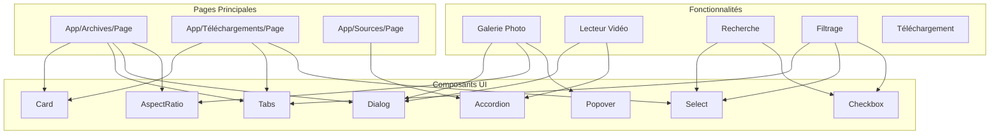
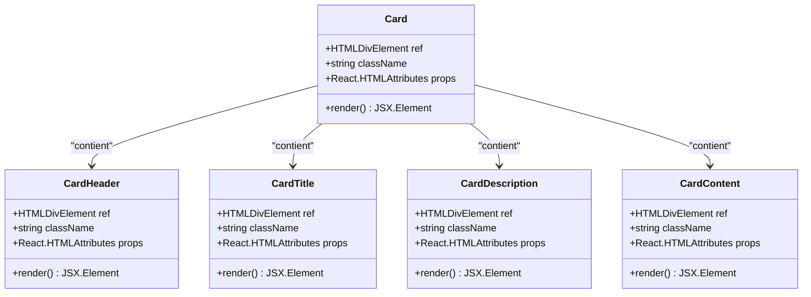
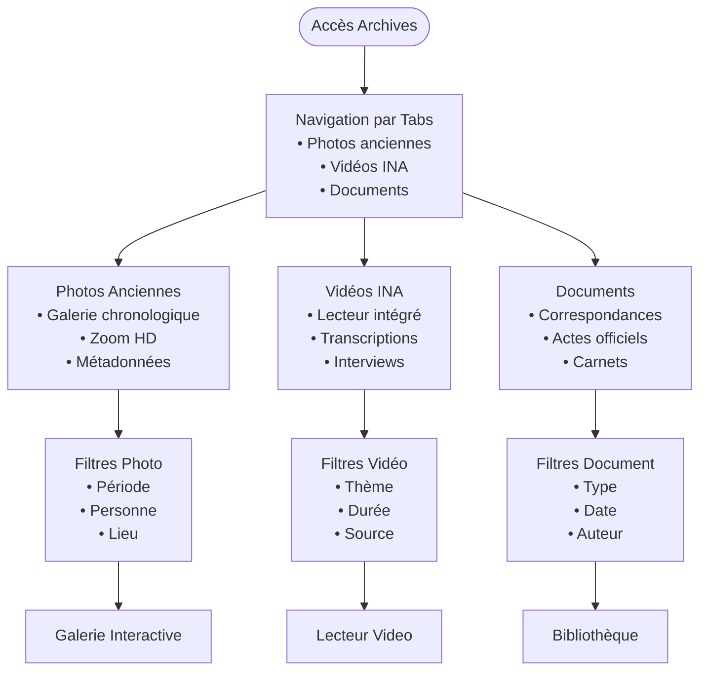
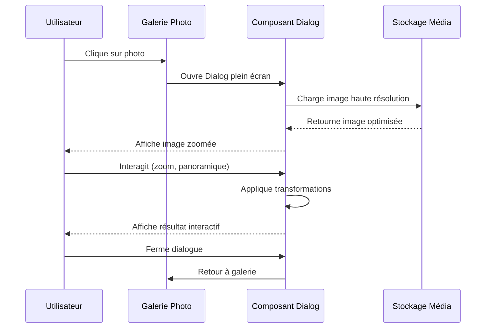
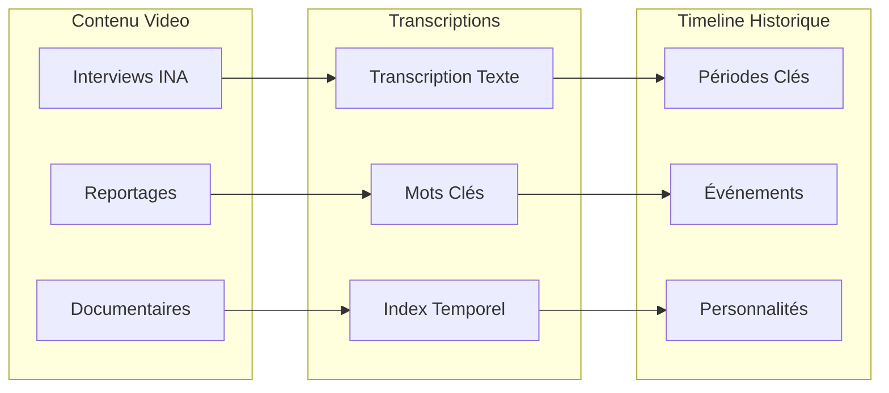
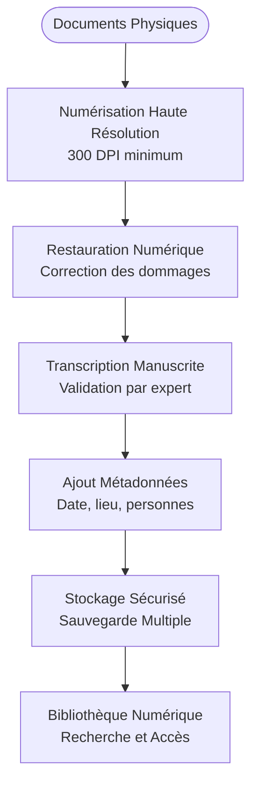
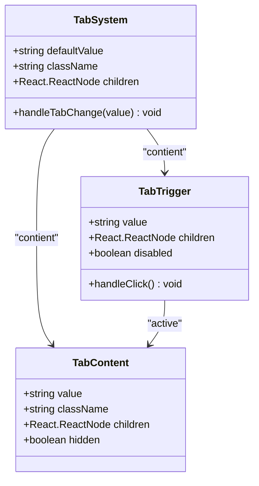
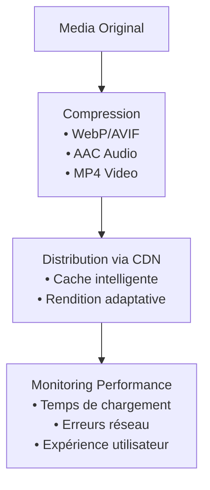
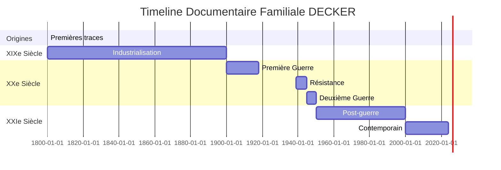

# Archives et Documents

<cite>
**Fichiers Référencés dans ce Document**
- [app/archives/page.tsx](file://app/archives/page.tsx)
- [app/telechargements/page.tsx](file://app/telechargements/page.tsx)
- [app/sources/page.tsx](file://app/sources/page.tsx)
- [components/ui/card.tsx](file://components/ui/card.tsx)
- [components/ui/tabs.tsx](file://components/ui/tabs.tsx)
- [components/ui/select.tsx](file://components/ui/select.tsx)
- [components/ui/checkbox.tsx](file://components/ui/checkbox.tsx)
- [components/ui/dialog.tsx](file://components/ui/dialog.tsx)
- [components/ui/aspect-ratio.tsx](file://components/ui/aspect-ratio.tsx)
- [components/ui/popover.tsx](file://components/ui/popover.tsx)
- [components/ui/accordion.tsx](file://components/ui/accordion.tsx)
- [PLAN.md](file://PLAN.md)
</cite>

## Table des Matières
1. [Introduction](#introduction)
2. [Structure du Projet](#structure-du-projet)
3. [Composants Shadcn/UI Utilisés](#composants-shadcnui-utilisés)
4. [Système de Navigation et Organisation](#système-de-navigation-et-organisation)
5. [Photographies Anciennes](#photographies-anciennes)
6. [Vidéos et Documents INA](#vidéos-et-documents-ina)
7. [Documents Familiaux](#documents-familiaux)
8. [Système de Filtrage et Recherche](#système-de-filtrage-et-recherche)
9. [Gestion du Stockage Média](#gestion-du-stockage-média)
10. [Considérations de Performance](#considérations-de-performance)
11. [Timeline Documentaire](#timeline-documentaire)
12. [Conclusion](#conclusion)

## Introduction

Le système d'Archives et Documents de Decker constitue l'un des piliers centraux du site web familial, offrant un accès structuré et interactif aux collections photographiques, vidéo, et documentaires de la famille DECKER. Ce système implémente une architecture moderne basée sur Next.js et utilise l'écosystème shadcn/ui pour fournir une expérience utilisateur intuitive et performante.

Le projet organise les archives en quatre grandes catégories principales : les Photographies anciennes avec galerie chronologique et fonctionnalité de zoom HD, les Vidéos et Documents INA avec intégration du lecteur vidéo INA et transcriptions, les Documents familiaux comprenant les correspondances et actes officiels, et la Timeline documentaire synchronisée avec l'histoire familiale.

## Structure du Projet

Le système d'archives suit une architecture modulaire organisée autour de plusieurs pages spécialisées et de composants UI réutilisables.

**Sources du Diagramme**
- [app/archives/page.tsx](file://app/archives/page.tsx#L1-L123)
- [app/telechargements/page.tsx](file://app/telechargements/page.tsx#L1-L191)
- [components/ui/card.tsx](file://components/ui/card.tsx#L1-L76)

**Sources de Section**
- [app/archives/page.tsx](file://app/archives/page.tsx#L1-L123)
- [app/telechargements/page.tsx](file://app/telechargements/page.tsx#L1-L191)

## Composants Shadcn/UI Utilisés

Le système d'archives repose sur une collection de composants shadcn/ui sophistiqués qui fournissent une interface utilisateur cohérente et accessible.

### Composants Fondamentaux

#### Card - Carte de Contenu
Le composant Card constitue la brique de base pour l'affichage des sections d'archives. Il offre une structure hiérarchique claire avec en-tête, titre, description et contenu.

**Sources du Diagramme**
- [components/ui/card.tsx](file://components/ui/card.tsx#L1-L76)

#### AspectRatio - Maintien des Proportions
Le composant AspectRatio garantit que les images conservent leurs proportions naturelles tout en s'adaptant aux conteneurs responsifs.

#### Dialog - Boîtes de Dialogue Plein Écran
Le système Dialog permet l'ouverture de contenus riches en plein écran, essentiel pour le zoom haute résolution des photos et la lecture de vidéos.

### Composants de Navigation

#### Tabs - Sélection de Type de Contenu
Les Tabs organisent le contenu par catégories (Photos, Vidéos, Documents) avec une interface intuitive et accessible.

#### Select - Sélection Avancée
Le composant Select fournit des menus déroulants pour les filtres par période, personne, type de document et autres critères de tri.

#### Checkbox - Filtres Multiples
Les Checkbox permettent la sélection de multiples critères simultanément pour des recherches complexes.

### Composants d'Interaction

#### Popover - Informations Contextuelles
Le Popover affiche des informations supplémentaires sans quitter la page courante, idéal pour les métadonnées photo.

#### Accordion - Contenu Développable
L'Accordion permet d'organiser les transcriptions vidéo et les informations historiques de manière compacte.

**Sources de Section**
- [components/ui/card.tsx](file://components/ui/card.tsx#L1-L76)
- [components/ui/tabs.tsx](file://components/ui/tabs.tsx#L1-L56)
- [components/ui/select.tsx](file://components/ui/select.tsx#L1-L160)
- [components/ui/checkbox.tsx](file://components/ui/checkbox.tsx#L1-L31)
- [components/ui/dialog.tsx](file://components/ui/dialog.tsx#L1-L123)
- [components/ui/aspect-ratio.tsx](file://components/ui/aspect-ratio.tsx#L1-L8)
- [components/ui/popover.tsx](file://components/ui/popover.tsx#L1-L34)
- [components/ui/accordion.tsx](file://components/ui/accordion.tsx#L1-L58)

## Système de Navigation et Organisation

Le système de navigation des archives utilise une approche hiérarchique basée sur les Tabs pour organiser le contenu par type de média.

**Sources du Diagramme**
- [app/archives/page.tsx](file://app/archives/page.tsx#L25-L122)

### Structure des Tabs

Chaque section d'archives est encapsulée dans un système de Tabs qui permet de naviguer facilement entre les différents types de contenu :

- **Photos anciennes** : Galerie chronologique avec fonctionnalités de zoom haute résolution
- **Vidéos INA** : Intégration du lecteur vidéo INA avec transcriptions
- **Documents** : Bibliothèque de correspondances et actes officiels

**Sources de Section**
- [app/archives/page.tsx](file://app/archives/page.tsx#L25-L122)

## Photographies Anciennes

La section Photographies anciennes représente l'un des éléments les plus riches du système d'archives, offrant une galerie interactive de photos familiales numérisées et restaurées.

### Fonctionnalités Principales

#### Galerie Chronologique
La galerie organise les photos par période historique, permettant une exploration narrative de l'histoire familiale. Chaque photo est accompagnée de métadonnées précises incluant la date, le lieu et les personnes identifiables.

#### Fonctionnalité de Zoom HD
L'intégration du composant Dialog permet l'ouverture des photos en plein écran avec zoom haute résolution, permettant de découvrir les détails fins des photographies anciennes.

#### Comparaison Avant/Après Restauration
Une fonctionnalité unique permet de comparer les versions restaurées des photos avec leurs originaux, illustrant le travail de numérisation et de restauration effectué.

### Architecture Technique

**Sources du Diagramme**
- [components/ui/dialog.tsx](file://components/ui/dialog.tsx#L32-L54)
- [components/ui/aspect-ratio.tsx](file://components/ui/aspect-ratio.tsx#L1-L8)

### Métadonnées et Informations

Chaque photo est enrichie avec des informations contextuelles :
- **Dates** : Précision temporelle avec validation historique
- **Lieux** : Identification géographique avec références historiques
- **Personnes** : Reconnaissance faciale et identification des individus
- **Contexte** : Description de l'événement ou du moment photographié

**Sources de Section**
- [app/archives/page.tsx](file://app/archives/page.tsx#L41-L60)

## Vidéos et Documents INA

La section Vidéos INA constitue un puits de connaissances historiques crucial, regroupant les archives audiovisuelles de l'INA (Institut National de l'Audiovisuel) et d'autres sources pertinentes.

### Intégration du Lecteur Video INA

#### Architecture du Lecteur
Le système intègre un lecteur vidéo spécialisé conçu pour la lecture de contenus provenant des archives INA. L'interface utilise le composant Dialog pour offrir une expérience de lecture immersive en plein écran.

#### Transcriptions et Accessibilité
Chaque vidéo est accompagnée de transcriptions détaillées accessibles via le composant Accordion, améliorant l'accessibilité et facilitant la recherche textuelle.

### Types de Contenu Vidéo

#### Interviews et Reportages
- **Colonel Rémy** : Interviews exclusifs et reportages historiques
- **Guerres Mondiales** : Documents sur la Résistance et l'histoire militaire
- **Événements Sociaux** : Reportages sur les transformations sociales

#### Documentation Historique
- **Archives Publiques** : Contenus documentaires de qualité
- **Collections Spécialisées** : Matériaux historiques spécifiques

### Synchronisation Historique

**Sources du Diagramme**
- [app/archives/page.tsx](file://app/archives/page.tsx#L63-L84)

**Sources de Section**
- [app/archives/page.tsx](file://app/archives/page.tsx#L63-L84)

## Documents Familiaux

La section Documents Familiaux constitue une bibliothèque numérique riche regroupant les correspondances, actes officiels, et documents manuscrits familiaux.

### Types de Documents

#### Correspondances Familiales
- **Lettres** : Correspondance entre membres de la famille
- **Notes Manuscrites** : Carnets de famille et mémoires personnelles
- **Mémos** : Documents administratifs et personnels

#### Actes Officiels
- **Actes d'État Civil** : Naissances, mariages, décès
- **Documents Notariés** : Contrats, testaments, actes fonciers
- **Certificats** : Diplômes, attestations, pièces justificatives

### Processus de Numérisation

Le système suit une méthodologie de numérisation professionnelle éprouvée :

**Sources du Diagramme**
- [app/sources/page.tsx](file://app/sources/page.tsx#L81-L95)

### Interface de Lecture

Chaque document est accessible via une interface Dialog qui permet :
- **Lecture Complète** : Affichage du document original
- **Transcription** : Version textuelle pour la recherche
- **Métadonnées** : Informations contextuelles
- **Téléchargement** : Options de téléchargement PDF

**Sources de Section**
- [app/archives/page.tsx](file://app/archives/page.tsx#L87-L106)
- [app/sources/page.tsx](file://app/sources/page.tsx#L81-L95)

## Système de Filtrage et Recherche

Le système de filtrage et recherche constitue un élément central permettant d'explorer efficacement les vastes collections d'archives.

### Architecture des Filtres

#### Système de Tabs Principal
Les Tabs organisent initialement le contenu par type de média, puis permettent des filtres secondaires :

**Sources du Diagramme**
- [components/ui/tabs.tsx](file://components/ui/tabs.tsx#L1-L56)

#### Filtres Avancés avec Select et Checkbox

##### Filtres Select
- **Période** : Sélection par décennie ou événement majeur
- **Personne** : Filtrage par membre de la famille identifié
- **Type de Document** : Classification par format ou contenu

##### Filtres Checkbox
- **Thème** : Catégorisation par sujet ou thème
- **Localisation** : Filtrage par lieu géographique
- **Format** : Séparation par type de média

### Système de Recherche

#### Recherche Textuelle
Bien que le code actuel ne présente pas encore un composant Command complet, la roadmap prévoit l'implémentation d'une barre de recherche avancée permettant :
- **Recherche Full-text** : Recherche dans les transcriptions
- **Recherche par Métadonnées** : Filtrage par tags et catégories
- **Suggestions Intelligentes** : Autocomplétion et recommandations

#### Algorithme de Filtrage
Le système de filtrage utilise un algorithme de matching progressif qui :
1. Applique les filtres principaux (Tabs)
2. Affine avec les filtres secondaires (Select/Checkbox)
3. Optimise les performances avec du lazy loading

**Sources de Section**
- [components/ui/tabs.tsx](file://components/ui/tabs.tsx#L1-L56)
- [components/ui/select.tsx](file://components/ui/select.tsx#L1-L160)
- [components/ui/checkbox.tsx](file://components/ui/checkbox.tsx#L1-L31)

## Gestion du Stockage Média

Le système d'archives implémente une architecture de stockage robuste et scalable conçue pour gérer efficacement les médias volumineux.

### Infrastructure de Stockage

#### Stratégie de Stockage Multi-Bucket
Le système utilise une organisation par buckets spécialisés :
- **Bucket Photos** : Images familiales numérisées
- **Bucket Videos** : Contenus vidéo et audio
- **Bucket Archives** : Documents numérisés
- **Bucket Audio** : Enregistrements sonores

#### Optimisation des Formats
- **Images** : Formats WebP et AVIF pour la compression
- **Vidéos** : Streaming adaptatif avec codecs modernes
- **Audio** : Compression AAC avec qualité optimale

### Sécurité et Accès

#### Contrôle d'Accès Basé sur Rôles
Le système implémente un contrôle d'accès granulaire :
- **Accès Public** : Contenu librement consultable
- **Accès Familial** : Documents sensibles restreints
- **Accès Administrateur** : Gestion des médias

#### Politiques de Stockage
Les politiques de stockage définissent :
- **Durée de Rétention** : Conservation des documents
- **Sauvegardes** : Copies de sécurité automatisées
- **Compression** : Optimisation des espaces disque

**Sources de Section**
- [PLAN.md](file://PLAN.md#L126-L152)

## Considérations de Performance

Le système d'archives a été conçu avec des considérations de performance avancées pour gérer efficacement les médias lourds et fournir une expérience utilisateur optimale.

### Optimisations de Chargement

#### Lazy Loading Progressif
- **Images** : Chargement progressif selon le viewport
- **Vidéos** : Streaming adaptatif selon la bande passante
- **Documents** : Chargement à la demande

#### Optimisation des Médias

#### Cache Intelligent
Le système implémente plusieurs niveaux de cache :
- **Cache Navigateur** : Assets statiques
- **Cache CDN** : Médias optimisés
- **Cache Application** : Métadonnées et index

### Gestion des Médias Lourds

#### Stratégies de Compression
- **Progressive JPEG** : Chargement graduel des images
- **Streaming Video** : Adaptation de qualité en temps réel
- **Lazy Loading** : Chargement à la demande

#### Optimisation des Requêtes
- **Pagination** : Chargement par lots de contenus
- **Indexation** : Recherche rapide dans les métadonnées
- **Préchargement** : Chargement anticipé des contenus proches

**Sources de Section**
- [PLAN.md](file://PLAN.md#L318-L331)

## Timeline Documentaire

La Timeline Documentaire constitue un élément innovant qui synchronise l'ensemble des archives avec l'histoire familiale chronologique.

### Architecture de la Timeline

#### Vue Chronologique Globale
La timeline offre une vue d'ensemble de tous les documents archivés, organisés par période historique :

#### Synchronisation avec l'Histoire Familiale
La timeline se synchronise avec la page d'Histoire Familiale pour :
- **Affichage Cohérent** : Même périodes et événements
- **Liens Directs** : Navigation entre contenu documentaire et historique
- **Métadonnées Communes** : Dates et contextes partagés

### Fonctionnalités Interactives

#### Navigation par Période
- **Zoom** : Agrandissement des périodes spécifiques
- **Filtrage** : Isolation de segments temporels
- **Exploration** : Navigation fluide par glissement

#### Intégration des Archives
Chaque point de la timeline est connecté aux archives correspondantes :
- **Photos Associées** : Images d'époque
- **Documents Relatifs** : Actes et correspondances
- **Vidéos Pertinentes** : Interviews et reportages

**Sources de Section**
- [app/histoire/page.tsx](file://app/histoire/page.tsx#L40-L101)
- [PLAN.md](file://PLAN.md#L234-L247)

## Conclusion

Le système d'Archives et Documents de Decker représente une solution complète et sophistiquée pour la gestion et l'exploitation des collections familiales numériques. Son architecture modulaire, basée sur Next.js et shadcn/ui, offre une expérience utilisateur optimale tout en maintenant une structure technique robuste.

### Points Forts du Système

1. **Organisation Intuitive** : Navigation par Tabs claire et logique
2. **Interactivité Riche** : Zoom HD, lecteurs vidéo intégrés, transcriptions
3. **Accessibilité** : Composants UI accessibles et métadonnées détaillées
4. **Performance** : Optimisations de chargement et cache intelligent
5. **Extensibilité** : Architecture modulaire pour futurs développements

### Évolutions Futures

Le projet prévoit plusieurs améliorations :
- **Système de Recherche Avancée** avec moteur de recherche full-text
- **Interface de Contribution Familiale** pour l'ajout de nouveaux documents
- **Export Groupé** pour la distribution de collections complètes
- **Intelligence Artificielle** pour la reconnaissance faciale et la classification automatique

Cette infrastructure solide constitue la fondation pour préserver et partager l'héritage familial de manière durable et accessible à toutes les générations.