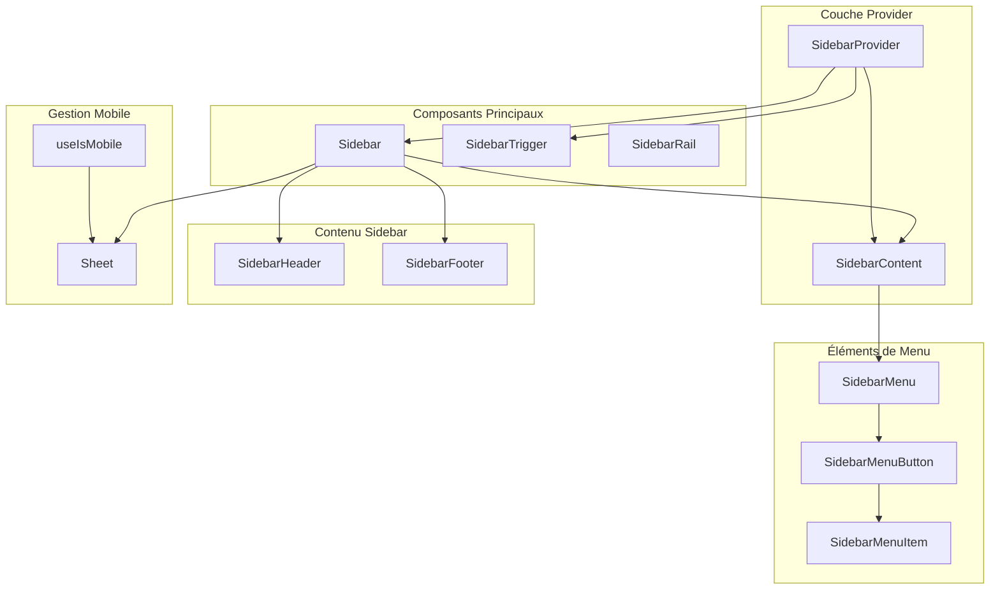
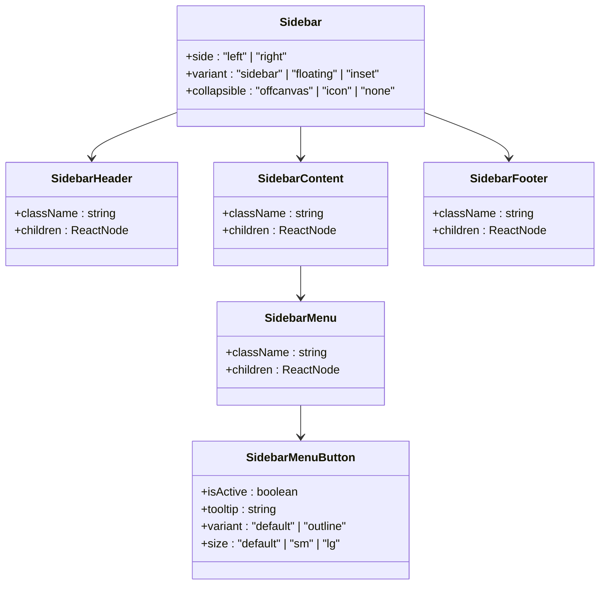
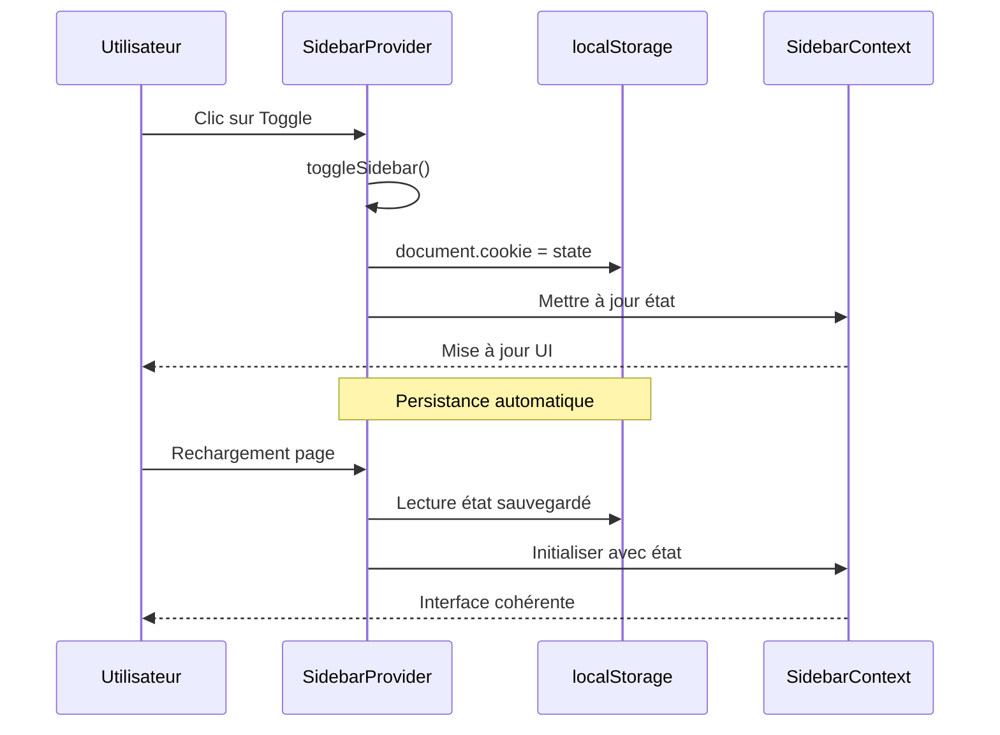
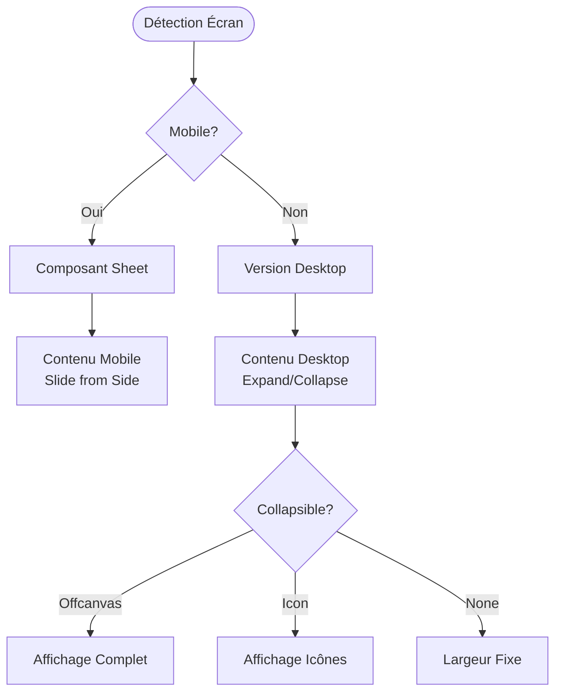
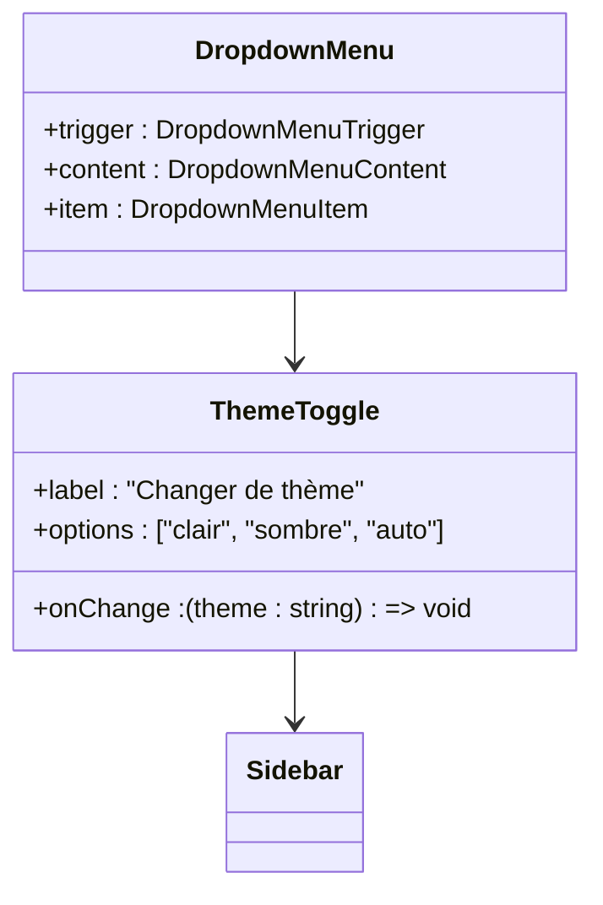

# Barre de Navigation Latérale

<cite>
**Fichiers Référencés dans ce Document**
- [components/ui/sidebar.tsx](file://components/ui/sidebar.tsx)
- [hooks/use-mobile.tsx](file://hooks/use-mobile.tsx)
- [components/ui/dropdown-menu.tsx](file://components/ui/dropdown-menu.tsx)
- [components/ui/sheet.tsx](file://components/ui/sheet.tsx)
- [app/globals.css](file://app/globals.css)
- [lib/utils.ts](file://lib/utils.ts)
- [app/layout.tsx](file://app/layout.tsx)
</cite>

## Table des Matières
1. [Introduction](#introduction)
2. [Architecture Générale](#architecture-générale)
3. [Composant SidebarProvider](#composant-sidebarprovider)
4. [Hook useSidebar](#hook-usesidebar)
5. [Structure des Éléments](#structure-des-éléments)
6. [Gestion de l'État Global](#gestion-de-létat-global)
7. [Responsive Design et Mobile](#responsive-design-et-mobile)
8. [Intégration avec les Thèmes](#intégration-avec-les-thèmes)
9. [Persistance des États](#persistance-des-états)
10. [Accessibilité](#accessibilité)
11. [Problèmes Courants](#problèmes-courants)
12. [Exemples d'Utilisation](#exemples-dutilisation)

## Introduction

La barre de navigation latérale de Decker est une implémentation sophistiquée basée sur le système de composants shadcn/ui, offrant une expérience utilisateur fluide à travers différents appareils et écrans. Cette documentation explore en détail l'architecture, les fonctionnalités et les bonnes pratiques d'utilisation du composant Sidebar.

Le système de navigation latérale intègre plusieurs technologies avancées :
- **React Context** pour la gestion d'état global
- **localStorage** pour la persistance des préférences utilisateur
- **CSS Variables** pour les thèmes dynamiques
- **Tailwind CSS** pour le design responsive
- **Lucide React** pour les icônes vectorielles

## Architecture Générale

L'architecture de la barre de navigation latérale suit un pattern de conception modulaire avec séparation claire des responsabilités :



**Sources du Diagramme**
- [components/ui/sidebar.tsx](file://components/ui/sidebar.tsx#L55-L162)
- [hooks/use-mobile.tsx](file://hooks/use-mobile.tsx#L5-L19)

## Composant SidebarProvider

Le `SidebarProvider` constitue le cœur de la gestion d'état global pour la barre de navigation. Il maintient l'état ouvert/fermé et gère la logique de basculement entre les modes mobile et desktop.

### Fonctionnalités Clés

- **Gestion d'état local et externe** : Support des props contrôlées (`open`, `onOpenChange`) et d'état interne
- **Persistance automatique** : Sauvegarde automatique dans les cookies
- **Raccourcis clavier** : Touche `Ctrl+B` (ou `Cmd+B` sur Mac) pour basculer la sidebar
- **Détectection responsive** : Adaptation automatique aux appareils mobiles

### Configuration Avancée

Le provider accepte plusieurs paramètres de configuration :

| Propriété | Type | Valeur par défaut | Description |
|-----------|------|------------------|-------------|
| `defaultOpen` | `boolean` | `true` | État initial de la sidebar |
| `open` | `boolean` | `undefined` | Contrôle externe de l'état |
| `onOpenChange` | `(open: boolean) => void` | `undefined` | Callback de changement d'état |

**Sources de Section**
- [components/ui/sidebar.tsx](file://components/ui/sidebar.tsx#L55-L162)

## Hook useSidebar

Le hook `useSidebar` fournit un accès simplifié aux fonctionnalités de la sidebar depuis n'importe quel composant descendant du `SidebarProvider`.

### Interface du Contexte

```typescript
type SidebarContextProps = {
  state: "expanded" | "collapsed"
  open: boolean
  setOpen: (open: boolean) => void
  openMobile: boolean
  setOpenMobile: (open: boolean) => void
  isMobile: boolean
  toggleSidebar: () => void
}
```

### Utilisation Pratique

Le hook expose toutes les propriétés nécessaires pour contrôler et interroger l'état de la sidebar :

```typescript
// Exemple d'utilisation dans un composant
function NavigationControls() {
  const { 
    state, 
    open, 
    setOpen, 
    isMobile, 
    toggleSidebar 
  } = useSidebar()

  return (
    <div>
      <button onClick={toggleSidebar}>
        {state === "expanded" ? "Réduire" : "Étendre"}
      </button>
      
      {isMobile && (
        <button onClick={() => setOpenMobile(true)}>
          Ouvrir Sidebar Mobile
        </button>
      )}
    </div>
  )
}
```

**Sources de Section**
- [components/ui/sidebar.tsx](file://components/ui/sidebar.tsx#L35-L54)

## Structure des Éléments

La sidebar est organisée en plusieurs sections spécialisées, chacune ayant un rôle spécifique dans l'expérience utilisateur.

### SidebarHeader

Le `SidebarHeader` sert de conteneur pour les éléments d'en-tête de la sidebar, généralement incluant :
- Logo de l'application
- Titre principal
- Boutons d'action rapides
- Informations utilisateur

### SidebarContent

Le `SidebarContent` est la section principale où se trouvent :
- La navigation principale
- Les menus déroulants
- Les filtres et recherche
- Contenu dynamique

### SidebarFooter

Le `SidebarFooter` contient généralement :
- Liens vers la documentation
- Paramètres de l'application
- Informations légales
- Boutons de basculement de thème

### Hiérarchie des Composants



**Sources du Diagramme**
- [components/ui/sidebar.tsx](file://components/ui/sidebar.tsx#L363-L439)
- [components/ui/sidebar.tsx](file://components/ui/sidebar.tsx#L498-L603)

**Sources de Section**
- [components/ui/sidebar.tsx](file://components/ui/sidebar.tsx#L363-L439)

## Gestion de l'État Global

La gestion d'état de la sidebar repose sur un système sophistiqué utilisant React Context et des mécanismes de mise en cache intelligente.

### Cycle de Vie de l'État



**Sources du Diagramme**
- [components/ui/sidebar.tsx](file://components/ui/sidebar.tsx#L78-L96)

### Mécanisme de Persistance

Le système utilise les cookies pour persister l'état de la sidebar :

```javascript
// Configuration du cookie
const SIDEBAR_COOKIE_NAME = "sidebar_state"
const SIDEBAR_COOKIE_MAX_AGE = 60 * 60 * 24 * 7 // 7 jours

// Mise à jour automatique lors des changements
document.cookie = `${SIDEBAR_COOKIE_NAME}=${openState}; path=/; max-age=${SIDEBAR_COOKIE_MAX_AGE}`
```

**Sources de Section**
- [components/ui/sidebar.tsx](file://components/ui/sidebar.tsx#L28-L33)

## Responsive Design et Mobile

La sidebar s'adapte automatiquement aux différentes tailles d'écran grâce à un système de détection intelligente et à des composants adaptés.

### Détection Mobile

Le hook `useIsMobile` détecte automatiquement les appareils mobiles :

```typescript
const MOBILE_BREAKPOINT = 768
const isMobile = window.innerWidth < MOBILE_BREAKPOINT
```

### Comportement Desktop vs Mobile



**Sources du Diagramme**
- [components/ui/sidebar.tsx](file://components/ui/sidebar.tsx#L186-L223)
- [hooks/use-mobile.tsx](file://hooks/use-mobile.tsx#L5-L19)

### Composant Sheet pour Mobile

Le `Sheet` fournit une interface tactile optimisée pour les appareils mobiles :

- **Positionnement** : Slide depuis le côté gauche ou droit
- **Overlay** : Fond semi-transparent avec effet de flou
- **Bouton de fermeture** : Icône X avec accessibilité
- **Navigation au clavier** : Support complet des raccourcis

**Sources de Section**
- [components/ui/sheet.tsx](file://components/ui/sheet.tsx#L56-L74)
- [hooks/use-mobile.tsx](file://hooks/use-mobile.tsx#L5-L19)

## Intégration avec les Thèmes

La sidebar s'intègre parfaitement avec le système de thèmes de Decker grâce aux variables CSS personnalisées.

### Variables CSS du Design System

```css
:root {
  --sidebar-background: 0 0% 98%;
  --sidebar-foreground: 240 5.3% 26.1%;
  --sidebar-primary: 240 5.9% 10%;
  --sidebar-primary-foreground: 0 0% 98%;
  --sidebar-accent: 240 4.8% 95.9%;
  --sidebar-accent-foreground: 240 5.9% 10%;
  --sidebar-border: 220 13% 91%;
  --sidebar-ring: 217.2 91.2% 59.8%;
}

.dark {
  --sidebar-background: 240 5.9% 10%;
  --sidebar-foreground: 240 4.8% 95.9%;
  --sidebar-primary: 224.3 76.3% 48%;
  --sidebar-primary-foreground: 0 0% 100%;
  --sidebar-accent: 240 3.7% 15.9%;
  --sidebar-accent-foreground: 240 4.8% 95.9%;
  --sidebar-border: 240 3.7% 15.9%;
  --sidebar-ring: 217.2 91.2% 59.8%;
}
```

### Composant DropdownMenu pour Changer de Thème

Le système de thèmes utilise un `DropdownMenu` pour permettre aux utilisateurs de basculer entre les modes clair et sombre :



**Sources du Diagramme**
- [components/ui/dropdown-menu.tsx](file://components/ui/dropdown-menu.tsx#L1-L202)

**Sources de Section**
- [app/globals.css](file://app/globals.css#L13-L82)

## Persistance des États

La persistance des états est réalisée via plusieurs mécanismes complémentaires pour assurer une expérience utilisateur cohérente.

### Mécanismes de Persistance

1. **Cookies** : Stockage temporaire de l'état de la sidebar
2. **localStorage** : Persistance plus longue terme
3. **État React** : Gestion locale pour les sessions courtes

### Configuration des Cookies

```javascript
// Configuration optimale pour la persistance
const SIDEBAR_COOKIE_NAME = "sidebar_state"
const SIDEBAR_COOKIE_MAX_AGE = 60 * 60 * 24 * 7 // 7 jours

// Création du cookie avec expiration
document.cookie = `${SIDEBAR_COOKIE_NAME}=${openState}; path=/; max-age=${SIDEBAR_COOKIE_MAX_AGE}`
```

### Récupération de l'État Sauvegardé

```javascript
// Logique de récupération automatique
const savedState = document.cookie
  .split('; ')
  .find(row => row.startsWith('sidebar_state='))
  ?.split('=')[1]

const initialState = savedState === 'true'
```

**Sources de Section**
- [components/ui/sidebar.tsx](file://components/ui/sidebar.tsx#L28-L33)
- [components/ui/sidebar.tsx](file://components/ui/sidebar.tsx#L78-L96)

## Accessibilité

La sidebar implémente plusieurs fonctionnalités d'accessibilité pour garantir une expérience utilisateur inclusive.

### Navigation au Clavier

- **Raccourcis clavier** : `Ctrl+B` (ou `Cmd+B`) pour basculer la sidebar
- **Focus management** : Gestion automatique du focus lors de l'ouverture/fermeture
- **Tab navigation** : Navigation séquentielle dans les éléments interactifs

### Étiquettes Accessibles

```html
<!-- Bouton de basculement avec étiquette cachée -->
<button aria-label="Basculer la barre latérale">
  <span class="sr-only">Basculer la barre latérale</span>
</button>

<!-- Titre et description pour Sheet mobile -->
<h2 class="sr-only">Barre latérale</h2>
<p class="sr-only">Affiche la barre latérale mobile</p>
```

### États Focus et Visibilité

Le système gère intelligemment les états focus et la visibilité des éléments :

- **Focus trap** : Limitation du focus dans la sidebar mobile
- **Announcements** : Avis vocaux pour les changements d'état
- **Screen reader support** : Compatibilité complète avec les lecteurs d'écran

**Sources de Section**
- [components/ui/sidebar.tsx](file://components/ui/sidebar.tsx#L105-L119)
- [components/ui/sidebar.tsx](file://components/ui/sidebar.tsx#L215-L218)

## Problèmes Courants

Cette section couvre les problèmes fréquents rencontrés lors de l'utilisation de la sidebar et leurs solutions.

### Flash of Unstyled Content (FOUC)

Le FOUC peut se produire lors du rendu hydraté côté client, surtout avec la persistance des états.

#### Solution avec suppressHydrationWarning

```typescript
// Dans le layout principal
import dynamic from 'next/dynamic'

const SidebarWithNoSSR = dynamic(
  () => import('@/components/ui/sidebar').then(mod => mod.Sidebar),
  { 
    ssr: false,
    loading: () => <div>Loading...</div>
  }
)
```

#### Autres Solutions

1. **Initial state management** : Définir un état initial cohérent
2. **CSS transitions** : Utiliser des transitions CSS fluides
3. **Server-side rendering** : Prérendre l'état approprié côté serveur

### Problèmes de Performance

- **Mise en cache excessive** : Limiter la fréquence des mises à jour de cookies
- **Re-rendus inutiles** : Utiliser `React.memo` pour les composants coûteux
- **Bundle size** : Lazy loading des composants non critiques

### Accessibilité Incomplète

- **Manque de raccourcis clavier** : Implémenter des raccourcis personnalisés
- **Focus management** : Assurer la gestion correcte du focus
- **Screen reader support** : Vérifier la compatibilité avec les lecteurs d'écran

**Sources de Section**
- [components/ui/sidebar.tsx](file://components/ui/sidebar.tsx#L105-L119)

## Exemples d'Utilisation

Voici quelques exemples concrets d'utilisation de la sidebar dans différents scénarios.

### Configuration Basique

```typescript
// Layout principal avec sidebar
function DashboardLayout({ children }: { children: React.ReactNode }) {
  return (
    <SidebarProvider>
      <div className="flex h-screen">
        <Sidebar>
          <SidebarHeader>
            <h1 className="text-lg font-bold">Mon Application</h1>
          </SidebarHeader>
          
          <SidebarContent>
            <SidebarMenu>
              <SidebarMenuItem>
                <SidebarMenuButton isActive>
                  Accueil
                </SidebarMenuButton>
              </SidebarMenuItem>
              
              <SidebarMenuItem>
                <SidebarMenuButton>
                  Paramètres
                </SidebarMenuButton>
              </SidebarMenuItem>
            </SidebarMenu>
          </SidebarContent>
          
          <SidebarFooter>
            <DropdownMenu>
              <DropdownMenuTrigger asChild>
                <SidebarMenuButton>
                  <SettingsIcon />
                </SidebarMenuButton>
              </DropdownMenuTrigger>
              <DropdownMenuContent>
                <DropdownMenuItem>Profil</DropdownMenuItem>
                <DropdownMenuItem>Paramètres</DropdownMenuItem>
              </DropdownMenuContent>
            </DropdownMenu>
          </SidebarFooter>
        </Sidebar>
        
        <SidebarInset>
          {children}
        </SidebarInset>
      </div>
    </SidebarProvider>
  )
}
```

### Sidebar avec Navigation Avancée

```typescript
// Sidebar avec sous-menus et badges
function AdvancedSidebar() {
  const [activeRoute, setActiveRoute] = useState('/dashboard')
  
  return (
    <SidebarProvider defaultOpen={false}>
      <Sidebar>
        <SidebarHeader>
          <SidebarTrigger />
        </SidebarHeader>
        
        <SidebarContent>
          <SidebarMenu>
            {routes.map(route => (
              <SidebarMenuItem key={route.href}>
                <SidebarMenuButton
                  isActive={activeRoute === route.href}
                  tooltip={route.label}
                >
                  <route.icon />
                  <span>{route.label}</span>
                  {route.badge && (
                    <SidebarMenuBadge>{route.badge}</SidebarMenuBadge>
                  )}
                </SidebarMenuButton>
                
                {route.subRoutes && (
                  <SidebarMenuSub>
                    {route.subRoutes.map(subRoute => (
                      <SidebarMenuSubItem key={subRoute.href}>
                        <SidebarMenuSubButton
                          href={subRoute.href}
                          isActive={activeRoute === subRoute.href}
                        >
                          <subRoute.icon />
                          <span>{subRoute.label}</span>
                        </SidebarMenuSubButton>
                      </SidebarMenuSubItem>
                    ))}
                  </SidebarMenuSub>
                )}
              </SidebarMenuItem>
            ))}
          </SidebarMenu>
        </SidebarContent>
        
        <SidebarFooter>
          <ThemeToggle />
        </SidebarFooter>
      </Sidebar>
    </SidebarProvider>
  )
}
```

### Sidebar Mobile Optimisée

```typescript
// Configuration spéciale pour mobile
function MobileOptimizedSidebar() {
  return (
    <SidebarProvider>
      <div className="flex h-screen">
        {/* Sidebar mobile */}
        <Sheet>
          <SheetTrigger asChild>
            <Button variant="outline" size="icon" className="md:hidden">
              <MenuIcon />
            </Button>
          </SheetTrigger>
          
          <SheetContent side="left" className="w-[280px]">
            <Sidebar>
              <SidebarHeader>
                <SheetClose asChild>
                  <Button variant="ghost" className="w-full justify-start">
                    <ArrowLeftIcon />
                    Retour
                  </Button>
                </SheetClose>
              </SidebarHeader>
              
              <SidebarContent>
                {/* Contenu de navigation mobile */}
              </SidebarContent>
            </Sidebar>
          </SheetContent>
        </Sheet>
        
        {/* Sidebar desktop */}
        <Sidebar collapsible="icon" className="hidden md:flex">
          <SidebarHeader>
            <SidebarTrigger />
          </SidebarHeader>
          
          <SidebarContent>
            {/* Contenu de navigation desktop */}
          </SidebarContent>
        </Sidebar>
        
        <SidebarInset>
          {/* Contenu principal */}
        </SidebarInset>
      </div>
    </SidebarProvider>
  )
}
```

**Sources de Section**
- [components/ui/sidebar.tsx](file://components/ui/sidebar.tsx#L55-L162)
- [components/ui/sheet.tsx](file://components/ui/sheet.tsx#L56-L74)