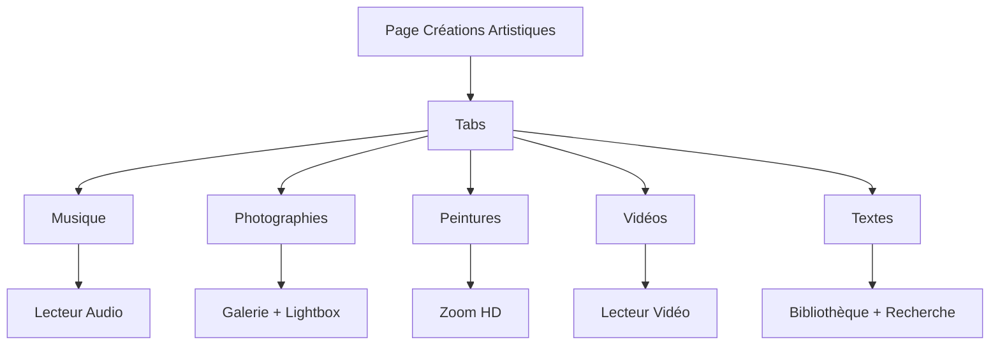
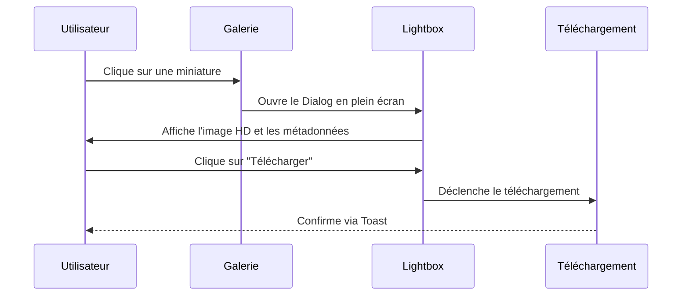

# Créations Artistiques

<cite>
**Fichiers référencés dans ce document**  
- [app/creations/page.tsx](file://app/creations/page.tsx)
- [components/ui/card.tsx](file://components/ui/card.tsx)
- [components/ui/tabs.tsx](file://components/ui/tabs.tsx)
- [components/ui/hover-card.tsx](file://components/ui/hover-card.tsx)
- [components/ui/scroll-area.tsx](file://components/ui/scroll-area.tsx)
- [components/ui/carousel.tsx](file://components/ui/carousel.tsx)
- [components/ui/dialog.tsx](file://components/ui/dialog.tsx)
- [components/ui/accordion.tsx](file://components/ui/accordion.tsx)
- [components/ui/badge.tsx](file://components/ui/badge.tsx)
- [components/ui/toast.tsx](file://components/ui/toast.tsx)
- [hooks/use-toast.ts](file://hooks/use-toast.ts)
- [components/ui/toaster.tsx](file://components/ui/toaster.tsx)
- [PLAN.md](file://PLAN.md)
</cite>

## Table des matières
1. [Introduction](#introduction)
2. [Structure de Navigation par Type](#structure-de-navigation-par-type)
3. [Section Musique](#section-musique)
4. [Section Photographies](#section-photographies)
5. [Section Peintures et Dessins](#section-peintures-et-dessins)
6. [Section Vidéos](#section-videos)
7. [Section Textes](#section-textes)
8. [Gestion des Métadonnées](#gestion-des-metadonnees)
9. [Considérations de Performance](#considerations-de-performance)
10. [Personnalisation de l'Expérience Utilisateur](#personnalisation-de-l-experience-utilisateur)

## Introduction

La section **Créations Artistiques** du projet Decker est conçue pour présenter de manière structurée et interactive les œuvres artistiques produites par les membres de la famille. Cette section regroupe cinq catégories principales : Musique, Photographies, Peintures, Vidéos et Textes. Chaque catégorie est accessible via un système de navigation par onglets (Tabs), permettant une exploration fluide et intuitive. Bien que le contenu soit actuellement en cours de développement, l'architecture prévue repose sur des composants modernes de l'interface utilisateur (UI) issus de la bibliothèque shadcn/ui, garantissant une expérience cohérente, accessible et réactive.

**Section sources**
- [app/creations/page.tsx](file://app/creations/page.tsx#L1-L24)

## Structure de Navigation par Type

La navigation principale de la section Créations Artistiques est implémentée à l'aide du composant **Tabs** de shadcn/ui. Ce système permet de basculer entre les différentes catégories artistiques sans rechargement de page, offrant une expérience utilisateur fluide. Chaque onglet est associé à une icône (provenant de Lucide React) et à une couleur thématique, renforçant l'identité visuelle de chaque catégorie.

Le composant Tabs est configuré avec une grille de cinq colonnes (`grid-cols-5`) pour un affichage optimal sur les écrans de bureau, tandis que les libellés sont masqués sur les petits écrans pour préserver l'espace. L'état par défaut est défini sur "musique", ce qui signifie que cette section s'affiche automatiquement lors du chargement de la page.

**Diagram sources**
- [app/creations/page.tsx](file://app/creations/page.tsx#L23-L56)

**Section sources**
- [app/creations/page.tsx](file://app/creations/page.tsx#L23-L56)
- [components/ui/tabs.tsx](file://components/ui/tabs.tsx)

## Section Musique

La section **Musique** est conçue pour offrir une expérience d'écoute immersive. Elle comprendra un lecteur audio complet intégré, permettant la lecture, la pause, la recherche dans la piste et le contrôle du volume. Le lecteur sera encapsulé dans un composant **Card**, offrant une présentation élégante et cohérente avec le design global.

La gestion de la playlist sera assurée par un composant **ScrollArea**, qui permettra de faire défiler une liste organisée de morceaux. Cette liste affichera les métadonnées essentielles de chaque piste : titre, année de création, durée, et crédits du beatmaker ou producteur.

Pour enrichir l'expérience, les paroles des chansons seront intégrées via un composant **Accordion**, permettant à l'utilisateur de les afficher ou de les masquer au besoin. Des anecdotes ou du contexte personnel sur la création d'une chanson seront accessibles via un **HoverCard**, qui s'affichera au survol du titre ou d'une icône dédiée.

Enfin, la fonction de téléchargement d'un morceau sera implémentée avec un bouton **Button**, dont l'action déclenchera une confirmation via un **Toast**, assurant que l'utilisateur est conscient de son action.

**Section sources**
- [PLAN.md](file://PLAN.md#L154-L175)
- [components/ui/card.tsx](file://components/ui/card.tsx)
- [components/ui/scroll-area.tsx](file://components/ui/scroll-area.tsx)
- [components/ui/accordion.tsx](file://components/ui/accordion.tsx)
- [components/ui/hover-card.tsx](file://components/ui/hover-card.tsx)
- [components/ui/button.tsx](file://components/ui/button.tsx)
- [components/ui/toast.tsx](file://components/ui/toast.tsx)

## Section Photographies

La section **Photographies** sera construite autour d'une galerie responsive, utilisant les composants **Card** et **AspectRatio** pour garantir que les images s'affichent correctement sur tous les appareils, sans déformation. Les photographies seront organisées par séries thématiques, chacune accessible via un sous-système d'onglets (Tabs).

Pour les projets photographiques plus complexes, un composant **Carousel** permettra de naviguer entre les images d'une série de manière fluide, avec des flèches de navigation et des indicateurs de position.

Le composant **Dialog** sera utilisé pour implémenter un **lightbox** en plein écran. Lorsqu'un utilisateur clique sur une miniature, une version haute résolution de l'image s'ouvrira dans un Dialog, offrant une vue détaillée. Ce Dialog affichera également les métadonnées de la photo (date, lieu, contexte) et permettra le téléchargement de la version haute résolution.

**Diagram sources**
- [PLAN.md](file://PLAN.md#L174-L182)
- [components/ui/carousel.tsx](file://components/ui/carousel.tsx)
- [components/ui/dialog.tsx](file://components/ui/dialog.tsx)

**Section sources**
- [PLAN.md](file://PLAN.md#L174-L182)
- [components/ui/card.tsx](file://components/ui/card.tsx)
- [components/ui/aspect-ratio.tsx](file://components/ui/aspect-ratio.tsx)

## Section Peintures et Dessins

La section **Peintures et Dessins** présentera chaque œuvre dans une **Card**, similaire à la galerie de photographies. L'élément clé de cette section sera la fonctionnalité de **zoom HD**, implémentée à l'aide du composant **Dialog**.

Lorsqu'un utilisateur clique sur une miniature d'une peinture ou d'un dessin, un Dialog s'ouvrira en plein écran, affichant l'œuvre dans sa résolution maximale. Cette fonctionnalité permettra d'apprécier les détails fins des œuvres, comme les coups de pinceau ou les traits de crayon. Le Dialog inclura également des informations techniques sur l'œuvre, telles que le médium utilisé (huile, acrylique, crayon, etc.), les dimensions, l'année de création et une brève description.

Cette approche garantit que les utilisateurs peuvent explorer les œuvres avec un niveau de détail comparable à une visite physique d'une galerie d'art.

**Section sources**
- [PLAN.md](file://PLAN.md#L174-L182)
- [components/ui/dialog.tsx](file://components/ui/dialog.tsx)
- [components/ui/card.tsx](file://components/ui/card.tsx)

## Section Vidéos

La section **Vidéos** intégrera un lecteur vidéo personnalisé, capable de lire des courts métrages, des captations ou des montages. Le lecteur sera intégré directement dans la page, évitant les redirections vers des plateformes tierces.

Des vignettes preview seront affichées pour chaque vidéo dans la galerie, permettant aux utilisateurs de visualiser rapidement le contenu avant de le lire. Le lecteur inclura les contrôles standards (lecture, pause, volume, progression) et sera optimisé pour une lecture fluide, même avec des fichiers volumineux.

Les métadonnées des vidéos, telles que le titre, la durée, la date de réalisation et le contexte, seront affichées sous le lecteur. La fonction de téléchargement sera également disponible, avec un système de confirmation via **Toast** pour les fichiers de grande taille.

**Section sources**
- [PLAN.md](file://PLAN.md#L154-L175)

## Section Textes

La section **Textes** fonctionnera comme une bibliothèque numérique organisée, regroupant des poèmes, des extraits d'autobiographie et des textes philosophiques. Les textes seront présentés dans des **Card**, avec un système de recherche global implémenté via le composant **Command**.

Ce système de recherche permettra aux utilisateurs de trouver rapidement un texte spécifique en tapant des mots-clés. Les textes seront également organisés par **tags** ou catégories (par exemple, "poésie", "souvenirs", "philosophie"), affichés à l'aide du composant **Badge**. Cela permet une navigation multi-dimensionnelle, par thème ou par type de contenu.

Le contenu des textes pourra être lu directement dans l'interface, avec une mise en page adaptée à la lecture longue. Une option de téléchargement en format PDF sera proposée pour une lecture hors ligne.

**Section sources**
- [PLAN.md](file://PLAN.md#L154-L175)
- [components/ui/badge.tsx](file://components/ui/badge.tsx)

## Gestion des Métadonnées

Chaque création artistique, quelle que soit sa catégorie, sera accompagnée d'un ensemble de métadonnées structurées. Ces métadonnées sont cruciales pour la documentation, la recherche et la préservation du contexte historique.

Les métadonnées typiques incluent :
- **Titre** : Le nom de l'œuvre
- **Date de création** : Année ou période précise
- **Catégorie/Tag** : Type d'œuvre (album, poème, photographie de voyage, etc.)
- **Crédits** : Auteur, collaborateurs, producteurs
- **Contexte** : Description narrative de la création, anecdotes, inspiration
- **Informations techniques** : Format, durée, dimensions, médium

Ces données seront stockées dans un système de gestion de contenu (CMS) ou dans des fichiers de configuration, et affichées de manière cohérente à travers l'interface via les composants Card, HoverCard ou Dialog.

**Section sources**
- [PLAN.md](file://PLAN.md#L154-L175)

## Considérations de Performance

La gestion des médias, en particulier des images et vidéos haute résolution, pose des défis importants en termes de performance. Pour garantir un chargement rapide et une expérience utilisateur fluide, plusieurs stratégies seront mises en œuvre :

1. **Optimisation des images** : Utilisation de formats modernes (WebP, AVIF) et de tailles adaptées à chaque contexte (miniature, galerie, lightbox).
2. **Chargement différé (Lazy Loading)** : Les images et vidéos ne seront chargées que lorsque l'utilisateur s'approche de leur position dans la page.
3. **Mise en cache** : Exploitation du cache navigateur et de services comme Next.js Image Optimization pour servir des ressources optimisées.
4. **Streaming vidéo** : Pour les vidéos longues, un système de streaming adaptatif (HLS ou DASH) pourrait être envisagé pour éviter les temps de chargement excessifs.

Ces mesures assureront que le site reste réactif même avec une bibliothèque de créations en constante expansion.

**Section sources**
- [PLAN.md](file://PLAN.md#L154-L175)

## Personnalisation de l'Expérience Utilisateur

Le projet Decker vise à offrir une expérience personnalisée et accessible. L'utilisation de composants shadcn/ui garantit une interface cohérente, accessible (conforme aux normes WCAG) et réactive sur tous les appareils.

La détection de l'appareil mobile via le hook `useIsMobile` permet d'ajuster l'interface (par exemple, masquer les libellés des onglets sur les petits écrans). Le système de thème sombre/clair, géré par `ThemeProvider`, permet aux utilisateurs de choisir leur mode d'affichage préféré.

Enfin, les interactions sont conçues pour être intuitives : les Toasts confirment les actions, les Dialogs offrent des vues détaillées sans quitter la page, et les HoverCards fournissent des informations contextuelles sans encombrer l'interface principale.

**Section sources**
- [hooks/use-mobile.tsx](file://hooks/use-mobile.tsx)
- [components/theme-provider](file://components/theme-provider)
- [components/ui/toaster.tsx](file://components/ui/toaster.tsx)