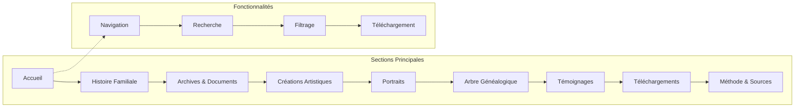

# Fonctionnalités Principales

<cite>
**Fichiers Référencés dans ce Document**
- [app/layout.tsx](file://app/layout.tsx)
- [app/page.tsx](file://app/page.tsx)
- [app/globals.css](file://app/globals.css)
- [components/ui/sidebar.tsx](file://components/ui/sidebar.tsx)
- [hooks/use-mobile.tsx](file://hooks/use-mobile.tsx)
- [components.json](file://components.json)
- [tailwind.config.ts](file://tailwind.config.ts.ts)
- [package.json](file://package.json)
- [PLAN.md](file://PLAN.md)
</cite>

## Table des Matières
1. [Introduction](#introduction)
2. [Architecture du Projet](#architecture-du-projet)
3. [Sidebar Dépliable](#sidebar-dépliable)
4. [Système de Thème Clair/Sombre](#système-de-thème-clairsombre)
5. [Page d'Accueil](#page-daccueil)
6. [Sections du Site](#sections-du-site)
7. [Composants UI](#composants-ui)
8. [Configuration et Persistance](#configuration-et-persistance)
9. [Optimisations et Performance](#optimisations-et-performance)
10. [Guide de Dépannage](#guide-de-dépannage)
11. [Conclusion](#conclusion)

## Introduction

Le projet Decker est une application web moderne développée avec Next.js 15 et TypeScript, utilisant shadcn/ui comme système de composants et Tailwind CSS pour le design. Cette documentation explore en détail les fonctionnalités principales du projet, notamment la sidebar dépliable, le système de thème, et les différentes sections du site.

Le projet suit une approche modulaire avec une architecture bien structurée, permettant une maintenance facile et une scalabilité future. L'application est conçue pour présenter des informations familiales de manière interactive et accessible.

## Architecture du Projet

Le projet Decker suit une architecture moderne basée sur Next.js 15 avec TypeScript, organisée selon les meilleures pratiques de développement web.


**Sources du Diagramme**
- [app/layout.tsx](file://app/layout.tsx#L1-L35)
- [components/ui/sidebar.tsx](file://components/ui/sidebar.tsx#L56-L161)
- [hooks/use-mobile.tsx](file://hooks/use-mobile.tsx#L1-L20)

**Sources de Section**
- [app/layout.tsx](file://app/layout.tsx#L1-L35)
- [components.json](file://components.json#L1-L23)
- [package.json](file://package.json#L1-L50)

## Sidebar Dépliable

La sidebar dépliable est l'un des composants les plus sophistiqués du projet, offrant une navigation intuitive et responsive.

### Architecture de la Sidebar


**Sources du Diagramme**
- [components/ui/sidebar.tsx](file://components/ui/sidebar.tsx#L56-L161)
- [components/ui/sidebar.tsx](file://components/ui/sidebar.tsx#L165-L270)
- [components/ui/sidebar.tsx](file://components/ui/sidebar.tsx#L47-L54)

### Fonctionnalités Avancées

#### Persistance de l'État
La sidebar implémente une persistance automatique via les cookies :

- **Nom du cookie** : `sidebar_state`
- **Durée** : 7 jours (60 * 60 * 24 * 7 secondes)
- **Mécanisme** : Mise à jour automatique lors des changements d'état

#### Gestion Responsive
Le système détecte automatiquement les appareils mobiles avec un breakpoint de 768px :

```typescript
// Détection mobile avec gestion d'événements
const MOBILE_BREAKPOINT = 768
const isMobile = window.innerWidth < MOBILE_BREAKPOINT
```

#### Touches de Raccourci Clavier
La sidebar supporte une touche de raccourci pour faciliter l'accès :
- **Raccourci** : `Ctrl/Cmd + B`
- **Implémentation** : Événement `keydown` global

### Configuration des Variables CSS

La sidebar utilise des variables CSS pour une personnalisation flexible :

```css
:root {
  --sidebar-width: 16rem;           /* Largeur normale */
  --sidebar-width-icon: 3rem;       /* Largeur en mode collapsed */
  --sidebar-background: var(--background);
  --sidebar-foreground: var(--foreground);
}
```

**Sources de Section**
- [components/ui/sidebar.tsx](file://components/ui/sidebar.tsx#L28-L33)
- [hooks/use-mobile.tsx](file://hooks/use-mobile.tsx#L3-L4)
- [components/ui/sidebar.tsx](file://components/ui/sidebar.tsx#L138-L184)

## Système de Thème Clair/Sombre

Le système de thème offre une expérience utilisateur optimale avec trois modes : Clair, Sombre et Système.

### Architecture du Système de Thème


**Sources du Diagramme**
- [app/globals.css](file://app/globals.css#L13-L82)
- [tailwind.config.ts](file://tailwind.config.ts#L4-L5)

### Variables CSS des Thèmes

#### Mode Clair
```css
:root {
  --background: 0 0% 100%;
  --foreground: 0 0% 3.9%;
  --card: 0 0% 100%;
  --popover: 0 0% 100%;
  --primary: 0 0% 9%;
  --secondary: 0 0% 96.1%;
  --muted: 0 0% 96.1%;
  --accent: 0 0% 96.1%;
  --destructive: 0 84.2% 60.2%;
  --border: 0 0% 89.8%;
  --input: 0 0% 89.8%;
  --ring: 0 0% 3.9%;
}
```

#### Mode Sombre
```css
.dark {
  --background: 0 0% 3.9%;
  --foreground: 0 0% 98%;
  --card: 0 0% 3.9%;
  --popover: 0 0% 3.9%;
  --primary: 0 0% 98%;
  --secondary: 0 0% 14.9%;
  --muted: 0 0% 14.9%;
  --accent: 0 0% 14.9%;
  --destructive: 0 62.8% 30.6%;
  --border: 0 0% 14.9%;
  --input: 0 0% 14.9%;
  --ring: 0 0% 83.1%;
}
```

### Fonctionnalités du Système de Thème

#### Détection Automatique du Système
Le système peut détecter automatiquement le thème préféré du navigateur :

```typescript
// Détection du thème système
const prefersDark = window.matchMedia('(prefers-color-scheme: dark)').matches
```

#### Persistance des Préférences
- **Stockage** : `localStorage` avec clé `theme`
- **Synchronisation** : Réactivité automatique avec `next-themes`
- **Transition** : Animations fluides entre thèmes

#### Options de Menu
Le sélecteur de thème propose trois options :
1. **Clair** : Mode lumineux traditionnel
2. **Sombre** : Mode sombre pour environnements faiblement éclairés
3. **Système** : Respecte les préférences du système d'exploitation

**Sources de Section**
- [app/globals.css](file://app/globals.css#L13-L82)
- [tailwind.config.ts](file://tailwind.config.ts#L1-L73)

## Page d'Accueil

La page d'accueil est minimaliste mais efficace, servant de point d'entrée principal vers les différentes sections du site.

### Structure de la Page d'Accueil


**Sources du Diagramme**
- [app/page.tsx](file://app/page.tsx#L1-L8)

### Caractéristiques de la Page d'Accueil

#### Design Minimaliste
- **Alignement** : Centre parfait avec `flex items-center justify-center`
- **Typographie** : Police Geist Sans avec variante CSS
- **Taille** : `text-4xl` avec `font-bold`
- **Responsivité** : S'adapte automatiquement à toutes les tailles d'écran

#### Accessibilité
- **Contraste** : Bon contraste entre texte et arrière-plan
- **Taille de police** : Taille appropriée pour la lisibilité
- **Structure sémantique** : Utilisation appropriée des éléments HTML

**Sources de Section**
- [app/page.tsx](file://app/page.tsx#L1-L8)
- [app/layout.tsx](file://app/layout.tsx#L5-L13)

## Sections du Site

Le site Decker est organisé autour de plusieurs sections principales, chacune ayant ses spécificités fonctionnelles.

### Vue d'Ensemble des Sections



### Histoire Familiale

La section Histoire Familiale présente une chronologie interactive des événements clés de la famille.

#### Fonctionnalités
- **Timeline Chronologique** : Navigation par périodes historiques
- **Cartes d'Événements** : Affichage détaillé avec badges
- **Photos d'Époque** : Intégration avec dialog pour zoom
- **Filtres par Période** : Sélection avec composant Select

### Archives & Documents

Cette section centralise tous les documents et médias de l'histoire familiale.

#### Fonctionnalités
- **Galerie de Photographies** : Organisation chronologique
- **Vidéos INA** : Intégration de contenu externe
- **Documents Officiels** : Actes de naissance, mariage, décès
- **Recherche Avancée** : Filtrage par type, période, personne

### Créations Artistiques

Une galerie complète des œuvres créatives de la famille.

#### Fonctionnalités
- **Musique** : Lecteur audio avec métadonnées
- **Photographies** : Galerie responsive avec zoom
- **Peintures** : Affichage HD avec descriptions
- **Vidéos** : Galerie avec vignettes preview

### Arbre Généalogique

Un arbre généalogique interactif permettant de naviguer dans les relations familiales.

#### Fonctionnalités
- **Visualisation Interactive** : Zoom, pan, clic
- **Photos aux Nœuds** : Intégration avec composant Avatar
- **Recherche par Nom** : Intégration avec Command
- **Export PDF** : Génération de rapports

### Portraits des Membres

Une galerie de portraits présentant les membres marquants de la famille.

#### Fonctionnalités
- **Grille de Portraits** : Organisation par génération
- **Fiches Détaillées** : Biographies complètes
- **Relations Familiales** : Liens interactifs
- **Galeries Photo** : Carousels pour chaque membre

### Témoignages

Une collection de témoignages et récits personnels.

#### Fonctionnalités
- **Galerie de Souvenirs** : Affichage par témoignage
- **Anecdotes Familiales** : Dialog pour lecture complète
- **Enregistrements Audio** : Lecteur personnalisé
- **Commentaires** : Système optionnel

### Téléchargements

Une bibliothèque de ressources téléchargeables.

#### Fonctionnalités
- **PDF des Généalogies** : Boutons de téléchargement
- **Albums Photos Numérisés** : Par période
- **Audios en Différents Formats** : Compression
- **Vidéos Compressées** : Téléchargement optimisé

**Sources de Section**
- [PLAN.md](file://PLAN.md#L50-L75)

## Composants UI

Le projet utilise shadcn/ui comme système de composants, offrant une base solide et personnalisable.

### Composants de Base

#### Button
- **Variantes** : Default, Outline, Ghost, Link
- **Tailles** : Sm, Default, Lg
- **Accessibilité** : Support WCAG natif

#### Card
- **Structure** : Header, Content, Footer
- **Variantes** : Default, Secondary, Outline
- **Utilisation** : Conteneurs pour les sections

#### Badge
- **Types** : Default, Secondary, Outline, Destructive
- **Utilisation** : Métadonnées et étiquettes

### Composants de Navigation

#### Sidebar (Principal)
- **État** : Expandid/Collapsed
- **Collapsibilité** : Offcanvas, Icon, None
- **Responsive** : Mobile avec Sheet

#### NavigationMenu
- **Structure** : List, Item, Trigger
- **Variants** : Horizontal, Vertical
- **Accessibilité** : Support navigation clavier

#### Breadcrumb
- **Structure** : List, Item, Separator
- **Utilisation** : Navigation hiérarchique
- **Responsive** : Adaptation automatique

### Composants de Formulaire

#### Input
- **Types** : Text, Email, Password, Number
- **Variantes** : Default, Secondary, Outline
- **Validation** : Support intégré

#### Select
- **Structure** : Trigger, Content, Item
- **Multi-selection** : Support optionnel
- **Recherche** : Autocomplete intégré

#### Checkbox
- **État** : Checked, Unchecked, Indeterminate
- **Groupes** : Support de formulaires complexes

### Composants d'Overlay

#### Dialog
- **Structure** : Header, Content, Footer
- **Actions** : Confirm, Cancel, Custom
- **Responsive** : Fullscreen sur mobile

#### Sheet
- **Positions** : Left, Right, Top, Bottom
- **Overlay** : Backdrop automatique
- **Mobile** : Composant natif

#### Tooltip
- **Positions** : Top, Right, Bottom, Left
- **Délai** : Configurable (0ms par défaut)
- **Responsive** : Masqué sur mobile

### Composants de Média

#### AspectRatio
- **Ratios** : 1/1, 4/3, 16/9, 21/9
- **Lazy Loading** : Support automatique
- **Responsive** : Adaptation automatique

#### Carousel
- **Navigation** : Auto, Manual, Infinite
- **Indicateurs** : Support optionnel
- **Touch** : Gestes tactiles

**Sources de Section**
- [components.json](file://components.json#L1-L23)
- [package.json](file://package.json#L12-L35)

## Configuration et Persistance

Le système de configuration du projet suit des principes de performance et d'expérience utilisateur.

### Configuration Tailwind CSS


**Sources du Diagramme**
- [tailwind.config.ts](file://tailwind.config.ts#L1-L73)
- [app/globals.css](file://app/globals.css#L13-L82)

### Variables de Configuration

#### Breakpoints Responsive
```typescript
// Configuration Tailwind
content: [
  "./pages/**/*.{js,ts,jsx,tsx,mdx}",
  "./components/**/*.{js,ts,jsx,tsx,mdx}",
  "./app/**/*.{js,ts,jsx,tsx,mdx}",
]

// Breakpoint mobile
const MOBILE_BREAKPOINT = 768
```

#### Couleurs du Design System
- **Primary** : Accentuation principale
- **Secondary** : Complémentaire
- **Background** : Arrière-plan
- **Foreground** : Texte principal
- **Sidebar** : Couleurs spécialisées

### Persistance des États

#### Sidebar
- **Méthode** : Cookies avec expiration de 7 jours
- **Clé** : `sidebar_state`
- **Valeur** : Boolean sérialisé

#### Thème
- **Méthode** : localStorage
- **Clé** : `theme`
- **Valeurs** : `light`, `dark`, `system`

#### État Mobile
- **Méthode** : État React local
- **Mise à jour** : Événement `resize` automatique
- **Breakpoint** : 768px

### Optimisations de Performance

#### Lazy Loading
- **Images** : IntersectionObserver natif
- **Composants** : Dynamic imports
- **Routes** : Code splitting automatique

#### Cache
- **Static Assets** : CDN avec TTL
- **API Responses** : Cache HTTP
- **Local Storage** : Données persistantes

**Sources de Section**
- [tailwind.config.ts](file://tailwind.config.ts#L1-L73)
- [hooks/use-mobile.tsx](file://hooks/use-mobile.tsx#L1-L20)
- [components/ui/sidebar.tsx](file://components/ui/sidebar.tsx#L28-L33)

## Optimisations et Performance

Le projet intègre plusieurs optimisations pour garantir une performance optimale.

### Optimisations Frontend

#### Bundle Size
- **Tree Shaking** : Suppression du code non utilisé
- **Code Splitting** : Division automatique des bundles
- **Compression** : Gzip/Brotli automatique

#### Chargement Critique
- **Critical CSS** : Styles essentiels inline
- **Fonts** : Web fonts avec fallback rapide
- **Images** : Format WebP avec fallback

### Optimisations Backend

#### Next.js Features
- **SSR** : Génération côté serveur pour SEO
- **ISR** : Récupération incrémentale
- **Edge Runtime** : Exécution près des utilisateurs

#### Métriques de Performance
- **LCP** : Largest Contentful Paint optimisé
- **FID** : First Input Delay < 100ms
- **CLS** : Cumulative Layout Shift < 0.1

### Monitoring et Analytics

#### Google Analytics
- **Événements** : Interactions utilisateur
- **Pages** : Navigation tracking
- **Performance** : Métriques Core Web Vitals

#### Uptime Monitoring
- **Disponibilité** : Surveillance 24/7
- **Alertes** : Notifications automatiques
- **Rétroaction** : Logs d'erreurs

**Sources de Section**
- [package.json](file://package.json#L6-L9)
- [PLAN.md](file://PLAN.md#L430-L466)

## Guide de Dépannage

Ce guide couvre les problèmes courants et leurs solutions.

### Problèmes de Sidebar

#### Sidebar ne se déplie pas
**Symptôme** : Le bouton toggle ne fonctionne pas
**Solutions** :
1. Vérifier que `SidebarProvider` enveloppe le composant
2. Contrôler l'état `isMobile` avec `useIsMobile()`
3. Vérifier les événements clavier (`Ctrl/Cmd + B`)

#### Persistance des préférences perdue
**Symptôme** : L'état de la sidebar réinitialise après rechargement
**Solutions** :
1. Vérifier les cookies dans les outils développeur
2. Contrôler la fonction `setOpen()` dans `SidebarProvider`
3. Vérifier les permissions de stockage

### Problèmes de Thème

#### Transition de thème lente
**Symptôme** : Changement de thème avec délai perceptible
**Solutions** :
1. Optimiser les variables CSS
2. Vérifier les animations CSS
3. Contrôler la priorité des styles

#### Thème système non détecté
**Symptôme** : Le mode système ne change pas automatiquement
**Solutions** :
1. Vérifier les préférences du navigateur
2. Contrôler les événements `prefers-color-scheme`
3. Vérifier la configuration `darkMode: ["class"]`

### Problèmes de Performance

#### Images lentes
**Symptôme** : Chargement lent des médias
**Solutions** :
1. Utiliser le format WebP
2. Implémenter le lazy loading
3. Optimiser les tailles de fichiers

#### Navigation lente
**Symptôme** : Retards lors de la navigation
**Solutions** :
1. Vérifier le bundle size
2. Activer le code splitting
3. Optimiser les requêtes API

### Problèmes de Responsivité

#### Sidebar mobile non fonctionnelle
**Symptôme** : La sidebar ne s'ouvre pas sur mobile
**Solutions** :
1. Vérifier le breakpoint de 768px
2. Contrôler l'utilisation du composant Sheet
3. Vérifier les événements tactiles

#### Composants mal positionnés
**Symptôme** : Layout cassé sur certains écrans
**Solutions** :
1. Vérifier les breakpoints Tailwind
2. Contrôler les propriétés CSS
3. Tester sur différents appareils

**Sources de Section**
- [components/ui/sidebar.tsx](file://components/ui/sidebar.tsx#L83-L96)
- [hooks/use-mobile.tsx](file://hooks/use-mobile.tsx#L8-L16)

## Conclusion

Le projet Decker représente une implémentation moderne et robuste d'une application web familiale, combinant performance, accessibilité et expérience utilisateur. Les fonctionnalités principales, notamment la sidebar dépliable et le système de thème, démontrent une architecture bien pensée et une attention particulière aux détails.

### Points Forts du Projet

1. **Architecture Modulaire** : Séparation claire des responsabilités
2. **Accessibilité** : Support WCAG natif avec shadcn/ui
3. **Performance** : Optimisations intégrées de Next.js
4. **Expérience Mobile** : Responsive design complet
5. **Personnalisation** : Variables CSS flexibles

### Recommandations Futures

1. **Tests Automatisés** : Implémentation de tests unitaires et d'intégration
2. **SEO** : Optimisations avancées pour le référencement
3. **Internationalisation** : Support multilingue potentiel
4. **Analytics** : Métriques utilisateur avancées
5. **Maintenance** : Documentation technique complète

Le projet constitue une base solide pour une application web familiale moderne, prête à évoluer avec les besoins futurs de la famille.