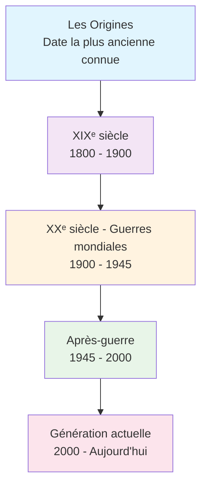
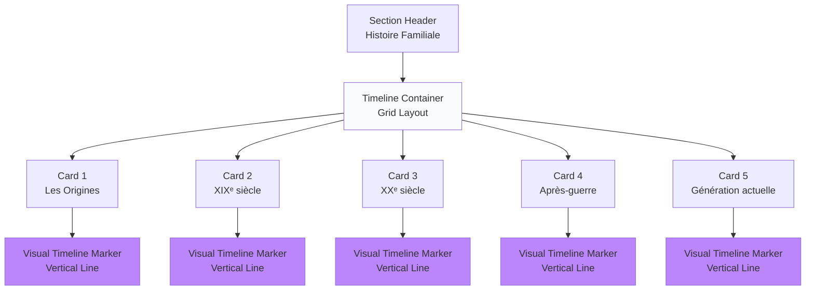
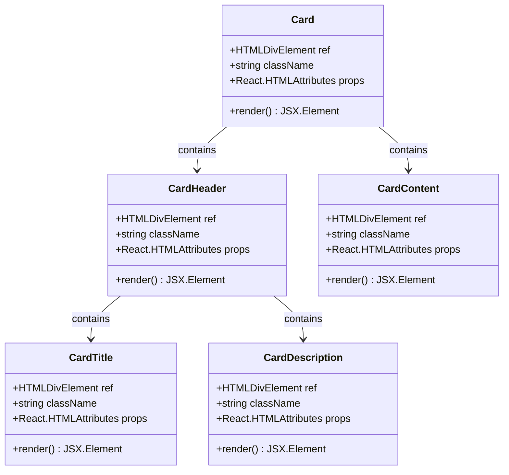
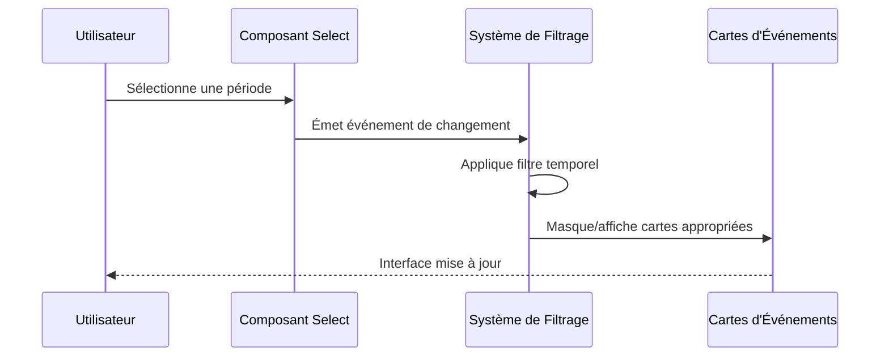
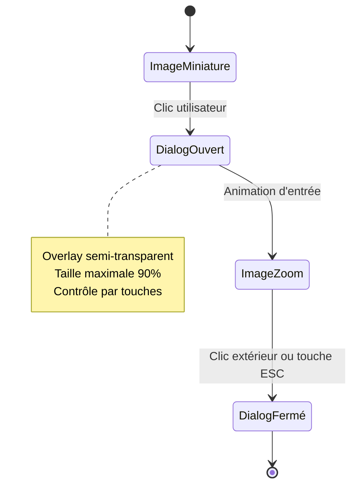
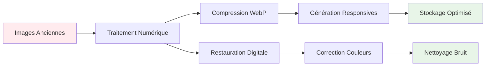
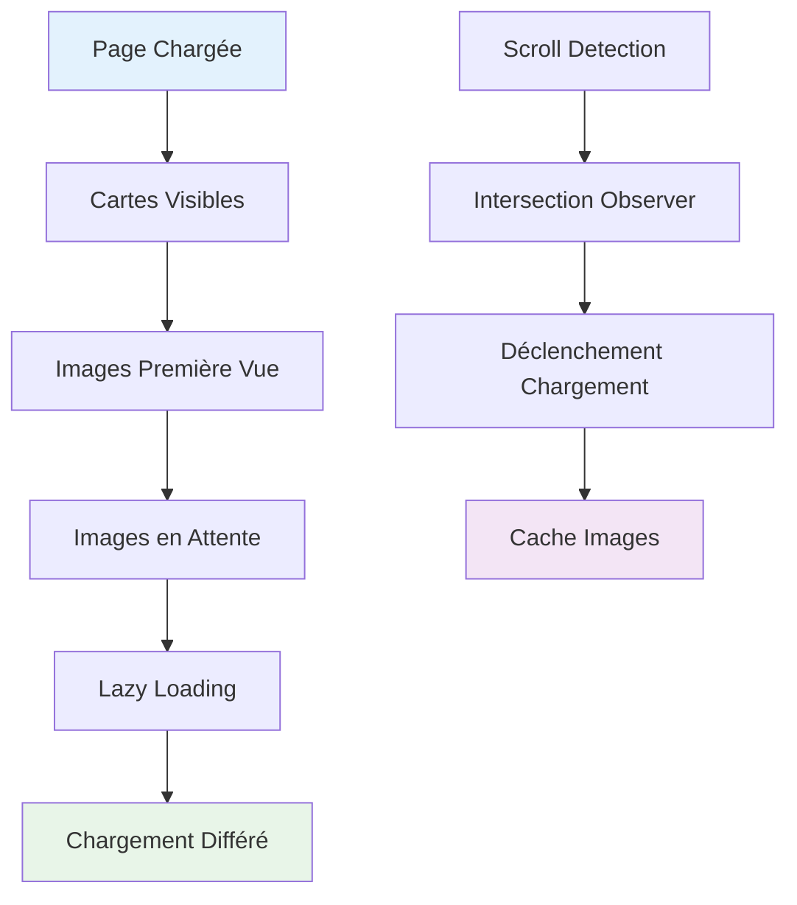
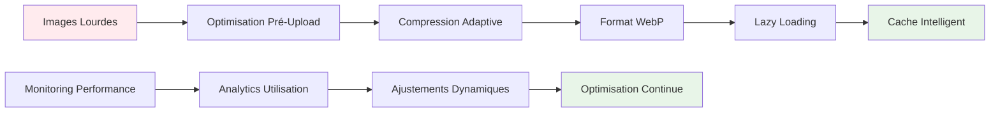

# Histoire Familiale

<cite>
**Fichiers Référencés dans ce Document**
- [app/histoire/page.tsx](file://app/histoire/page.tsx)
- [components/ui/card.tsx](file://components/ui/card.tsx)
- [components/ui/badge.tsx](file://components/ui/badge.tsx)
- [components/ui/select.tsx](file://components/ui/select.tsx)
- [components/ui/aspect-ratio.tsx](file://components/ui/aspect-ratio.tsx)
- [components/ui/dialog.tsx](file://components/ui/dialog.tsx)
- [components/ui/scroll-area.tsx](file://components/ui/scroll-area.tsx)
- [components/app-sidebar.tsx](file://components/app-sidebar.tsx)
- [PLAN.md](file://PLAN.md)
</cite>

## Table des Matières
1. [Introduction](#introduction)
2. [Structure Chronologique](#structure-chronologique)
3. [Architecture de la Timeline](#architecture-de-la-timeline)
4. [Composants UI Utilisés](#composants-ui-utilisés)
5. [Système de Filtrage](#système-de-filtrage)
6. [Intégration des Médias Anciens](#intégration-des-médias-anciens)
7. [Considérations d'Accessibilité](#considérations-daccessibilité)
8. [Optimisation des Performances](#optimisation-des-performances)
9. [Problèmes Courants et Solutions](#problèmes-courants-et-solutions)
10. [Conclusion](#conclusion)

## Introduction

La section Histoire Familiale de Decker constitue le cœur narratif du site web, offrant une exploration immersive de l'histoire de la famille DECKER à travers les siècles. Cette implémentation sophistiquée combine une structure chronologique intuitive avec des technologies modernes pour créer une expérience utilisateur engageante et accessible.

Le projet adopte une approche méthodique pour présenter l'histoire familiale, organisée autour de cinq périodes principales : Les Origines, XIXᵉ siècle, XXᵉ siècle, Après-guerre → années 2000, et Génération actuelle. Chaque période est présentée avec une carte d'événement interactive, permettant aux visiteurs de naviguer facilement à travers l'historique familial.

## Structure Chronologique

### Organisation Périodique

La structure chronologique repose sur un système de cinq grandes divisions temporelles, chacune représentant une ère distincte de l'histoire familiale :

**Sources du Diagramme**
- [app/histoire/page.tsx](file://app/histoire/page.tsx#L7-L37)

### Implémentation des Périodes

Chaque période est définie dans un tableau de données structuré, contenant les éléments essentiels suivants :

- **Titre** : Nom de la période avec indication de l'époque
- **Période** : Plage temporelle exacte
- **Description** : Résumé succinct du contenu
- **Statut** : État de développement du contenu

Cette structure permet une maintenance flexible et une extension future facile du contenu historique.

**Sources de la Section**
- [app/histoire/page.tsx](file://app/histoire/page.tsx#L7-L37)

## Architecture de la Timeline

### Layout Principal

La timeline chronologique utilise une architecture basée sur des cartes (Cards) empilées verticalement, avec une ligne temporelle visuelle latérale :

**Sources du Diagramme**
- [app/histoire/page.tsx](file://app/histoire/page.tsx#L63-L84)

### Cartes d'Événements

Chaque période est représentée par une carte élégante utilisant le système de composants shadcn/ui :

#### Structure des Cartes

- **Conteneur Principal** : [`Card`](file://components/ui/card.tsx#L7-L16) avec ombre et arrondi
- **Marqueur Temporel** : Ligne verticale bleue (`absolute left-0 top-0 bottom-0 w-1`)
- **En-tête** : [`CardHeader`](file://components/ui/card.tsx#L18-L27) avec titre et période
- **Corps** : [`CardContent`](file://components/ui/card.tsx#L55-L64) avec description et statut
- **Pied de Page** : [`CardFooter`](file://components/ui/card.tsx#L66-L76) optionnel

#### Design Visuel

Les cartes utilisent une hiérarchie visuelle claire :
- Titre principal en 2xl (24px)
- Description en lg (18px)
- Statut en badge secondaire
- Marqueur temporel bleu contrasté

**Sources de la Section**
- [app/histoire/page.tsx](file://app/histoire/page.tsx#L63-L84)

## Composants UI Utilisés

### Card et Badge

#### Card Component

Le composant Card fournit une structure cohérente pour toutes les cartes d'événements :

**Sources du Diagramme**
- [components/ui/card.tsx](file://components/ui/card.tsx#L7-L76)

#### Badge Component

Le Badge sert à afficher l'état de développement des différentes périodes :

- **Variant "secondary"** : Utilisé pour les statuts (À documenter, En recherche, Documentation riche, À compléter, En cours)
- **Taille adaptative** : Basé sur le contenu
- **Contraste élevé** : Facilite la lecture des informations

**Sources de la Section**
- [components/ui/card.tsx](file://components/ui/card.tsx#L1-L76)
- [components/ui/badge.tsx](file://components/ui/badge.tsx#L1-L36)

### Select pour Filtrage

Le composant Select permet la navigation rapide entre les différentes périodes :

**Sources du Diagramme**
- [components/ui/select.tsx](file://components/ui/select.tsx#L1-L160)

### AspectRatio pour Photos

Le composant AspectRatio maintient les proportions des images historiques :

- **Préservation des proportions** : Empêche les distorsions des photos anciennes
- **Responsive design** : Adapte automatiquement aux différentes tailles d'écran
- **Performance optimisée** : Charge les images selon les besoins

**Sources de la Section**
- [components/ui/aspect-ratio.tsx](file://components/ui/aspect-ratio.tsx#L1-L8)

### Dialog pour Zoom Images

Le Dialog crée une expérience de zoom haute résolution pour les images historiques :

**Sources du Diagramme**
- [components/ui/dialog.tsx](file://components/ui/dialog.tsx#L32-L54)

**Sources de la Section**
- [components/ui/dialog.tsx](file://components/ui/dialog.tsx#L1-L123)

## Système de Filtrage

### Implémentation du Select

Le système de filtrage utilise le composant Select de shadcn/ui pour permettre la navigation par période :

#### Fonctionnalités Clés

- **Options multiples** : Sélection unique des périodes
- **Placeholder informatif** : Guide pour l'utilisateur
- **Animations fluides** : Transition douce lors des changements
- **Accessibilité** : Support clavier et lecteurs d'écran

#### Intégration avec la Timeline

Le filtrage se synchronise avec l'affichage des cartes pour masquer/informer les périodes non sélectionnées, créant une expérience de navigation fluide.

**Sources de la Section**
- [components/ui/select.tsx](file://components/ui/select.tsx#L15-L160)

## Intégration des Médias Anciens

### Gestion des Images Historiques

#### Stratégie de Chargement

- **Lazy loading** : Images chargées uniquement lors de l'entrée dans le viewport
- **Format WebP** : Utilisation des formats modernes pour optimiser les poids
- **Responsive images** : Adaptation automatique selon la résolution
- **Fallbacks** : Support des navigateurs plus anciens

#### Optimisation des Formats

**Sources du Diagramme**
- [PLAN.md](file://PLAN.md#L319-L352)

### Aspect Ratio pour Maintien des Proportions

Le composant AspectRatio garantit que les images historiques conservent leurs proportions originales :

- **Preservation de l'identité visuelle** : Évite la distorsion des documents anciens
- **Adaptabilité** : Fonctionne sur tous les appareils
- **Performance** : Charge adaptative selon les besoins

**Sources de la Section**
- [components/ui/aspect-ratio.tsx](file://components/ui/aspect-ratio.tsx#L1-L8)

## Considérations d'Accessibilité

### Support des Technologies d'Aide

#### Navigation Clavier

- **Tab navigation** : Ordre logique des éléments
- **Touches fléchées** : Navigation dans les listes de périodes
- **ESCAPE** : Fermeture des Dialogs
- **Entrée** : Activation des boutons et liens

#### ARIA Labels et Roles

- **Labels descriptifs** : Description claire de chaque composant
- **Roles appropriés** : Structuration sémantique de l'interface
- **States visibles** : Indicateurs visuels des états actifs

#### Contraste et Lisibilité

- **Contraste minimal** : Respect des normes WCAG AA
- **Tailles de police** : Hiérarchie claire du contenu
- **Espacement** : Lecture confortable sur tous les appareils

### Expérience Mobile

- **Touch targets** : Zones de clic suffisamment grandes
- **Swipe gestures** : Navigation intuitive sur mobile
- **Lecture automatique** : Adaptation aux préférences utilisateur

**Sources de la Section**
- [components/ui/dialog.tsx](file://components/ui/dialog.tsx#L41-L51)

## Optimisation des Performances

### Lazy Loading et Chargement Progressif

#### Stratégies de Chargement

**Sources du Diagramme**
- [PLAN.md](file://PLAN.md#L319-L352)

#### Optimisation des Images

- **Compression intelligente** : Balance qualité/performance
- **Formats adaptatifs** : Choix optimal selon le contexte
- **Cache intelligent** : Réutilisation des ressources
- **Progressive loading** : Affichage graduel des contenus

### Scroll Area pour Navigation Fluides

Le composant ScrollArea offre une expérience de navigation fluide :

- **Scrollbar personnalisé** : Esthétique cohérente avec le design
- **Touch scrolling** : Support natif sur appareils tactiles
- **Smooth scrolling** : Animation fluides pour la navigation
- **Performance optimisée** : Gestion efficace des événements

**Sources de la Section**
- [components/ui/scroll-area.tsx](file://components/ui/scroll-area.tsx#L1-L49)

## Problèmes Courants et Solutions

### Gestion des Médias Lourds

#### Problèmes Identifiés

1. **Temps de chargement long** : Images haute résolution bloquent l'interface
2. **Utilisation excessive de bande passante** : Impact sur les utilisateurs mobiles
3. **Consommation mémoire élevée** : Risque de ralentissement sur appareils faibles

#### Solutions Implémentées

**Sources du Diagramme**
- [PLAN.md](file://PLAN.md#L319-L352)

#### Stratégies de Résolution

1. **Progressive Enhancement** : Chargement de base puis amélioration progressive
2. **Media Queries** : Adaptation selon la résolution et la bande passante
3. **Priority Queuing** : Chargement prioritaire des contenus visibles
4. **Preload Strategies** : Préchargement stratégique des prochains éléments

### Synchronisation Timeline-Contenu

#### Problèmes de Cohérence

- **Désynchronisation visuelle** : Les cartes ne correspondent pas à la timeline
- **Navigation confuse** : Lien entre filtrage et affichage
- **Performance des transitions** : Animations lentes ou bloquées

#### Solutions Techniques

- **Event-driven updates** : Synchronisation en temps réel
- **Debounced filtering** : Évite les mises à jour excessives
- **Virtual scrolling** : Gestion efficace des grandes listes
- **State management** : Cohérence globale de l'interface

**Sources de la Section**
- [components/ui/select.tsx](file://components/ui/select.tsx#L15-L160)

## Conclusion

La section Histoire Familiale de Decker représente une implémentation exemplaire de l'intersection entre design moderne et contenu historique. L'architecture modulaire, basée sur les composants shadcn/ui, offre une base solide pour l'évolution future du site.

### Points Forts de l'Implémentation

- **Structure claire** : Organisation logique des périodes historiques
- **Expérience utilisateur** : Navigation intuitive et accessible
- **Performance** : Chargement optimisé des médias anciens
- **Extensibilité** : Architecture flexible pour l'ajout de contenu
- **Accessibilité** : Support complet des technologies d'aide

### Perspectives d'Amélioration

1. **Intelligence Artificielle** : Reconnaissance d'images pour l'indexation automatique
2. **Géolocalisation** : Carte interactive des déplacements familiaux
3. **Multimédia enrichi** : Intégration de vidéos et audio
4. **Collaboration** : Plateforme de contribution communautaire
5. **Mobile-first** : Optimisation spécifique pour les appareils mobiles

Cette implémentation constitue une base solide pour préserver et partager l'histoire familiale de manière interactive et accessible, tout en maintenant les standards de performance et d'expérience utilisateur les plus élevés.