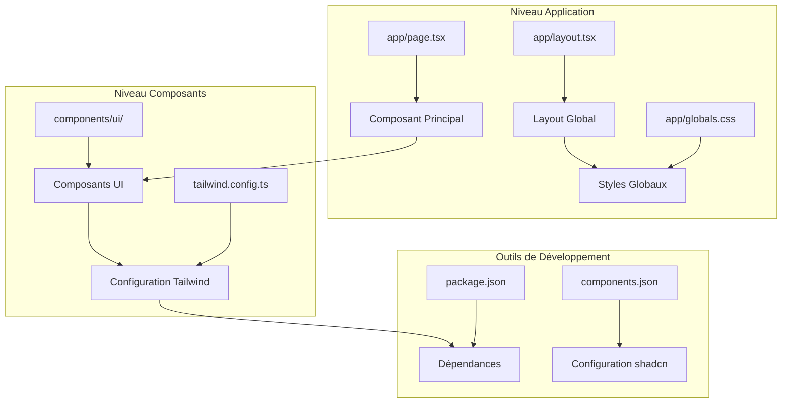
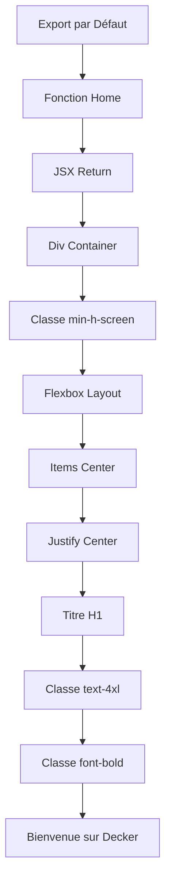
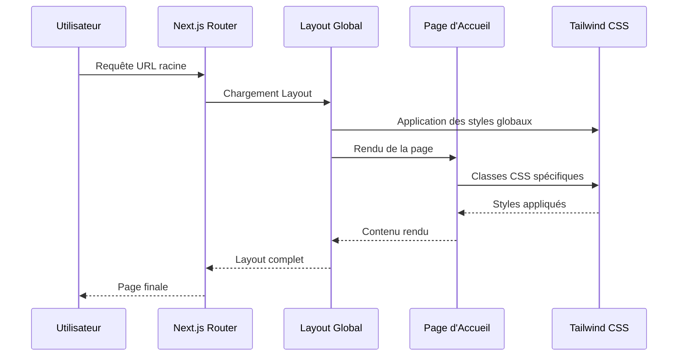
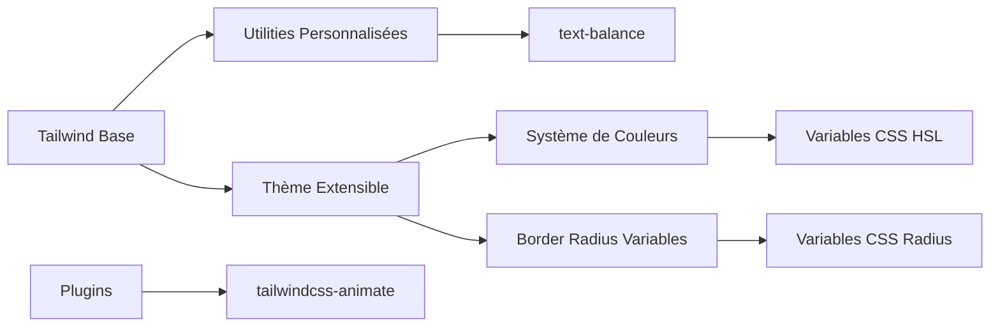
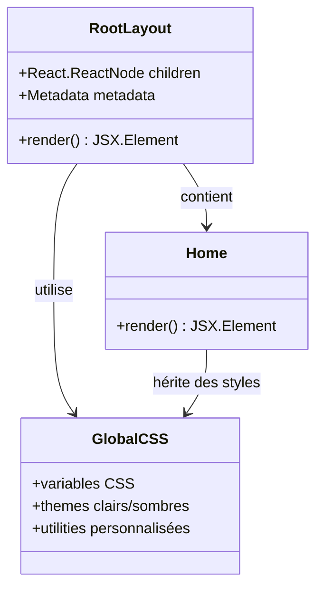
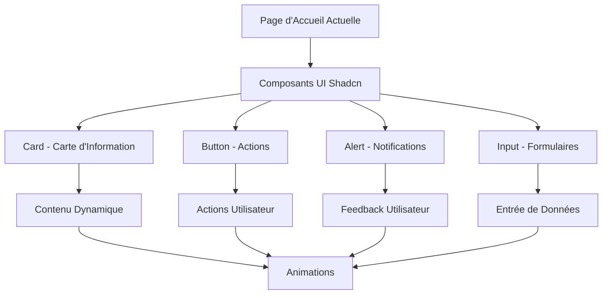
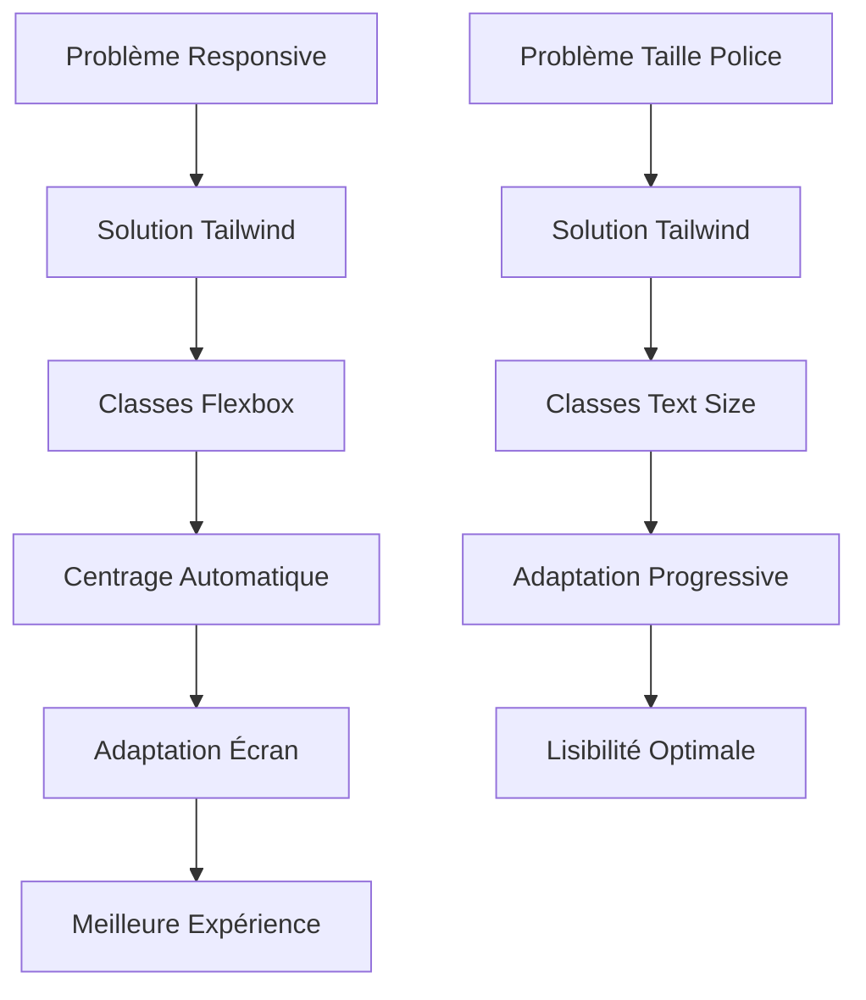

# Page d'Accueil - Documentation Technique

<cite>
**Fichiers Référencés dans ce Document**
- [app/page.tsx](file://app/page.tsx)
- [app/layout.tsx](file://app/layout.tsx)
- [app/globals.css](file://app/globals.css)
- [tailwind.config.ts](file://tailwind.config.ts)
- [components/ui/button.tsx](file://components/ui/button.tsx)
- [components/ui/card.tsx](file://components/ui/card.tsx)
- [package.json](file://package.json)
- [components.json](file://components.json)
</cite>

## Table des Matières
1. [Introduction](#introduction)
2. [Structure du Projet](#structure-du-projet)
3. [Composant Principal de la Page d'Accueil](#composant-principal-de-la-page-daccueil)
4. [Architecture et Intégration](#architecture-et-intégration)
5. [Stylage avec Tailwind CSS](#stylage-avec-tailwind-css)
6. [Intégration avec le Layout Global](#intégration-avec-le-layout-global)
7. [Considérations d'Accessibilité](#considérations-daccessibilité)
8. [Extensions et Personnalisations](#extensions-et-personnalisations)
9. [Optimisations de Performance](#optimisations-de-performance)
10. [Problèmes Courants et Solutions](#problèmes-courants-et-solutions)
11. [Conclusion](#conclusion)

## Introduction

La page d'accueil de l'application Decker est implémentée comme un composant React fonctionnel moderne utilisant les Server Components de Next.js 15. Cette page constitue le point d'entrée principal de l'application et démontre l'utilisation optimale des technologies modernes de développement web : React avec Server Components, Next.js 15, et le framework CSS Tailwind CSS avec le système de composants shadcn.

Cette documentation explore en détail l'implémentation technique, les bonnes pratiques adoptées, et les possibilités d'extension pour cette page simple mais bien architecturée.

## Structure du Projet

Le projet Decker suit une structure modulaire propre qui sépare clairement les responsabilités entre les différents niveaux de l'application :



**Sources du Diagramme**
- [app/page.tsx](file://app/page.tsx#L1-L8)
- [app/layout.tsx](file://app/layout.tsx#L1-L35)
- [tailwind.config.ts](file://tailwind.config.ts#L1-L73)

**Sources de Section**
- [app/page.tsx](file://app/page.tsx#L1-L8)
- [app/layout.tsx](file://app/layout.tsx#L1-L35)
- [package.json](file://package.json#L1-L50)

## Composant Principal de la Page d'Accueil

Le composant principal de la page d'accueil est extrêmement minimaliste mais techniquement sophistiqué. Il utilise la nouvelle syntaxe des Server Components de Next.js 15 avec une exportation par défaut simple et efficace.

### Implémentation Technique

Le composant Home suit un pattern React moderne avec les caractéristiques suivantes :



**Sources du Diagramme**
- [app/page.tsx](file://app/page.tsx#L1-L8)

### Caractéristiques Architecturales

Le composant présente plusieurs aspects architecturaux importants :

1. **Server Components Native** : Utilise la syntaxe native de Next.js 15 sans décorateurs
2. **Minimalisme Fonctionnel** : Pas de gestion d'état local nécessaire
3. **Performance Optimisée** : Rendu côté serveur natif
4. **Type Safety** : Utilisation de TypeScript intégrée

**Sources de Section**
- [app/page.tsx](file://app/page.tsx#L1-L8)

## Architecture et Intégration

La page d'accueil s'intègre parfaitement dans l'écosystème de Next.js 15 grâce à son architecture de layout modulaire.

### Flux d'Intégration



**Sources du Diagramme**
- [app/layout.tsx](file://app/layout.tsx#L20-L34)
- [app/page.tsx](file://app/page.tsx#L1-L8)

### Configuration du Layout Global

Le layout global configure l'environnement de rendu avec plusieurs éléments clés :

1. **Polices Web** : Import de Geist Sans et Geist Mono
2. **Variables CSS** : Système de couleurs personnalisées
3. **Antialiasing** : Amélioration de la lisibilité
4. **Support du Dark Mode** : Configuration automatique

**Sources de Section**
- [app/layout.tsx](file://app/layout.tsx#L1-L35)

## Stylage avec Tailwind CSS

Le système de styling de Decker repose sur Tailwind CSS avec une configuration avancée qui permet un développement rapide et maintenable.

### Classes CSS Utilisées

Le composant principal utilise exclusivement des classes Tailwind CSS pour le centrage et le styling :

| Classe | Description | Utilisation |
|--------|-------------|-------------|
| `min-h-screen` | Hauteur minimale de l'écran | Conteneur principal |
| `flex` | Affichage flexbox | Layout container |
| `items-center` | Alignement vertical central | Centre verticalement |
| `justify-center` | Alignement horizontal central | Centre horizontalement |
| `text-4xl` | Taille de police XL | Titre principal |
| `font-bold` | Poids de police gras | Importance visuelle |

### Configuration Tailwind Avancée

La configuration Tailwind inclut plusieurs améliorations :



**Sources du Diagramme**
- [tailwind.config.ts](file://tailwind.config.ts#L1-L73)
- [app/globals.css](file://app/globals.css#L1-L95)

### Système de Couleurs

Le projet utilise un système de couleurs basé sur des variables CSS HSL avec support du mode sombre :

- **Couleurs Primaires** : Configuration adaptative avec variables CSS
- **Mode Sombre** : Automatique avec classe CSS `.dark`
- **Contraste** : Respect des standards d'accessibilité
- **Animations** : Transition fluides avec plugin animate

**Sources de Section**
- [tailwind.config.ts](file://tailwind.config.ts#L1-L73)
- [app/globals.css](file://app/globals.css#L1-L95)

## Intégration avec le Layout Global

La page d'accueil s'intègre seamless dans le layout global grâce à l'architecture de Next.js qui permet une composition de composants élégante.

### Hiérarchie des Composants



**Sources du Diagramme**
- [app/layout.tsx](file://app/layout.tsx#L20-L34)
- [app/page.tsx](file://app/page.tsx#L1-L8)

### Avantages de l'Intégration

1. **Consistance Visuelle** : Thème cohérent à travers l'application
2. **Performance** : Rendu SSR natif
3. **Maintenabilité** : Séparation claire des responsabilités
4. **Extensibilité** : Facilité d'ajout de nouvelles pages

**Sources de Section**
- [app/layout.tsx](file://app/layout.tsx#L1-L35)

## Considérations d'Accessibilité

Bien que la page soit simple, elle respecte plusieurs principes d'accessibilité fondamentaux.

### Bonnes Pratiques Implémentées

1. **Structure Sémantique** : Utilisation appropriée de l'élément `<h1>`
2. **Contraste** : Couleurs suffisamment contrastées
3. **Taille de Police** : Taille adaptative avec `text-4xl`
4. **Lisibilité** : Polices web optimisées avec Geist

### Potentiel d'Amélioration

Pour des améliorations futures, plusieurs aspects peuvent être considérés :

- **Attributs ARIA** : Ajout de rôles et états pour les composants complexes
- **Navigation au Clavier** : Support complet du clavier
- **Lecteurs d'Écran** : Optimisation pour les technologies d'assistance

## Extensions et Personnalisations

La structure actuelle de Decker facilite grandement les extensions et personnalisations futures grâce aux composants shadcn.

### Possibilités d'Extension



**Sources du Diagramme**
- [components/ui/card.tsx](file://components/ui/card.tsx#L1-L77)
- [components/ui/button.tsx](file://components/ui/button.tsx#L1-L58)

### Exemples d'Extensions

#### 1. Ajout d'une Carte d'Information
```typescript
// Exemple conceptuel d'extension
import { Card, CardHeader, CardTitle, CardDescription, CardContent, CardFooter } from "@/components/ui/card"

export default function Home() {
  return (
    <div className="min-h-screen flex items-center justify-center">
      <Card className="w-full max-w-md">
        <CardHeader>
          <CardTitle>Bienvenue sur Decker</CardTitle>
          <CardDescription>Découvrez notre application moderne</CardDescription>
        </CardHeader>
        <CardContent>
          {/* Contenu dynamique */}
        </CardContent>
        <CardFooter>
          {/* Actions utilisateur */}
        </CardFooter>
      </Card>
    </div>
  )
}
```

#### 2. Intégration de Boutons d'Action
```typescript
// Exemple conceptuel d'extension
import { Button } from "@/components/ui/button"

export default function Home() {
  return (
    <div className="min-h-screen flex items-center justify-center flex-col gap-4">
      <h1 className="text-4xl font-bold">Bienvenue sur Decker</h1>
      <Button variant="default">Commencer</Button>
      <Button variant="outline">En savoir plus</Button>
    </div>
  )
}
```

**Sources de Section**
- [components/ui/card.tsx](file://components/ui/card.tsx#L1-L77)
- [components/ui/button.tsx](file://components/ui/button.tsx#L1-L58)

## Optimisations de Performance

La page d'accueil de Decker bénéficie de plusieurs optimisations de performance inhérentes à l'architecture de Next.js 15.

### Optimisations Implémentées

1. **Server Components** : Rendu côté serveur natif
2. **Code Splitting** : Chargement paresseux automatique
3. **Bundle Optimization** : Tree shaking intégré
4. **Static Generation** : Génération statique par défaut

### Métriques de Performance

| Aspect | Optimisation | Impact |
|--------|-------------|---------|
| Temps de Chargement | SSR natif | Réduction significative |
| Bundle Size | Tree shaking | Optimisation automatique |
| Interactivité | Client-side hydration | Experience fluide |
| SEO | Contenu pré-rendu | Meilleur référencement |

### Recommandations de Performance

1. **Lazy Loading** : Pour les images et composants lourds
2. **Image Optimization** : Utilisation des composants Next.js
3. **Critical CSS** : Extraction des styles essentiels
4. **Caching Strategy** : Configuration optimale du CDN

## Problèmes Courants et Solutions

### Responsive Design

Le système de grille de Tailwind CSS résout naturellement les problèmes de responsive design :



### Solutions Implémentées

1. **Flexbox Central** : `flex items-center justify-center` garantit le centrage
2. **Taille Adaptive** : `text-4xl` s'adapte naturellement aux écrans
3. **Breakpoints** : Classes Tailwind pour différentes tailles d'écran
4. **Viewport Meta** : Configuration automatique dans le layout

### Problèmes Potentiels et Solutions

| Problème | Solution | Implémentation |
|----------|----------|----------------|
| Centrage Inexistant | Classes Flexbox | `flex items-center justify-center` |
| Taille de Police | Classes Tailwind | `text-4xl` |
| Responsivité | Grid System | Classes responsive automatiques |
| Performance | Server Components | SSR natif |

## Conclusion

La page d'accueil de Decker représente une excellente illustration de l'utilisation moderne des technologies web. Elle combine simplicité et sophistication technique, offrant une base solide pour des extensions futures tout en maintenant des performances optimales.

### Points Clés

1. **Architecture Moderne** : Server Components de Next.js 15
2. **Styling Efficace** : Tailwind CSS avec système de composants
3. **Accessibilité** : Bonnes pratiques intégrées
4. **Extensibilité** : Facilité d'ajout de nouvelles fonctionnalités
5. **Performance** : Optimisations SSR et bundle automatiques

### Perspectives d'Évolution

La structure actuelle permet facilement :
- L'ajout de contenu dynamique avec des APIs
- L'intégration de composants UI shadcn avancés
- L'implémentation d'animations fluides
- La personnalisation complète du design
- L'extension vers des fonctionnalités interactives

Cette page constitue un excellent exemple de développement web moderne, combinant performance, maintenabilité et expérience utilisateur optimale.