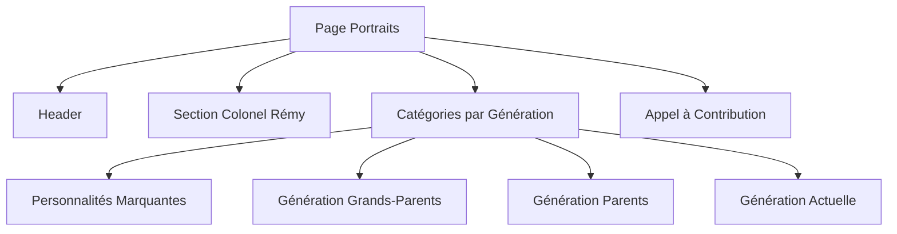
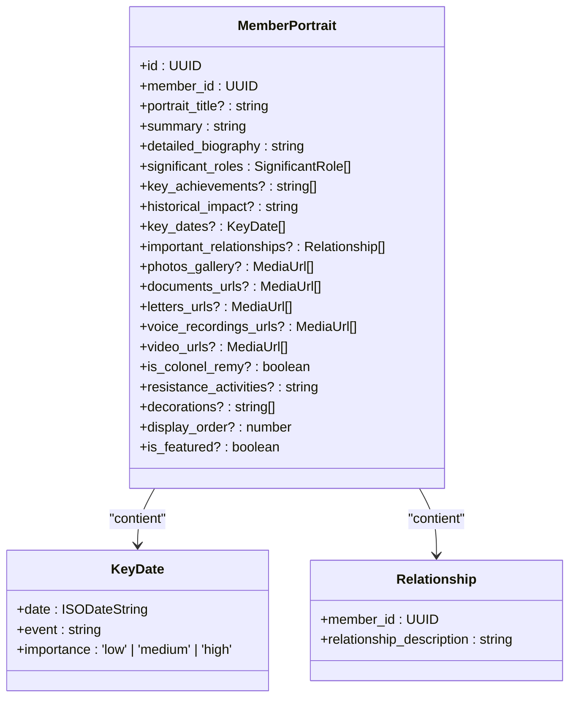
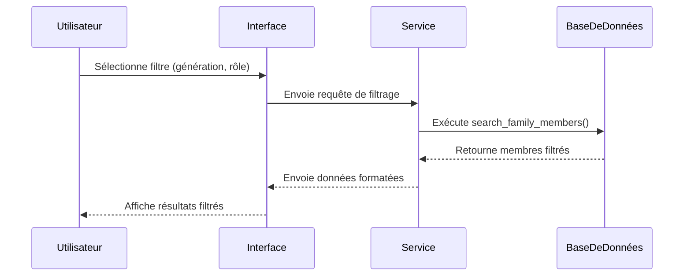
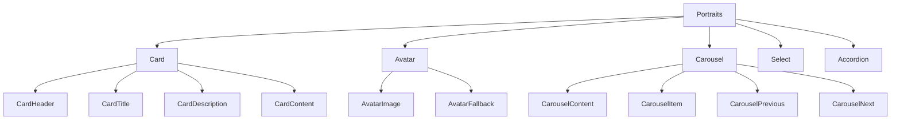

# Portraits des Membres

<cite>
**Fichiers référencés dans ce document**  
- [app\portraits\page.tsx](file://app/portraits/page.tsx)
- [components\ui\card.tsx](file://components/ui/card.tsx)
- [components\ui\avatar.tsx](file://components/ui/avatar.tsx)
- [components\ui\carousel.tsx](file://components/ui/carousel.tsx)
- [components\ui\select.tsx](file://components/ui/select.tsx)
- [components\ui\accordion.tsx](file://components/ui/accordion.tsx)
- [lib\services\portraits.ts](file://lib/services/portraits.ts)
- [types\index.ts](file://types/index.ts)
- [supabase\migrations\20251114062946_create_archives_testimonies.sql](file://supabase/migrations/20251114062946_create_archives_testimonies.sql)
- [supabase\migrations\20251114063120_create_api_functions.sql](file://supabase/migrations/20251114063120_create_api_functions.sql)
</cite>

## Table des matières
1. [Introduction](#introduction)
2. [Grille de Portraits et Organisation](#grille-de-portraits-et-organisation)
3. [Fiches Individuelles Détaillées](#fiches-individuelles-détaillées)
4. [Système de Filtrage](#système-de-filtrage)
5. [Composants Utilisés](#composants-utilisés)
6. [Gestion des Métadonnées](#gestion-des-métadonnées)
7. [Considérations de Performance](#considérations-de-performance)
8. [Navigation entre Membres](#navigation-entre-membres)
9. [Cas Spécifique : Colonel Rémy](#cas-spécifique--colonel-rémy)
10. [Conclusion](#conclusion)

## Introduction

La section Portraits des Membres du projet Decker est conçue pour présenter de manière structurée et interactive les membres marquants de la famille. Cette documentation explore en profondeur l'implémentation technique, l'architecture des données et les composants utilisés pour créer une expérience utilisateur riche et informative. Le système permet d'organiser les membres par génération ou importance, de filtrer par période ou rôle familial, et de fournir des fiches détaillées intégrant divers médias et documents.

**Section sources**
- [app\portraits\page.tsx](file://app/portraits/page.tsx#L6-L104)

## Grille de Portraits et Organisation

La grille de portraits est implémentée à l'aide du composant **Card** de shadcn/ui, qui fournit une structure visuelle cohérente et responsive. Les membres sont organisés en catégories basées sur la génération ou l'importance historique, permettant une navigation intuitive à travers l'histoire familiale.

Chaque catégorie est représentée par une carte contenant un titre, une description et un compteur indiquant le nombre de membres documentés. L'organisation par génération suit une chronologie claire : génération des grands-parents (guerres mondiales), génération des parents (après-guerre), et génération actuelle. Cette structure hiérarchique facilite la compréhension des liens temporels et généalogiques.



**Diagram sources**
- [app\portraits\page.tsx](file://app/portraits/page.tsx#L8-L29)
- [components\ui\card.tsx](file://components/ui/card.tsx#L5-L77)

**Section sources**
- [app\portraits\page.tsx](file://app/portraits/page.tsx#L69-L88)

## Fiches Individuelles Détaillées

Les fiches individuelles détaillées combinent plusieurs composants pour offrir une expérience immersive. Chaque fiche utilise le composant **Avatar** pour afficher la photo de profil du membre, accompagnée de son nom et de son rôle familial.

La galerie personnelle est implémentée avec le composant **Carousel**, permettant de naviguer entre les photos, documents, lettres et enregistrements vocaux associés à chaque membre. La chronologie des dates clés est gérée par un système de données structurées, bien que le composant **Timeline** ne soit pas encore implémenté dans le codebase.

La biographie et les contributions sont présentées dans un composant **Accordion**, qui permet de déplier progressivement les informations détaillées. Ce système optimise l'espace tout en offrant un accès complet aux contenus textuels.



**Diagram sources**
- [types\index.ts](file://types/index.ts#L464-L508)
- [supabase\migrations\20251114062946_create_archives_testimonies.sql](file://supabase/migrations/20251114062946_create_archives_testimonies.sql#L168-L197)

**Section sources**
- [types\index.ts](file://types/index.ts#L449-L508)

## Système de Filtrage

Le système de filtrage permet aux utilisateurs de rechercher des membres par période historique ou rôle familial. Bien que l'interface actuelle n'affiche pas encore les contrôles de filtrage, la base de données et les fonctions API sont conçues pour supporter cette fonctionnalité.

La fonction `search_family_members` dans les migrations Supabase permet une recherche avancée basée sur plusieurs critères : statut vital, importance, génération et similarité de texte. Le composant **Select** de shadcn/ui est disponible dans le projet et peut être intégré pour créer des menus déroulants permettant de filtrer par génération ou rôle significatif.



**Diagram sources**
- [supabase\migrations\20251114063120_create_api_functions.sql](file://supabase/migrations/20251114063120_create_api_functions.sql#L137-L185)
- [components\ui\select.tsx](file://components/ui/select.tsx#L9-L160)

**Section sources**
- [supabase\migrations\20251114063120_create_api_functions.sql](file://supabase/migrations/20251114063120_create_api_functions.sql#L137-L185)

## Composants Utilisés

Le système de portraits repose sur une collection de composants shadcn/ui qui assurent une cohérence visuelle et une expérience utilisateur optimale :

- **Card** : Structure principale pour les portraits et catégories
- **Avatar** : Affichage des photos de profil avec fallback
- **Carousel** : Navigation entre les médias personnels
- **Select** : Contrôle de filtrage par génération ou rôle
- **Accordion** : Affichage progressif de la biographie et contributions
- **Button** : Interactions utilisateur (navigation, actions)

Ces composants sont intégrés de manière modulaire, permettant une personnalisation tout en maintenant un style uniforme à travers l'application.



**Diagram sources**
- [components\ui\card.tsx](file://components/ui/card.tsx#L5-L77)
- [components\ui\avatar.tsx](file://components/ui/avatar.tsx#L8-L51)
- [components\ui\carousel.tsx](file://components/ui/carousel.tsx#L45-L263)
- [components\ui\select.tsx](file://components/ui/select.tsx#L9-L160)
- [components\ui\accordion.tsx](file://components/ui/accordion.tsx#L9-L58)

**Section sources**
- [components\ui\card.tsx](file://components/ui/card.tsx#L5-L77)
- [components\ui\avatar.tsx](file://components/ui/avatar.tsx#L8-L51)
- [components\ui\carousel.tsx](file://components/ui/carousel.tsx#L45-L263)

## Gestion des Métadonnées

Les métadonnées des portraits sont soigneusement structurées pour permettre une classification et une recherche efficaces. Chaque portrait inclut des champs de métadonnées tels que `display_order` pour le tri, `is_featured` pour les membres marquants, et `significant_roles` pour la catégorisation par rôle familial.

Les rôles significatifs sont définis comme une union de types TypeScript, incluant des catégories comme 'family_founder', 'war_hero', 'artist', 'scholar', 'entrepreneur', et 'community_leader'. Cette approche type-safe garantit la cohérence des données tout en permettant une flexibilité dans la classification.

**Section sources**
- [types\index.ts](file://types/index.ts#L452-L459)

## Considérations de Performance

Plusieurs considérations de performance ont été intégrées dans la conception du système de portraits :

1. **Chargement différé des galeries** : Le composant Carousel implémente un chargement progressif des images pour éviter de surcharger la mémoire.
2. **Pagination des résultats** : La fonction de recherche limite les résultats à 50 membres, avec un système de pagination prévu.
3. **Indexation de base de données** : Des index sont créés sur les champs fréquemment consultés comme `is_featured`, `is_colonel_remy`, et `display_order`.
4. **Caching des requêtes** : Les services utilisent Supabase avec des options de caching pour réduire les appels API répétés.

**Section sources**
- [supabase\migrations\20251114062946_create_archives_testimonies.sql](file://supabase/migrations/20251114062946_create_archives_testimonies.sql#L193-L197)
- [lib\services\portraits.ts](file://lib/services/portraits.ts#L4-L55)

## Navigation entre Membres

Le système de navigation entre les membres est conçu pour faciliter la découverte des relations familiales. Les fiches individuelles incluent des liens interactifs vers les membres connexes, basés sur les relations définies dans le champ `important_relationships`.

La structure de données permet de naviguer entre les générations et de comprendre les liens familiaux. Un système de navigation par flèches (précédent/suivant) est également disponible via le composant Carousel, permettant de parcourir les membres d'une même catégorie.

**Section sources**
- [types\index.ts](file://types/index.ts#L485-L490)

## Cas Spécifique : Colonel Rémy

Le Colonel Rémy bénéficie d'un traitement spécial en tant que personnage historique majeur de la famille. Une section dédiée dans la page des portraits met en avant son rôle de résistant et de héros de la France libre.

La fiche du Colonel Rémy inclut des champs spécifiques comme `resistance_activities` et `decorations`, ainsi qu'une identification explicite avec le champ `is_colonel_remy`. Un service dédié `getColonelRemyPortrait()` permet de récupérer ses données de manière optimisée.

```mermaid
flowchart TD
A[Page Portraits] --> B[Section Colonel Rémy]
B --> C[Avatar avec fallback "R"]
B --> D[Informations de base]
B --> E[Description de rôle]
B --> F[Appel à contribution]
C --> G[Photo ou fallback]
D --> H[Nom: Colonel Rémy]
E --> I[Résistant, Héros France Libre]
```

**Diagram sources**
- [app\portraits\page.tsx](file://app/portraits/page.tsx#L47-L67)
- [lib\services\portraits.ts](file://lib/services/portraits.ts#L38-L54)

**Section sources**
- [app\portraits\page.tsx](file://app/portraits/page.tsx#L47-L67)
- [lib\services\portraits.ts](file://lib/services/portraits.ts#L38-L54)

## Conclusion

Le système de portraits du projet Decker représente une solution complète et bien structurée pour présenter l'histoire familiale. En combinant des composants UI modernes avec une architecture de données robuste, il offre une expérience utilisateur riche et interactive. L'utilisation de shadcn/ui garantit une cohérence visuelle, tandis que la structure de données bien pensée permet une évolution future avec de nouvelles fonctionnalités comme le filtrage avancé et la navigation relationnelle.