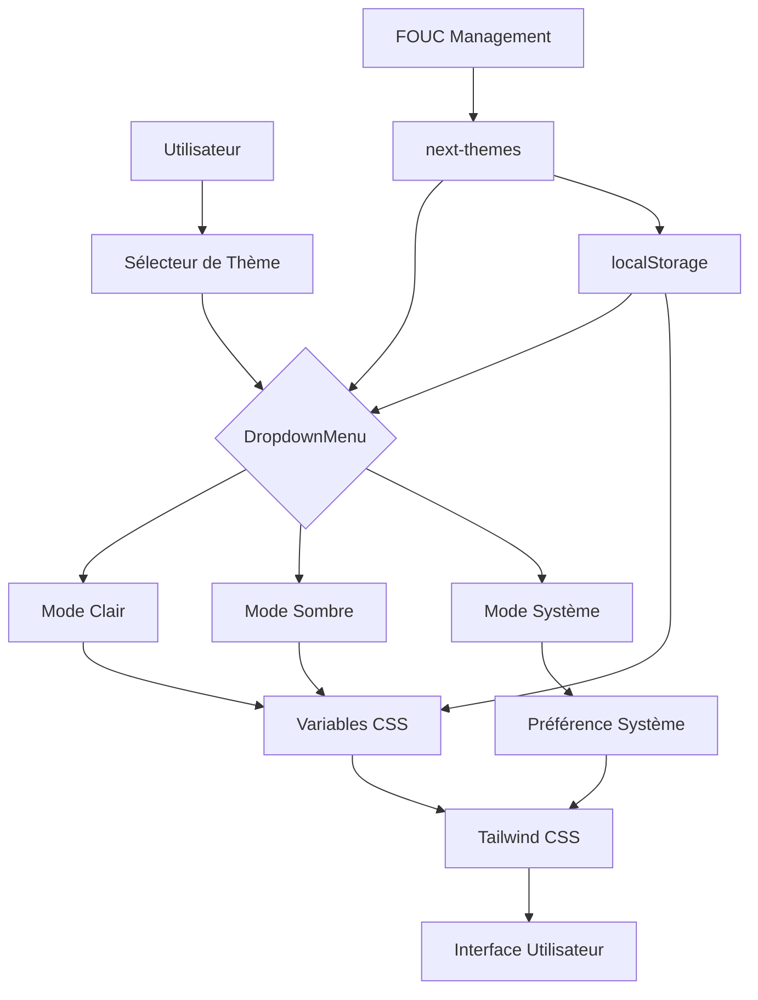
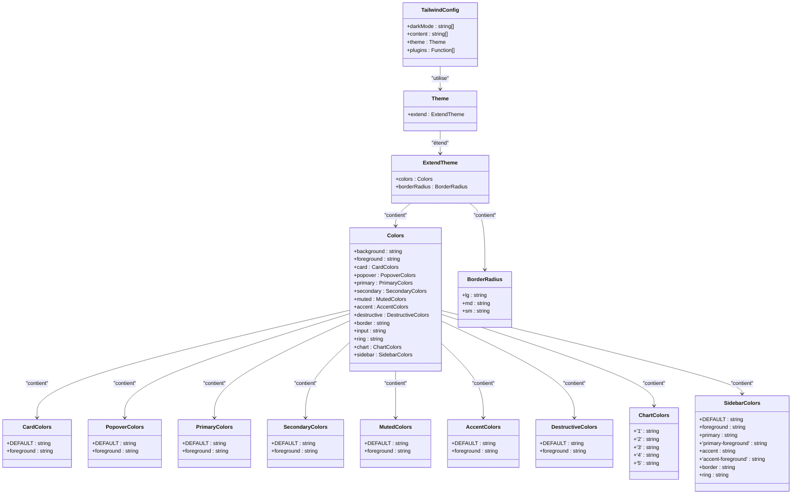
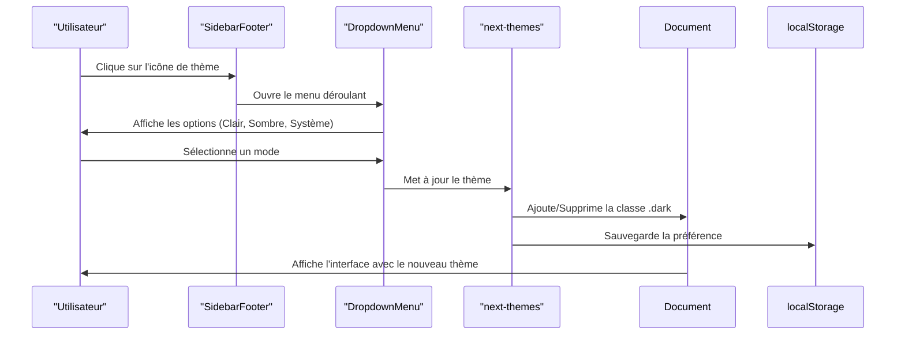

# Système de Thème Clair/Sombre

<cite>
**Fichiers référencés dans ce document**   
- [app/globals.css](file://app/globals.css)
- [app/layout.tsx](file://app/layout.tsx)
- [tailwind.config.ts](file://tailwind.config.ts)
- [components/ui/dropdown-menu.tsx](file://components/ui/dropdown-menu.tsx)
- [components/ui/sidebar.tsx](file://components/ui/sidebar.tsx)
- [PLAN.md](file://PLAN.md)
</cite>

## Table des matières
1. [Introduction](#introduction)
2. [Architecture du Système de Thème](#architecture-du-système-de-thème)
3. [Implémentation des Variables CSS](#implémentation-des-variables-css)
4. [Configuration de Tailwind CSS](#configuration-de-tailwind-css)
5. [Intégration du Sélecteur de Thème](#intégration-du-sélecteur-de-thème)
6. [Gestion de la Persistance et du FOUC](#gestion-de-la-persistance-et-du-fouc)
7. [Considérations de Performance et de Design System](#considérations-de-performance-et-de-design-system)
8. [Résolution des Problèmes Courants](#résolution-des-problèmes-courants)

## Introduction
Le système de thème du projet Decker permet aux utilisateurs de basculer entre les modes clair, sombre et système selon leurs préférences. Ce système repose sur une architecture bien conçue combinant `next-themes`, Tailwind CSS, et les composants shadcn/ui pour offrir une expérience utilisateur fluide et cohérente. L'implémentation assure la persistance des préférences utilisateur via `localStorage`, évite le flash de contenu non stylisé (FOUC) au chargement, et intègre parfaitement le design system du projet.

## Architecture du Système de Thème

Le système de thème est construit autour de plusieurs composants clés qui interagissent pour fournir une expérience de changement de thème fluide et persistante. L'architecture repose sur une combinaison de `next-themes` pour la gestion du thème, Tailwind CSS pour le styling conditionnel, et les composants shadcn/ui pour l'interface utilisateur.

**Sources du diagramme**
- [app/globals.css](file://app/globals.css)
- [tailwind.config.ts](file://tailwind.config.ts)
- [components/ui/dropdown-menu.tsx](file://components/ui/dropdown-menu.tsx)

## Implémentation des Variables CSS

Le système de thème utilise des variables CSS définies dans `globals.css` pour gérer les couleurs et les styles dans les différents modes. Ces variables sont définies dans le sélecteur `:root` pour le mode clair et dans la classe `.dark` pour le mode sombre.

Les variables CSS sont organisées en plusieurs catégories principales :
- **Background/Foreground** : Couleurs de base pour l'arrière-plan et le texte
- **Card/Popover** : Styles pour les cartes et les popovers
- **Primary/Secondary** : Couleurs principales et secondaires
- **Muted/Accent** : Couleurs atténuées et d'accentuation
- **Destructive** : Couleurs pour les éléments destructeurs
- **Border/Input/Ring** : Bordures, champs de saisie et anneaux de focus
- **Chart** : Couleurs pour les graphiques
- **Sidebar** : Couleurs spécifiques à la sidebar

La définition des variables suit une convention HSL (Teinte, Saturation, Luminosité) qui permet une gestion plus intuitive des couleurs et facilite les ajustements.

**Sources de la section**
- [app/globals.css](file://app/globals.css#L13-L82)

## Configuration de Tailwind CSS

La configuration de Tailwind CSS dans `tailwind.config.ts` étend le thème par défaut pour utiliser les variables CSS définies dans `globals.css`. Cette configuration permet à Tailwind d'accéder aux variables de thème via la fonction `hsl(var(--variable))`.

La configuration inclut plusieurs éléments clés :
- **darkMode** : Configuré en mode "class" pour basculer entre les thèmes en ajoutant/supprimant la classe `.dark` sur l'élément racine
- **Couleurs étendues** : Toutes les variables CSS sont mappées aux classes Tailwind correspondantes
- **Bordures arrondies** : Définition des rayons de bordure basés sur la variable CSS `--radius`
- **Plugins** : Inclusion du plugin `tailwindcss-animate` pour les animations

Cette configuration assure une cohérence entre le système de thème et le design system de l'application, permettant une utilisation transparente des classes Tailwind tout en respectant le thème actuel.

**Sources du diagramme**
- [tailwind.config.ts](file://tailwind.config.ts#L1-L72)

**Sources de la section**
- [tailwind.config.ts](file://tailwind.config.ts#L1-L72)

## Intégration du Sélecteur de Thème

Le sélecteur de thème est intégré dans le `SidebarFooter` de l'application, permettant aux utilisateurs de changer facilement le mode d'affichage. L'interface utilisateur utilise le composant `DropdownMenu` de shadcn/ui pour créer un menu déroulant avec trois options : Clair, Sombre et Système.

L'implémentation suit les bonnes pratiques de shadcn/ui avec :
- **DropdownMenu** : Composant racine du menu déroulant
- **DropdownMenuTrigger** : Bouton qui ouvre le menu, affichant une icône selon le thème actuel
- **DropdownMenuContent** : Contenu du menu déroulant
- **DropdownMenuRadioGroup** : Groupe de boutons radio pour les options de thème
- **DropdownMenuRadioItem** : Éléments du groupe de boutons radio
- **Icônes Lucide** : Utilisation des icônes Sun, Moon et Monitor de lucide-react pour représenter les différents modes

Le composant utilise des icônes différentes selon le thème actuel pour une meilleure expérience utilisateur. Par exemple, une icône de soleil est affichée en mode sombre, tandis qu'une icône de lune est affichée en mode clair.

**Sources du diagramme**
- [components/ui/sidebar.tsx](file://components/ui/sidebar.tsx)
- [components/ui/dropdown-menu.tsx](file://components/ui/dropdown-menu.tsx)

**Sources de la section**
- [components/ui/sidebar.tsx](file://components/ui/sidebar.tsx#L378-L391)
- [components/ui/dropdown-menu.tsx](file://components/ui/dropdown-menu.tsx#L1-L202)

## Gestion de la Persistance et du FOUC

Le système de thème gère la persistance des préférences utilisateur et évite le flash de contenu non stylisé (FOUC) grâce à plusieurs techniques combinées.

### Persistance des Préférences
Les préférences de thème sont persistées dans `localStorage` via la bibliothèque `next-themes`. Lorsqu'un utilisateur change de thème, la sélection est automatiquement sauvegardée et restaurée lors des visites ultérieures. Cette persistance est transparente et ne nécessite aucune intervention supplémentaire du développeur.

### Gestion du FOUC
Le FOUC (Flash of Unstyled Content) est un problème courant dans les applications web où le contenu est temporairement affiché avec des styles par défaut avant que les styles corrects ne soient appliqués. Le système de thème de Decker résout ce problème en utilisant plusieurs techniques :

1. **suppressHydrationWarning** : Cette propriété est utilisée pour supprimer les avertissements de désynchronisation entre le rendu côté serveur et côté client lors de l'hydratation initiale.

2. **Initialisation rapide du thème** : Le thème est appliqué dès que possible dans le cycle de vie de l'application, minimisant le temps pendant lequel les styles incorrects pourraient être visibles.

3. **Styles par défaut cohérents** : Les styles par défaut (mode clair) sont définis dans `:root` et sont cohérents avec l'apparence attendue, réduisant l'impact visuel du FOUC.

4. **Transitions fluides** : Des transitions CSS sont appliquées aux changements de couleur pour que les transitions entre les thèmes soient fluides et agréables pour l'œil.

Ces techniques combinées assurent que les utilisateurs ne voient jamais un flash de contenu non stylisé ou incohérent lors du chargement de l'application.

**Sources de la section**
- [PLAN.md](file://PLAN.md#L77-L95)
- [app/globals.css](file://app/globals.css)

## Considérations de Performance et de Design System

Le système de thème a été conçu avec des considérations de performance et d'intégration avec le design system du projet.

### Performance
L'utilisation de variables CSS pour le système de thème offre plusieurs avantages en termes de performance :
- **Mise à jour efficace** : Changer de thème nécessite seulement d'ajouter/supprimer une classe CSS, ce qui est une opération très légère pour le moteur de rendu.
- **Pas de re-rendu des composants** : Contrairement à une approche basée sur React state, le changement de thème ne déclenche pas de re-rendu des composants, car c'est le CSS qui gère le changement d'apparence.
- **Petite empreinte mémoire** : Les variables CSS sont stockées au niveau du DOM et n'ajoutent pas de surcharge mémoire supplémentaire dans l'application React.

### Intégration avec le Design System
Le système de thème est étroitement intégré avec le design system de l'application :
- **Palette de couleurs centralisée** : Toutes les couleurs sont définies dans un seul endroit (`globals.css`), ce qui facilite la maintenance et les modifications.
- **Cohérence visuelle** : L'utilisation de variables HSL permet des ajustements cohérents de la luminosité et de la saturation à travers tous les composants.
- **Accessibilité** : Les contrastes entre les couleurs de texte et d'arrière-plan sont soigneusement choisis pour respecter les normes d'accessibilité.
- **Extensibilité** : Le système est facilement extensible pour ajouter de nouveaux thèmes ou ajuster les couleurs existantes.

Cette intégration assure que tous les composants de l'application respectent le thème actuel de manière cohérente, créant une expérience utilisateur uniforme.

**Sources de la section**
- [app/globals.css](file://app/globals.css)
- [tailwind.config.ts](file://tailwind.config.ts)

## Résolution des Problèmes Courants

Plusieurs problèmes courants peuvent survenir lors de l'implémentation d'un système de thème, et le projet Decker inclut des solutions pour ces cas.

### Incohérences de Couleurs entre Composants
Un problème courant est l'incohérence des couleurs entre différents composants, surtout lorsqu'ils proviennent de différentes bibliothèques ou ont été développés à différents moments. Le système de thème de Decker résout ce problème par :

1. **Gestion centralisée des palettes** : Toutes les couleurs sont définies dans `globals.css` comme variables CSS, ce qui assure que tous les composants utilisent exactement les mêmes valeurs de couleur.

2. **Utilisation de Tailwind avec variables** : En configurant Tailwind pour utiliser les variables CSS via `hsl(var(--variable))`, on s'assure que même les classes utilitaires Tailwind respectent le thème actuel.

3. **Composants shadcn/ui** : L'utilisation de composants prédéfinis de shadcn/ui assure une cohérence visuelle, car ces composants sont conçus pour fonctionner avec le système de thème.

### Problèmes de Transition
Les transitions entre thèmes peuvent parfois être saccadées ou produire des effets visuels indésirables. Le système de Decker gère cela en :

1. **Transitions CSS fluides** : Des transitions sont appliquées aux propriétés de couleur pour que les changements soient progressifs plutôt que instantanés.

2. **Synchronisation des animations** : Tous les éléments de l'interface changent de thème simultanément, évitant les effets de "clignotement" où certaines parties changent avant d'autres.

3. **Optimisation des performances** : En utilisant des propriétés CSS optimisées pour les animations (comme `opacity` et `transform`), on s'assure que les transitions sont fluides même sur les appareils moins puissants.

Ces solutions combinées assurent que le système de thème est non seulement fonctionnel mais aussi agréable à utiliser, avec des transitions fluides et une cohérence visuelle parfaite à travers toute l'application.

**Sources de la section**
- [PLAN.md](file://PLAN.md#L77-L95)
- [app/globals.css](file://app/globals.css)
- [tailwind.config.ts](file://tailwind.config.ts)