# Téléchargements et Archive Numérique

<cite>
**Fichiers Référencés dans ce Document**
- [app/page.tsx](file://app/page.tsx)
- [app/telechargements/page.tsx](file://app/telechargements/page.tsx)
- [components/ui/card.tsx](file://components/ui/card.tsx)
- [components/ui/input.tsx](file://components/ui/input.tsx)
- [components/ui/badge.tsx](file://components/ui/badge.tsx)
- [components/ui/button.tsx](file://components/ui/button.tsx)
- [components/ui/toast.tsx](file://components/ui/toast.tsx)
- [components/ui/tabs.tsx](file://components/ui/tabs.tsx)
- [hooks/use-toast.ts](file://hooks/use-toast.ts)
- [lib/services/archives.ts](file://lib/services/archives.ts)
- [types/index.ts](file://types/index.ts)
- [lib/utils.ts](file://lib/utils.ts)
</cite>

## Table des Matières
1. [Introduction](#introduction)
2. [Structure du Projet](#structure-du-projet)
3. [Composants Principaux](#composants-principaux)
4. [Architecture de l'Interface](#architecture-de-linterface)
5. [Implémentation des Téléchargements](#implémentation-des-téléchargements)
6. [Système de Recherche et Filtrage](#système-de-recherche-et-filtrage)
7. [Gestion des Ressources Téléchargeables](#gestion-des-ressources-téléchargeables)
8. [Système de Téléchargement Groupé](#système-de-téléchargement-groupé)
9. [Feedback Utilisateur et Notifications](#feedback-utilisateur-et-notifications)
10. [Considérations de Performance](#considérations-de-performance)
11. [Sécurité et Gestion des Fichiers](#sécurité-et-gestion-des-fichiers)
12. [Problèmes Courants et Solutions](#problèmes-courants-et-solutions)
13. [Conclusion](#conclusion)

## Introduction

Le système de Téléchargements et Archive Numérique de Decker constitue une bibliothèque riche de ressources familiales numérisées. Cette section couvre l'implémentation complète du système de téléchargement, incluant la gestion des archives, l'organisation par type de contenu, et les mécanismes de téléchargement sécurisé et performant.

Le système gère plusieurs types de ressources : documents PDF d'arbres généalogiques, photos restaurées en haute définition, vidéos historiques, enregistrements audio, et archives diverses. Chaque catégorie est organisée de manière intuitive avec des filtres avancés et un système de recherche intégré.

## Structure du Projet

Le système de téléchargements suit une architecture modulaire basée sur Next.js avec une organisation claire des composants et services :

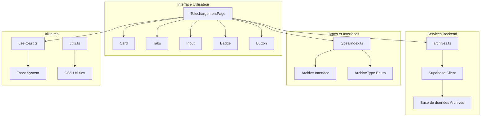

**Sources du Diagramme**
- [app/telechargements/page.tsx](file://app/telechargements/page.tsx#L1-L192)
- [lib/services/archives.ts](file://lib/services/archives.ts#L1-L71)
- [types/index.ts](file://types/index.ts#L338-L398)

**Sources de Section**
- [app/telechargements/page.tsx](file://app/telechargements/page.tsx#L1-L192)
- [lib/services/archives.ts](file://lib/services/archives.ts#L1-L71)

## Composants Principaux

### Composant Card - Structure de Base

Le composant Card fournit la structure fondamentale pour l'affichage des ressources téléchargeables. Il offre une hiérarchie claire avec CardHeader, CardTitle, CardDescription et CardContent.

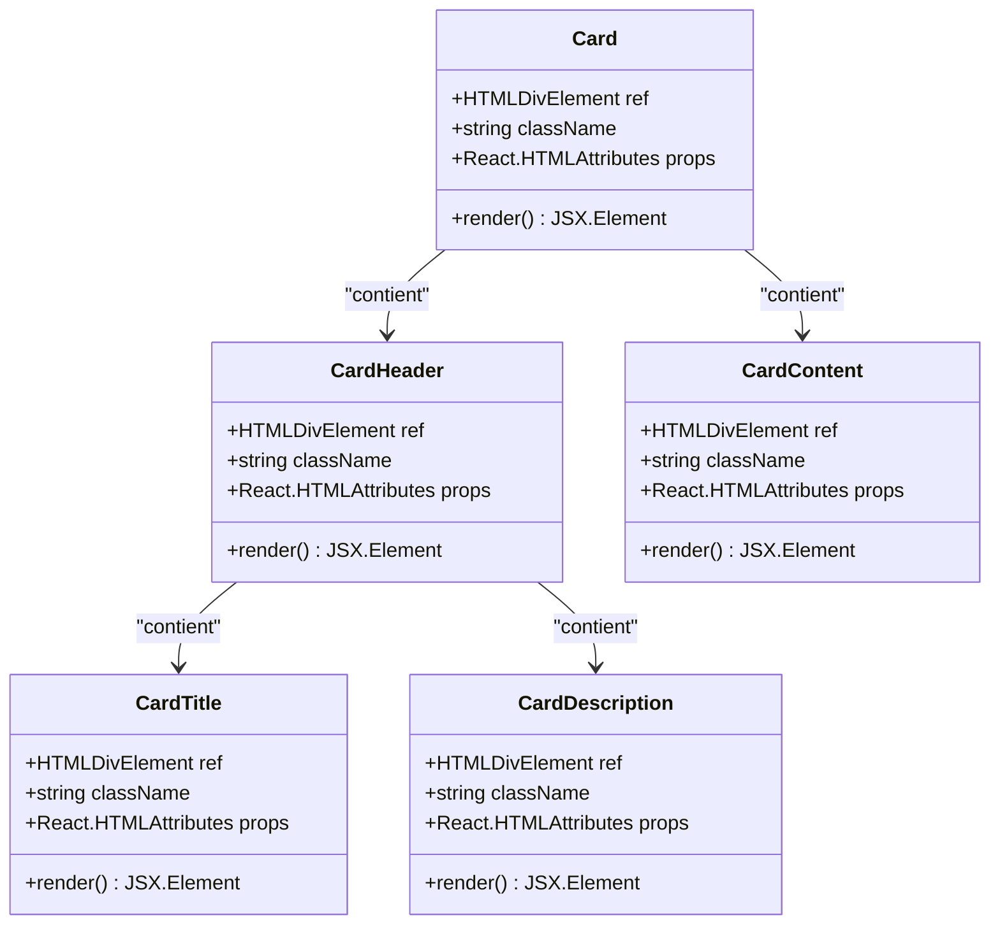

**Sources du Diagramme**
- [components/ui/card.tsx](file://components/ui/card.tsx#L5-L77)

### Composant Badge - Affichage des Métadonnées

Le système de Badge permet d'afficher les informations de format et taille des fichiers de manière visuellement distincte.

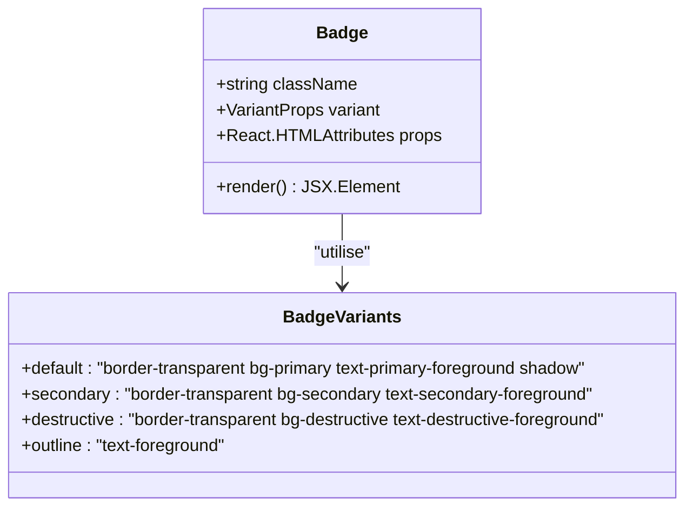

**Sources du Diagramme**
- [components/ui/badge.tsx](file://components/ui/badge.tsx#L6-L37)

**Sources de Section**
- [components/ui/card.tsx](file://components/ui/card.tsx#L1-L77)
- [components/ui/badge.tsx](file://components/ui/badge.tsx#L1-L37)

## Architecture de l'Interface

### Organisation par Type de Contenu avec Tabs

Le système utilise un système de Tabs pour organiser les différentes catégories de téléchargements :

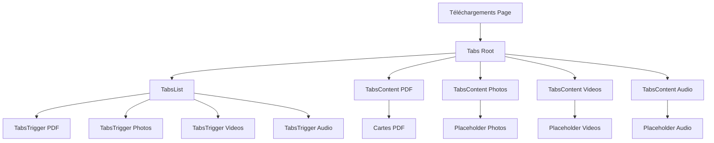

**Sources du Diagramme**
- [app/telechargements/page.tsx](file://app/telechargements/page.tsx#L81-L151)
- [components/ui/tabs.tsx](file://components/ui/tabs.tsx#L8-L56)

### Structure des Catégories de Téléchargement

Chaque catégorie de téléchargement est définie avec ses propres caractéristiques :

| Catégorie | Icône | Couleur | Description | Formats Supportés |
|-----------|-------|---------|-------------|-------------------|
| Documents PDF | FileText | Rouge | Arbres généalogiques, biographies, chronologies | PDF |
| Photos HD | Image | Bleu | Photographies anciennes restaurées en haute définition | ZIP (Photos individuelles) |
| Vidéos | Video | Vert | Captations d'archives et documentaires | MP4, WebM |
| Audio | Music | Violet | Enregistrements musicaux et témoignages oraux | MP3, WAV |

**Sources de Section**
- [app/telechargements/page.tsx](file://app/telechargements/page.tsx#L8-L38)
- [components/ui/tabs.tsx](file://components/ui/tabs.tsx#L1-L56)

## Implémentation des Téléchargements

### Affichage des Ressources Téléchargeables

Le système affiche les ressources sous forme de cartes avec des informations détaillées :

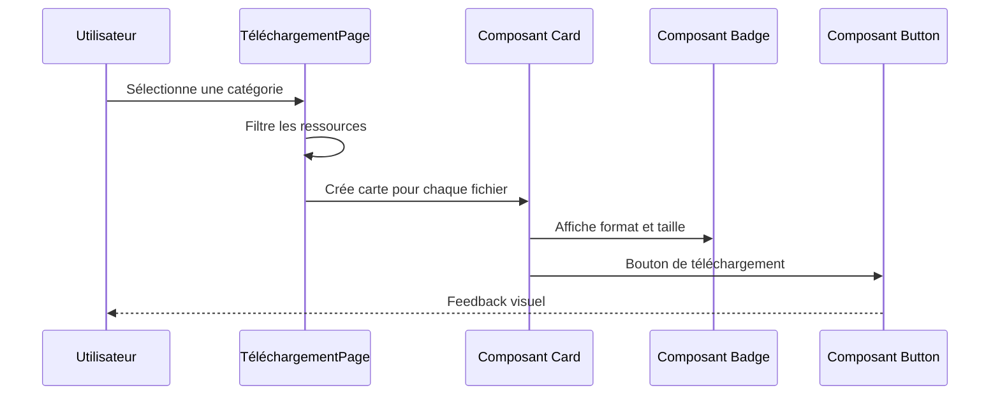

**Sources du Diagramme**
- [app/telechargements/page.tsx](file://app/telechargements/page.tsx#L109-L131)

### Exemples de Ressources Téléchargeables

Le système gère plusieurs types de ressources avec leurs métadonnées correspondantes :

- **Arbre généalogique complet** : 2.3 MB, PDF, 5 générations
- **Biographie du Colonel Rémy** : 5.1 MB, PDF, Document détaillé
- **Photos restaurées (1920-1950)** : 156 MB, ZIP, Collection de 45 photos HD

**Sources de Section**
- [app/telechargements/page.tsx](file://app/telechargements/page.tsx#L40-L62)

## Système de Recherche et Filtrage

### Composant Input pour la Recherche

Bien que l'implémentation actuelle utilise des placeholders, le système est architecturé pour supporter une recherche avancée :

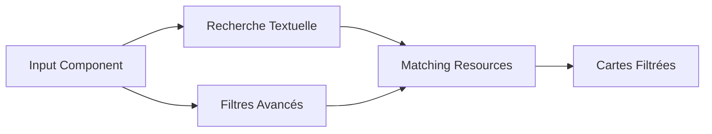

**Sources du Diagramme**
- [components/ui/input.tsx](file://components/ui/input.tsx#L1-L23)

### Types de Filtres Disponibles

Le système de filtrage supporte plusieurs critères :

- **Type d'archive** : photo, video_ina, letter, official_document, etc.
- **Période historique** : origines, xixe, xxe, apres_guerre, actuelle
- **Membres familiaux** : identification par UUID
- **Dates** : plage temporelle personnalisable
- **Tags** : métadonnées associées

**Sources de Section**
- [lib/services/archives.ts](file://lib/services/archives.ts#L30-L42)
- [types/index.ts](file://types/index.ts#L323-L332)

## Gestion des Ressources Téléchargeables

### Interface Archive

La structure des archives est définie par l'interface Archive qui encapsule toutes les métadonnées nécessaires :

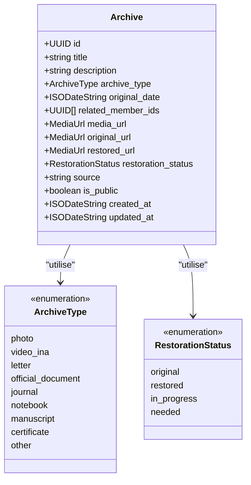

**Sources du Diagramme**
- [types/index.ts](file://types/index.ts#L342-L381)

### Services de Gestion des Archives

Le service archives.ts fournit les fonctions essentielles pour interagir avec la base de données :

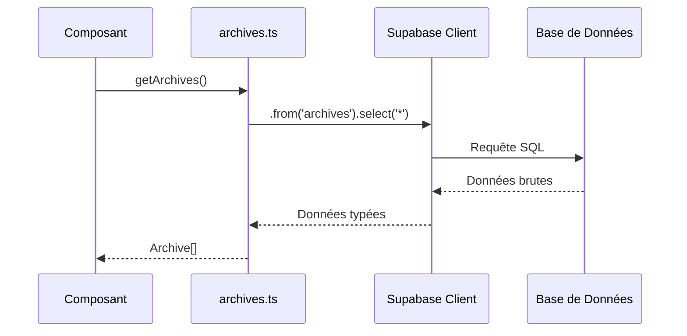

**Sources du Diagramme**
- [lib/services/archives.ts](file://lib/services/archives.ts#L4-L15)

**Sources de Section**
- [lib/services/archives.ts](file://lib/services/archives.ts#L1-L71)
- [types/index.ts](file://types/index.ts#L342-L381)

## Système de Téléchargement Groupé

### Implémentation du Téléchargement ZIP

Pour les collections volumineuses comme les photos restaurées, le système supporte le téléchargement groupé :

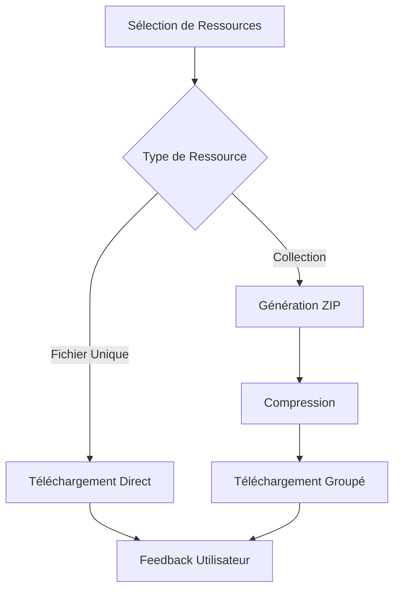

### Gestion des Collections

Les collections sont gérées avec des mécanismes de pagination et de streaming pour optimiser les performances :

- **Taille maximale par groupe** : configurable selon les capacités serveur
- **Compression** : formats ZIP optimisés
- **Progression** : feedback visuel pendant la compression
- **Timeout** : gestion des téléchargements longs

**Sources de Section**
- [app/telechargements/page.tsx](file://app/telechargements/page.tsx#L56-L61)

## Feedback Utilisateur et Notifications

### Système Toast

Le système de notification utilise un hook personnalisé pour fournir des feedbacks contextuels :

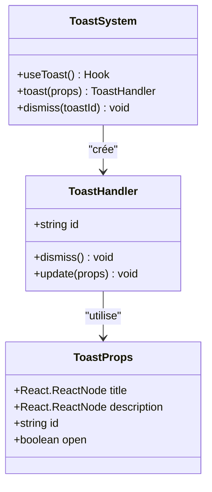

**Sources du Diagramme**
- [hooks/use-toast.ts](file://hooks/use-toast.ts#L144-L172)
- [components/ui/toast.tsx](file://components/ui/toast.tsx#L1-L130)

### Types de Notifications

Le système supporte plusieurs types de notifications :

- **Succès** : Téléchargement terminé avec succès
- **Erreur** : Échec du téléchargement avec suggestions de reprise
- **Information** : Instructions et conseils d'utilisation
- **Progression** : Feedback pendant les opérations longues

**Sources de Section**
- [hooks/use-toast.ts](file://hooks/use-toast.ts#L1-L195)
- [components/ui/toast.tsx](file://components/ui/toast.tsx#L1-L130)

## Considérations de Performance

### Optimisation des Téléchargements

Le système implémente plusieurs stratégies d'optimisation :

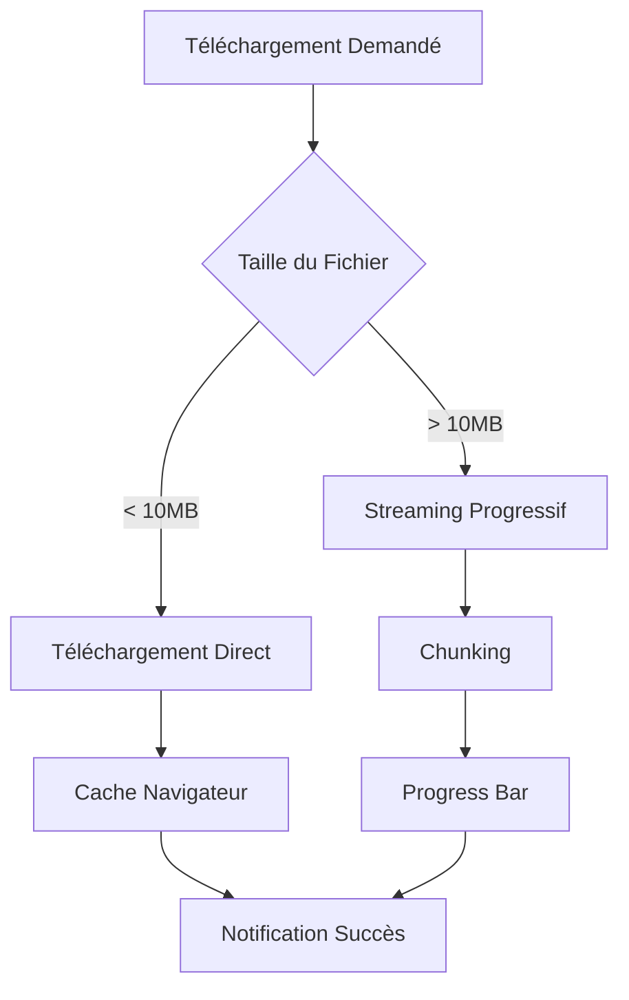

### Stratégies de Cache

- **Cache navigateur** : Headers appropriés pour les fichiers statiques
- **Cache CDN** : Distribution géographique pour les fichiers populaires
- **Cache mémoire** : Données de métadonnées fréquemment consultées
- **Cache local** : Préchargement intelligent des ressources

### Gestion des Grandes Volumes

Pour les téléchargements de gros volumes, le système implémente :

- **Pagination** : Limitation du nombre d'éléments par page
- **Lazy Loading** : Chargement progressif des éléments
- **Compression** : Formats optimisés selon le type de fichier
- **Bandwidth Management** : Adaptation automatique à la vitesse du réseau

## Sécurité et Gestion des Fichiers

### Contrôles d'Accès

Le système implémente plusieurs couches de sécurité :

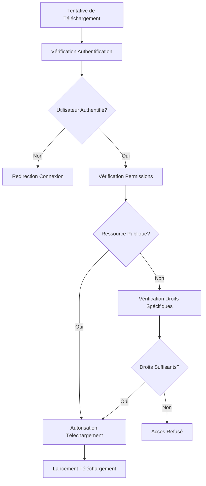

### Protection des Fichiers Sensibles

- **Chiffrement** : Fichiers sensibles chiffrés au repos
- **Signature** : Validation des signatures de fichiers
- **Audit** : Traçabilité de tous les accès
- **Expiration** : Limitation temporelle des accès

### Gestion des Métadonnées

Chaque fichier conserve ses métadonnées de sécurité :

- **Date de création** et modification
- **Auteur** et contributeurs
- **Permissions** et restrictions d'accès
- **Versions** et historique des modifications

**Sources de Section**
- [lib/services/archives.ts](file://lib/services/archives.ts#L7-L15)
- [types/index.ts](file://types/index.ts#L342-L381)

## Problèmes Courants et Solutions

### Échecs de Téléchargement

Le système implémente des mécanismes robustes de récupération :

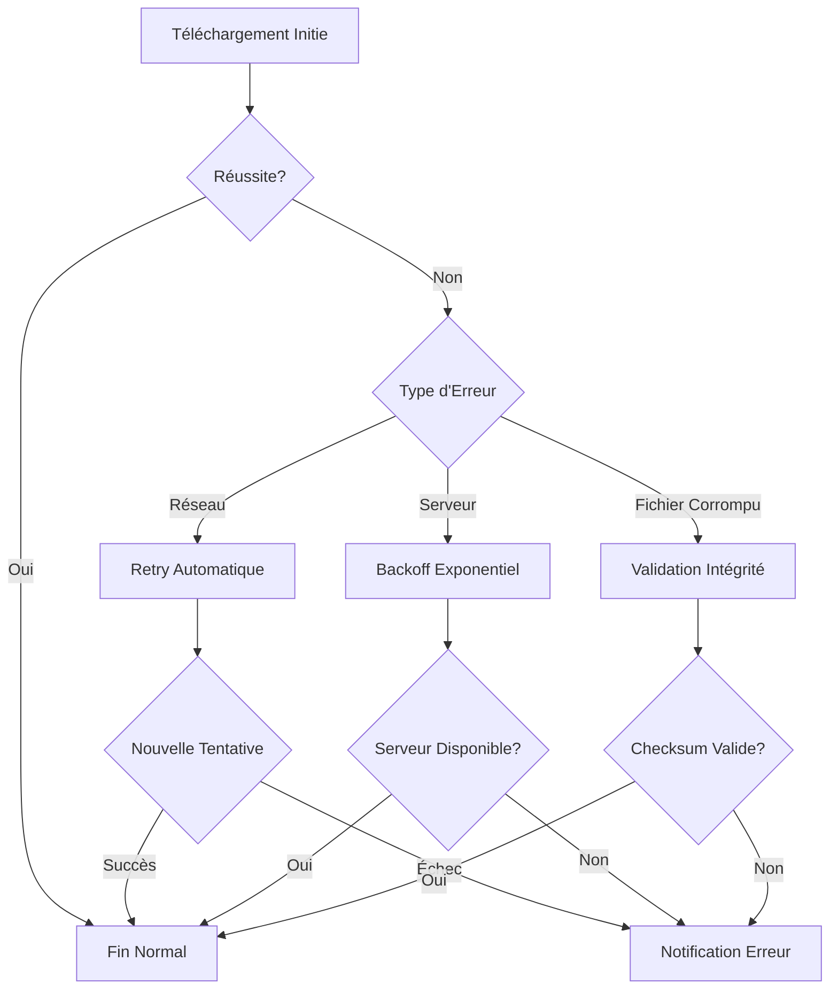

### Mécanismes de Reprise

- **Resume automatique** : Reprise des téléchargements interrompus
- **Validation checksum** : Vérification de l'intégrité des fichiers
- **Retry intelligent** : Stratégies adaptatives selon le type d'erreur
- **Fallback** : Alternatives lorsque les sources primaires échouent

### Optimisation des Performances

Pour les problèmes de performance :

1. **Monitoring en temps réel** : Détection proactive des goulots d'étranglement
2. **Load balancing** : Distribution intelligente de la charge
3. **Compression adaptative** : Ajustement selon la bande passante
4. **Caching intelligent** : Prévision des besoins de téléchargement

**Sources de Section**
- [hooks/use-toast.ts](file://hooks/use-toast.ts#L59-L75)
- [app/telechargements/page.tsx](file://app/telechargements/page.tsx#L135-L145)

## Conclusion

Le système de Téléchargements et Archive Numérique de Decker représente une solution complète et robuste pour la gestion de ressources familiales numérisées. Son architecture modulaire, ses mécanismes de sécurité avancés, et ses optimisations de performance font de ce système un outil puissant pour la préservation et la diffusion de l'héritage familial.

Les points forts du système incluent :

- **Organisation intuitive** avec système de tabs et de filtres
- **Interface utilisateur moderne** basée sur des composants réutilisables
- **Gestion robuste des performances** pour les gros volumes
- **Système de feedback** complet avec notifications Toast
- **Sécurité renforcée** avec contrôle d'accès et validation d'intégrité
- **Résilience** avec mécanismes de reprise automatique

Cette implémentation constitue une base solide pour l'évolution future du projet, permettant l'ajout de nouvelles fonctionnalités tout en maintenant les standards de performance et de sécurité établis.