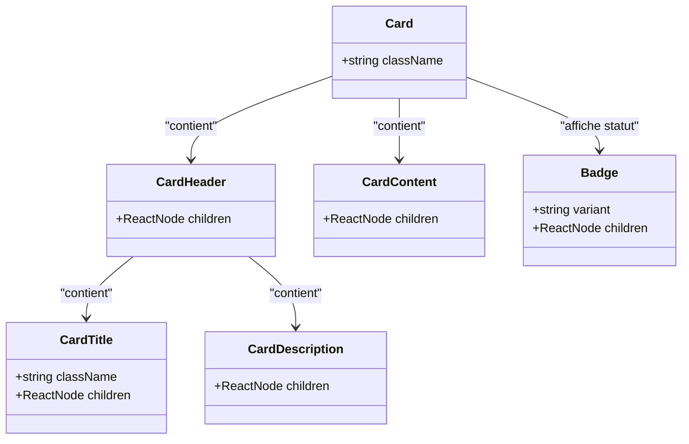
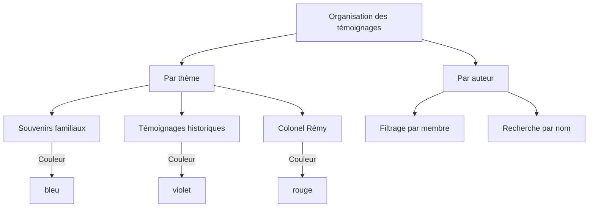
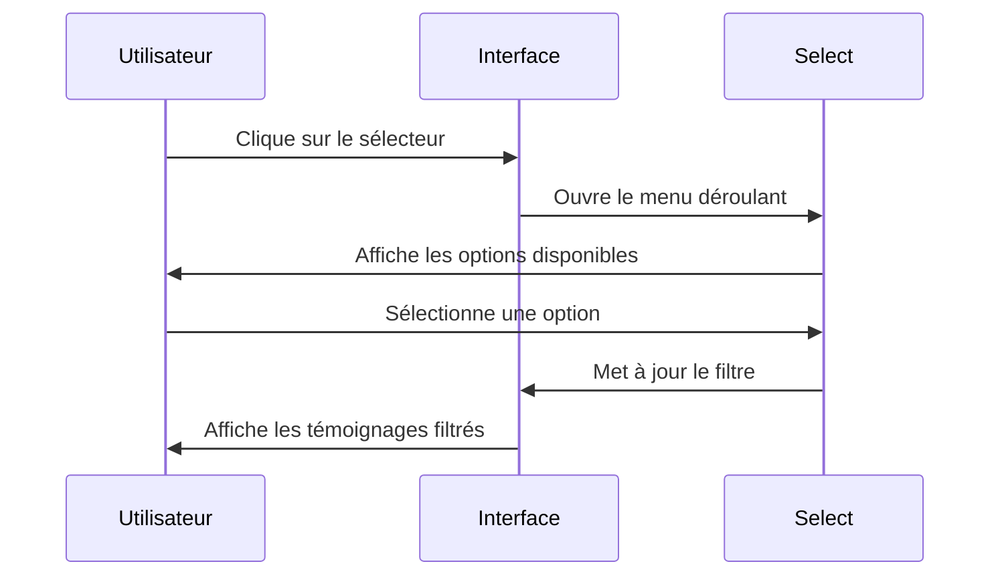
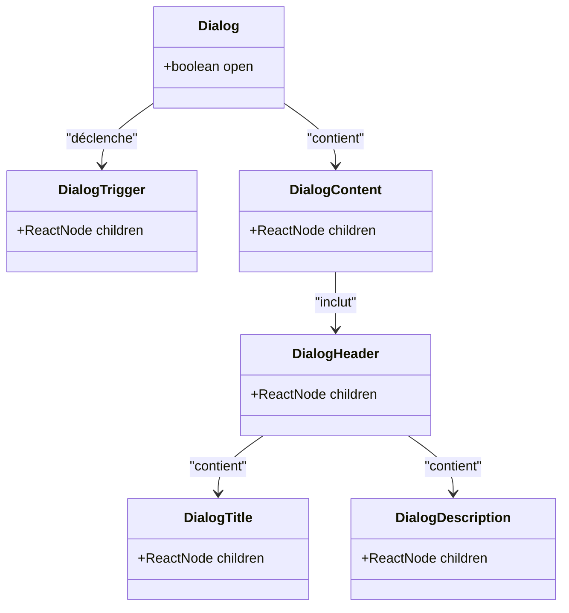
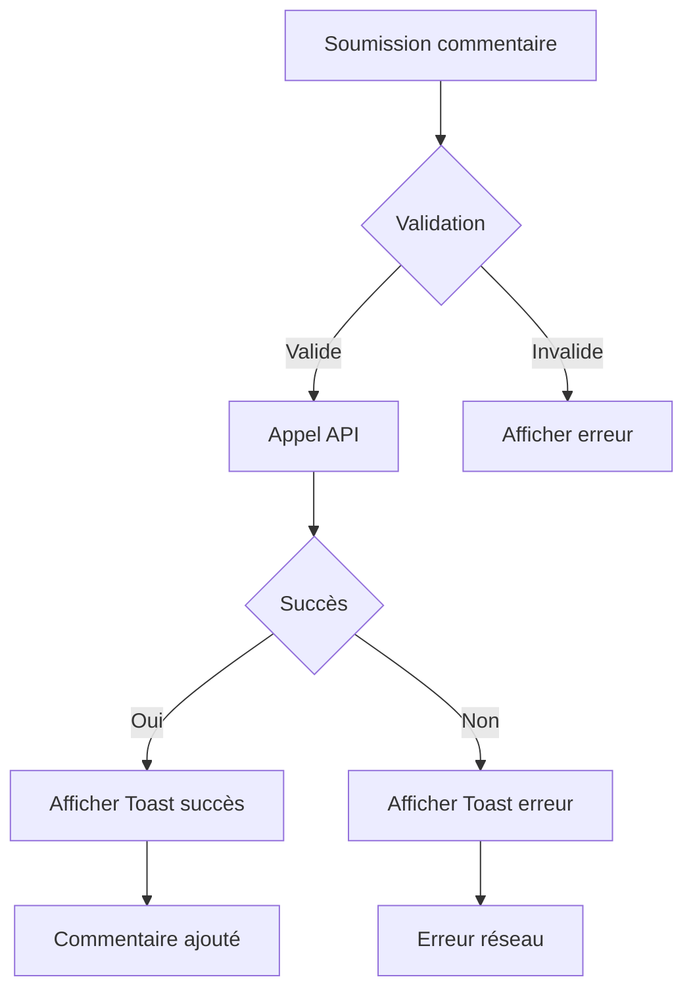

# Témoignages et Récits

<cite>
**Fichiers référencés dans ce document**  
- [app/temoignages/page.tsx](file://app/temoignages/page.tsx)
- [types/index.ts](file://types/index.ts)
- [supabase/migrations/20251114062946_create_archives_testimonies.sql](file://supabase/migrations/20251114062946_create_archives_testimonies.sql)
- [lib/services/testimonies.ts](file://lib/services/testimonies.ts)
- [components/ui/card.tsx](file://components/ui/card.tsx)
- [components/ui/select.tsx](file://components/ui/select.tsx)
- [components/ui/dialog.tsx](file://components/ui/dialog.tsx)
- [components/ui/toast.tsx](file://components/ui/toast.tsx)
- [components/ui/input.tsx](file://components/ui/input.tsx)
- [PLAN.md](file://PLAN.md)
</cite>

## Table des matières
1. [Introduction](#introduction)
2. [Structure de la galerie de souvenirs](#structure-de-la-galerie-de-souvenirs)
3. [Organisation par auteur et thème](#organisation-par-auteur-et-thème)
4. [Système de filtrage avancé](#système-de-filtrage-avancé)
5. [Contenu des témoignages](#contenu-des-témoignages)
6. [Système de commentaires et notifications](#système-de-commentaires-et-notifications)
7. [Gestion des formats audio](#gestion-des-formats-audio)
8. [Accessibilité et fonctionnalités sociales](#accessibilité-et-fonctionnalités-sociales)
9. [Recherche et navigation](#recherche-et-navigation)
10. [Problèmes courants et solutions](#problèmes-courants-et-solutions)

## Introduction

La section **Témoignages et Récits** du projet Decker est conçue pour préserver et partager les souvenirs familiaux à travers différentes formes de contenu. Bien que les témoignages ne soient pas encore disponibles (indiqué par le message "Les témoignages seront ajoutés prochainement"), l'architecture et les fonctionnalités sont entièrement définies. Cette section permettra de consulter des récits, anecdotes et souvenirs transmis par les membres de la famille, organisés selon plusieurs critères et accessibles via des outils de filtrage et de recherche avancés.

**Section sources**
- [app/temoignages/page.tsx](file://app/temoignages/page.tsx#L29-L38)

## Structure de la galerie de souvenirs

La galerie de souvenirs est construite autour du composant **Card**, qui sert de conteneur principal pour chaque témoignage. Chaque carte affiche le titre, la description et le statut de collecte du témoignage, avec un design différencié selon la catégorie (souvenirs familiaux, témoignages historiques, Colonel Rémy).

Le composant **Card** est structuré en plusieurs parties :
- **CardHeader** : contient le titre avec une icône de citation et la description
- **CardContent** : affiche un message d'information sur l'état de collecte
- **Badge** : indique visuellement que les témoignages sont "En cours de collecte"

**Diagram sources**
- [components/ui/card.tsx](file://components/ui/card.tsx#L5-L77)
- [app/temoignages/page.tsx](file://app/temoignages/page.tsx#L73-L97)

## Organisation par auteur ou thème

Les témoignages sont organisés selon deux axes principaux : **l'auteur** et **le thème**. Trois catégories principales sont déjà définies dans le code :

1. **Souvenirs familiaux** : récits et anecdotes transmis de génération en génération
2. **Témoignages historiques** : récits sur les périodes marquantes de l'histoire
3. **Colonel Rémy** : témoignages spécifiques sur le héros de la Résistance

Chaque catégorie dispose d'une configuration visuelle distincte avec des couleurs spécifiques (bleu, violet, rouge) pour faciliter l'identification rapide. L'organisation par auteur permettra de filtrer les témoignages selon leur auteur, bien que cette fonctionnalité soit actuellement en développement.

**Diagram sources**
- [app/temoignages/page.tsx](file://app/temoignages/page.tsx#L8-L24)
- [types/index.ts](file://types/index.ts#L399-L405)

## Système de filtrage par période ou personne concernée avec Select

Le système de filtrage utilise le composant **Select** pour permettre aux utilisateurs de trier les témoignages selon différents critères. Deux sélecteurs sont implémentés :

1. **Filtrage par auteur** : permet de sélectionner tous les auteurs ou un auteur spécifique
2. **Filtrage par thème** : permet de choisir parmi les catégories définies (tous les thèmes, souvenirs familiaux, témoignages historiques, Colonel Rémy)

Le composant **Select** est un élément d'interface utilisateur réutilisable qui fournit une liste déroulante interactive avec des options clairement définies. Il est conçu pour être accessible et responsive, s'adaptant à différents formats d'écran.

**Diagram sources**
- [components/ui/select.tsx](file://components/ui/select.tsx#L9-L159)
- [app/temoignages/page.tsx](file://app/temoignages/page.tsx#L43-L68)

## Contenu des témoignages

Le contenu des témoignages sera diversifié et inclura plusieurs types de médias et de formats textuels :

### Affichage de souvenirs racontés
Les souvenirs racontés seront présentés dans des cartes avec un format enrichi, incluant le titre, la date du témoignage, l'auteur et des photos associées si disponibles.

### Anecdotes familiales dans Dialog
Les anecdotes familiales seront affichées dans des composants **Dialog**, qui permettent d'ouvrir une fenêtre modale pour lire le récit complet sans quitter la page principale.

**Diagram sources**
- [components/ui/dialog.tsx](file://components/ui/dialog.tsx#L9-L122)
- [types/index.ts](file://types/index.ts#L410-L443)

### Textes écrits par différents membres
Les textes écrits seront stockés dans le champ `content` de l'interface `Testimony` et pourront inclure du texte enrichi avec des mises en forme spécifiques.

### Enregistrements audio avec lecteur personnalisé
Les témoignages audio seront gérés via le champ `audio_url` et lus à travers un lecteur personnalisé. Le modèle de données prévoit également un champ `transcript` pour les transcriptions des enregistrements.

**Section sources**
- [types/index.ts](file://types/index.ts#L410-L443)
- [PLAN.md](file://PLAN.md#L281-L304)

## Système de commentaires optionnel avec Textarea et Toast

Un système de commentaires optionnel est prévu, utilisant deux composants principaux :

1. **Textarea** : pour saisir le commentaire
2. **Toast** : pour notifier l'utilisateur du succès ou de l'échec de la soumission

Le système de toast est géré par un hook personnalisé `use-toast` qui permet d'afficher des notifications éphémères à l'utilisateur. Ces notifications peuvent inclure un titre, une description et une action optionnelle.

**Diagram sources**
- [components/ui/textarea.tsx](file://components/ui/textarea.tsx)
- [hooks/use-toast.ts](file://hooks/use-toast.ts)
- [components/ui/toast.tsx](file://components/ui/toast.tsx)

## Gestion des formats audio

La gestion des formats audio est intégrée au modèle de données via le champ `audio_url` dans l'interface `Testimony`. Les politiques de sécurité au niveau de la base de données (Supabase) garantissent que :

- Le public peut visualiser les fichiers audio
- Seuls les administrateurs peuvent télécharger, mettre à jour ou supprimer des fichiers audio

Les fichiers audio sont stockés dans un bucket spécifique `audio_creations` avec des politiques de contrôle d'accès strictes. Cette architecture permet de préserver l'intégrité des enregistrements tout en assurant leur disponibilité pour les membres de la famille.

**Section sources**
- [supabase/migrations/20251114063050_create_storage_buckets.sql](file://supabase/migrations/20251114063050_create_storage_buckets.sql#L121-L145)
- [types/index.ts](file://types/index.ts#L422)

## Accessibilité et fonctionnalités sociales

### Accessibilité pour les contenus audio
Le système intègre plusieurs considérations d'accessibilité :
- Transcription disponible via le champ `transcript`
- Lecteur audio personnalisé avec contrôles accessibles
- Support des technologies d'assistance via les composants Radix UI

### Livre d'or familial
La fonctionnalité sociale prévue inclut un "livre d'or familial" qui permettra aux membres de partager leurs souvenirs. Cette fonctionnalité est liée au système de commentaires et aux notifications par toast.

**Section sources**
- [types/index.ts](file://types/index.ts#L424)
- [components/ui/dialog.tsx](file://components/ui/dialog.tsx)

## Recherche et navigation

Un système de recherche global est implémenté au niveau de la base de données, permettant de rechercher dans les témoignages via une fonction SQL qui évalue la pertinence du contenu. La recherche s'effectue sur :
- Le titre du témoignage
- Le contenu textuel
- La description

La navigation entre les témoignages sera facilitée par une structure de pagination et des liens contextuels. Le modèle de données inclut des champs comme `about_member_ids` et `about_period` qui permettront des liens sémantiques entre les différents contenus.

**Section sources**
- [supabase/migrations/20251114063120_create_api_functions.sql](file://supabase/migrations/20251114063120_create_api_functions.sql#L372-L424)
- [types/index.ts](file://types/index.ts#L418-L429)

## Problèmes courants et solutions

### Compatibilité des formats audio
Le principal problème anticipé concerne la compatibilité des formats audio anciens. La solution implémentée consiste en :
- Des conversions préalables des fichiers audio vers des formats standardisés
- Un stockage séparé des versions originales et restaurées
- Une politique de gestion des médias via Cloudinary (prévue dans l'espace d'administration)

### Gestion des contributions
Le système prévoit un espace d'administration avec :
- Un système de modération pour les témoignages
- Une gestion des droits d'accès par rôles
- Un éditeur de contenu avec prévisualisation

Ces fonctionnalités permettront de contrôler la qualité du contenu avant sa publication.

**Section sources**
- [app/admin/page.tsx](file://app/admin/page.tsx#L210-L226)
- [PLAN.md](file://PLAN.md#L281-L304)