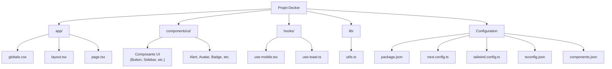
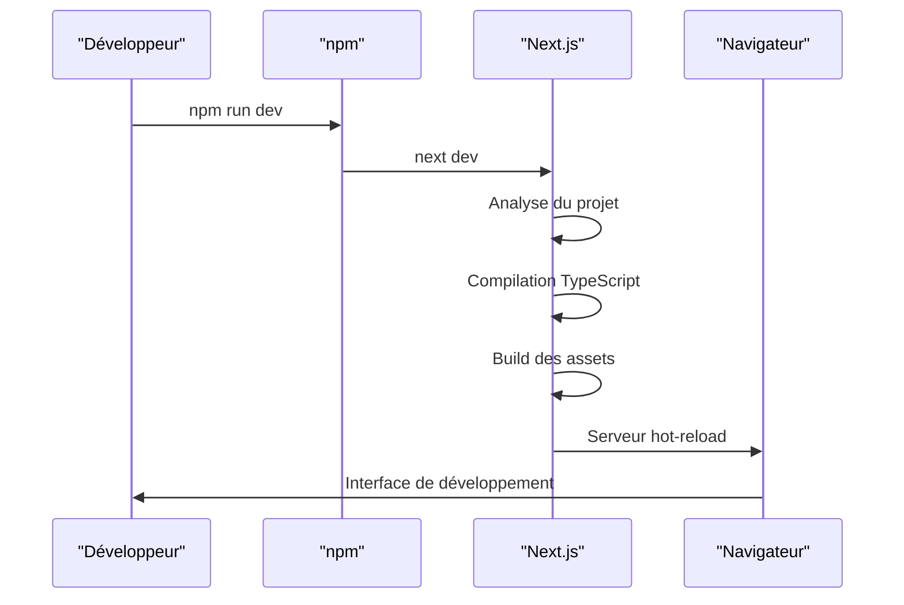
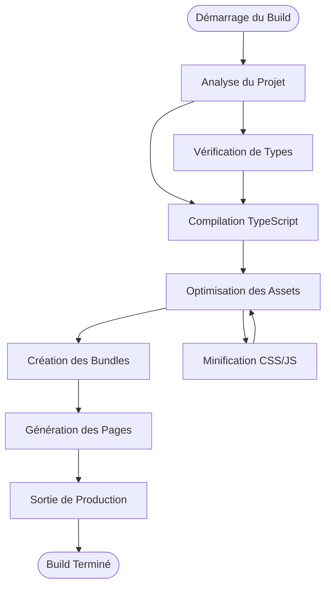
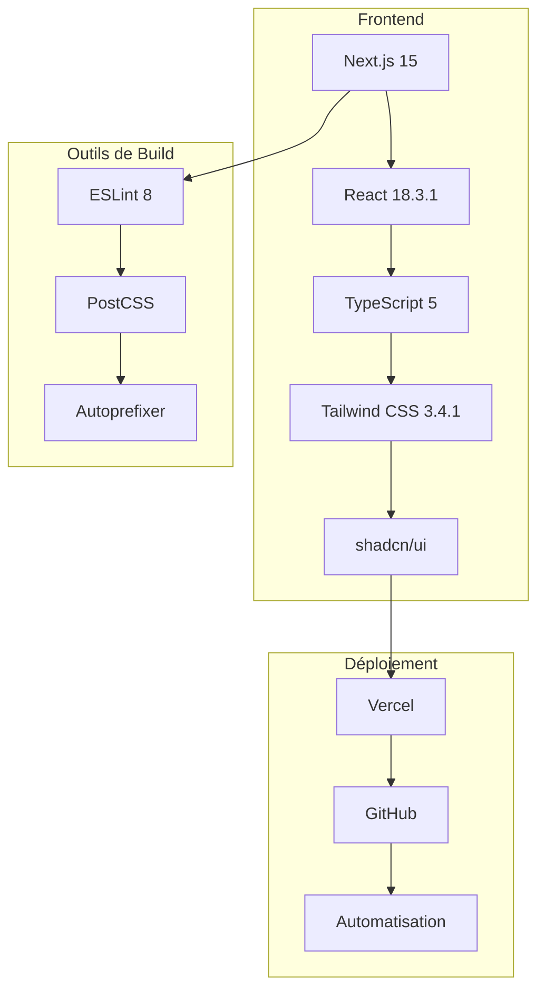

# Guide de Démarrage - Projet Decker

<cite>
**Fichiers Référencés dans ce Document**
- [package.json](file://package.json)
- [PLAN.md](file://PLAN.md)
- [next.config.ts](file://next.config.ts)
- [tailwind.config.ts](file://tailwind.config.ts)
- [tsconfig.json](file://tsconfig.json)
- [components.json](file://components.json)
- [postcss.config.mjs](file://postcss.config.mjs)
- [app/globals.css](file://app/globals.css)
- [app/layout.tsx](file://app/layout.tsx)
- [app/page.tsx](file://app/page.tsx)
- [components/ui/button.tsx](file://components/ui/button.tsx)
- [components/ui/sidebar.tsx](file://components/ui/sidebar.tsx)
</cite>

## Table des Matières
1. [Introduction](#introduction)
2. [Prérequis Système](#prérequis-système)
3. [Structure du Projet](#structure-du-projet)
4. [Configuration de l'Environnement](#configuration-de-lenvironnement)
5. [Installation des Dépendances](#installation-des-dépendances)
6. [Scripts Disponibles](#scripts-disponibles)
7. [Lancement du Serveur de Développement](#lancement-du-serveur-de-développement)
8. [Processus de Construction](#processus-de-construction)
9. [Configuration de Vercel](#configuration-de-vercel)
10. [Variables d'Environnement](#variables-denvironnement)
11. [Problèmes Courants et Solutions](#problèmes-courants-et-solutions)
12. [Architecture Technique](#architecture-technique)
13. [Conclusion](#conclusion)

## Introduction

Le projet Decker est une application web moderne développée avec Next.js 15, TypeScript, et shadcn/ui. Cette application familiale propose une plateforme interactive pour partager l'histoire, les archives, et les créations artistiques de la famille Decker. Le projet utilise une architecture moderne basée sur React avec des composants réutilisables et un système de thème clair/sombre.

## Prérequis Système

### Logiciels Requis

Pour développer et déployer le projet Decker, vous devez disposer des éléments suivants :

- **Node.js** : Version LTS recommandée (minimum v18.x)
- **Git** : Pour le contrôle de version et le déploiement
- **Éditeur de Code** : Visual Studio Code (recommandé) ou éditeur de votre choix
- **Compte GitHub** : Pour héberger le code source et faciliter le déploiement

### Vérification des Prérequis

Avant de commencer, vérifiez que vos outils sont correctement installés :

```bash
# Vérifier Node.js
node --version

# Vérifier npm
npm --version

# Vérifier Git
git --version
```

**Sources de section**
- [PLAN.md](file://PLAN.md#L18-L25)

## Structure du Projet

Le projet Decker suit une architecture Next.js moderne avec une organisation claire des fichiers et dossiers :



**Sources de diagramme**
- [package.json](file://package.json#L1-L50)
- [next.config.ts](file://next.config.ts#L1-L8)
- [tailwind.config.ts](file://tailwind.config.ts#L1-L73)

### Description des Dossiers Principaux

- **app/** : Contient les pages et composants racine de l'application
- **components/ui/** : Bibliothèque de composants shadcn/ui réutilisables
- **hooks/** : Hooks personnalisés pour la logique réutilisable
- **lib/** : Utilitaires et fonctions partagées

**Sources de section**
- [package.json](file://package.json#L1-L50)
- [components.json](file://components.json#L1-L23)

## Configuration de l'Environnement

### Installation de Node.js

1. **Téléchargement** : Rendez-vous sur [nodejs.org](https://nodejs.org/)
2. **Installation** : Choisissez la version LTS (Current) pour une stabilité maximale
3. **Vérification** : Ouvrez un terminal et exécutez `node --version`

### Configuration Git

1. **Installation** : Si Git n'est pas déjà installé, téléchargez-le depuis [git-scm.com](https://git-scm.com/)
2. **Configuration initiale** :
   ```bash
   git config --global user.name "Votre Nom"
   git config --global user.email "votre@email.com"
   ```

### Configuration de l'Éditeur de Code

**Visual Studio Code** est fortement recommandé avec ces extensions utiles :
- TypeScript Vue Plugin (Volar)
- ESLint
- Prettier
- Tailwind CSS IntelliSense

**Sources de section**
- [PLAN.md](file://PLAN.md#L18-L25)

## Installation des Dépendances

### Processus d'Installation

Le projet utilise npm comme gestionnaire de paquets principal. Pour installer toutes les dépendances nécessaires :

```bash
# Naviguez vers le répertoire du projet
cd chemin/vers/decker

# Installez toutes les dépendances
npm install
```

### Analyse des Dépendances

Le projet utilise plusieurs catégories de dépendances :

#### Dépendances de Production
- **Next.js 15.0.3** : Framework React moderne
- **React 18.3.1** : Bibliothèque UI
- **shadcn/ui** : Bibliothèque de composants UI
- **Tailwind CSS** : Framework CSS utilitaire

#### Dépendances de Développement
- **TypeScript** : Typage statique
- **ESLint** : Analyse de code
- **PostCSS** : Transformation CSS

**Sources de section**
- [package.json](file://package.json#L11-L47)

## Scripts Disponibles

Le fichier `package.json` contient plusieurs scripts prédéfinis pour faciliter le développement :

### Scripts Principaux

| Script | Commande | Description |
|--------|----------|-------------|
| `dev` | `npm run dev` | Lance le serveur de développement |
| `build` | `npm run build` | Construit l'application pour la production |
| `start` | `npm run start` | Lance le serveur de production |
| `lint` | `npm run lint` | Exécute l'analyse de code ESLint |

### Utilisation des Scripts

```bash
# Démarrer le développement
npm run dev

# Construire pour la production
npm run build

# Lancer en mode production
npm run start

# Analyser le code
npm run lint
```

**Sources de section**
- [package.json](file://package.json#L5-L9)

## Lancement du Serveur de Développement

### Commande de Démarrage

Pour lancer le serveur de développement local :

```bash
npm run dev
```

### Processus de Démarrage



**Sources de diagramme**
- [package.json](file://package.json#L6-L6)

### URL d'Accès

Une fois le serveur démarré, l'application sera disponible à l'adresse :
- **Local** : http://localhost:3000
- **Réseau** : http://IP_DE_VOTRE_ORDINATEUR:3000

### Fonctionnalités du Mode Développement

- **Hot Reload** : Actualisation automatique lors des modifications
- **Erreurs en temps réel** : Affichage des erreurs TypeScript et runtime
- **Source Maps** : Debugging facilité avec les fichiers sources

**Sources de section**
- [package.json](file://package.json#L6-L6)

## Processus de Construction

### Commande de Build

Pour construire l'application optimisée pour la production :

```bash
npm run build
```

### Phases de Construction



**Sources de diagramme**
- [package.json](file://package.json#L7-L7)

### Sortie du Build

Le processus de build génère :
- **Répertoire `.next/`** : Contient les fichiers optimisés
- **Pages statiques** : Génération côté serveur
- **Assets optimisés** : Images, CSS, JavaScript

### Lancement en Production

Après la construction, lancez le serveur de production :

```bash
npm run start
```

**Sources de section**
- [package.json](file://package.json#L7-L8)

## Configuration de Vercel

### Processus de Déploiement

Le projet est configuré pour un déploiement facile sur Vercel :

1. **Création de compte** : Inscrivez-vous sur [vercel.com](https://vercel.com/)
2. **Connexion GitHub** : Connectez votre compte GitHub
3. **Import du projet** : Sélectionnez le dépôt Decker
4. **Configuration automatique** : Vercel détectera automatiquement Next.js

### Variables d'Environnement sur Vercel

Configurez ces variables dans les paramètres de déploiement :

| Variable | Valeur | Description |
|----------|--------|-------------|
| `NODE_VERSION` | `18` | Version Node.js |
| `NEXT_PUBLIC_APP_URL` | `https://votre-domaine.com` | URL de l'application |

### Déploiement Automatique

Vercel configure automatiquement le déploiement :
- **Build Command** : `npm run build`
- **Output Directory** : `.next`
- **Install Command** : `npm install`

**Sources de section**
- [PLAN.md](file://PLAN.md#L44-L48)

## Variables d'Environnement

### Configuration Actuelle

Le projet utilise les variables d'environnement suivantes :

```bash
# Variables de configuration de l'application
NEXT_PUBLIC_APP_URL=http://localhost:3000
NODE_ENV=development
```

### Variables Recommandées

Pour un environnement de production, ajoutez :

```bash
# URL de l'application en production
NEXT_PUBLIC_APP_URL=https://decker-famille.vercel.app

# Configuration de l'environnement
NODE_ENV=production
```

### Gestion des Variables

Utilisez un fichier `.env.local` pour les variables locales de développement :

```bash
# .env.local
NEXT_PUBLIC_APP_URL=http://localhost:3000
```

**Sources de section**
- [PLAN.md](file://PLAN.md#L47-L47)

## Problèmes Courants et Solutions

### Problèmes d'Installation

#### Erreur de mémoire lors de l'installation

**Symptôme** : `JavaScript heap out of memory`

**Solution** :
```bash
# Augmenter la mémoire disponible pour Node.js
export NODE_OPTIONS="--max-old-space-size=4096"
npm install
```

#### Conflits de dépendances

**Symptôme** : Erreurs de version incompatible

**Solution** :
```bash
# Nettoyer le cache npm
npm cache clean --force

# Supprimer node_modules et reinstaller
rm -rf node_modules package-lock.json
npm install
```

### Problèmes de Développement

#### Port déjà utilisé

**Symptôme** : `Port 3000 already in use`

**Solution** :
```bash
# Modifier le port dans package.json
"dev": "next dev -p 3001"

# Ou trouver et tuer le processus
lsof -ti:3000 | xargs kill -9
```

#### Erreurs TypeScript

**Symptôme** : Erreurs de compilation TypeScript

**Solution** :
```bash
# Vérifier la syntaxe TypeScript
npm run lint

# Corriger les erreurs automatiquement
npm run lint --fix
```

### Problèmes de Build

#### Erreurs de build

**Symptôme** : Échec du processus de build

**Solution** :
```bash
# Nettoyer le cache de build
rm -rf .next

# Reconstruire l'application
npm run build
```

### Problèmes de Déploiement

#### Erreur de déploiement Vercel

**Symptôme** : Échec du déploiement sur Vercel

**Solution** :
1. Vérifiez les logs de déploiement
2. Assurez-vous que toutes les variables d'environnement sont configurées
3. Testez localement avec `npm run build`

**Sources de section**
- [PLAN.md](file://PLAN.md#L44-L48)

## Architecture Technique

### Stack Technologique



**Sources de diagramme**
- [package.json](file://package.json#L11-L47)
- [next.config.ts](file://next.config.ts#L1-L8)

### Configuration CSS

Le projet utilise Tailwind CSS avec des variables CSS personnalisées :

```css
:root {
  --background: 0 0% 100%;
  --foreground: 0 0% 3.9%;
  --sidebar-background: 0 0% 98%;
  --sidebar-foreground: 240 5.3% 26.1%;
}

.dark {
  --background: 0 0% 3.9%;
  --foreground: 0 0% 98%;
  --sidebar-background: 240 5.9% 10%;
}
```

### Configuration TypeScript

La configuration TypeScript inclut :
- **Support RSC** : React Server Components
- **TypeScript strict** : Vérifications de type strictes
- **Paths alias** : Alias `@/*` pour les imports

**Sources de section**
- [tailwind.config.ts](file://tailwind.config.ts#L1-L73)
- [tsconfig.json](file://tsconfig.json#L1-L28)

## Conclusion

Le projet Decker représente une excellente base pour développer une application web familiale moderne. Avec son architecture bien structurée, ses composants réutilisables, et son processus de déploiement automatisé, il offre une expérience de développement fluide et une expérience utilisateur optimale.

### Points Clés à Retenir

1. **Préparation** : Assurez-vous que tous les prérequis sont installés
2. **Développement** : Utilisez `npm run dev` pour le développement local
3. **Production** : Construisez avec `npm run build` avant déploiement
4. **Déploiement** : Configurez Vercel pour un déploiement automatique
5. **Maintenance** : Surveillez les variables d'environnement et les dépendances

### Prochaines Étapes

1. Explorez la documentation shadcn/ui pour personnaliser les composants
2. Configurez les variables d'environnement pour la production
3. Planifiez le contenu et les fonctionnalités selon le plan d'implémentation
4. Testez l'application sur différents appareils et navigateurs

Le projet Decker est conçu pour évoluer avec les besoins de la famille, offrant une plateforme flexible et extensible pour partager l'histoire et les créations familiales.