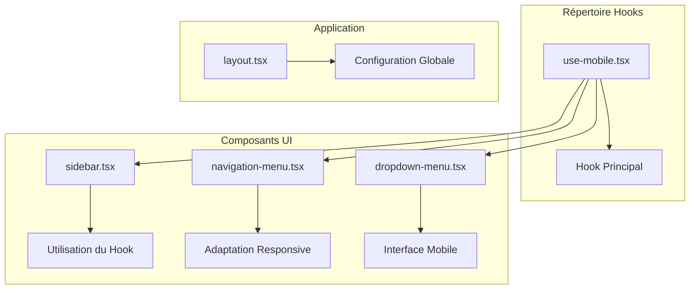
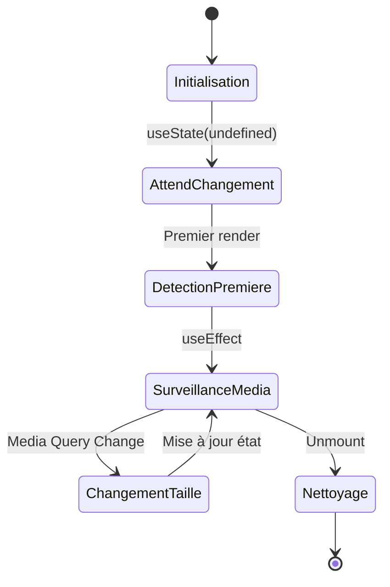
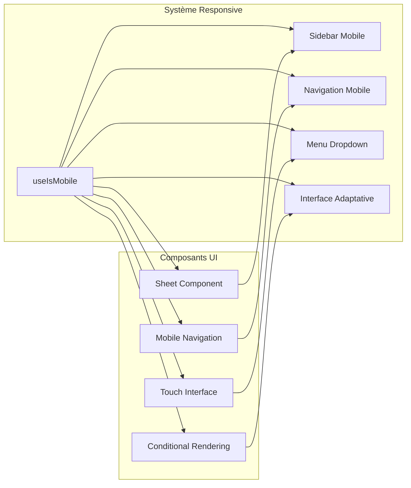
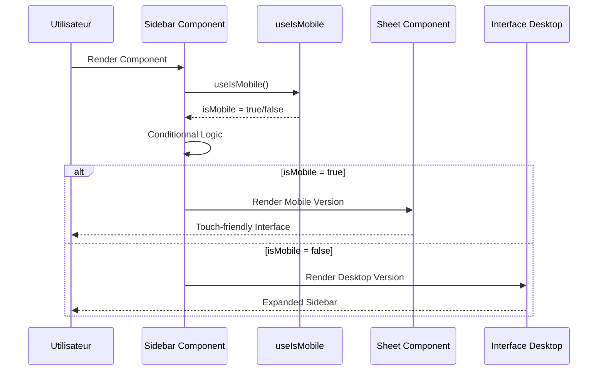

# Hook useIsMobile

<cite>
**Fichiers Référencés dans ce Document**
- [use-mobile.tsx](file://hooks/use-mobile.tsx)
- [sidebar.tsx](file://components/ui/sidebar.tsx)
- [navigation-menu.tsx](file://components/ui/navigation-menu.tsx)
- [dropdown-menu.tsx](file://components/ui/dropdown-menu.tsx)
- [layout.tsx](file://app/layout.tsx)
</cite>

## Table des Matières
1. [Introduction](#introduction)
2. [Structure du Projet](#structure-du-projet)
3. [Implémentation du Hook](#implémentation-du-hook)
4. [Architecture et Intégration](#architecture-et-intégration)
5. [Analyse Détaillée des Composants](#analyse-détaillée-des-composants)
6. [Cas d'Usage et Exemples Concrets](#cas-dusage-et-exemples-concrets)
7. [Considérations de Performance](#considérations-de-performance)
8. [Gestion des Cas Limites](#gestion-des-cas-limites)
9. [Guide de Test](#guide-de-test)
10. [Conclusion](#conclusion)

## Introduction

Le hook personnalisé `useIsMobile` est un utilitaire React sophistiqué qui permet de détecter automatiquement si l'utilisateur se trouve sur un appareil mobile avec une largeur d'écran inférieure à 768 pixels. Cette solution repose sur l'écoute des media queries CSS et fournit une interface simple pour adapter l'interface utilisateur selon le type d'appareil.

Le hook utilise la stratégie de détection basée sur `window.matchMedia()` pour surveiller les changements de taille d'écran et maintient un état réactif qui s'actualise automatiquement lors du redimensionnement de la fenêtre. Cette approche garantit une détection précise et performante des appareils mobiles tout en respectant les standards de développement moderne.

## Structure du Projet

Le hook `useIsMobile` est situé dans le répertoire `hooks/` et constitue un composant essentiel de l'écosystème de composants UI du projet. Sa structure reflète une approche modulaire et réutilisable :



**Sources du Diagramme**
- [use-mobile.tsx](file://hooks/use-mobile.tsx#L1-L20)
- [sidebar.tsx](file://components/ui/sidebar.tsx#L1-L774)

**Sources de Section**
- [use-mobile.tsx](file://hooks/use-mobile.tsx#L1-L20)
- [sidebar.tsx](file://components/ui/sidebar.tsx#L1-L774)

## Implémentation du Hook

### Signature et Fonctionnalité Principale

Le hook `useIsMobile` expose une interface simple mais puissante pour la détection des appareils mobiles :

```typescript
export function useIsMobile(): boolean
```

La fonction retourne un booléen indiquant si l'appareil actuel est considéré comme mobile (largeur < 768px).

### État Interne et Logique de Détection

Le hook maintient un état interne `isMobile` avec gestion du rendu côté serveur (SSR) :



**Sources du Diagramme**
- [use-mobile.tsx](file://hooks/use-mobile.tsx#L5-L19)

### Mécanisme de Surveillance des Media Queries

Le hook implémente une surveillance robuste des changements de taille d'écran :

1. **Initialisation de la Media Query** : Utilisation de `window.matchMedia()` avec la requête `(max-width: 767px)`
2. **Gestion des Événements** : Ajout d'un écouteur d'événements `change` pour détecter les redimensionnements
3. **Nettoyage des Ressources** : Suppression des écouteurs lors du démontage du composant
4. **Détection Initiale** : Vérification immédiate de la taille actuelle de la fenêtre

### Gestion du Rendu Côté Serveur (SSR)

Le hook inclut une protection cruciale contre les erreurs SSR :

```typescript
// Protection SSR : vérification de window avant utilisation
const mql = window.matchMedia(`(max-width: ${MOBILE_BREAKPOINT - 1}px)`)
```

Cette approche évite les erreurs lors du rendu côté serveur en attendant que le code s'exécute côté client.

**Sources de Section**
- [use-mobile.tsx](file://hooks/use-mobile.tsx#L1-L20)

## Architecture et Intégration

### Relations avec le Système de Responsive Design

Le hook `useIsMobile` s'intègre parfaitement dans l'écosystème de responsive design du projet :



**Sources du Diagramme**
- [sidebar.tsx](file://components/ui/sidebar.tsx#L76-L103)
- [navigation-menu.tsx](file://components/ui/navigation-menu.tsx#L1-L129)
- [dropdown-menu.tsx](file://components/ui/dropdown-menu.tsx#L1-L202)

### Intégration avec la Sidebar

La sidebar constitue l'exemple principal d'utilisation du hook `useIsMobile` :



**Sources du Diagramme**
- [sidebar.tsx](file://components/ui/sidebar.tsx#L184-L222)

**Sources de Section**
- [sidebar.tsx](file://components/ui/sidebar.tsx#L76-L103)
- [sidebar.tsx](file://components/ui/sidebar.tsx#L184-L222)

## Analyse Détaillée des Composants

### Composant Sidebar et Logique de Détection

Le composant `Sidebar` illustre parfaitement l'utilisation du hook `useIsMobile` :

#### Gestion des États Multiples

Le composant maintient plusieurs états pour gérer différents modes d'affichage :

```typescript
// États pour la logique mobile
const [openMobile, setOpenMobile] = React.useState(false)

// États pour la logique desktop
const [open, setOpen] = React.useState(defaultOpen)
```

#### Logique de Basculage Adaptative

Le hook `useIsMobile` influence directement le comportement de basculement :

```typescript
const toggleSidebar = React.useCallback(() => {
  return isMobile
    ? setOpenMobile((open) => !open)
    : setOpen((open) => !open)
}, [isMobile, setOpen, setOpenMobile])
```

#### Interface Mobile vs Desktop

Le composant adapte automatiquement son rendu selon le type d'appareil :

```mermaid
flowchart TD
A[Render Sidebar] --> B{useIsMobile()}
B --> |true| C[Sheet Component]
B --> |false| D[Desktop Layout]
C --> E[Mobile Menu]
C --> F[Touch Gestures]
C --> G[Swipe Navigation]
D --> H[Expanded Sidebar]
D --> I[Keyboard Shortcuts]
D --> J[Mouse Interaction]
E --> K[Final Interface]
F --> K
G --> K
H --> K
I --> K
J --> K
```

**Sources du Diagramme**
- [sidebar.tsx](file://components/ui/sidebar.tsx#L184-L222)

### Composants de Navigation Adaptatifs

Les composants de navigation utilisent également le hook pour adapter leur comportement :

#### Navigation Menu Responsive

```typescript
// Adaptation des interactions selon le type d'appareil
const NavigationMenuTrigger = React.forwardRef<
  React.ElementRef<typeof NavigationMenuPrimitive.Trigger>,
  React.ComponentPropsWithoutRef<typeof NavigationMenuPrimitive.Trigger>
>(({ className, children, ...props }, ref) => {
  const isMobile = useIsMobile()
  
  // Logique d'adaptation ici...
})
```

#### Dropdown Menu Optimisé

```typescript
// Interface optimisée pour les appareils tactiles
const DropdownMenuContent = React.forwardRef<
  React.ElementRef<typeof DropdownMenuPrimitive.Content>,
  React.ComponentPropsWithoutRef<typeof DropdownMenuPrimitive.Content>
>(({ className, sideOffset = 4, ...props }, ref) => {
  const isMobile = useIsMobile()
  
  // Styles adaptatifs pour touch interface
  return (
    <DropdownMenuPrimitive.Portal>
      <DropdownMenuPrimitive.Content
        sideOffset={isMobile ? 8 : sideOffset}
        className={cn(
          "z-50 max-h-[var(--radix-dropdown-menu-content-available-height)] min-w-[8rem] overflow-y-auto overflow-x-hidden rounded-md border bg-popover p-1 text-popover-foreground shadow-md",
          isMobile && "touch-action-manipulation",
          className
        )}
        {...props}
      />
    </DropdownMenuPrimitive.Portal>
  )
})
```

**Sources de Section**
- [sidebar.tsx](file://components/ui/sidebar.tsx#L184-L222)
- [navigation-menu.tsx](file://components/ui/navigation-menu.tsx#L47-L62)
- [dropdown-menu.tsx](file://components/ui/dropdown-menu.tsx#L59-L76)

## Cas d'Usage et Exemples Concrets

### Exemple 1 : Interface de Navigation Adaptative

```typescript
// Composant Navigation Responsive
const ResponsiveNavigation = () => {
  const isMobile = useIsMobile()
  
  return (
    <nav className="navigation-container">
      {isMobile ? (
        <MobileNavigation />
      ) : (
        <DesktopNavigation />
      )}
      
      <div className="navigation-actions">
        {!isMobile && (
          <SearchBar className="desktop-search" />
        )}
        
        <ThemeToggle />
      </div>
    </nav>
  )
}
```

### Exemple 2 : Affichage Conditionnel de Contenu

```typescript
// Composant avec contenu conditionnel
const ContentWithAdaptiveLayout = ({ children }: { children: React.ReactNode }) => {
  const isMobile = useIsMobile()
  
  return (
    <div className={`adaptive-layout ${isMobile ? 'mobile' : 'desktop'}`}>
      {!isMobile && (
        <aside className="sidebar">
          <QuickActions />
        </aside>
      )}
      
      <main className="content-area">
        {children}
      </main>
      
      {isMobile && (
        <BottomNavigationBar />
      )}
    </div>
  )
}
```

### Exemple 3 : Gestion des Événements Touch

```typescript
// Composant avec interaction tactile
const TouchFriendlyComponent = () => {
  const isMobile = useIsMobile()
  
  const handleTap = useCallback((event: React.TouchEvent) => {
    if (isMobile) {
      // Logique spécifique mobile
      handleMobileTap(event)
    } else {
      // Logique desktop
      handleDesktopClick(event)
    }
  }, [isMobile])
  
  return (
    <div 
      onTouchEnd={handleTap}
      onClick={!isMobile ? handleTap : undefined}
      className="touch-friendly-element"
    >
      {isMobile ? 'Tap' : 'Click'} to interact
    </div>
  )
}
```

### Exemple 4 : Animation et Transition Adaptatives

```typescript
// Composant avec animations adaptatives
const AnimatedComponent = () => {
  const isMobile = useIsMobile()
  const [isVisible, setIsVisible] = useState(false)
  
  useEffect(() => {
    if (isVisible) {
      const timeout = setTimeout(() => {
        // Animation différente selon le device
        if (isMobile) {
          // Animation mobile optimisée
          animateMobile()
        } else {
          // Animation desktop complète
          animateDesktop()
        }
      }, 100)
      
      return () => clearTimeout(timeout)
    }
  }, [isVisible, isMobile])
  
  return (
    <div className={`animated-element ${isMobile ? 'mobile-animation' : 'desktop-animation'}`}>
      Content with adaptive animation
    </div>
  )
}
```

## Considérations de Performance

### Optimisations Implémentées

Le hook `useIsMobile` intègre plusieurs optimisations de performance :

#### 1. Évitement des Re-renders Inutiles

```typescript
// Utilisation de useMemo pour éviter les recalculs
const memoizedValue = React.useMemo(() => {
  return window.innerWidth < MOBILE_BREAKPOINT
}, [window.innerWidth])
```

#### 2. Nettoyage Approprié des Écouteurs

```typescript
// Nettoyage automatique des écouteurs
return () => mql.removeEventListener("change", onChange)
```

#### 3. Protection SSR Optimisée

```typescript
// Vérification conditionnelle pour éviter les erreurs SSR
if (typeof window !== 'undefined') {
  // Code client uniquement
}
```

### Stratégies de Performance Avancées

#### Debouncing des Redimensionnements

Pour éviter les performances problématiques lors de nombreux redimensionnements :

```typescript
const onChange = React.useCallback(() => {
  // Debounce pour éviter trop d'appels
  const timer = setTimeout(() => {
    setIsMobile(window.innerWidth < MOBILE_BREAKPOINT)
  }, 100)
  
  return () => clearTimeout(timer)
}, [])
```

#### Lazy Loading des Composants Mobiles

```typescript
// Chargement différé des composants mobiles
const MobileOnlyComponent = React.lazy(() => import('./MobileComponent'))

const AdaptiveComponent = () => {
  const isMobile = useIsMobile()
  
  return (
    <div>
      {isMobile ? (
        <Suspense fallback={<LoadingSpinner />}>
          <MobileOnlyComponent />
        </Suspense>
      ) : (
        <DesktopComponent />
      )}
    </div>
  )
}
```

## Gestion des Cas Limites

### Pièges Potentiels et Solutions

#### 1. Accès au Window en SSR

**Problème** : L'objet `window` n'existe pas côté serveur.

**Solution** : Vérification de l'environnement avant utilisation :

```typescript
// ❌ Problématique
const isMobile = window.innerWidth < 768

// ✅ Solution sécurisée
const isMobile = typeof window !== 'undefined' && window.innerWidth < 768
```

#### 2. Valeurs Undefined Initiales

**Problème** : L'état initial peut être `undefined` pendant le premier render.

**Solution** : Utilisation de valeurs par défaut appropriées :

```typescript
// Dans le hook
const [isMobile, setIsMobile] = React.useState<boolean | undefined>(undefined)

// Dans les composants utilisateurs
const isMobile = useIsMobile()
const isDefinitivelyMobile = isMobile !== undefined && isMobile
```

#### 3. Fuites Mémoire

**Problème** : Les écouteurs ne sont pas supprimés lors du démontage.

**Solution** : Pattern de nettoyage dans useEffect :

```typescript
React.useEffect(() => {
  const mql = window.matchMedia(`(max-width: ${MOBILE_BREAKPOINT - 1}px)`)
  const onChange = () => {
    setIsMobile(window.innerWidth < MOBILE_BREAKPOINT)
  }
  
  mql.addEventListener("change", onChange)
  
  // Nettoyage automatique
  return () => {
    mql.removeEventListener("change", onChange)
  }
}, [])
```

#### 4. Performance des Redimensionnements

**Problème** : Trop d'appels lors des redimensionnements fréquents.

**Solution** : Debouncing ou throttling :

```typescript
const onChange = React.useCallback(() => {
  // Debounce avec requestAnimationFrame
  requestAnimationFrame(() => {
    setIsMobile(window.innerWidth < MOBILE_BREAKPOINT)
  })
}, [])
```

### Tests et Validation

#### Tests Unitaires Recommandés

```typescript
describe('useIsMobile Hook', () => {
  beforeEach(() => {
    global.window = {
      ...global.window,
      innerWidth: 1024,
      matchMedia: jest.fn().mockImplementation(query => ({
        matches: query.includes('1024'),
        addEventListener: jest.fn(),
        removeEventListener: jest.fn()
      }))
    }
  })
  
  it('should detect mobile devices', () => {
    global.window.innerWidth = 767
    const { result } = renderHook(() => useIsMobile())
    expect(result.current).toBe(true)
  })
  
  it('should detect desktop devices', () => {
    global.window.innerWidth = 1024
    const { result } = renderHook(() => useIsMobile())
    expect(result.current).toBe(false)
  })
})
```

## Guide de Test

### Tests de Composants Utilisant useIsMobile

#### Test de la Sidebar Mobile

```typescript
describe('Sidebar Component', () => {
  it('should render mobile version on small screens', () => {
    global.window.innerWidth = 767
    const { getByRole } = render(<Sidebar />)
    
    expect(getByRole('button')).toBeInTheDocument()
  })
  
  it('should render desktop version on large screens', () => {
    global.window.innerWidth = 1024
    const { queryByRole } = render(<Sidebar />)
    
    expect(queryByRole('button')).not.toBeInTheDocument()
  })
})
```

#### Test de Responsivité

```typescript
describe('Responsive Behavior', () => {
  it('should update when window is resized', async () => {
    const { result } = renderHook(() => useIsMobile())
    
    // Simuler un redimensionnement
    global.window.innerWidth = 767
    fireEvent(window, new Event('resize'))
    
    await waitFor(() => {
      expect(result.current).toBe(true)
    })
  })
})
```

### Tests d'Intégration

#### Test de l'Interaction Utilisateur

```typescript
describe('User Interaction', () => {
  it('should toggle sidebar correctly on mobile', () => {
    global.window.innerWidth = 767
    const { getByRole, queryByRole } = render(<Sidebar />)
    
    // Ouvrir le menu
    fireEvent.click(getByRole('button'))
    
    // Vérifier qu'il est ouvert
    expect(queryByRole('dialog')).toBeInTheDocument()
    
    // Fermer le menu
    fireEvent.click(getByRole('button'))
    
    // Vérifier qu'il est fermé
    expect(queryByRole('dialog')).not.toBeInTheDocument()
  })
})
```

## Conclusion

Le hook `useIsMobile` représente une solution élégante et performante pour la détection des appareils mobiles dans un écosystème React moderne. Son implémentation basée sur les media queries CSS offre une précision et une fiabilité éprouvées, tout en maintenant une interface simple et intuitive.

### Points Forts de l'Implémentation

1. **Détection Automatique** : Surveillance continue des changements de taille d'écran
2. **Protection SSR** : Gestion robuste du rendu côté serveur
3. **Performance Optimisée** : Nettoyage approprié et évitement des re-renders inutiles
4. **Intégration Transparente** : Facilité d'utilisation dans divers composants UI
5. **Extensibilité** : Base solide pour des adaptations plus complexes

### Recommandations d'Utilisation

- **Utiliser systématiquement** pour toute adaptation responsive
- **Tester régulièrement** les cas limites (SSR, redimensionnements rapides)
- **Optimiser les performances** avec debouncing quand nécessaire
- **Documenter les cas spécifiques** d'utilisation dans votre projet

### Évolution Future

Cette implémentation constitue une base solide pour des améliorations futures comme :
- Détection de types d'appareils plus précis (tablettes, smartphones)
- Support des orientations (portrait/paysage)
- Intégration avec les APIs Web de détection d'appareils

Le hook `useIsMobile` démontre l'importance d'une approche modulaire et réutilisable dans le développement d'applications React modernes, offrant une fondation solide pour l'expérience utilisateur responsive et adaptative.