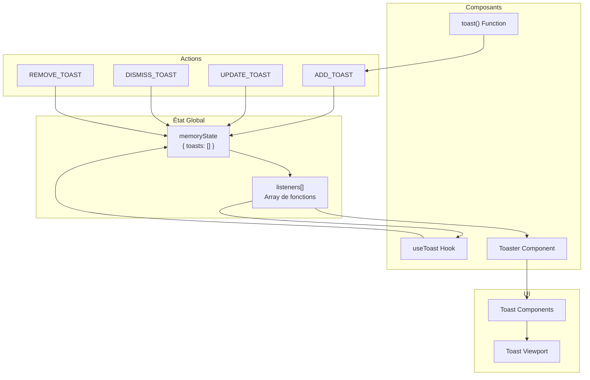
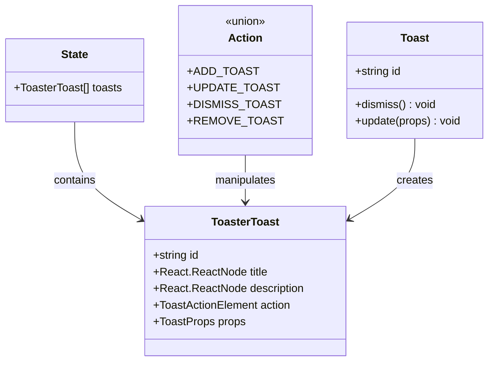
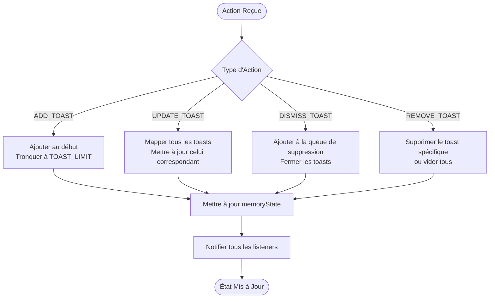
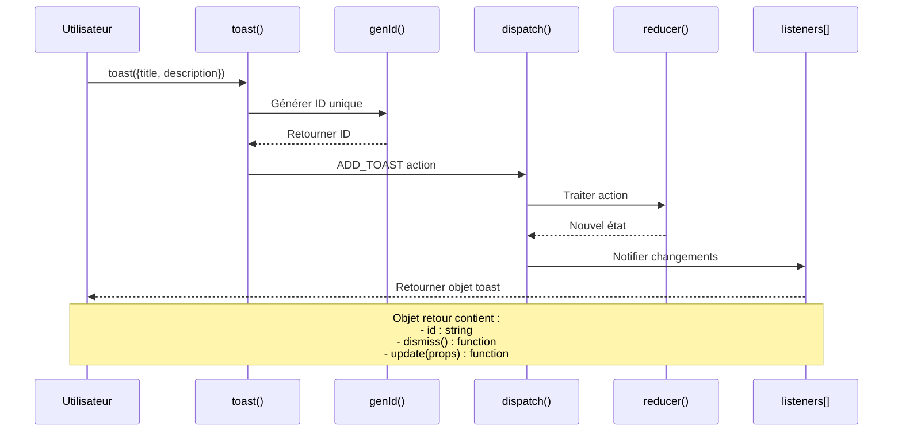
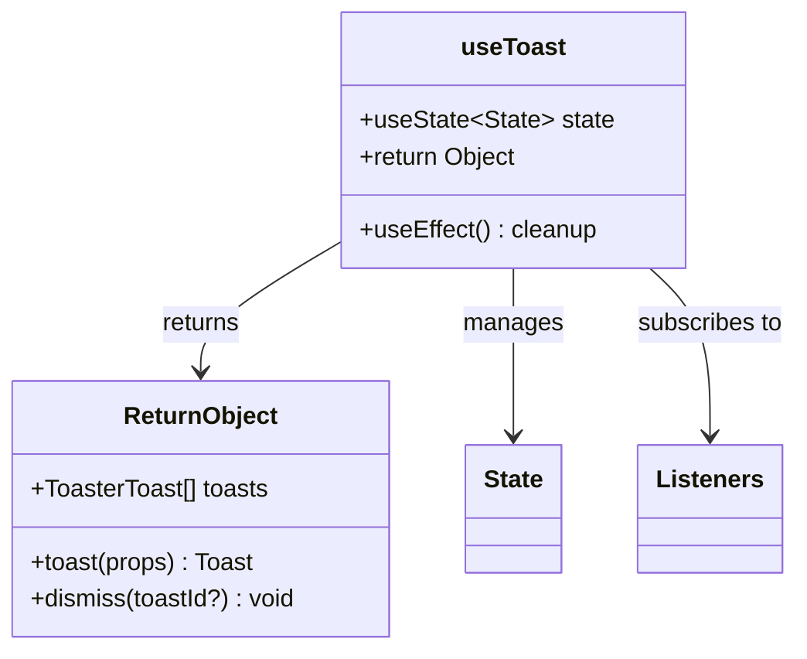
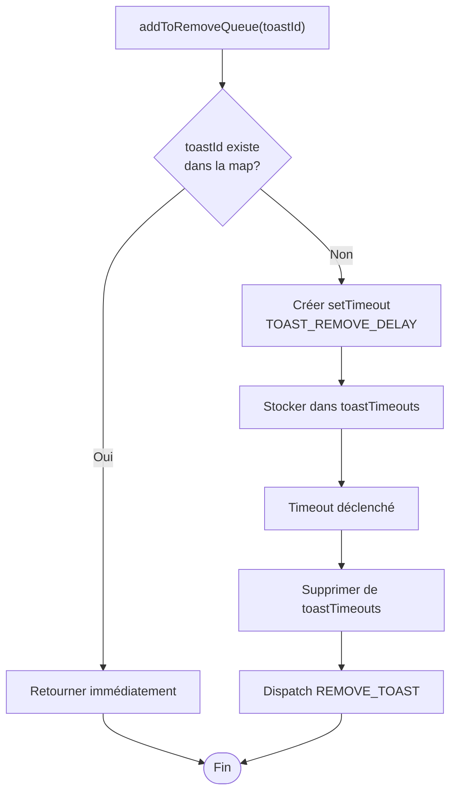
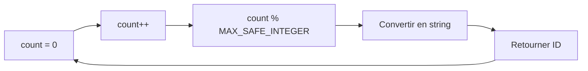
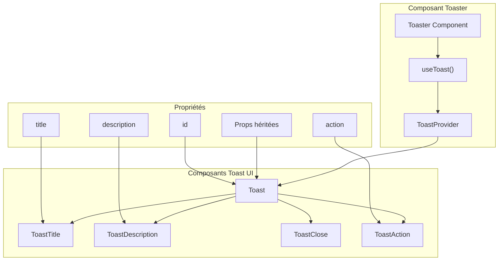
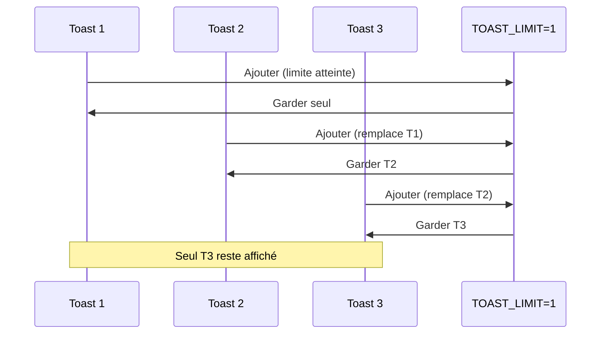

# Hook useToast et système de notifications

<cite>
**Fichiers Référencés dans ce Document**
- [hooks/use-toast.ts](file://hooks/use-toast.ts)
- [components/ui/toast.tsx](file://components/ui/toast.tsx)
- [components/ui/toaster.tsx](file://components/ui/toaster.tsx)
- [lib/utils.ts](file://lib/utils.ts)
- [package.json](file://package.json)
</cite>

## Table des Matières
1. [Introduction](#introduction)
2. [Architecture du Système](#architecture-du-système)
3. [Types et Constantes Fondamentaux](#types-et-constantes-fondamentaux)
4. [Implémentation du Reducteur d'État](#implémentation-du-reducteur-détat)
5. [Fonction toast() et Hook useToast](#fonction-toast-et-hook-useToast)
6. [Gestion des Timeouts et Queue](#gestion-des-timeouts-et-queue)
7. [Intégration avec les Composants UI](#intégration-avec-les-composants-ui)
8. [Exemples d'Utilisation](#exemples-dutilisation)
9. [Cas d'Usage Avancés](#cas-dusage-avancés)
10. [Tests, Débogage et Accessibilité](#tests-débogage-et-accessibilité)
11. [Limites et Optimisations](#limites-et-optimisations)
12. [Conclusion](#conclusion)

## Introduction

Le système de notifications de Decker est une implémentation moderne et efficace inspirée de react-hot-toast, utilisant un réducteur d'état global en mémoire pour gérer les toasts. Cette architecture permet une gestion centralisée des notifications avec support pour les actions, mises à jour dynamiques et fermeture automatique.

Le système repose sur trois composants principaux :
- **useToast** : Hook principal pour accéder aux fonctionnalités de toast
- **toast** : Fonction utilitaire pour créer de nouveaux toasts
- **Toaster** : Composant d'affichage des toasts

## Architecture du Système

Le système de toasts utilise une architecture basée sur le pattern Redux simplifié avec un état global en mémoire :



**Sources du Diagramme**
- [hooks/use-toast.ts](file://hooks/use-toast.ts#L132-L194)
- [components/ui/toaster.tsx](file://components/ui/toaster.tsx#L13-L35)

**Sources de Section**
- [hooks/use-toast.ts](file://hooks/use-toast.ts#L1-L195)
- [components/ui/toaster.tsx](file://components/ui/toaster.tsx#L1-L36)

## Types et Constantes Fondamentaux

### Types Principaux

Le système définit plusieurs types essentiels pour la gestion des toasts :



**Sources du Diagramme**
- [hooks/use-toast.ts](file://hooks/use-toast.ts#L14-L19)
- [hooks/use-toast.ts](file://hooks/use-toast.ts#L55-L57)
- [hooks/use-toast.ts](file://hooks/use-toast.ts#L37-L53)

### Constantes de Configuration

Le système utilise deux constantes critiques pour son fonctionnement :

| Constante | Valeur | Description |
|-----------|--------|-------------|
| `TOAST_LIMIT` | 1 | Limite maximale de toasts affichés simultanément |
| `TOAST_REMOVE_DELAY` | 1000000 ms | Délai avant suppression automatique (1 million de millisecondes) |

**Sources de Section**
- [hooks/use-toast.ts](file://hooks/use-toast.ts#L11-L12)
- [hooks/use-toast.ts](file://hooks/use-toast.ts#L59)

## Implémentation du Reducteur d'État

Le réducteur `reducer` gère toutes les mutations d'état selon les actions définies :



**Sources du Diagramme**
- [hooks/use-toast.ts](file://hooks/use-toast.ts#L77-L129)

### Logique des Actions

Chaque action possède une logique spécifique :

1. **ADD_TOAST** : Ajoute un nouveau toast au début du tableau et tronque si nécessaire
2. **UPDATE_TOAST** : Met à jour un toast existant par son ID
3. **DISMISS_TOAST** : Prépare la suppression automatique et ferme visuellement
4. **REMOVE_TOAST** : Supprime définitivement un toast ou tous

**Sources de Section**
- [hooks/use-toast.ts](file://hooks/use-toast.ts#L77-L129)

## Fonction toast() et Hook useToast

### Fonction toast()

La fonction `toast()` crée et gère un nouveau toast avec des méthodes de contrôle :



**Sources du Diagramme**
- [hooks/use-toast.ts](file://hooks/use-toast.ts#L145-L171)

### Hook useToast()

Le hook `useToast()` fournit un accès réactif à l'état global des toasts :



**Sources du Diagramme**
- [hooks/use-toast.ts](file://hooks/use-toast.ts#L174-L191)

**Sources de Section**
- [hooks/use-toast.ts](file://hooks/use-toast.ts#L145-L191)

## Gestion des Timeouts et Queue

### Système de Queue de Suppression

Le système utilise une map `toastTimeouts` pour gérer les délais de suppression :



**Sources du Diagramme**
- [hooks/use-toast.ts](file://hooks/use-toast.ts#L61-L75)

### Génération d'IDs Uniques

La fonction `genId()` génère des identifiants uniques pour chaque toast :



**Sources du Diagramme**
- [hooks/use-toast.ts](file://hooks/use-toast.ts#L30-L33)

**Sources de Section**
- [hooks/use-toast.ts](file://hooks/use-toast.ts#L59-L75)
- [hooks/use-toast.ts](file://hooks/use-toast.ts#L28-L33)

## Intégration avec les Composants UI

### Composant Toaster

Le composant `Toaster` intègre le système de toasts avec l'interface utilisateur :



**Sources du Diagramme**
- [components/ui/toaster.tsx](file://components/ui/toaster.tsx#L13-L35)
- [components/ui/toast.tsx](file://components/ui/toast.tsx#L43-L56)

### Styles et Variants

Le système utilise `class-variance-authority` pour les styles :

| Variant | Classe CSS | Description |
|---------|------------|-------------|
| default | `border bg-background text-foreground` | Style par défaut |
| destructive | `destructive border-destructive bg-destructive text-destructive-foreground` | Style destructif |

**Sources de Section**
- [components/ui/toaster.tsx](file://components/ui/toaster.tsx#L1-L36)
- [components/ui/toast.tsx](file://components/ui/toast.tsx#L27-L56)

## Exemples d'Utilisation

### Notification Simple

```typescript
// Affichage basic d'une notification
toast({
  title: "Succès",
  description: "Opération terminée avec succès.",
});
```

### Notification avec Action

```typescript
// Notification avec bouton d'action
toast({
  title: "Notification importante",
  description: "Veuillez vérifier votre compte.",
  action: (
    <ToastAction altText="Recharger">
      Recharger
    </ToastAction>
  ),
});
```

### Notification Destructive

```typescript
// Notification d'erreur
toast({
  variant: "destructive",
  title: "Erreur",
  description: "Une erreur s'est produite lors du traitement.",
});
```

### Mise à Jour Dynamique

```typescript
// Créer un toast et le mettre à jour
const toastId = toast({
  title: "Traitement en cours...",
  description: "Veuillez patienter.",
});

// Mettre à jour le toast après traitement
setTimeout(() => {
  toast.update({
    id: toastId,
    title: "Terminé",
    description: "Traitement terminé avec succès.",
  });
}, 2000);
```

### Fermeture Programmée

```typescript
// Créer un toast avec possibilité de fermeture programmée
const toastId = toast({
  title: "Message temporaire",
  description: "Ce message disparaîtra dans 5 secondes.",
});

// Fermer le toast après délai
setTimeout(() => {
  toast.dismiss(toastId);
}, 5000);
```

## Cas d'Usage Avancés

### Notifications Groupées

Bien que `TOAST_LIMIT` soit défini à 1, le système peut être étendu pour supporter des notifications groupées :

```typescript
// Extension hypothétique pour notifications multiples
const toasts = [
  toast({ title: "Notification 1" }),
  toast({ title: "Notification 2" }),
  toast({ title: "Notification 3" }),
];
```

### Gestion de la File d'Attente

Le système gère automatiquement la file d'attente grâce au `TOAST_LIMIT` :



**Sources du Diagramme**
- [hooks/use-toast.ts](file://hooks/use-toast.ts#L80-L82)

### Intégration avec les États Globaux

Le système peut être intégré avec d'autres états globaux React :

```typescript
// Exemple d'intégration avec Zustand ou Redux
const useGlobalStore = create((set) => ({
  showSuccessToast: (message) => {
    toast({ title: "Succès", description: message });
  },
}));
```

## Tests, Débogage et Accessibilité

### Stratégies de Test

Pour tester le système de toasts :

1. **Test d'État Global** : Vérifier que les actions modifient correctement l'état
2. **Test de Timing** : Valider que les timeouts fonctionnent comme prévu
3. **Test d'Accessibilité** : S'assurer que les toasts sont lisibles par les lecteurs d'écran

### Outils de Débogage

```typescript
// Debugging du système de toasts
console.log("État actuel des toasts:", useToast().toasts);
console.log("Nombre de listeners:", useToast().listeners.length);
```

### Considérations d'Accessibilité

Le système implémente plusieurs bonnes pratiques d'accessibilité :

- **Focus Management** : Les toasts peuvent recevoir le focus
- **ARIA Labels** : Labels appropriés pour les actions
- **Keyboard Navigation** : Support complet au clavier
- **Screen Reader** : Compatibilité avec les lecteurs d'écran

### Recommandations de Performance

1. **Limitation des Toasts** : `TOAST_LIMIT` prévient la surcharge
2. **Cleanup des Timeouts** : Nettoyage automatique des timers
3. **Optimisation des Rendus** : Mise à jour sélective des composants

## Limites et Optimisations

### Limites Actuelles

1. **Limite Unique** : `TOAST_LIMIT = 1` empêche l'affichage simultané de plusieurs toasts
2. **Pas de Persistency** : Les toasts ne persistent pas entre les rechargements
3. **Pas de Notifications Push** : Pas de support pour les notifications système

### Optimisations Possibles

1. **Support Multi-Toasts** : Augmenter `TOAST_LIMIT` ou implémenter une queue
2. **Persistency** : Ajouter un localStorage pour conserver les toasts
3. **Notifications Push** : Intégration avec les APIs de notification du navigateur
4. **Animations Améliorées** : Animations plus fluides avec Web Animations API

### Mise en Production

Pour une utilisation en production :

1. **Monitoring** : Surveiller le nombre de toasts générés
2. **Rate Limiting** : Implémenter un rate limiting pour éviter les floods
3. **Internationalization** : Support multilingue pour les messages
4. **Customization** : Permettre la personnalisation des styles

## Conclusion

Le système de toasts de Decker offre une solution robuste et moderne pour la gestion des notifications dans les applications React. Inspiré de react-hot-toast mais optimisé pour les besoins spécifiques du projet, il combine simplicité d'utilisation et puissance fonctionnelle.

### Points Forts

- **Architecture Simple** : Basée sur un réducteur d'état global en mémoire
- **Performance** : Gestion efficace des timeouts et du nettoyage
- **Accessibilité** : Respect des standards d'accessibilité web
- **Extensibilité** : Facilité d'ajout de nouvelles fonctionnalités

### Recommandations

1. **Documentation** : Maintenir une documentation complète des APIs
2. **Tests** : Implémenter une suite de tests complète
3. **Monitoring** : Surveiller l'utilisation en production
4. **Feedback** : Collecter des retours pour améliorer continuellement

Cette architecture fournit une base solide pour les futures évolutions et permet une expérience utilisateur fluide et accessible pour toutes les interactions de notification.