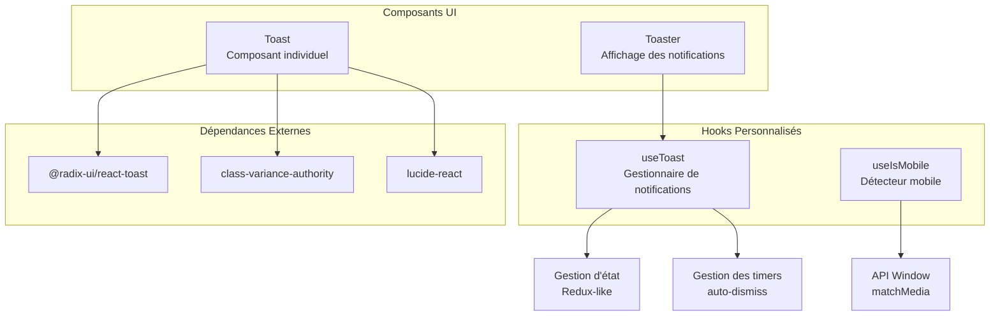
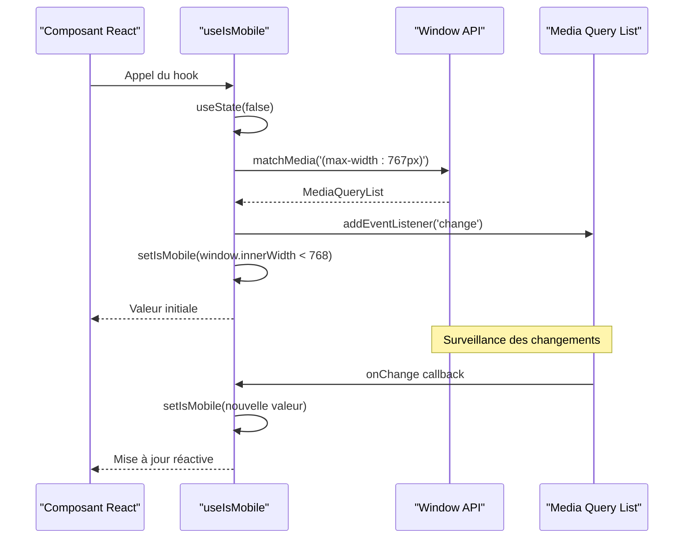
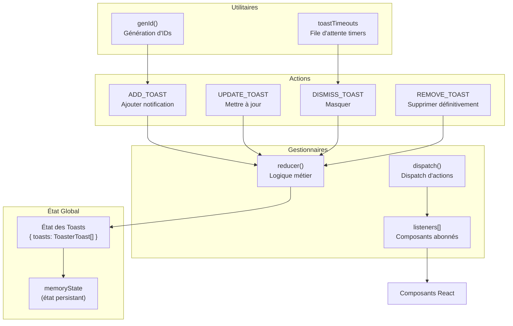
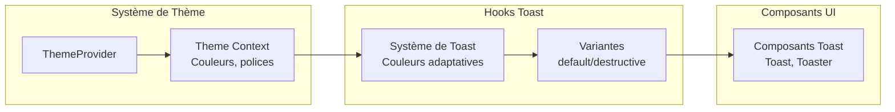

# Hooks Personnalisés

<cite>
**Fichiers Référencés dans ce Document**
- [hooks/use-mobile.tsx](file://hooks/use-mobile.tsx)
- [hooks/use-toast.ts](file://hooks/use-toast.ts)
- [components/ui/toaster.tsx](file://components/ui/toaster.tsx)
- [components/ui/toast.tsx](file://components/ui/toast.tsx)
- [package.json](file://package.json)
</cite>

## Table des Matières
1. [Introduction](#introduction)
2. [Structure du Projet](#structure-du-projet)
3. [Hook use-mobile](#hook-use-mobile)
4. [Hook use-toast](#hook-use-toast)
5. [Intégration et Utilisation](#intégration-et-utilisation)
6. [Cas d'Usage Courants](#cas-dusage-courants)
7. [Pièges à Éviter](#pièges-à-éviter)
8. [Optimisations et Bonnes Pratiques](#optimisations-et-bonnes-pratiques)
9. [Conclusion](#conclusion)

## Introduction

Le projet Decker utilise deux hooks personnalisés essentiels pour améliorer l'expérience utilisateur : `useIsMobile` pour détecter les appareils mobiles et `useToast` pour gérer les notifications. Ces hooks sont conçus pour être simples, efficaces et faciles à utiliser dans différents contextes de développement.

Cette documentation couvre l'implémentation technique, les signatures des fonctions, les paramètres, les valeurs de retour et les effets secondaires de chaque hook. Elle est structurée pour être accessible aux développeurs débutants tout en fournissant des détails techniques approfondis pour les experts.

## Structure du Projet

Le système de hooks personnalisés de Decker est organisé de manière modulaire :



**Sources du Diagramme**
- [hooks/use-mobile.tsx](file://hooks/use-mobile.tsx#L1-L20)
- [hooks/use-toast.ts](file://hooks/use-toast.ts#L1-L195)
- [components/ui/toaster.tsx](file://components/ui/toaster.tsx#L1-L36)
- [components/ui/toast.tsx](file://components/ui/toast.tsx#L1-L130)

**Sources de Section**
- [hooks/use-mobile.tsx](file://hooks/use-mobile.tsx#L1-L20)
- [hooks/use-toast.ts](file://hooks/use-toast.ts#L1-L195)

## Hook use-mobile

### Vue d'Ensemble

Le hook `useIsMobile` est un utilitaire simple mais puissant pour détecter automatiquement si l'utilisateur accède au site depuis un appareil mobile. Il utilise l'API `window.matchMedia` pour surveiller les changements de taille d'écran et fournit une valeur réactive.

### Implémentation Technique



**Sources du Diagramme**
- [hooks/use-mobile.tsx](file://hooks/use-mobile.tsx#L8-L16)

### Signature de la Fonction

```typescript
export function useIsMobile(): boolean
```

### Paramètres

Le hook `useIsMobile` n'accepte aucun paramètre.

### Valeurs de Retour

- **Type** : `boolean`
- **Description** : Retourne `true` si l'appareil est détecté comme mobile (largeur <= 768px), `false` sinon.

### Effets Secondaires

- **Écouteur d'événements** : Ajoute un écouteur `change` sur `window.matchMedia` pour surveiller les changements de taille d'écran.
- **Nettoyage** : Supprime l'écouteur lors du démontage du composant pour éviter les fuites mémoire.
- **État local** : Maintient un état local avec `useState` pour stocker la valeur de détection mobile.

### Algorithme de Détection

Le hook implémente une logique de détection basée sur la largeur de fenêtre :

1. **Seuil défini** : Utilise un seuil de 768px comme critère de détection mobile
2. **Surveillance continue** : Écoute les changements de média avec `matchMedia`
3. **Mise à jour réactive** : Met à jour l'état lorsque la condition change
4. **Nettoyage automatique** : Supprime les écouteurs lors du démontage

### Cas d'Usage Spécifiques

- **Rendu conditionnel** : Afficher différents layouts selon le type d'appareil
- **Optimisation responsive** : Adapter les fonctionnalités selon la capacité de l'appareil
- **Navigation adaptative** : Modifier la navigation pour les interfaces touch

**Sources de Section**
- [hooks/use-mobile.tsx](file://hooks/use-mobile.tsx#L1-L20)

## Hook use-toast

### Vue d'Ensemble

Le hook `useToast` fournit un système complet de gestion des notifications avec une architecture Redux-like. Il permet d'ajouter, mettre à jour et supprimer des notifications de manière centralisée.

### Architecture du Système



**Sources du Diagramme**
- [hooks/use-toast.ts](file://hooks/use-toast.ts#L77-L130)
- [hooks/use-toast.ts](file://hooks/use-toast.ts#L132-L194)

### Signatures des Fonctions

#### useToast()

```typescript
function useToast(): {
  toasts: ToasterToast[];
  toast: (props: Toast) => { id: string; dismiss: () => void; update: (props: ToasterToast) => void };
  dismiss: (toastId?: string) => void;
}
```

#### toast()

```typescript
function toast(props: Toast): { id: string; dismiss: () => void; update: (props: ToasterToast) => void }
```

### Paramètres

#### useToast()

- **Retour** : Objet contenant :
  - `toasts` : Tableau des notifications actives
  - `toast` : Fonction pour créer de nouvelles notifications
  - `dismiss` : Fonction pour masquer des notifications

#### toast(props: Toast)

- **props** : Propriétés de la notification
  - `title?` : Titre de la notification (ReactNode)
  - `description?` : Description (ReactNode)
  - `action?` : Bouton d'action (ToastActionElement)
  - `variant?` : Variante (default/destructive)
  - `duration?` : Durée d'affichage (ms)
  - `onOpenChange?` : Callback de changement d'état
  - `...props` : Autres propriétés compatibles avec ToastProps

### Valeurs de Retour

#### useToast()

- **Type** : `{ toasts: ToasterToast[]; toast: Function; dismiss: Function }`
- **Description** : Objet contenant l'état des notifications et les fonctions de manipulation

#### toast()

- **Type** : `{ id: string; dismiss: Function; update: Function }`
- **Description** : Objet représentant la notification avec méthodes de contrôle

### Effets Secondaires

#### useToast()

- **Abonnement** : Ajoute le composant aux listeners pour recevoir les mises à jour d'état
- **Nettoyage** : Supprime l'abonnement lors du démontage
- **État local** : Maintient un état local synchronisé avec l'état global

#### toast()

- **ID unique** : Génère un identifiant unique pour chaque notification
- **Timer automatique** : Configure un timer pour la suppression automatique
- **Callback** : Attache un callback pour la fermeture automatique
- **Mise à jour** : Permet la mise à jour dynamique de la notification

### Flux de Traitement

```mermaid
flowchart TD
Start([Appel toast()]) --> GenId["Générer ID unique"]
GenId --> CreateToast["Créer objet Toast"]
CreateToast --> AttachCallbacks["Attacher callbacks"]
AttachCallbacks --> DispatchAdd["Dispatch ADD_TOAST"]
DispatchAdd --> UpdateMemory["Mettre à jour memoryState"]
UpdateMemory --> NotifyListeners["Notifier listeners"]
NotifyListeners --> UpdateUI["Mettre à jour UI"]
UpdateUI --> UserAction{"Action utilisateur"}
UserAction --> |Cliquer| DismissManual["Dismiss manuel"]
UserAction --> |Timer expiré| AutoDismiss["Dismiss automatique"]
DismissManual --> DispatchDismiss["Dispatch DISMISS_TOAST"]
AutoDismiss --> DispatchDismiss
DispatchDismiss --> QueueRemoval["Ajouter à queue de suppression"]
QueueRemoval --> DispatchRemove["Dispatch REMOVE_TOAST"]
DispatchRemove --> FinalUpdate["Mise à jour finale"]
```

**Sources du Diagramme**
- [hooks/use-toast.ts](file://hooks/use-toast.ts#L145-L171)

### Configuration et Limites

Le système de toast intègre plusieurs contraintes pour une expérience utilisateur optimale :

- **TOAST_LIMIT** : Limite à 1 notification simultanée
- **TOAST_REMOVE_DELAY** : Délai de suppression automatique (1000000ms)
- **Génération d'IDs** : Système de compteur circulaire pour éviter les collisions
- **Gestion des timers** : Map de timers pour éviter les doublons

**Sources de Section**
- [hooks/use-toast.ts](file://hooks/use-toast.ts#L1-L195)

## Intégration et Utilisation

### Configuration de Base

Pour utiliser les hooks personnalisés dans une application Next.js :

```typescript
// Dans votre fichier layout.tsx ou page.tsx
import { Toaster } from '@/components/ui/toaster'

export default function RootLayout({ children }) {
  return (
    <>
      {children}
      <Toaster />
    </>
  )
}
```

### Utilisation du Hook use-mobile

```typescript
import { useIsMobile } from '@/hooks/use-mobile'

function ResponsiveComponent() {
  const isMobile = useIsMobile()
  
  return (
    <div>
      {isMobile ? (
        <MobileView />
      ) : (
        <DesktopView />
      )}
    </div>
  )
}
```

### Utilisation du Hook use-toast

```typescript
import { useToast } from '@/hooks/use-toast'

function ButtonWithToast() {
  const { toast } = useToast()
  
  const handleClick = () => {
    toast({
      title: "Succès",
      description: "Opération effectuée avec succès",
      variant: "default"
    })
  }
  
  return (
    <button onClick={handleClick}>
      Effectuer l'action
    </button>
  )
}
```

### Intégration avec le Contexte de Thème

Les hooks personnalisés s'intègrent bien avec le système de thème de Decker :



**Sources du Diagramme**
- [components/ui/toast.tsx](file://components/ui/toast.tsx#L27-L40)
- [components/ui/toaster.tsx](file://components/ui/toaster.tsx#L1-L36)

**Sources de Section**
- [components/ui/toaster.tsx](file://components/ui/toaster.tsx#L1-L36)
- [hooks/use-mobile.tsx](file://hooks/use-mobile.tsx#L1-L20)
- [hooks/use-toast.ts](file://hooks/use-toast.ts#L174-L194)

## Cas d'Usage Courants

### 1. Notifications de Succès

```typescript
// Utilisation typique pour les succès
const { toast } = useToast()

const handleSuccess = () => {
  toast({
    title: "Modification enregistrée",
    description: "Votre profil a été mis à jour",
    variant: "default",
    duration: 3000
  })
}
```

### 2. Notifications d'Erreur

```typescript
// Utilisation pour les erreurs
const handleError = (error: Error) => {
  toast({
    title: "Erreur",
    description: error.message,
    variant: "destructive",
    duration: 5000
  })
}
```

### 3. Notifications avec Actions

```typescript
// Notifications avec boutons d'action
const handleUndo = () => {
  toast({
    title: "Action annulée",
    description: "La dernière modification a été annulée",
    action: (
      <ToastAction altText="Rétablir">
        Rétablir
      </ToastAction>
    )
  })
}
```

### 4. Détection Responsive

```typescript
// Adaptation UI selon le type d'appareil
const Navigation = () => {
  const isMobile = useIsMobile()
  
  if (isMobile) {
    return <MobileNavigation />
  }
  
  return <DesktopNavigation />
}
```

### 5. Notifications de Chargement

```typescript
// Pattern de notification de chargement
const useLoadingToast = () => {
  const { toast } = useToast()
  
  const showLoading = (message: string) => {
    return toast({
      title: message,
      description: "Veuillez patienter...",
      duration: Infinity
    })
  }
  
  return { showLoading }
}
```

## Pièges à Éviter

### 1. Oubli de l'Élément Toaster

**Problème** : Le composant `Toaster` n'est pas inclus dans le layout

**Solution** :
```typescript
// ❌ Incorrect
export default function Layout({ children }) {
  return children
}

// ✅ Correct
export default function Layout({ children }) {
  return (
    <>
      {children}
      <Toaster />
    </>
  )
}
```

### 2. Gestion Manuelle des IDs

**Problème** : Tentative de gestion manuelle des IDs de toast

**Solution** :
```typescript
// ❌ Incorrect - ne pas gérer manuellement les IDs
const myToast = toast({ title: "Message" })
myToast.id = "custom-id" // Ne fonctionnera pas comme prévu

// ✅ Correct - utiliser les méthodes fournies
const myToast = toast({ title: "Message" })
myToast.update({ title: "Nouveau titre" })
myToast.dismiss()
```

### 3. Surcharge de Notifications

**Problème** : Trop de notifications simultanées

**Solution** :
```typescript
// ❌ Incorrect - peut surcharger l'interface
for (let i = 0; i < 10; i++) {
  toast({ title: `Notification ${i}` })
}

// ✅ Correct - gestion limitée
const { toast } = useToast()
const MAX_TOASTS = 3

// Implémenter une logique de limitation
```

### 4. Ignorer la Nettoyance

**Problème** : Les écouteurs ne sont pas nettoyés correctement

**Solution** :
```typescript
// ✅ Correct - le hook gère automatiquement le nettoyage
import { useToast } from '@/hooks/use-toast'

function MyComponent() {
  const { toast } = useToast()
  
  // Pas besoin de nettoyage manuel
  useEffect(() => {
    toast({ title: "Hello" })
  }, [])
}
```

### 5. Dépendances Incorrectes

**Problème** : Utilisation incorrecte des dépendances dans les callbacks

**Solution** :
```typescript
// ❌ Incorrect - dépendances potentiellement erronées
useEffect(() => {
  const interval = setInterval(() => {
    toast({ title: "Tick" })
  }, 1000)
  
  return () => clearInterval(interval)
}, [toast]) // Dépendance inutile

// ✅ Correct - dépendances appropriées
useEffect(() => {
  const interval = setInterval(() => {
    toast({ title: "Tick" })
  }, 1000)
  
  return () => clearInterval(interval)
}, []) // Pas de dépendance
```

## Optimisations et Bonnes Pratiques

### 1. Performance du Hook use-mobile

- **Cache de la requête média** : La requête `matchMedia` est créée une seule fois
- **Nettoyage automatique** : Les écouteurs sont supprimés lors du démontage
- **État initial optimisé** : Utilise `undefined` comme valeur initiale pour éviter le re-rendu

### 2. Performance du Hook use-toast

- **État global partagé** : Un seul état global pour toutes les notifications
- **Listeners optimisés** : Gestion efficace des abonnements/désabonnements
- **Génération d'IDs rapide** : Système de compteur simple et efficace

### 3. Gestion Mémoire

```typescript
// ✅ Bonne pratique : Nettoyage automatique
function OptimizedComponent() {
  const { toast } = useToast()
  
  useEffect(() => {
    // Le hook gère automatiquement le nettoyage
    const cleanup = toast({
      title: "Opération longue",
      duration: Infinity
    })
    
    return () => {
      // Nettoyage optionnel si nécessaire
      cleanup.dismiss()
    }
  }, [])
}
```

### 4. Accessibilité

- **Focus management** : Les notifications peuvent être fermées avec le clavier
- **ARIA labels** : Composants accessibles nativement
- **Contraste suffisant** : Couleurs adaptées au thème

### 5. Tests et Validation

```typescript
// ✅ Bonne pratique : Tests de validation
describe('useToast', () => {
  it('should add a toast', () => {
    const { result } = renderHook(() => useToast())
    act(() => {
      result.current.toast({ title: 'Test' })
    })
    expect(result.current.toasts.length).toBe(1)
  })
})
```

### 6. Types et Interfaces

Le système utilise des types TypeScript stricts :

```typescript
// Types garantissant la sécurité
type ToasterToast = ToastProps & {
  id: string
  title?: React.ReactNode
  description?: React.ReactNode
  action?: ToastActionElement
}
```

**Sources de Section**
- [hooks/use-mobile.tsx](file://hooks/use-mobile.tsx#L8-L16)
- [hooks/use-toast.ts](file://hooks/use-toast.ts#L132-L194)
- [components/ui/toast.tsx](file://components/ui/toast.tsx#L115-L118)

## Conclusion

Les hooks personnalisés `useIsMobile` et `useToast` constituent des outils puissants et bien conçus pour améliorer l'expérience utilisateur dans l'application Decker. Ils démontrent une architecture modulaire, une gestion d'état efficace et une intégration transparente avec le système de composants UI.

### Points Clés à Retenir

1. **Simplicité d'utilisation** : Les hooks offrent une API intuitive et facile à utiliser
2. **Performance optimisée** : Implémentations efficaces avec nettoyage automatique
3. **Intégration transparente** : Compatible avec le système de thème et les autres composants
4. **Flexibilité** : Support de nombreux cas d'usage avec peu de configuration
5. **Accessibilité** : Conception respectant les standards d'accessibilité web

### Recommandations pour l'Évolution

- **Extensibilité** : Considérer l'ajout de nouveaux types de notifications
- **Personnalisation** : Permettre plus de personnalisation des animations
- **Internationalisation** : Support multilingue pour les messages
- **Analytics** : Intégration avec les systèmes d'analyse d'interaction

Ces hooks personnalisés représentent un excellent exemple de développement React moderne, combinant simplicité d'utilisation avec robustesse technique et performance.