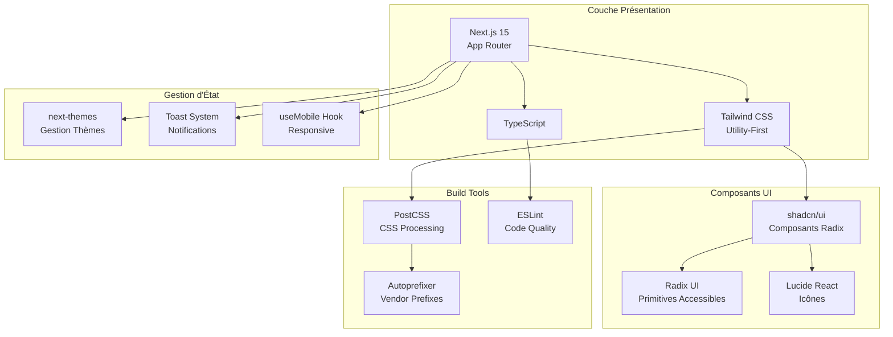
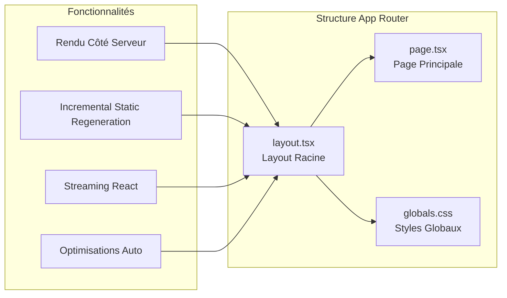
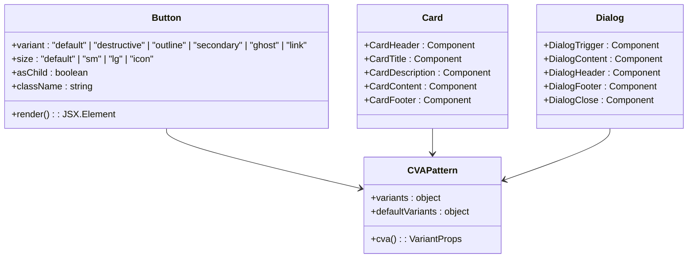
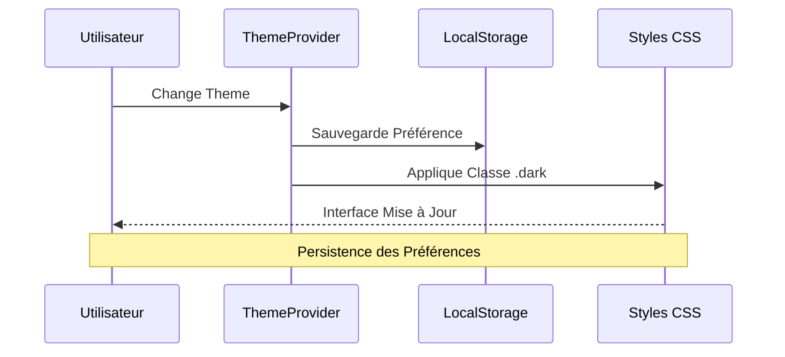
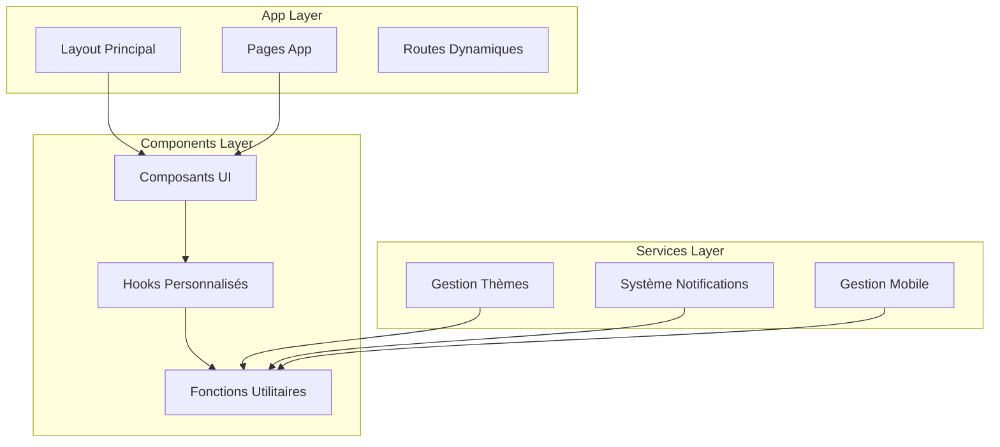
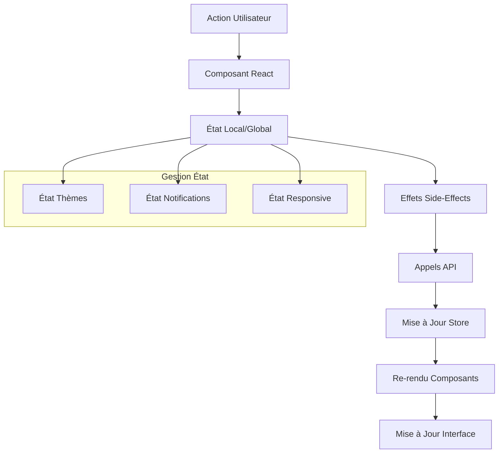
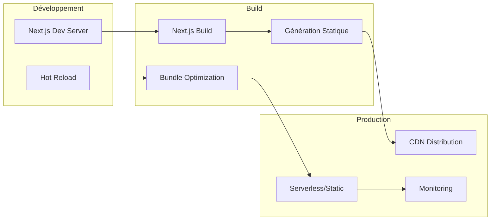

# Stack Technique

<cite>
**Fichiers Référencés dans ce Document**
- [package.json](file://package.json)
- [next.config.ts](file://next.config.ts)
- [tailwind.config.ts](file://tailwind.config.ts)
- [tsconfig.json](file://tsconfig.json)
- [components.json](file://components.json)
- [postcss.config.mjs](file://postcss.config.mjs)
- [app/layout.tsx](file://app/layout.tsx)
- [app/globals.css](file://app/globals.css)
- [app/page.tsx](file://app/page.tsx)
- [lib/utils.ts](file://lib/utils.ts)
- [hooks/use-toast.ts](file://hooks/use-toast.ts)
- [hooks/use-mobile.tsx](file://hooks/use-mobile.tsx)
- [components/ui/button.tsx](file://components/ui/button.tsx)
- [components/ui/card.tsx](file://components/ui/card.tsx)
- [components/ui/dialog.tsx](file://components/ui/dialog.tsx)
</cite>

## Table des Matières
1. [Introduction](#introduction)
2. [Vue d'Ensemble de la Stack](#vue-densemble-de-la-stack)
3. [Next.js 15 - Rendu Côté Serveur](#nextjs-15---rendu-côté-serveur)
4. [TypeScript - Typage Statique](#typescript---typage-statique)
5. [Tailwind CSS - Styling Utility-First](#tailwind-css---styling-utility-first)
6. [Shadcn/ui - Composants Réutilisables](#shadcnui---composants-réutilisables)
7. [Next-Themes - Gestion du Thème](#next-themes---gestion-du-thème)
8. [Architecture et Patterns de Conception](#architecture-et-patterns-de-conception)
9. [Flux de Données et Intégration](#flux-de-données-et-intégration)
10. [Considérations de Performance](#considérations-de-performance)
11. [Déploiement et Infrastructure](#déploiement-et-infrastructure)
12. [Conclusion](#conclusion)

## Introduction

Decker est une application web moderne construite avec une stack technique sophistiquée qui combine les dernières innovations du développement web. Cette documentation explore en détail chaque technologie utilisée, leurs interactions, et les décisions architecturales qui ont façonné cette application.

La stack technique de Decker repose sur plusieurs piliers fondamentaux : Next.js 15 pour le rendu côté serveur et les routes App Router, TypeScript pour le typage statique, Tailwind CSS pour le styling utility-first, shadcn/ui pour les composants réutilisables basés sur Radix UI, et next-themes pour la gestion du thème clair/sombre.

## Vue d'Ensemble de la Stack



**Sources du Diagramme**
- [package.json](file://package.json#L11-L35)
- [tailwind.config.ts](file://tailwind.config.ts#L1-L73)
- [components.json](file://components.json#L1-L23)

**Sources de Section**
- [package.json](file://package.json#L1-L50)
- [next.config.ts](file://next.config.ts#L1-L8)
- [tailwind.config.ts](file://tailwind.config.ts#L1-L73)

## Next.js 15 - Rendu Côté Serveur

### Architecture App Router

Next.js 15 implémente le nouveau système de routage App Router qui offre plusieurs avantages architecturaux :



**Sources du Diagramme**
- [app/layout.tsx](file://app/layout.tsx#L1-L35)
- [app/page.tsx](file://app/page.tsx#L1-L8)

### Configuration et Optimisations

Le fichier de configuration Next.js utilise une approche minimaliste, permettant au framework d'appliquer ses optimisations par défaut tout en maintenant la flexibilité nécessaire.

**Caractéristiques principales :**
- **Rendu côté serveur (SSR)** : Chaque page est générée côté serveur pour améliorer les performances et le SEO
- **Routes dynamiques** : Support natif des paramètres de route et des segments dynamiques
- **Streaming** : Chargement progressif des composants pour une expérience utilisateur optimale
- **Optimisations automatiques** : Lazy loading, code splitting et optimisation des assets

**Sources de Section**
- [next.config.ts](file://next.config.ts#L1-L8)
- [app/layout.tsx](file://app/layout.tsx#L1-L35)

## TypeScript - Typage Statique

### Configuration TypeScript

La configuration TypeScript de Decker est optimisée pour les applications Next.js modernes :

```mermaid
classDiagram
class TypeScriptConfig {
+target : ES2017
+lib : ["dom", "dom.iterable", "esnext"]
+strict : true
+noEmit : true
+jsx : "preserve"
+plugins : ["next"]
+paths : {"@/*" : ["./*"]}
}
class NextPlugin {
+name : "next"
+processes : JSX, TSX, MDX
+optimizations : Incremental Compilation
}
class CompilerOptions {
+module : "esnext"
+moduleResolution : "bundler"
+resolveJsonModule : true
+isolatedModules : true
}
TypeScriptConfig --> NextPlugin
TypeScriptConfig --> CompilerOptions
```

**Sources du Diagramme**
- [tsconfig.json](file://tsconfig.json#L2-L24)

### Avantages du Typage Statique

- **Détection d'erreurs précoces** : Validation des types à la compilation
- **Meilleure expérience développeur** : Autocomplétion intelligente et documentation intégrée
- **Maintenabilité** : Documentation implicite des interfaces et contrats
- **Refactoring sécurisé** : Modification de code sans risque de régression

**Sources de Section**
- [tsconfig.json](file://tsconfig.json#L1-L28)

## Tailwind CSS - Styling Utility-First

### Configuration et Variables CSS

La configuration Tailwind CSS de Decker utilise un système de variables CSS pour une gestion centralisée des couleurs et des espacements :

```mermaid
graph TB
subgraph "Configuration Tailwind"
Config[tailwind.config.ts]
Content[content: ["./app/**/*"]]
Theme[theme.extend]
end
subgraph "Variables CSS"
Light[Variables Claires<br/>--background, --primary]
Dark[Variables Sombres<br/>.dark class]
Semantic[Variables Sémantiques<br/>card, popover, accent]
end
subgraph "Plugins"
Animations[tailwindcss-animate]
Utilities[Custom Utilities]
end
Config --> Content
Config --> Theme
Theme --> Light
Theme --> Dark
Theme --> Semantic
Config --> Animations
Config --> Utilities
```

**Sources du Diagramme**
- [tailwind.config.ts](file://tailwind.config.ts#L1-L73)
- [app/globals.css](file://app/globals.css#L1-L95)

### Système de Couleurs

Le système de couleurs utilise des variables CSS HSL pour une gestion cohérente du thème :

- **Couleurs primaires** : Utilisation de variables `--primary` et `--primary-foreground`
- **Couleurs sémantiques** : `--background`, `--foreground`, `--card`, `--popover`
- **Couleurs d'état** : `--destructive`, `--warning`, `--success`
- **Couleurs d'accent** : `--accent`, `--muted`, `--border`

### PostCSS et Autoprefixer

La configuration PostCSS inclut :
- **Tailwind CSS** : Processing des directives @tailwind
- **Autoprefixer** : Ajout automatique des prefixes vendor
- **Optimisations** : Minification et optimisation des CSS

**Sources de Section**
- [tailwind.config.ts](file://tailwind.config.ts#L1-L73)
- [postcss.config.mjs](file://postcss.config.mjs#L1-L10)
- [app/globals.css](file://app/globals.css#L1-L95)

## Shadcn/ui - Composants Réutilisables

### Architecture des Composants

Shadcn/ui fournit une collection de composants réutilisables basés sur Radix UI, avec un système de variantes sophistiqué :



**Sources du Diagramme**
- [components/ui/button.tsx](file://components/ui/button.tsx#L1-L58)
- [components/ui/card.tsx](file://components/ui/card.tsx#L1-L77)
- [components/ui/dialog.tsx](file://components/ui/dialog.tsx#L1-L123)

### Système de Variantes

Le composant Button illustre parfaitement le système de variantes de shadcn/ui :

- **Variantes de couleur** : default, destructive, outline, secondary, ghost, link
- **Variantes de taille** : default, sm, lg, icon
- **Flexibilité** : Propriété `asChild` pour wrapper d'autres composants
- **Accessibilité** : Basé sur Radix UI avec support complet des rôles ARIA

### Intégration avec Radix UI

Chaque composant shadcn/ui est une enveloppe autour d'un ou plusieurs primitives Radix UI, garantissant :
- **Accessibilité** : Implémentation conforme WCAG
- **Performance** : Bundle size optimisé
- **Flexibilité** : API extensible et personnalisable
- **Coherence** : Design system cohérent

**Sources de Section**
- [components/ui/button.tsx](file://components/ui/button.tsx#L1-L58)
- [components/ui/card.tsx](file://components/ui/card.tsx#L1-L77)
- [components/ui/dialog.tsx](file://components/ui/dialog.tsx#L1-L123)
- [components.json](file://components.json#L1-L23)

## Next-Themes - Gestion du Thème

### Système de Thèmes

Le système de thèmes utilise next-themes pour une gestion transparente des thèmes clair/sombre :



**Sources du Diagramme**
- [app/layout.tsx](file://app/layout.tsx#L1-L35)
- [app/globals.css](file://app/globals.css#L49-L82)

### Variables CSS et Thèmes

Le système utilise des variables CSS HSL pour une synchronisation automatique des couleurs :

- **Variables racine** : Définition des couleurs pour le thème clair
- **Classe .dark** : Application des couleurs pour le thème sombre
- **Transition fluide** : Animations CSS pour les changements de thème
- **Persistance** : Sauvegarde des préférences utilisateur

**Sources de Section**
- [app/globals.css](file://app/globals.css#L1-L95)
- [app/layout.tsx](file://app/layout.tsx#L1-L35)

## Architecture et Patterns de Conception

### Architecture Modulaire



### Patterns de Conception Implémentés

1. **Pattern Provider** : Gestion centralisée de l'état global (thèmes, notifications)
2. **Pattern Composition** : Utilisation de `asChild` pour la composition flexible
3. **Pattern Factory** : Système de variantes pour la création dynamique de composants
4. **Pattern Observer** : Hooks personnalisés pour la réactivité (useToast, useMobile)

### Séparation des Responsabilités

- **App** : Gestion des routes et layouts
- **Components** : Logique de présentation et interactivité
- **Hooks** : Logique métier et état local
- **Lib** : Fonctions utilitaires partagées
- **Styles** : Système de styling et design tokens

**Sources de Section**
- [lib/utils.ts](file://lib/utils.ts#L1-L7)
- [hooks/use-toast.ts](file://hooks/use-toast.ts#L1-L195)
- [hooks/use-mobile.tsx](file://hooks/use-mobile.tsx#L1-L20)

## Flux de Données et Intégration

### Flux de Données Unidirectionnel



### Intégration des Composants

Le système d'intégration des composants suit ces principes :

1. **Composition plutôt qu'héritage** : Utilisation de `asChild` pour la flexibilité
2. **Prop drilling minimisé** : Context providers pour l'état global
3. **Type safety** : Interfaces TypeScript pour toutes les props
4. **Accessibility first** : Implémentation Radix UI pour l'accessibilité

### Hooks Personnalisés

Les hooks personnalisés suivent un pattern cohérent :

- **useToast** : Système de notification avec limitation de nombre
- **useMobile** : Détection responsive avec gestion d'événements
- **cn** : Fonction utilitaire pour la composition de classes CSS

**Sources de Section**
- [hooks/use-toast.ts](file://hooks/use-toast.ts#L1-L195)
- [hooks/use-mobile.tsx](file://hooks/use-mobile.tsx#L1-L20)
- [lib/utils.ts](file://lib/utils.ts#L1-L7)

## Considérations de Performance

### Optimisations Automatiques

Next.js 15 apporte plusieurs optimisations de performance :

- **Code splitting automatique** : Division du bundle par route
- **Lazy loading** : Chargement différé des composants non critiques
- **Image optimization** : Optimisation automatique des images
- **Prefetching intelligent** : Préchargement des ressources importantes

### Optimisations CSS

- **Tailwind purging** : Suppression des styles inutilisés
- **Variables CSS** : Réduction de la taille des bundles
- **Animations optimisées** : Utilisation de transform et opacity
- **Critique rendering** : Critic-first rendering pour les performances

### Gestion Mémoire

- **React.memo** : Optimisation des re-rendus
- **useCallback/useMemo** : Mémorisation des fonctions et valeurs
- **Event delegation** : Gestion efficace des événements
- **Cleanup des effets** : Nettoyage automatique des listeners

## Déploiement et Infrastructure

### Configuration de Build



### Exigences d'Infrastructure

- **Serveur Node.js** : Version 18+ recommandée
- **Mémoire** : Minimum 512MB, recommandé 1GB+
- **Stockage** : Espace disque pour les assets générés
- **Réseau** : Connexion stable pour les builds et déploiements

### Considérations d'Évolutivité

- **Scaling horizontal** : Applications Next.js facilement distribuables
- **Caching stratégique** : Utilisation des caches CDN et navigateur
- **Optimisation des assets** : Compression et minification automatique
- **Monitoring** : Observabilité intégrée avec les métriques Next.js

### Topologie de Déploiement

- **Static Generation** : Pages statiques pour haute performance
- **Server-Side Rendering** : Contenu dynamique avec SSR
- **Incremental Static Regeneration** : Mise à jour progressive des pages
- **Edge Functions** : Exécution côté edge pour latence réduite

## Conclusion

La stack technique de Decker représente une approche moderne et cohérente du développement web moderne. L'architecture modulaire, combinée aux technologies avancées, offre :

### Avantages Clés

- **Performance** : Optimisations automatiques et rendu côté serveur
- **Expérience développeur** : TypeScript, ESLint et outils de build robustes
- **Accessibilité** : Base Radix UI garantissant l'accessibilité
- **Maintenabilité** : Architecture claire et patterns de conception cohérents
- **Extensibilité** : Système de composants modulaires et configurable

### Limites et Contraintes

- **Complexité initiale** : Apprentissage des nouvelles APIs Next.js 15
- **Bundle size** : Impact potentiel des bibliothèques externes
- **SEO** : Nécessité de configuration appropriée pour le SSR
- **Testing** : Complexité accrue pour les tests d'intégration

### Recommandations Futures

- **Monitoring** : Implémentation de métriques de performance
- **Testing** : Ajout de tests unitaires et d'intégration
- **Documentation** : Amélioration de la documentation technique
- **CI/CD** : Automatisation complète du processus de déploiement

Cette stack technique constitue une base solide pour le développement d'applications web modernes, équilibrant performance, maintenabilité et expérience utilisateur.