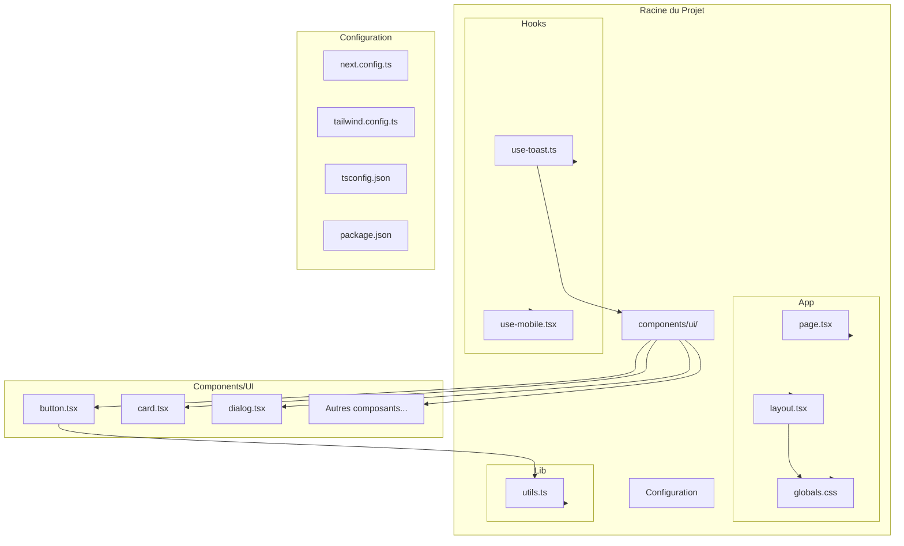
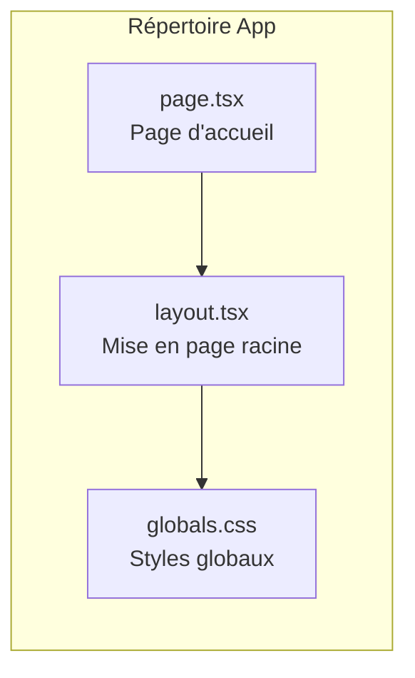
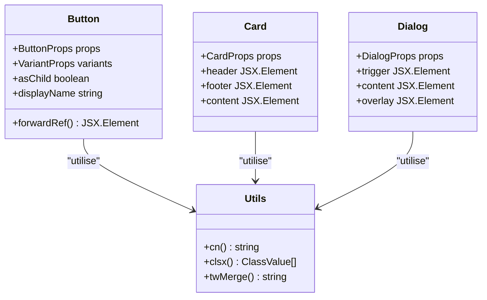
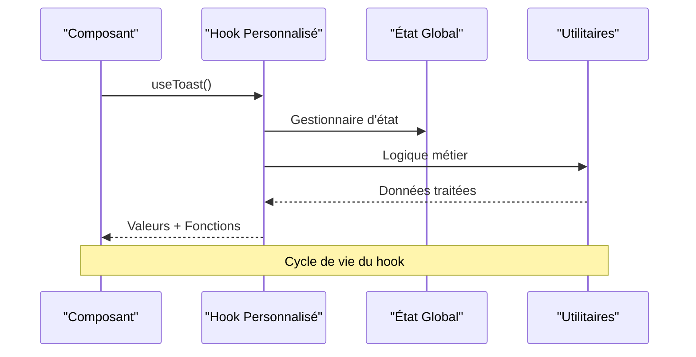
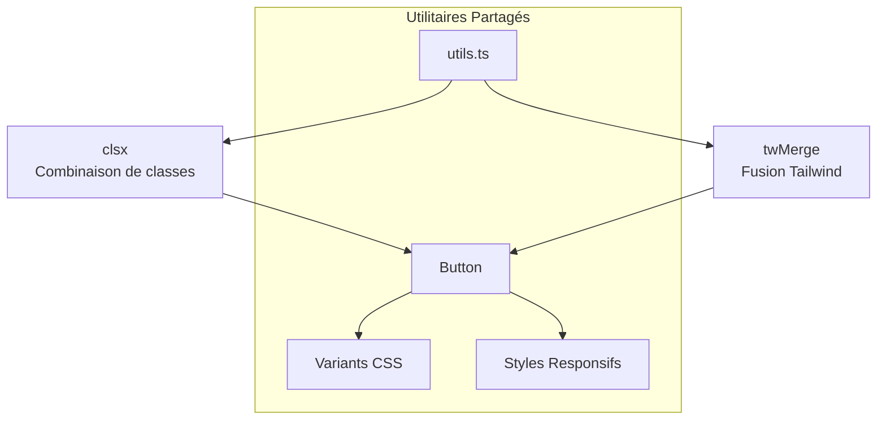
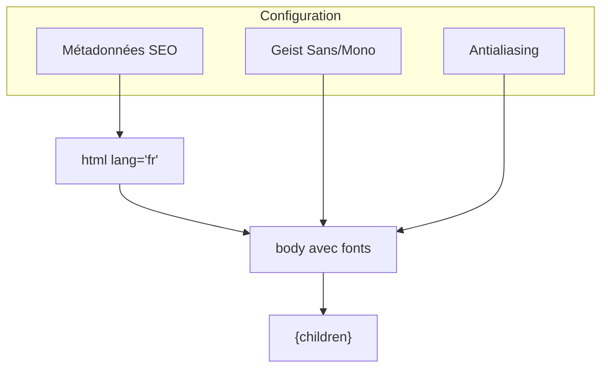
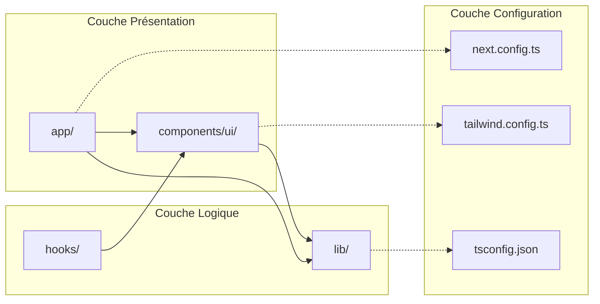

# Structure du Projet Decker

<cite>
**Fichiers Référencés dans ce Document**
- [app/layout.tsx](file://app/layout.tsx)
- [app/page.tsx](file://app/page.tsx)
- [app/globals.css](file://app/globals.css)
- [next.config.ts](file://next.config.ts)
- [tailwind.config.ts](file://tailwind.config.ts)
- [tsconfig.json](file://tsconfig.json)
- [lib/utils.ts](file://lib/utils.ts)
- [hooks/use-toast.ts](file://hooks/use-toast.ts)
- [hooks/use-mobile.tsx](file://hooks/use-mobile.tsx)
- [components/ui/button.tsx](file://components/ui/button.tsx)
- [package.json](file://package.json)
- [components.json](file://components.json)
</cite>

## Table des Matières
1. [Introduction](#introduction)
2. [Vue d'Ensemble de l'Architecture](#vue-densemble-de-larchitecture)
3. [Répertoire App](#répertoire-app)
4. [Répertoire Components/UI](#répertoire-componentsui)
5. [Répertoire Hooks](#répertoire-hooks)
6. [Répertoire Lib](#répertoire-lib)
7. [Fichiers de Configuration](#fichiers-de-configuration)
8. [Composants Principaux](#composants-principaux)
9. [Relations d'Importation et Dépendances](#relations-dimportation-et-dépendances)
10. [Bonnes Pratiques de Nommage](#bonnes-pratiques-de-nommage)
11. [Conclusion](#conclusion)

## Introduction

Le projet Decker est une application web moderne construite avec Next.js 15, utilisant une architecture modulaire bien organisée qui suit les meilleures pratiques du développement React. L'application implémente une approche de composants réutilisables avec shadcn/ui comme base de design système, tout en intégrant Tailwind CSS pour le styling et TypeScript pour la sécurité des types.

Cette structure permet une séparation claire des responsabilités, facilitant la maintenance et l'évolution du code. Le projet utilise RSC (React Server Components) pour optimiser les performances et adopte une approche conventionnelle pour organiser les fichiers et dossiers.

## Vue d'Ensemble de l'Architecture

L'architecture du projet Decker suit une structure hiérarchique claire avec des responsabilités bien définies pour chaque répertoire :



**Sources du Diagramme**
- [app/layout.tsx](file://app/layout.tsx#L1-L35)
- [app/page.tsx](file://app/page.tsx#L1-L8)
- [components/ui/button.tsx](file://components/ui/button.tsx#L1-L58)
- [hooks/use-toast.ts](file://hooks/use-toast.ts#L1-L195)
- [lib/utils.ts](file://lib/utils.ts#L1-L7)

## Répertoire App

Le répertoire `app/` constitue le cœur de l'application Next.js 15, suivant la nouvelle convention de routing introduite dans Next.js 13+. Il contient tous les composants de niveau supérieur et les fichiers de configuration de base.

### Structure du Répertoire App



**Sources du Diagramme**
- [app/layout.tsx](file://app/layout.tsx#L1-L35)
- [app/page.tsx](file://app/page.tsx#L1-L8)
- [app/globals.css](file://app/globals.css#L1-L95)

### Fichiers Clés du Répertoire App

#### layout.tsx
Le fichier `layout.tsx` définit la structure de mise en page racine de l'application. Il inclut :
- Importation des polices Geist pour l'optimisation des performances
- Configuration des variables CSS pour le thème
- Métadonnées SEO de base
- Structure HTML de base avec support RTL

#### page.tsx
Le fichier `page.tsx` représente la page d'accueil de l'application. Il contient :
- Un composant fonctionnel simple affichant un message de bienvenue
- Utilisation des classes Tailwind CSS pour le styling
- Structure responsive avec flexbox

#### globals.css
Le fichier CSS global configure :
- Import des directives Tailwind CSS (@tailwind base, components, utilities)
- Variables CSS personnalisées pour le thème sombre/clair
- Classes utilitaires personnalisées
- Application automatique des styles de base

**Sources de Section**
- [app/layout.tsx](file://app/layout.tsx#L1-L35)
- [app/page.tsx](file://app/page.tsx#L1-L8)
- [app/globals.css](file://app/globals.css#L1-L95)

## Répertoire Components/UI

Le répertoire `components/ui/` contient tous les composants d'interface utilisateur réutilisables basés sur shadcn/ui. Chaque composant suit une structure cohérente et implémente le design system de shadcn.

### Architecture des Composants UI



**Sources du Diagramme**
- [components/ui/button.tsx](file://components/ui/button.tsx#L1-L58)
- [lib/utils.ts](file://lib/utils.ts#L1-L7)

### Composants Principaux Disponibles

Le répertoire contient plus de 20 composants UI essentiels :

#### Composants de Base
- **Button** : Bouton avec variants multiples (default, destructive, outline, secondary, ghost, link)
- **Input** : Champ de saisie avec validation
- **Checkbox** : Case à cocher
- **Switch** : Interrupteur toggle

#### Composants de Layout
- **Card** : Carte avec header, content et footer
- **Separator** : Séparateur visuel
- **AspectRatio** : Maintien des proportions

#### Composants d'Interaction
- **Dialog** : Boîte de dialogue modale
- **DropdownMenu** : Menu contextuel
- **Popover** : Popover (infobulle interactive)
- **Tooltip** : Info-bulle simple

#### Composants de Navigation
- **NavigationMenu** : Menu de navigation principal
- **Breadcrumb** : Fil d'Ariane
- **Sidebar** : Barre latérale

#### Composants de Feedback
- **Alert** : Message d'alerte
- **Badge** : Badge informatif
- **Toast** : Notifications temporaires
- **Toaster** : Conteneur des notifications

**Sources de Section**
- [components/ui/button.tsx](file://components/ui/button.tsx#L1-L58)

## Répertoire Hooks

Le répertoire `hooks/` contient des hooks personnalisés réutilisables qui encapsulent la logique métier et l'état des composants.

### Architecture des Hooks



**Sources du Diagramme**
- [hooks/use-toast.ts](file://hooks/use-toast.ts#L1-L195)
- [hooks/use-mobile.tsx](file://hooks/use-mobile.tsx#L1-L20)

### Hooks Disponibles

#### useToast
Le hook `useToast` fournit un système de notification sophistiqué avec :
- Gestion d'état centralisée pour les notifications
- Limitation du nombre de notifications simultanées
- Timeout automatique pour la suppression
- Actions interactives (dismiss, update)
- Support SSR avec gestion mémoire

#### useMobile
Le hook `useMobile` détecte automatiquement si l'utilisateur utilise un appareil mobile :
- Écoute des changements de taille d'écran
- Breakpoint configurable (768px par défaut)
- Mise à jour réactive de l'état
- Nettoyage automatique des événements

**Sources de Section**
- [hooks/use-toast.ts](file://hooks/use-toast.ts#L1-L195)
- [hooks/use-mobile.tsx](file://hooks/use-mobile.tsx#L1-L20)

## Répertoire Lib

Le répertoire `lib/` contient les utilitaires partagés et les fonctions auxiliaires qui ne sont pas spécifiques à l'interface utilisateur.

### Architecture des Utilitaires



**Sources du Diagramme**
- [lib/utils.ts](file://lib/utils.ts#L1-L7)
- [components/ui/button.tsx](file://components/ui/button.tsx#L1-L58)

### Fonctionnalités de Lib

La fonction `cn()` dans `utils.ts` combine et fusionne les classes CSS de manière intelligente :
- **clsx** : Permet la conditionnalité dans la combinaison de classes
- **twMerge** : Fusionne les classes Tailwind CSS sans conflits
- **TypeScript** : Typage strict pour les valeurs de classe

Cette fonction est utilisée par tous les composants UI pour appliquer les classes CSS de manière optimale.

**Sources de Section**
- [lib/utils.ts](file://lib/utils.ts#L1-L7)

## Fichiers de Configuration

Le projet utilise plusieurs fichiers de configuration pour contrôler le comportement de l'application, du bundling au styling.

### Configuration Next.js

Le fichier `next.config.ts` configure Next.js avec :
- Options de base vides (configuration par défaut)
- Support RSC activé
- Optimisations de build
- Plugins et middlewares

### Configuration Tailwind CSS

Le fichier `tailwind.config.ts` définit :
- Support du mode sombre avec classes CSS
- Couleurs personnalisées via variables CSS
- Radius personnalisés pour les bordures
- Extensions pour les couleurs de chart et sidebar
- Plugin tailwindcss-animate

### Configuration TypeScript

Le fichier `tsconfig.json` configure :
- Cible ES2017 pour la compatibilité
- Support RSC avec le plugin Next.js
- Alias de chemin (@/*)
- Modules JSON et modules isolés
- JSX preserve pour Next.js

### Configuration Shadcn/ui

Le fichier `components.json` configure :
- Style New York de shadcn/ui
- Support TypeScript et RSC
- Configuration Tailwind CSS
- Alias personnalisés pour les imports
- Bibliothèque d'icônes Lucide

**Sources de Section**
- [next.config.ts](file://next.config.ts#L1-L8)
- [tailwind.config.ts](file://tailwind.config.ts#L1-L73)
- [tsconfig.json](file://tsconfig.json#L1-L28)
- [components.json](file://components.json#L1-L23)

## Composants Principaux

### Layout Principal

Le layout racine (`layout.tsx`) définit la structure fondamentale de l'application :



**Sources du Diagramme**
- [app/layout.tsx](file://app/layout.tsx#L20-L34)

### Page d'Accueil

La page d'accueil (`page.tsx`) est un exemple minimaliste :
- Composant fonctionnel simple
- Utilisation de classes Tailwind CSS
- Centrage vertical et horizontal
- Hiérarchie de titres

**Sources de Section**
- [app/layout.tsx](file://app/layout.tsx#L1-L35)
- [app/page.tsx](file://app/page.tsx#L1-L8)

## Relations d'Importation et Dépendances

### Architecture des Dépendances



**Sources du Diagramme**
- [app/layout.tsx](file://app/layout.tsx#L1-L4)
- [components/ui/button.tsx](file://components/ui/button.tsx#L1-L6)
- [lib/utils.ts](file://lib/utils.ts#L1-L3)

### Flux d'Importation Principal

1. **App** → **Components/UI** : Les pages importent les composants UI
2. **Components/UI** → **Lib** : Les composants UI utilisent les utilitaires
3. **Hooks** → **Components/UI** : Les hooks fournissent la logique aux composants
4. **Configuration** → **Tous** : Tous les fichiers utilisent la configuration globale

### Dépendances Externes

Le projet utilise des bibliothèques externes bien choisies :
- **Next.js 15** : Framework React moderne
- **shadcn/ui** : Design system modulaire
- **Tailwind CSS** : Utility-first CSS
- **Radix UI** : Composants de base accessibles
- **Lucide React** : Icônes vectorielles

**Sources de Section**
- [package.json](file://package.json#L11-L36)

## Bonnes Pratiques de Nommage

### Conventions Adoptées

#### Nommage des Fichiers
- **Convention kebab-case** : `use-toast.ts`, `use-mobile.tsx`
- **Extension explicite** : `.tsx` pour les composants React
- **Suffixe `.ts`** : Pour les utilitaires TypeScript
- **Nom du composant** : Identique au nom du fichier

#### Organisation des Imports
- **Alias `@/*`** : Chemins relatifs depuis la racine
- **Groupes d'imports** : React, packages, alias, locaux
- **Ordre alphabétique** : Dans chaque groupe

#### Structure des Composants
- **PropType interface** : Pour les props typées
- **VariantProps** : Pour les variations de composants
- **forwardRef** : Pour les composants composites
- **displayName** : Pour le debugging React

### Patterns Recommandés

#### Composants UI
```typescript
// Structure recommandée pour un composant UI
const buttonVariants = cva(/* ... */)
export interface ButtonProps extends React.ButtonHTMLAttributes<HTMLButtonElement>, VariantProps<typeof buttonVariants> {
  // Props supplémentaires
}
const Button = React.forwardRef<HTMLButtonElement, ButtonProps>(/* ... */)
```

#### Hooks Personnalisés
```typescript
// Structure recommandée pour un hook
export function useCustomHook() {
  // Logique du hook
  return {/* valeurs exportées */}
}
```

#### Utilitaires
```typescript
// Structure recommandée pour les utilitaires
export function utilityFunction() {
  // Logique utilitaire
  return /* résultat */
}
```

**Sources de Section**
- [components/ui/button.tsx](file://components/ui/button.tsx#L37-L58)
- [hooks/use-toast.ts](file://hooks/use-toast.ts#L174-L195)
- [lib/utils.ts](file://lib/utils.ts#L4-L7)

## Conclusion

La structure du projet Decker représente une architecture moderne et bien organisée pour une application Next.js 15. Elle met en pratique plusieurs bonnes pratiques :

### Points Forts de l'Architecture

1. **Séparation des Responsabilités** : Chaque répertoire a un rôle clair et bien défini
2. **Réutilisabilité** : Les composants UI et hooks sont conçus pour être réutilisables
3. **Maintenabilité** : La structure favorise la compréhension et la modification du code
4. **Performance** : L'utilisation de RSC et des optimisations Tailwind améliore les performances
5. **Accessibilité** : Les composants Radix UI garantissent l'accessibilité

### Avantages de l'Organisation

- **Scalabilité** : La structure peut facilement s'étendre avec de nouveaux composants
- **Collaboration** : Les conventions claires facilitent le travail d'équipe
- **Maintenance** : La séparation claire des préoccupations simplifie la maintenance
- **Évolutivité** : L'architecture supporte l'évolution de l'application

### Recommandations pour l'Évolution

1. **Documentation** : Ajouter des commentaires JSDoc pour les composants complexes
2. **Tests** : Implémenter une suite de tests unitaires et d'intégration
3. **Monitoring** : Intégrer des outils de monitoring des performances
4. **CI/CD** : Configurer un pipeline d'intégration continue

Cette architecture constitue une base solide pour développer des applications web modernes avec Next.js, offrant un équilibre optimal entre simplicité et fonctionnalité.