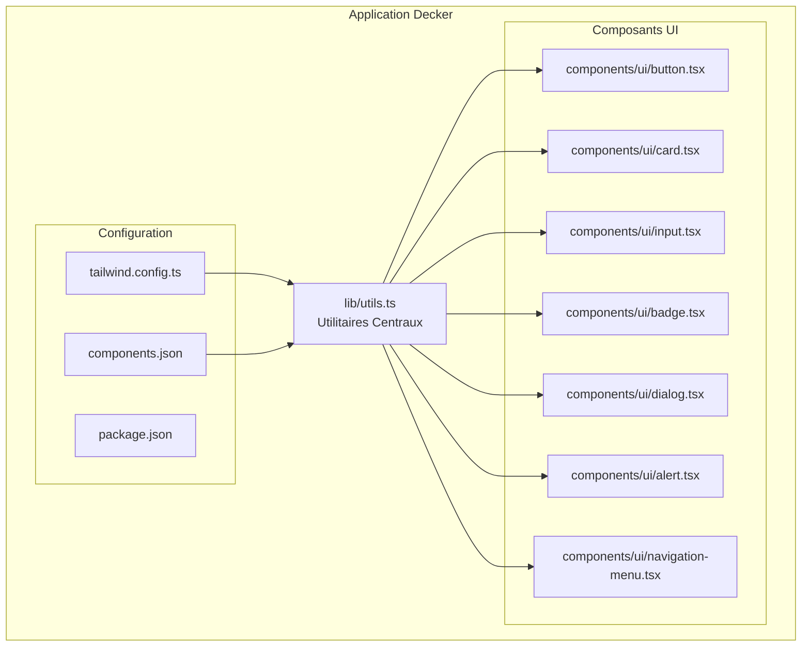
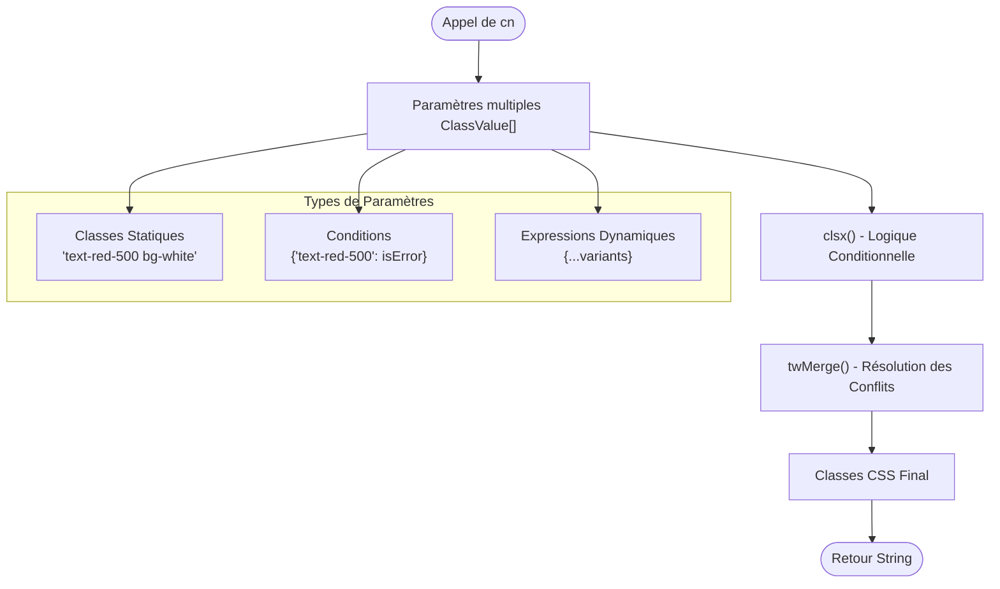
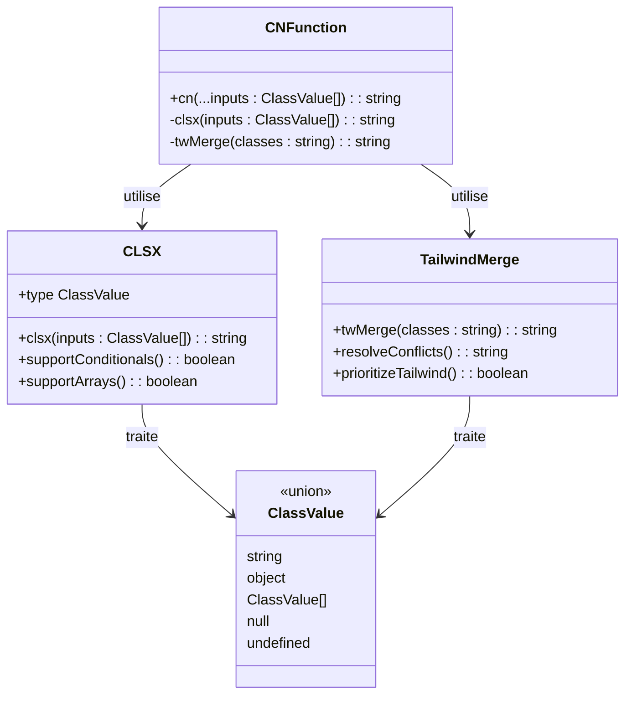
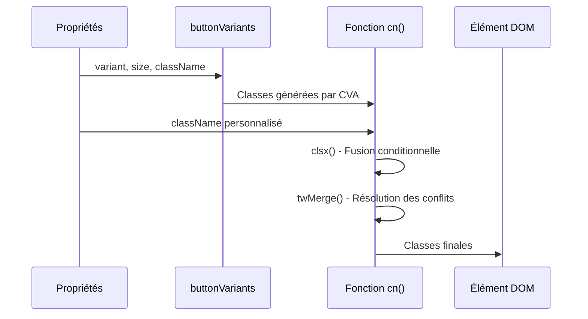
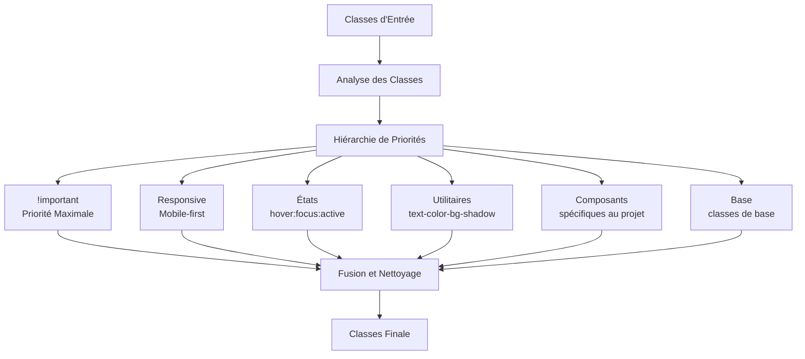

# Utilitaires

<cite>
**Fichiers Référencés dans ce Document**
- [lib/utils.ts](file://lib/utils.ts)
- [package.json](file://package.json)
- [components/ui/button.tsx](file://components/ui/button.tsx)
- [components/ui/card.tsx](file://components/ui/card.tsx)
- [components/ui/input.tsx](file://components/ui/input.tsx)
- [components/ui/badge.tsx](file://components/ui/badge.tsx)
- [components/ui/dialog.tsx](file://components/ui/dialog.tsx)
- [components/ui/alert.tsx](file://components/ui/alert.tsx)
- [components/ui/navigation-menu.tsx](file://components/ui/navigation-menu.tsx)
- [tailwind.config.ts](file://tailwind.config.ts)
- [components.json](file://components.json)
</cite>

## Table des Matières
1. [Introduction](#introduction)
2. [Structure du Projet](#structure-du-projet)
3. [Fonction `cn()`](#fonction-cn)
4. [Architecture des Utilitaires](#architecture-des-utilitaires)
5. [Analyse Détaillée des Composants](#analyse-détaillée-des-composants)
6. [Avantages et Cas d'Usage](#avantages-et-cas-dusage)
7. [Gestion des Conflits de Style](#gestion-des-conflits-de-style)
8. [Guide de Dépannage](#guide-de-dépannage)
9. [Conclusion](#conclusion)

## Introduction

Le système d'utilitaires de Decker constitue l'épine dorsale de la gestion des classes CSS dans cette application Next.js. Il repose principalement sur la fonction `cn()` située dans `lib/utils.ts`, qui offre une solution sophistiquée pour la composition des classes Tailwind CSS avec une gestion intelligente des conflits et des priorités.

Cette documentation explore en profondeur l'implémentation de `cn()`, ses capacités avancées, et son rôle crucial dans l'écosystème de composants UI basé sur shadcn/ui et Tailwind CSS.

## Structure du Projet

Le projet Decker suit une architecture modulaire bien organisée qui sépare clairement les responsabilités entre les utilitaires, les composants UI, et la configuration globale.



**Sources du Diagramme**
- [lib/utils.ts](file://lib/utils.ts#L1-L7)
- [components/ui/button.tsx](file://components/ui/button.tsx#L1-L58)
- [tailwind.config.ts](file://tailwind.config.ts#L1-L73)

**Sources de Section**
- [lib/utils.ts](file://lib/utils.ts#L1-L7)
- [package.json](file://package.json#L1-L50)

## Fonction `cn()`

La fonction `cn()` est l'outil principal pour la composition des classes CSS dans Decker. Elle combine deux bibliothèques puissantes : `clsx` pour la logique conditionnelle et `tailwind-merge` pour la résolution intelligente des conflits.

### Implémentation Technique



**Sources du Diagramme**
- [lib/utils.ts](file://lib/utils.ts#L4-L6)

### Signature et Types

La fonction `cn()` accepte un nombre variable de paramètres typés `ClassValue[]` et retourne une chaîne de caractères contenant les classes CSS fusionnées.

**Signature :**
```typescript
export function cn(...inputs: ClassValue[]): string
```

**Types Supportés :**
- Chaînes de caractères simples
- Objets conditionnels `{ [className]: boolean }`
- Tableaux de classes
- Expressions conditionnelles complexes
- Valeurs nulles ou undefined (ignorées automatiquement)

**Sources de Section**
- [lib/utils.ts](file://lib/utils.ts#L1-L7)

## Architecture des Utilitaires

### Intégration avec les Bibliothèques



**Sources du Diagramme**
- [lib/utils.ts](file://lib/utils.ts#L1-L7)
- [package.json](file://package.json#L27-L35)

### Configuration de la Dépendance

Le projet utilise des versions spécifiques des bibliothèques pour garantir la compatibilité :
- `clsx@^2.1.1` : Bibliothèque de composition de classes
- `tailwind-merge@^3.4.0` : Résolution intelligente des conflits

**Sources de Section**
- [lib/utils.ts](file://lib/utils.ts#L1-L7)
- [package.json](file://package.json#L27-L35)

## Analyse Détaillée des Composants

### Exemple 1 : Composant Button

Le composant Button illustre parfaitement l'utilisation de `cn()` avec les variants de class-variance-authority (CVA).



**Sources du Diagramme**
- [components/ui/button.tsx](file://components/ui/button.tsx#L44-L49)

### Exemple 2 : Composant Card

Le composant Card montre une utilisation plus simple mais efficace de `cn()` pour combiner des classes de base avec des classes personnalisées.

**Sources de Section**
- [components/ui/button.tsx](file://components/ui/button.tsx#L1-L58)
- [components/ui/card.tsx](file://components/ui/card.tsx#L1-L77)
- [components/ui/input.tsx](file://components/ui/input.tsx#L1-L23)
- [components/ui/badge.tsx](file://components/ui/badge.tsx#L1-L37)

## Avantages et Cas d'Usage

### Avantages par Rapport à la Concaténation Simple

La fonction `cn()` offre plusieurs avantages significatifs par rapport à une simple concaténation de chaînes :

#### 1. Gestion Intelligente des Conditions
```typescript
// Avantage de cn() : logique conditionnelle automatique
cn(
  "base-class",
  { "conditional-class": condition },
  dynamicClasses
)
```

#### 2. Résolution Automatique des Conflits
```typescript
// Sans cn() : conflits possibles
"bg-red-500 bg-blue-500" // bg-blue-500 gagne

// Avec cn() : résolution intelligente
cn("bg-red-500", "bg-blue-500") // bg-blue-500 retenu
```

#### 3. Support des Tableaux et Expressions
```typescript
// Complexité de la concaténation simple
const classes = [
  "static-class",
  condition && "conditional-class",
  dynamicClasses
].filter(Boolean).join(" ");

// Avec cn() : syntaxe simplifiée
cn("static-class", { "conditional-class": condition }, dynamicClasses);
```

### Cas d'Usage Avancés

#### 1. Composition de Variants Multiples
```typescript
// Combinaison de variants multiples
cn(
  buttonVariants({ variant: "default", size: "lg" }),
  "custom-modifier",
  { "special-state": isActive }
)
```

#### 2. Gestion des États Conditionnels
```typescript
// États conditionnels complexes
cn(
  "base-transition",
  { "hover:opacity-75": !disabled },
  { "opacity-50": disabled },
  { "text-red-500": hasError }
)
```

#### 3. Intégration avec les Systèmes de Thème
```typescript
// Variables CSS et thèmes sombre/clair
cn(
  "text-foreground",
  { "dark:text-white": isDarkTheme },
  { "light:text-gray-900": !isDarkTheme }
)
```

## Gestion des Conflits de Style

### Mécanisme de Résolution des Conflits

`tailwind-merge` applique une hiérarchie de priorités pour résoudre les conflits entre classes Tailwind :



**Sources du Diagramme**
- [lib/utils.ts](file://lib/utils.ts#L5-L6)

### Stratégies de Résolution

#### 1. Priorité des Classes Tailwind
- Les classes avec `!important` ont la priorité maximale
- Les classes responsives suivent selon leur taille (sm, md, lg, xl, 2xl)
- Les classes d'état (hover, focus, active) viennent ensuite
- Les utilitaires généraux ont une priorité intermédiaire
- Les classes de base ont la priorité la plus faible

#### 2. Gestion des Conflits Spécifiques
```typescript
// Exemples de résolution automatique
cn("text-red-500 text-blue-500")           // "text-blue-500"
cn("bg-white bg-black")                    // "bg-black"
cn("w-full w-1/2")                         // "w-1/2"
cn("hidden block")                         // "block"
cn("transition-all duration-300")          // "transition-all duration-300"
```

**Sources de Section**
- [lib/utils.ts](file://lib/utils.ts#L5-L6)

## Guide de Dépannage

### Problèmes Courants et Solutions

#### 1. Classes Non Appliquées
**Problème :** Les classes personnalisées ne sont pas appliquées
**Solution :** Vérifier que `cn()` est utilisé correctement
```typescript
// ❌ Incorrect
className={`cn(${dynamicClasses})`}
// ✅ Correct
className={cn(baseClasses, dynamicClasses)}
```

#### 2. Conflits de Couleur
**Problème :** Les couleurs ne s'affichent pas comme attendu
**Solution :** Utiliser `cn()` pour résoudre les conflits
```typescript
// ❌ Problématique
className="text-red-500 text-blue-500"
// ✅ Solution
className={cn("text-red-500", "text-blue-500")}
```

#### 3. Classes Responsives Ignorées
**Problème :** Les classes responsives ne fonctionnent pas
**Solution :** Vérifier l'ordre des classes dans `cn()`
```typescript
// ✅ Correct - l'ordre n'affecte pas la priorité
className={cn("sm:text-lg", "text-sm")}
```

### Bonnes Pratiques

#### 1. Organisation des Classes
```typescript
// ✅ Bonne pratique : organisation logique
className={cn(
  "base-styles",                    // Styles de base
  variantStyles,                   // Styles de variant
  { "conditional-styles": condition }, // Styles conditionnels
  additionalClasses                // Classes additionnelles
)}
```

#### 2. Utilisation avec les Systèmes de Variants
```typescript
// ✅ Bonne pratique avec CVA
const buttonClasses = cn(
  buttonVariants({ variant, size }), // Styles de base du bouton
  className                          // Classes personnalisées
)
```

#### 3. Gestion des États Complexes
```typescript
// ✅ Bonne pratique pour les états multiples
className={cn(
  "base-transition",
  { "opacity-50 cursor-not-allowed": disabled },
  { "text-red-500": hasError },
  { "shadow-lg": isFocused }
)}
```

## Conclusion

La fonction `cn()` dans `lib/utils.ts` représente un élément fondamental de l'écosystème Decker, offrant une solution robuste et flexible pour la gestion des classes CSS. Son intégration avec `clsx` et `tailwind-merge` permet :

- **Composition intelligente** des classes avec support des conditions
- **Résolution automatique** des conflits de style
- **Flexibilité** pour les systèmes de variants complexes
- **Performance** optimisée grâce à la fusion efficace

Cette approche centralisée simplifie considérablement le développement de composants UI réutilisables tout en maintenant la cohérence visuelle et la performance de l'application. L'utilisation systématique de `cn()` dans tous les composants UI de Decker démontre son rôle essentiel dans l'architecture moderne des applications React basées sur Tailwind CSS.

Les développeurs travaillant sur ce projet peuvent tirer parti de cette abstraction pour créer des interfaces utilisateur cohérentes et maintenables, tout en bénéficiant des avantages de la composition de classes avancée et de la résolution intelligente des conflits.